# NP-LoRA: 零空間射影が LoRA 融合において被写体とスタイルを統一する

> 原題: NP-LoRA: Null Space Projection Unifies Subject and Style in LoRA Fusion
> 著者: Chuheng Chen, Xiaofei Zhou, Geyuan Zhang, Yong Huang（中国科学院 情報工学研究所）
> 出典: arXiv:2511.11051
>
> **訳注**: 本翻訳は `raw/papers/` に保存された版（arXiv v1 に相当）に忠実に従っている。arXiv は現在これより新しい版を配信しており、図の枚数（14 → 13）・表の構成（表 I と表 II の統合、ランク別比較の表とコミュニティ LoRA の表の新設）・図番号が異なる。詳細は [[summaries/2025-np-lora]] を参照。

## Abstract（要旨）

Low-Rank Adaptation（LoRA）の融合は、コストのかかる再学習なしに、学習された被写体表現とスタイル表現を再利用・合成して制御可能な生成を行うための鍵となる技術として浮上してきた。しかしながら既存の手法は**重みベースのマージ**に依拠しており、そこでは一方の LoRA がもう一方を支配しがちで、干渉と忠実度の劣化を招く。**この干渉は構造的である**：別々に学習された LoRA は低ランクの高次元部分空間を占め、非直交で重なり合う表現をもたらす。本研究で我々は LoRA の内部構造を分析し、その生成的な振る舞いが**低ランク部分空間内の少数の主方向によって支配されている**こと、そしてそれらが融合の間に干渉から自由に保たれるべきことを見出す。これを達成するため、我々は **Null Space Projection LoRA（NP-LoRA）** を提案する。これは LoRA 融合のための射影ベースの枠組みであり、主方向間の構造的な干渉を防ぐために部分空間の分離を強制する。具体的には、まず**特異値分解（SVD）** を介して主要なスタイル方向を抽出し、次に被写体 LoRA をその**直交する零空間へ射影する**。さらに我々は、被写体の忠実度とスタイルの一貫性の間のトレードオフを滑らかに制御できる**ソフト射影機構**を導入する。実験は、NP-LoRA が強力なベースラインに対して融合品質を一貫して改善し（例えば DINO と CLIP ベースの指標、および人間と LLM の選好スコアにおいて）、再学習なしに多様なバックボーンと LoRA の対に広く適用できることを示す。

## I Introduction（はじめに）

<figure>

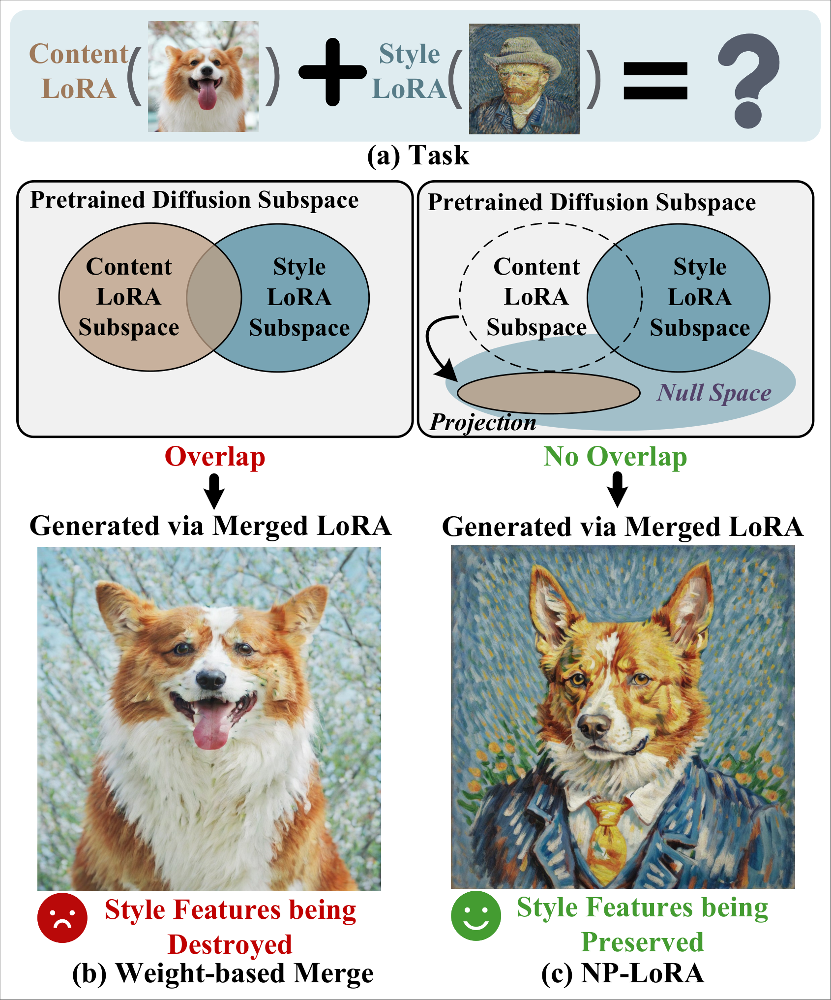

<figcaption>図1: 我々の動機の図解。(a) このタスクは、被写体の同一性を捉えるコンテンツ LoRA と、芸術的な外観を符号化するスタイル LoRA を組み合わせ、学習された生成的知識の再利用と合成を可能にするものである。(b) 2 つの LoRA の加重加算はマージ結果においてスタイルの特徴を破壊する。独立に学習された LoRA は事前学習済み拡散モデルの特徴空間を共有するため、相関した低ランクの高次元部分空間（例えばテクスチャや色）を占めがちであり、それが生成コンテンツの忠実度を劣化させる表現的干渉を引き起こす。(c) コンテンツ LoRA はスタイル LoRA の零空間へ射影され、重なりを効果的に回避してスタイルの特徴を保存する。</figcaption>
</figure>

Low-Rank Adaptation（LoRA）は拡散モデルの効率的なカスタマイゼーション手法として浮上してきた。注意の重みに軽量な分解を適用することにより、LoRA は少数の例から被写体固有あるいはスタイル固有の表現を学習する。LoRA における事前学習された知識の柔軟な再利用のために、パーソナライズされた概念の合成において主要な課題が生じる：**それぞれ被写体の同一性と芸術的外観を捉える、独立に学習されたコンテンツ LoRA とスタイル LoRA をどう組み合わせるか**。そのようなシナリオは、ユーザーがパーソナライズされた被写体を所望の芸術的スタイルで描画したいときによく生じる。各々は別々の例から学習されている。例えば、学習された被写体（ペットの犬など）を、別に学習された芸術的スタイル（ゴッホの筆致など）で描画することを目指すかもしれない（図 1(a) に示す）。目標は、コンテンツ LoRA（$\Delta W_{c}$）とスタイル LoRA（$\Delta W_{s}$）を、破壊的な干渉なしに双方の表現を保持する単一の首尾一貫したモジュールへ融合することである。

既存のマージ技法は主に**重みベースの操作**に依拠しており、パラメータ空間における LoRA の加重結合を形成する。ZipLoRA・K-LoRA・LoRA.rar のような最近の最先端のアプローチは素朴な線形の重みを超えているが、依然として重みベースの融合というパラダイムに従っている。具体的には、ZipLoRA は損失の最適化を通じて最適な融合比率を学習し、K-LoRA は拡散のタイムステップにわたってコンテンツ LoRA とスタイル LoRA の間で区分的な二値の重み付けを行い、LoRA.rar は事前学習済みのハイパーネットワークを介して融合の重みを予測する。しかしながら、そのような重みベースのマージ手法は本質的に 2 つの LoRA の間の干渉を引き起こす。図 1(b) に示すように、$\Delta W_{c}$ と $\Delta W_{s}$ の加重加算はスタイル LoRA を歪め、生成画像における様式的忠実度を劣化させる。**この干渉が生じるのは、独立に学習された LoRA が事前学習済み拡散モデルの同じ特徴空間内で最適化されるためであり**、それらが相関した低ランク部分空間を占め、類似の特徴次元（例えばテクスチャや色のパターン）を適応させることにつながる。その結果、それらの低ランク部分空間は不可避的に重なり合い、非直交になる。さらに経験的分析（IV-A 節）は、**LoRA が構造化された低ランク空間を示し、そこでは少数の主方向が生成的な振る舞いを支配する**ことを明らかにする。これらの方向は摂動に非常に敏感であり、融合の間に明示的に保存する必要があることを示している。この問題に対処するため、我々はマージの目的を再定式化する：$\Delta W_{c}$ と $\Delta W_{s}$ を単に加重マージするのではなく、**コンテンツ LoRA をスタイル部分空間の零空間へ射影することで幾何学的に変換する**ことを目標とする。

この目標を達成するため、我々は **Null Space Projection LoRA（NP-LoRA）** を提案する。これはコンテンツ LoRA とスタイル LoRA の間の干渉を防ぐ射影ベースの枠組みである。具体的には、スタイル LoRA $\Delta W_{s}$ に特異値分解（SVD）を行ってその主方向を抽出し、その直交補空間を干渉のない融合のための零空間として定義する（図 1(c) に図解）。この構成に基づき、我々はまずコンテンツ LoRA $\Delta W_{c}$ をスタイル LoRA の零空間へ完全に射影して干渉を除去する**厳密な射影の枠組み**を定式化する。この厳密な定式化はスタイルへの干渉の効果を完全に除去し、コンテンツ表現とスタイル表現の明確な分離を達成する。この基盤の上に、我々は硬い射影を連続的で調整可能なプロセスへ緩和する**ソフト射影の定式化**を導入する。単一のパラメータで射影の強度を変調することにより、被写体の忠実度とスタイルの一貫性を均衡させながら適応的に干渉を抑制し、LoRA 融合において双方の表現を効果的に統一する。提案する NP-LoRA の枠組みは完全に学習不要であり、事前学習済みのコンテンツ-スタイル LoRA の対の広い範囲に適用でき、LoRA 融合についての単純かつ解釈可能な幾何学的視点を提供する。広範な実験は、NP-LoRA が多様なバックボーンと LoRA の組合せにわたって、強力なベースラインに対し画像の忠実度とスタイルの一貫性を一貫して改善することを実証する。

我々の主要な貢献は以下にまとめられる。

- 我々は **Null Space Projection LoRA（NP-LoRA）** を提案する。これは零空間変換を通じて被写体 LoRA とスタイル LoRA を統一する、学習不要の射影ベースの幾何学的枠組みである。
- 我々は、**重みベースのマージが本質的に干渉を導入する**ことを示す理論的分析を提供し、SVD を活用してスタイル部分空間を特定し、干渉のない融合のためにその零空間を構成する。
- 我々は、硬い射影を調整可能なプロセスへ緩和するソフト射影の定式化を導入し、LoRA 融合において適応的に干渉を抑制しつつ被写体の忠実度とスタイルの一貫性を均衡させる。
- 我々は、NP-LoRA が多様な事前学習済みコンテンツ-スタイル LoRA の対に汎化し、強力なベースラインにわたって画像の忠実度とスタイルの一貫性を一貫して改善することを実証する広範な実験を行う。

<figure>

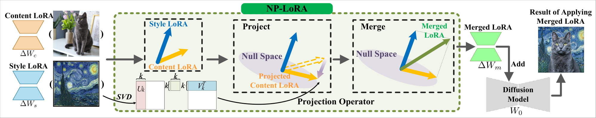

<figcaption>図2: 提案手法の概観。NP-LoRA は事前学習済みのコンテンツ LoRA とスタイル LoRA を入力に取る。スタイル LoRA は特異値分解（SVD）を介して分解されて零空間が構成され、そこへコンテンツ LoRA が射影される。この設計は追加の学習やハイパーパラメータ調整なしに効果的な融合を可能にする。</figcaption>
</figure>

## II Related Work（関連研究）

**拡散モデルのカスタマイゼーション。** 拡散モデルは少数ショットのパーソナライゼーションに関する広範な研究を促進してきた。Textual Inversion や DreamBooth のようなアプローチは、被写体の同一性を捉えるためにそれぞれトークン埋め込みを学習するか、モデルのパラメータを微調整する。Custom Diffusion やいくつかの学習不要の変種を含む後続の手法は、事前学習済みの構成要素を再利用するか選択的に更新することで効率を改善する。これらの進展にもかかわらず、ほとんどのアプローチは依然として計算的に要求が高く、汎化に苦戦する。LoRA は柔軟性と効率を均衡させる階数分解されたアダプタを通じて効率的な代替を提供する。その拡張の中で、B-LoRA は後の融合のために解きほぐされたスタイル LoRA とコンテンツ LoRA を学習する。本研究で我々は、独立に学習された LoRA を調和のとれた概念融合を達成するようどう効果的にマージできるかを研究する。

**画像生成のための複数 LoRA のマージ。** コンテンツとスタイルをゼロから学習する共同学習の手法とは異なり、我々は独立に学習された LoRA の融合に焦点を当てる。画像生成において、LoRA のマージは概して 2 つのカテゴリに分かれる：**物体の合成**と**コンテンツ-スタイルの融合**である。我々は後者を対象とし、被写体の忠実度と様式的一貫性の双方を保存しながらコンテンツ LoRA とスタイル LoRA を結合することを目指す。最近の手法のうち、ZipLoRA と K-LoRA は一様な加算を超えているが依然として加重結合に依拠している。すなわち ZipLoRA はコンテンツとスタイルを均衡させる融合比率を最適化し、K-LoRA は拡散の間に両者を適応的に切り替える。LoRA.rar はさらに、未見の組合せに汎化するためコンテンツ-スタイル LoRA の対で学習されたハイパーネットワークを採用する。これらの進展にもかかわらず、**既存の手法は重みベースの操作を通じて LoRA を融合しており、2 つが干渉なくマージできるという仮定を暗黙に置いている。この仮定を我々の分析は後に反証する。**

## III Background（背景）

**LoRA の微調整。** 大規模な拡散モデルを特定の概念へ効率的に適応させるため、LoRA は広く用いられる微調整技法となっている。事前学習済みのすべてのパラメータを更新する代わりに、LoRA は既存の重み行列に軽量な低ランクアダプタを挿入する。事前学習済みの重み $W_{0}\in\mathbb{R}^{m\times n}$ が与えられたとき、LoRA の更新は

$$
\Delta W=BA,\quad B\in\mathbb{R}^{m\times r},\ A\in\mathbb{R}^{r\times n},
$$

であり、$r\ll\min(m,n)$ である。$W_{0}$ が凍結されたまま $A$ と $B$ のみが最適化され、メモリと学習コストを大きく削減する。推論時、適応された重みは

$$
W=W_{0}+\Delta W
$$

となる。ひとたび学習されれば、LoRA モジュールは拡散のバックボーンへ直接適用でき、新しい被写体やスタイルで条件づけられる。

**問題設定。** 本研究は、学習済みの 2 つの LoRA——コンテンツ用とスタイル用——を、双方に忠実な画像を生成する単一の LoRA へマージすることを目指す。我々は事前学習済みの重み $W^{(i)}_{0}$ と対応する LoRA の更新 $\Delta W^{(i)}$ を含む拡散モデルから始める。同じ操作がすべての LoRA 行列に適用されるため、以降の定式化では層のインデックス $(i)$ を省略する。特定の被写体の画像から学習されたコンテンツ LoRA を $\Delta W_{c}$、特定のスタイルの画像から学習されたスタイル LoRA を $\Delta W_{s}$ と表記する。我々の目的は、コンテンツとスタイルの双方の情報を統合するマージ済み LoRA $\Delta W_{m}$ を得ることである。

$$
\Delta W_{m}=\text{Merge}(\Delta W_{c},\Delta W_{s}).
$$

基本的な要件は、マージ済み LoRA が相互干渉なくコンテンツ LoRA とスタイル LoRA の双方の特徴的な特性を保存することである。この要件を満たすには、**LoRA が内部でコンテンツとスタイルの情報をどう符号化しているかを理解することが不可欠である**。したがって我々は、干渉のない融合を達成するために保存されなければならない鍵となる情報を特定するため、LoRA の内部構造に踏み込む。

## IV Methodology（方法論）

本研究で我々は、独立に学習された LoRA を融合するための学習不要の枠組みである NP-LoRA を提示する（図 2 に図解）。まず特異値分解（SVD）を行ってスタイル LoRA の主方向を特定する。次に硬い射影がコンテンツ LoRA をスタイル部分空間の直交補空間へ写像し、重なり合う方向を完全に除去する。制御可能な柔軟性を提供するため、我々はさらに調整可能なパラメータで制御されるソフト射影を導入し、コンテンツとスタイルの間の滑らかで適応的な融合を可能にする。

<figure>

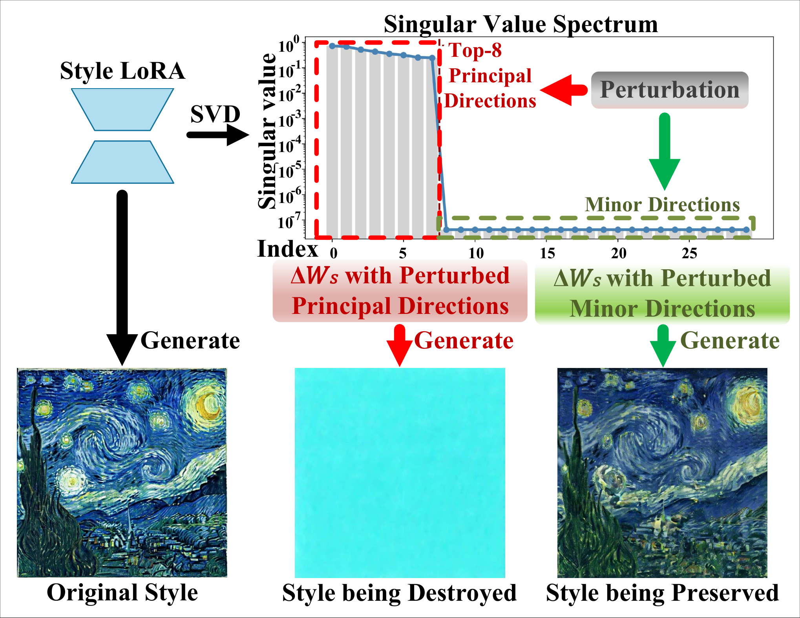

<figcaption>図3: LoRA の特異値スペクトルと摂動の効果。まず特異値スペクトルを可視化し、次に主方向と微小方向をそれぞれ摂動する。主方向への摂動はスタイルの一貫性を破壊する一方、微小方向への摂動はほとんど影響を与えない。</figcaption>
</figure>

### IV-A Principal Direction Extraction via SVD（SVD による主方向の抽出）

我々は特異値分解（SVD）を介して主方向を抽出し、スタイル LoRA の重みを次のように分解する。

$$
\Delta W_{s}=U\Sigma V^{\top},
$$

ここで $V\in\mathbb{R}^{d_{in}\times r_{s}}$ の列は正規直交な右特異ベクトルである。各ベクトル $v\in V$ はパラメータ空間内の異なる方向を定義し、$\Sigma$ 内の対応する特異値がその方向に沿った $\Delta W_{s}$ の寄与の強さを定量化する。K-LoRA の慣例に従い、すべての LoRA は rank 8 で学習される。したがって我々は**上位 8 個の特異ベクトル**（最大の特異値を持つもの）を主方向と見なす。その影響を調べるため、これらの方向を摂動した生成的効果を可視化する。図 3 に示すように、**支配的な成分を摂動すると様式的一貫性が急激に低下する一方、微小な成分の摂動はほとんど変化をもたらさない**。これはこれらの主方向が生成の忠実度において決定的な役割を果たすことを裏づける。

保存されるべき主要なスタイル方向を特定したので、次に既存の重みベースのマージがそれらを保護できるかどうかを検討する。コンテンツ LoRA とスタイル LoRA の直截な結合は次の形を取る。

$$
\Delta W_{\mathrm{m}}=a\Delta W_{c}+b\Delta W_{s},\quad a,b\in\mathbb{R}.
$$

しかしながら、そのような線形の融合は、図 4(c) に示すようにコンテンツ LoRA が導入するスタイルに決定的な部分空間への干渉を防ぐことに失敗する。

###### 命題 1.

コンテンツ LoRA $\Delta W_{c}$ とスタイル LoRA $\Delta W_{s}$ が与えられたとき、それらの加重結合は一般に、スタイルに決定的な部分空間からコンテンツの特徴を分離できない。その結果、**コンテンツに起因する干渉は避けられず、様式的一貫性は保証できない。**

###### 証明.

スタイル部分空間が $\Delta W_{s}$ の上位の特異ベクトル（$V_{k}$ と表記）で張られるとし、射影演算子を $P=V_{k}V_{k}^{\top}$ と定義する。コンテンツ LoRA を分解すると

$$
\Delta W_{c}=(I-P)\Delta W_{c}+P\Delta W_{c},
$$

となり、ここで $P\Delta W_{c}$ はスタイル部分空間に存在する。加重マージ $\Delta W_{m}=a\Delta W_{c}+b\Delta W_{s}$ について、そのスタイル部分空間への射影は

$$
P\Delta W_{m}=a\,P\Delta W_{c}+b\,\Delta W_{s}
$$

である。元のスタイル成分を保存するには $P\Delta W_{m}=\Delta W_{s}$ が要求され、これは

$$
a\,P\Delta W_{c}=(1-b)\Delta W_{s}
$$

を意味する。この条件が解を持つのは $P\Delta W_{c}$ と $\Delta W_{s}$ が共線である（すなわち $P\Delta W_{c}=\alpha\Delta W_{s}$）場合に限られるが、**独立に学習された LoRA についてはほぼ決してそうならない**。ベクトル化された重み $a,b$ を用いたとしても、$P\Delta W_{c}$ の各列が $\Delta W_{s}$ の張る空間に存在しなければならず、高次元空間では統計的にありそうにない。したがって加重マージは不可避的にスタイル部分空間内に干渉を導入し、スタイルの劣化を招く。∎

<figure>

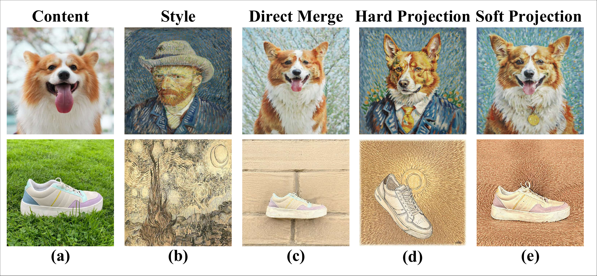

<figcaption>図4: 我々の手法の可視化。(a) コンテンツ画像。(b) スタイル画像。(c) 直接の重みベースのマージの結果。スタイルの歪みと干渉を引き起こす。(d) 硬い射影（我々の手法の基本形）の結果。干渉は除去されるがコンテンツの詳細を抑制する。(e) ソフト射影（本手法）の結果。被写体の忠実度とスタイルの一貫性の均衡のとれた融合を達成する。</figcaption>
</figure>

### IV-B Hard Projection for Subspace Separation（部分空間分離のための硬い射影）

保存されるべき主要なスタイル方向を特定し、重みベースのマージがそれらを保護できないことを示したので、我々はここで射影ベースの定式化を導入する。我々は**コンテンツ LoRA をスタイル LoRA へ注入する**。スタイルの表現は構造的あるいは意味的な特徴より本質的に脆く、上書きされやすいからである。V-D 節で実証するように、この設計はコンテンツ固有の情報を保持しつつ様式的一貫性を保存する。

我々はスタイル部分空間の零空間への直交射影を定義する。

$$
P_{\text{null}}=I-V_{k}V_{k}^{\top},
$$

ここで $I$ は単位行列を表す。この演算子は保護されたスタイル方向に整合するあらゆる成分を除去し、それらに直交する部分のみを保持する。この射影をコンテンツ LoRA $\Delta W_{c}$ に適用すると、スタイルに直交する成分が得られる。

$$
\Delta W_{c}^{\perp}=\Delta W_{c}P_{\text{null}}.
$$

マージ済み LoRA は次のように定義される。

$$
\Delta W_{m}=\Delta W_{s}+\Delta W_{c}^{\perp}=\Delta W_{s}+\Delta W_{c}(I-V_{k}V_{k}^{\top}).
$$

この構成は、コンテンツ LoRA $\Delta W_{c}$ がスタイル部分空間に直交する方向を通じてのみ寄与することを保証し、図 4(d) に示すように主要なスタイル方向が $\Delta W_{s}$ によって排他的に支配されるようにする。

###### 命題 2.

式 11 を適用することにより、提案する射影ベースのマージは、**スタイルに直交するコンテンツ情報のみが注入される**ことを保証する。その結果、保護されたスタイル部分空間内でコンテンツに起因する干渉は起こり得ない。

###### 証明.

任意の入力 $x$ について、射影されたコンテンツ LoRA は

$$
\Delta W_{c}^{\perp}x=\Delta W_{c}P_{\text{null}}x
$$

である。それがスタイルに決定的な部分空間へ侵入しないことを検証するため、その部分空間への射影を調べる。

$$
P(\Delta W_{c}^{\perp}x)=P\,\Delta W_{c}P_{\text{null}}x=V_{k}V_{k}^{\top}\,\Delta W_{c}(I-V_{k}V_{k}^{\top})x.
$$

$V_{k}^{\top}V_{k}=I_{k}$ であるから、

$$
V_{k}V_{k}^{\top}(I-V_{k}V_{k}^{\top})=0
$$

が従い、直ちに

$$
P(\Delta W_{c}^{\perp}x)=0
$$

が得られる。したがって $\Delta W_{c}^{\perp}x$ は $\mathrm{span}(V_{k})$ に成分を持たず、スタイルに決定的な部分空間に完全に直交している。∎

これは $\Delta W_{c}^{\perp}x$ がスタイル部分空間の直交補空間に完全に存在し、$\Delta W_{s}$ が支配するスタイルに決定的な方向が影響を受けないままであることを裏づける。エネルギーの観点からは、これはスタイル部分空間内でのコンテンツ LoRA の寄与が抑制されることを意味する。我々はこの残留する相互作用を次の二次形式で定量化する。

$$
(\Delta W_{c}^{\text{proj}})^{\top}P\Delta W_{c}^{\text{proj}},
$$

これは $\Delta W_{c}^{\text{proj}}$ のスタイル部分空間に沿った残留エネルギーを測る。式 10 の硬い射影はこのエネルギーを最小化し、事実上スタイルへの干渉をゼロへ駆動する。

### IV-C Soft Projection for Balanced Fusion（均衡のとれた融合のためのソフト射影）

硬い射影は完全なスタイルの保存を達成する一方で、図 4(d) に示すように**スタイル方向と部分的に整合するコンテンツの特徴も除去してしまう**。その結果、射影は過度に保守的になり、より柔軟な代替の必要を動機づける。したがって我々は、スタイルの保存とコンテンツの保持を均衡させる緩和された定式化を導入する。具体的には、先の目的の **Tikhonov 正則化**された変種を考える。

$$
\min_{\Delta W_{c}^{\text{proj}}}\;\|\Delta W_{c}^{\text{proj}}-\Delta W_{c}\|_{2}^{2}+\mu\,(\Delta W_{c}^{\text{proj}})^{\top}P\,\Delta W_{c}^{\text{proj}},
$$

ここで第 1 項は元のコンテンツ LoRA $\Delta W_{c}$ への近さを促し、第 2 項はスタイル部分空間内に保持されるエネルギーを罰する。$\mu\geq 0$ が抑制の強度を制御する。

微分してゼロと置くと

$$
\Delta W_{c}^{\text{proj}}=(I+\mu P)^{-1}\Delta W_{c}
$$

が得られる。$P=V_{k}V_{k}^{\top}$ かつ $V_{k}^{\top}V_{k}=I_{k}$ であるから、逆行列は Woodbury の恒等式から導かれる単純な閉形式を持つ（詳細な導出は補足資料を参照）。

$$
(I+\mu P)^{-1}=I-\tfrac{\mu}{1+\mu}V_{k}V_{k}^{\top}.
$$

これによりソフト射影演算子と射影されたコンテンツ LoRA が得られる。

$$
P_{\text{soft}}=I-\tfrac{\mu}{1+\mu}V_{k}V_{k}^{\top},\qquad\Delta W_{c}^{\text{proj}}=P_{\text{soft}}\,\Delta W_{c}.
$$

最終的にマージ済み LoRA は

$$
\Delta W_{m}=\Delta W_{s}+\Delta W_{c}^{\text{proj}}=\Delta W_{s}+(I-\tfrac{\mu}{1+\mu}V_{k}V_{k}^{\top})\,\Delta W_{c}
$$

である。この定式化は 2 つの成分を明示的に分離する：スタイル部分空間の外側にある $\Delta W_{c}$ の部分は保存され、重なり合うスタイル干渉の部分は $\tfrac{\mu}{1+\mu}$ の係数で減衰される。パラメータ $\mu$ を調整することにより、我々の手法は**線形マージ（$\mu\to 0$）から厳密な直交射影（$\mu\to\infty$）までの連続的なスペクトル**を提供する。このようにして NP-LoRA は、図 4(e) に示すようにコンテンツの意味を損なうことなく様式的一貫性を維持する均衡のとれた融合を達成する。

<figure>

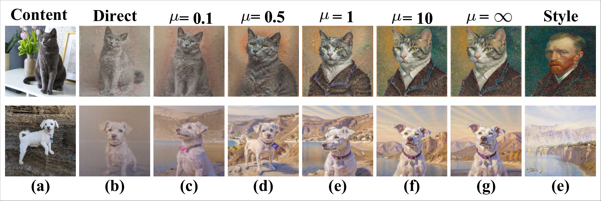

<figcaption>図5: (a) と (e) はそれぞれコンテンツとスタイルの参照である。(c) は直接マージの結果を示し、これは μ = 0 に対応する（すなわち NP-LoRA の退化した場合）。(d)–(g) は μ = 0.1, 0.5, 1, 10, ∞ の結果を示し、μ = ∞ は我々の手法の硬い射影の場合を表す。小さい μ の値はコンテンツとスタイルの干渉を引き起こし、大きい値はコンテンツの忠実度を犠牲にしてスタイルを保存する。</figcaption>
</figure>

<figure>

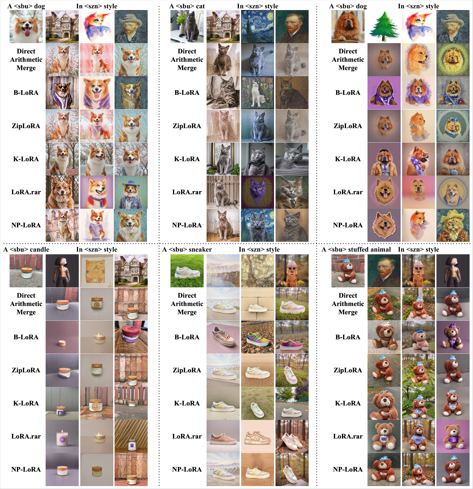

<figcaption>図6: Direct Weight Merge・B-LoRA・ZipLoRA・K-LoRA・LoRA.rar と、我々が提案する NP-LoRA との定性的比較。被写体の忠実度とスタイルの保存の間のトレードオフを図解する。</figcaption>
</figure>

## V Experiments（実験）

### V-A Experiment Setup（実験設定）

**データセット。** カスタマイゼーションにおける一般的な慣行に従い、公開されている画像から LoRA を得る。コンテンツについては DreamBooth データセットを採用し、各被写体は 4〜5 枚の参照画像で表される。スタイルについては StyleDrop データセットを用い、いくつかの代表的な芸術的スタイルを補う。コミュニティで学習された LoRA については、評価のために Hugging Face の公開モデルを用いる。

**実験の詳細。** すべての実験は SDXL v1.0 と FLUX のモデルで行う。我々の手法については rank を 8 に設定し、IV-A 節で述べたとおりすべての主方向を保存する。ソフト射影（式 21）における主要なハイパーパラメータ $\mu$ は **0.5** に固定する。詳細な分析は V-B 節で提供する。実装の詳細は補足資料で提供する。SDXL に基づく実験は NVIDIA RTX 3090 GPU で、FLUX に基づくものは NVIDIA A800 GPU で行う。

**ベースライン。** 我々は複数の LoRA を結合または学習する代表的なアプローチと比較する。それらのうちほとんどの手法は独立に学習された 2 つの LoRA をマージする。すなわちモデルは学習済みの 2 つの LoRA を入力に取り、マージされた生成物を出力する。具体的には (i) 直接の重みマージのベースライン $\Delta W_{m}=\Delta W_{c}+\Delta W_{s}$、(ii) B-LoRA（ECCV2024）、(iii) ZipLoRA（ECCV2024）、(iv) K-LoRA（CVPR2025）、(v) LoRA.rar（ICCV2025）を評価する。

### V-B Ablation on Projection Strength（射影強度のアブレーション）

我々は、被写体の忠実度とスタイルの一貫性を均衡させるパラメータ $\mu$ が制御する射影強度の効果を図 5 のように分析する。$\mu$ が 0 から $\infty$ へ増えるにつれ射影の強度が増す。$\mu\to 0$ のとき NP-LoRA はコンテンツ LoRA に支配された直接の重みベースのマージへ帰着し、コンテンツとスタイルの干渉を招く。$\mu\to\infty$ のとき、スタイル部分空間と重なるコンテンツ成分を除去する硬い射影へ近づく。我々はこの遷移を研究するため $\mu\in\{0,0.1,0.5,1,10,\infty\}$ にわたって NP-LoRA を評価する。このアブレーションは明確なトレードオフを明らかにする：**小さい $\mu$ の値はコンテンツとスタイルの干渉を招き、大きい $\mu$ の値はスタイルを保存するがコンテンツの詳細を抑制する**。とりわけ硬い射影（$\mu=\infty$）は豊かなコンテンツの特徴を失い、ソフト射影機構の必要性を裏づける。経験的に **$\mu=0.5$** が最良の均衡をもたらし、以降のすべての実験で既定値として用いる。追加の定性的・定量的結果は補足資料で提供する。

<figure>

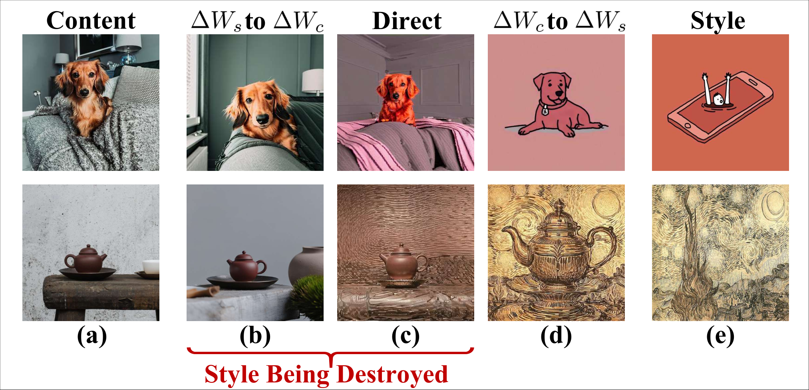

<figcaption>図7: LoRA の射影の比較。(a) コンテンツ LoRA の学習画像、(b) コンテンツ LoRA の零空間へ射影されたスタイル LoRA、(c) 直接マージ、(d) スタイル LoRA の零空間へ射影されたコンテンツ LoRA、(e) スタイル LoRA の学習画像。(b) と (c) はスタイルの一貫性を劣化させ、(b) は様式的な痕跡をほぼ除去してしまう一方、(d) はコンテンツとスタイルをより良く均衡させる。</figcaption>
</figure>

<figure>

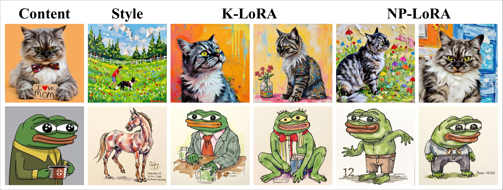

<figcaption>図8: 汎化性の検証のための flux 上の定性的結果。</figcaption>
</figure>

**表I**: コンテンツとスタイルについて CLIP と DINO の類似度を用いた手法の比較。集約スコア（$S_{\text{arith}}$, $S_{\text{harm}}$）は全体的なコンテンツ-スタイルのトレードオフを要約する。

| 手法 | $S^{\text{CLIP}}_{\text{content}}$ | $S^{\text{CLIP}}_{\text{style}}$ | $S^{\text{DINO}}_{\text{content}}$ | $S^{\text{DINO}}_{\text{style}}$ | $S_{\text{arith}}$ | $S_{\text{harm}}$ $\uparrow$ |
| --- | --- | --- | --- | --- | --- | --- |
| Direct | 0.75 | 0.55 | 0.54 | 0.23 | 0.51 | 0.42 |
| B-LoRA | 0.72 | 0.55 | 0.51 | 0.26 | 0.51 | 0.44 |
| ZipLoRA | 0.75 | 0.56 | 0.55 | 0.24 | 0.52 | 0.44 |
| K-LoRA | **0.76** | 0.55 | **0.57** | 0.22 | 0.52 | 0.42 |
| LoRA.rar | 0.70 | 0.53 | 0.50 | 0.30 | 0.51 | 0.46 |
| NP-LoRA | 0.73 | **0.59** | 0.52 | **0.33** | **0.55** | **0.50** |

**表II**: ユーザー選好と GPT-5 評価の比較。人間のユーザーと GPT-5 の双方が候補の中から最良の結果を選ぶよう求められる。報告されるスコアは、各手法が最良として選ばれた場合の割合を表す。

| 手法 | ユーザー選好 $\uparrow$ | GPT5 のフィードバック $\uparrow$ |
| --- | --- | --- |
| Direct | 7.97% | 6.25% |
| B-LoRA | 9.06% | 9.38% |
| ZipLoRA | 10.00% | 9.38% |
| K-LoRA | 12.19% | 12.50% |
| LoRA.rar | 11.25% | 9.38% |
| NP-LoRA | **49.53%** | **53.13%** |

**表III**: 異なる LoRA マージ戦略の効率比較。Merge (s †) はモデルの読み込み時間を含む。Gen./Img. (s) は画像あたりの平均生成時間。

| 手法 | Merge (s †) $\downarrow$ | Gen./Img. (s) $\downarrow$ |
| --- | --- | --- |
| Direct | 13.466 | 22.898 |
| ZipLoRA | $>10$ 分 | 29.931 |
| K-LoRA | 12.250 * | 60.388 * |
| NP-LoRA | 13.440 | 23.208 |

\* K-LoRA は生成中にその場でマージを行うため、LoRA の読み込み時間のみを含む。

### V-C Results（結果）

#### 定量的比較。

公平な評価を保証するため、この段階のすべての実験は SDXL を用いて行う。K-LoRA（18 対）と ZipLoRA（32 対）を含む先行研究に従い、我々は 5 種の動物被写体・5 種の物体レベルのカテゴリ・15 の異なる芸術的スタイルをカバーする、ランダムに選ばれた 32 のコンテンツ-スタイル LoRA の対で NP-LoRA を評価する。各対は 10 枚の生成画像を含む。評価には先行研究に従い、被写体の保存（コンテンツ）とスタイルの整合（スタイル）を共同で評価するために CLIP と DINO の類似度を採用する。具体的には CLIP について $S^{\text{CLIP}}_{\text{content}}$ と $S^{\text{CLIP}}_{\text{style}}$ を、DINO について $S^{\text{DINO}}_{\text{content}}$ と $S^{\text{DINO}}_{\text{style}}$ を計算する。統一されたコンテンツ-スタイル類似度の尺度を得るため、一般的な F1 スタイルの集約方式に従って算術平均と調和平均の双方を報告する。4 つの類似度スコア $S_{i}$ が与えられたとき、算術平均 $S_{\text{arith}}=\tfrac{1}{4}\sum_{i}S_{i}$ と調和平均 $S_{\text{harm}}=\tfrac{4}{\sum_{i}(1/S_{i})}$ の双方を報告する。$S_{\text{arith}}$ が全体的な傾向を反映するのに対し、**調和平均 $S_{\text{harm}}$ はコンテンツとスタイルの双方への同時の忠実度を強調する**。表 I に示すように、我々の手法は最高の $S_{\text{arith}}$ と $S_{\text{overall}}$ を達成し、被写体の忠実度とスタイルの一貫性を均衡させる優れた能力を示している。

知覚的品質をさらに評価するため、K-LoRA に従って 20 名の参加者によるユーザースタディを実施した。各ケースは最先端のベースラインと我々の手法の出力、および参照被写体とスタイルの画像を含む。参加者は被写体の忠実度とスタイルの一貫性を最もよく均衡させている結果を選択した。表 II に示すように、我々の手法は $49.53\%$ のケースで選好された。さらに GPT-5 ベースの自動評価を採用し、我々の手法について一貫した $53.13\%$ の選好が得られた。

#### 定性的比較。

定性的結果を図 6 に示す。直接マージと ZipLoRA は部分的な融合を達成するが、特定のコンテンツ-スタイル対でしばしば失敗する。B-LoRA はスタイルの特性を捉えるがコンテンツの忠実度を犠牲にする。**K-LoRA は被写体の同一性をよく保存するが、所望のスタイルを捉えることに苦戦する**。LoRA.rar はわずかな改善しかもたらさず、依然として不十分である。対照的に NP-LoRA は最良の結果を達成し、コンテンツの忠実度とスタイルの保存の間の優れた均衡を実現する。共同学習の手法との定性的比較は補足資料に示し、NP-LoRA が優れた結果を得ることを示す。

#### 効率の比較。

効率を評価するため、表 III でマージ時間と生成時間の双方を比較する。LoRA.rar はパラメータ融合に事前学習済みモデルを必要とするため除外し、B-LoRA も事前学習済み LoRA のマージではなくゼロからの学習を必要とするため省略する。ZipLoRA は追加の融合最適化のため最も遅く、K-LoRA は初期化時には効率的だがサンプリング段階での動的な融合のため遅くなる。対照的に NP-LoRA は Direct Merge のベースラインと同等のマージ・推論の効率を維持しつつ、一貫して優れた結果をもたらす。

### V-D Projection Direction: Content into Style（射影の向き：コンテンツをスタイルへ）

図 6 と表 I に示すように、**直接マージは圧倒的にコンテンツ LoRA を優遇する**：構造的な情報が保存される一方、様式的な特性は大きく失われる。図 7 の射影は、**スタイルをコンテンツ空間へ埋め込むとスタイルの信号がほぼ完全に消える**ことをさらに裏づける。これは**コンテンツの表現が本質的により支配的で干渉に抵抗力がある一方、スタイルの特徴は脆い**ことを示唆する。したがって我々は射影の向きを反転させ、コンテンツ LoRA をスタイル LoRA の零空間へ写像し、干渉のない方向に沿ってのみコンテンツを注入する。これはコンテンツ固有の情報を保持しつつ様式的一貫性を保存する。

### V-E Evaluation on Flux for Generalization（汎化性のための Flux 上の評価）

我々はさらに FLUX バックボーン上で手法の一般性を検証する（図 8 に図解）。既存のアプローチのうち K-LoRA のみが FLUX の公式実装を提供しており、参照として含める。公開されている LoRA を用いていくつかの対でコンテンツ-スタイルの融合を行う。FLUX 上ではすべての手法が視覚的に妥当な結果を生むが、微妙な差異が残る：直接マージは絡み合った出力を生み、K-LoRA はコンテンツを優遇し、我々の NP-LoRA はコンテンツとスタイルの均衡のとれた融合を達成する。これらの観察は、我々の射影ベースの設計が異なる拡散バックボーンにわたってよく汎化することを実証する。

## VI Conclusions（結論）

本論文で我々は NP-LoRA を提案した。これは破壊的な干渉を避けつつスタイル LoRA とコンテンツ LoRA を調和的に統一するよう設計されたマージ戦略である。我々の手法はまず特異値分解（SVD）を介してスタイルに決定的な部分空間を特定し、硬い射影を通じてコンテンツ LoRA をその直交補空間へ射影する。次に所望の柔軟性の水準に応じて重なり合う成分を柔らかく減衰させる。さらに我々は、従来の重みマージがなぜ失敗するのかを理論的に分析し、零空間射影がなぜこの問題を効果的に解決するのかを示す。定量的指標・ユーザースタディ・GPT-5 評価を含む包括的な実験が、我々の手法の有効性と選好を裏づける。特筆すべきことに、NP-LoRA は直接マージと同等の実行時効率を維持しながら有意な性能向上をもたらす。

**限界。** 我々の手法は **LoRA の表現が層をまたいで独立であるという仮定**のもとで単層の射影機構を構築しており、これは先行するマージのアプローチと共有される。この仮定は複雑な非線形あるいは層をまたぐ依存性を完全には捉えないかもしれない。さらに NP-LoRA における減衰係数 $\mu$ は経験的に選ばれており、今後の課題では自動選択のための適応的あるいはデータ駆動の戦略を探求する。

## Supplementary Material Overview（補足資料の概観）

本補足資料は、本論文で提示した知見を裏づける追加の技術的詳細・導出・拡張された分析を提供する。具体的には、まず VII 節で提案するソフト射影演算子の定式化を導出し、VIII 節で効率的な実装の詳細を提示する。IX 節ではどちらの零空間の構成（U 空間か V 空間か）が様式的忠実度をより良く保存するかを調べる。XI 節では共同学習との追加比較を提供し、学習ベースのアプローチに対する NP-LoRA の有効性をさらに検証する。XII 節では様々なプロンプト条件下での我々の手法の制御可能性を実証し、XIII 節では異なるランダムシードにわたる頑健性を評価する。XIV 節では検証を Flux モデルへ拡張してモデル横断の汎化を評価する。最後に XV 節では、定量的な選好評価に用いた GPT-5 評価のプロトコルを詳述する。

## VII Derivation of the Soft Projection Operator（ソフト射影演算子の導出）

我々は本文で導入した緩和された目的から始める。

$$
\min_{\Delta W_{c}^{\text{proj}}}\;\|\Delta W_{c}^{\text{proj}}-\Delta W_{c}\|_{2}^{2}+\mu\,(\Delta W_{c}^{\text{proj}})^{\top}P\,\Delta W_{c}^{\text{proj}},
$$

ここで第 1 項は元のコンテンツアダプタへの近さを保ち、第 2 項は $P=V_{k}V_{k}^{\top}$ で定義されるスタイル部分空間内でのその活性化を罰する。

#### 閉形式の解。

$\Delta W_{c}^{\text{proj}}$ に関して微分してゼロと置くと

$$
(I+\mu P)\,\Delta W_{c}^{\text{proj}}=\Delta W_{c},
$$

したがって

$$
\Delta W_{c}^{\text{proj}}=(I+\mu P)^{-1}\Delta W_{c}
$$

が得られる。

#### 逆行列の簡約。

$P=V_{k}V_{k}^{\top}$ は $V_{k}^{\top}V_{k}=I_{k}$ を満たす階数 $k$ の射影子であるから、逆行列は次の閉形式を持つ。

$$
(I+\mu P)^{-1}=I-\tfrac{\mu}{1+\mu}V_{k}V_{k}^{\top},
$$

これはスペクトル分解あるいは Woodbury の恒等式のいずれからも従う。これを代入してソフト射影演算子

$$
P_{\text{soft}}=I-\tfrac{\mu}{1+\mu}V_{k}V_{k}^{\top},\qquad\Delta W_{c}^{\text{proj}}=P_{\text{soft}}\,\Delta W_{c}
$$

を得る。

#### 最終的な融合則。

マージ済み LoRA は次のように定義される。

$$
\Delta W_{m}=\Delta W_{s}+\Delta W_{c}^{\text{proj}}=\Delta W_{s}+(I-\tfrac{\mu}{1+\mu}V_{k}V_{k}^{\top})\,\Delta W_{c}.
$$

この定式化は直接マージ（$\mu=0$）と硬い射影（$\mu\rightarrow\infty$）の間を連続的に補間し、スタイルの保存とコンテンツの保持の間の制御可能な均衡を提供する。

<figure>

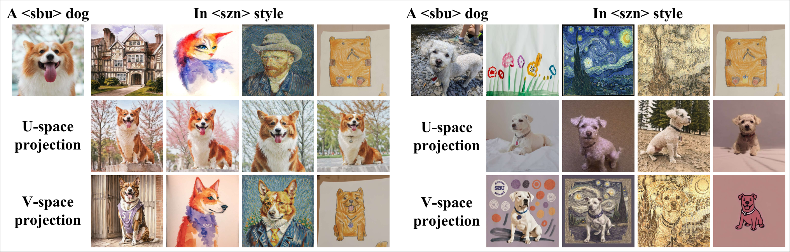

<figcaption>図9: 零空間の構成のための出力空間（U）とパラメータ空間（V）の射影の比較。U 空間の射影はスタイルの干渉を除去できず、歪んだ様式的特徴を招く一方、V 空間の射影はそのような干渉を効果的に除去して意図されたスタイルの外観を保存する。</figcaption>
</figure>

## VIII Implementation Details（実装の詳細）

我々の理論的な定式化では、LoRA の更新行列 $\Delta W_{s}=B_{s}A_{s}$ の右特異部分空間を得るために特異値分解（SVD）を採用する。ここで $A_{s}\in\mathbb{R}^{r\times n}$、$B_{s}\in\mathbb{R}^{m\times r}$ である。具体的には、$\Delta W_{c}$ の $\Delta W_{s}$ の直交補空間への元の射影は、$\Delta W_{s}$ の右特異ベクトル $V_{k}$ を用いて計算される。

$$
\Delta W_{c}^{\perp}=\Delta W_{c}(I-V_{k}V_{k}^{\top}).
$$

しかしながら、大きな行列 $\Delta W_{s}\in\mathbb{R}^{m\times n}$ に対して SVD や PCA で $V_{k}$ を直接計算するのは、計算量が $\mathcal{O}(mnr)$ でスケールするため計算的に高価である。

#### QR に基づく効率的な実装。

効率を改善するため、我々は SVD を**数学的に等価でありながら遥かに効率的な QR ベースの射影**で置き換える。$\Delta W_{s}$ の階数は高々 $r$ であり、その右特異部分空間が $A_{s}^{\top}$ の列空間と等しいことに注目する。

$$
\mathrm{span}(V)=\mathrm{span}(A_{s}^{\top}).
$$

したがって $A_{s}^{\top}$ について薄い QR 分解を計算する。

$$
A_{s}^{\top}=QR,
$$

ここで $Q\in\mathbb{R}^{n\times r}$ は $\mathrm{span}(A_{s}^{\top})$ を張る正規直交な列を持ち、$R\in\mathbb{R}^{r\times r}$ は上三角行列である。次に $V$ を $Q$ で置き換えて

$$
\Delta W_{c}^{\text{proj}}=\Delta W_{c}-\Delta W_{c}QQ^{\top}
$$

を計算する。これは $n\times r$（$r\ll n,m$）の小さな行列の QR 分解のみを必要とし、計算量を $\mathcal{O}(nr^{2})$ へ削減する。

#### 等価性の証明。

$\Delta W_{s}=B_{s}A_{s}$ を LoRA 行列とする。LoRA は完全な列階数と行階数（すなわち $rank=r$）を持つ低ランク因子を用いるので、$B_{s}^{\top}B_{s}$ は対称正定値である。すると

$$
\Delta W_{s}^{\top}\Delta W_{s}=A_{s}^{\top}(B_{s}^{\top}B_{s})A_{s}.
$$

$B_{s}^{\top}B_{s}$ は対称正定値であるから Cholesky 分解 $B_{s}^{\top}B_{s}=C^{\top}C$（$C$ は可逆）を許す。代入すると

$$
\Delta W_{s}^{\top}\Delta W_{s}=(CA_{s})^{\top}(CA_{s}).
$$

$C$ はフル階数の線形変換を表すので、$A_{s}^{\top}$ の列空間を変えない。したがって $\Delta W_{s}$ の右特異部分空間は $\mathrm{span}(A_{s}^{\top})$ と一致する。

$$
\mathrm{Col}(\Delta W_{s}^{\top}\Delta W_{s})=\mathrm{span}(A_{s}^{\top}).
$$

したがって SVD と QR を介して構成される直交射影子は同一である。

$$
P=V_{k}V_{k}^{\top}=QQ^{\top}.
$$

実践上これは、高価な低ランク SVD を $A_{s}^{\top}$ の単純な QR 分解で置き換えることで、数学的に等価な射影を得ながら**計算時間を 1 桁削減できる**ことを意味する。

## IX Which Null-Space Construction Preserves Style: $U$-space or $V$-space?（どちらの零空間の構成がスタイルを保存するか：$U$ 空間か $V$ 空間か）

本文では SVD 分解 $\Delta W_{s}=U\Sigma V^{\top}$ の右特異ベクトル $V$ を用いて零空間を構成した。**LoRA 融合における干渉は、$U$ が表す活性化空間ではなくパラメータ空間（すなわち $\Delta W_{s}$ の列空間）で生じる**からである。具体的には、$U$ は $\Delta W_{s}$ の出力（活性化）領域を張り、スタイル LoRA が特徴の活性化にどう影響するかを記述する。一方 $V$ は入力（パラメータ）領域を張り、LoRA の更新が重みの列にどう分布するかを捉える。LoRA 融合は重みのパラメータを直接操作するので、干渉はこれらの列方向に沿って現れ、$V$ が零空間を構成する適切な基底になる。したがって $V$ 空間での射影は、重み領域内のスタイルに決定的な方向に沿ったコンテンツ由来の摂動を直接除去する。対照的に、$U$ に基づいて零空間を構成することは出力（活性化）空間で作用し、**コンテンツとスタイルの双方の応答を抑制して全体的な表現力を弱める**。図 9 に示すように、$V$ から構成された射影は様式的一貫性を効果的に保存する一方、$U$ から導かれたものはコンテンツとスタイルの解きほぐしに失敗し、顕著なスタイルの劣化を招く。

## X Additional Ablation on Soft Projection（ソフト射影の追加アブレーション）

ソフトな緩和のない版を硬い変種と呼び、**NP-LoRA-H** と表記する。定性的結果を図 10 に、定量的比較を表 IV に示す。図解するとおり、NP-LoRA-H はスタイルを効果的に保存するがコンテンツの詳細を失いがちである。対照的に、我々の完全な NP-LoRA はコンテンツとスタイルのより良い均衡を達成し、最高の総合スコアをもたらす。これは提案するソフトな緩和機構の必要性を裏づける。

<figure>

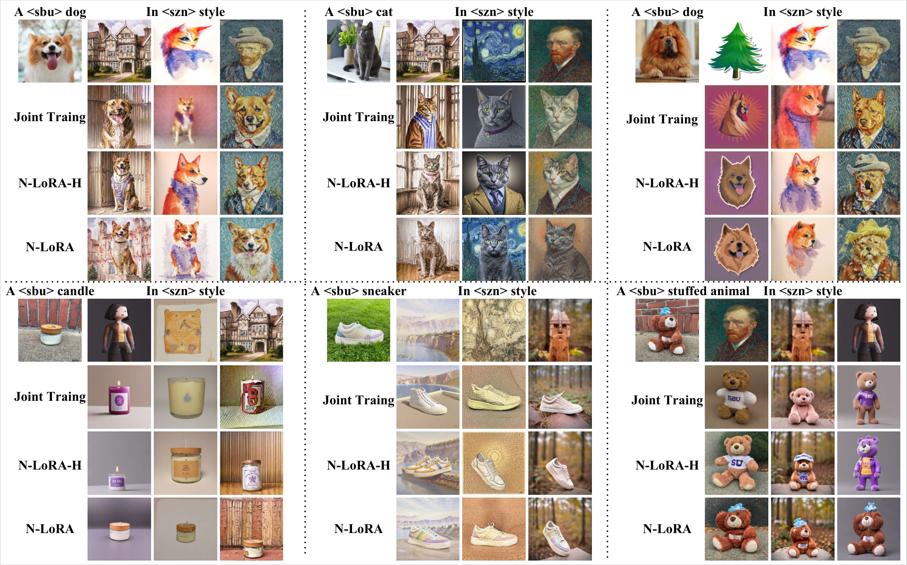

<figcaption>図10: 共同学習との定性的比較。共同学習は不安定な性能を示し、しばしばコンテンツとスタイルを効果的にマージすることに失敗する一方、NP-LoRA は再学習なしに一貫して均衡のとれた融合を達成する。</figcaption>
</figure>

## XI Additional Comparison with Joint Training（共同学習との追加比較）

我々はさらに、混合されたコンテンツ画像とスタイル画像を用いてゼロから新しい LoRA を学習する共同学習のベースラインと比較する。定性的結果を図 10 に、定量的比較を表 IV に示す。観察されるとおり、**共同学習のアプローチは高い不安定性を示す**。すなわち時折妥当な融合を生むものの、コンテンツとスタイルを効果的に結合できないことが多い。この不安定性は多目的最適化における**破滅的忘却**から生じている可能性があり、新しいスタイル特徴の学習が以前に獲得したコンテンツ表現に干渉する。対照的に我々の NP-LoRA は再学習なしに一貫した調和的な融合を達成し、コンテンツの忠実度と様式的特性の双方を効果的に保存する。定量的には、表 IV に示すように NP-LoRA はすべての指標で共同学習を上回り、最高の総合スコアを達成して、コンテンツとスタイルを同時に保存する優れた能力を裏づける。

**表IV**: CLIP と DINO の類似度スコアを用いた共同学習手法との比較。集約結果（$S_{\text{arith}}$ と $S_{\text{harm}}$）のみがコンテンツとスタイルの間の全体的なトレードオフを反映するため、この 2 列のみを強調する。

| 手法 | $S^{\text{CLIP}}_{\text{content}}$ | $S^{\text{CLIP}}_{\text{style}}$ | $S^{\text{DINO}}_{\text{content}}$ | $S^{\text{DINO}}_{\text{style}}$ | $S_{\text{arith}}$ | $S_{\text{harm}}$ $\uparrow$ |
| --- | --- | --- | --- | --- | --- | --- |
| Joint Training | 0.67 | 0.61 | 0.49 | 0.25 | 0.50 | 0.43 |
| NP-LoRA-H | 0.68 | 0.60 | 0.39 | **0.40** | 0.52 | 0.48 |
| NP-LoRA | **0.73** | 0.59 | **0.52** | 0.33 | **0.55** | **0.50** |

<figure>

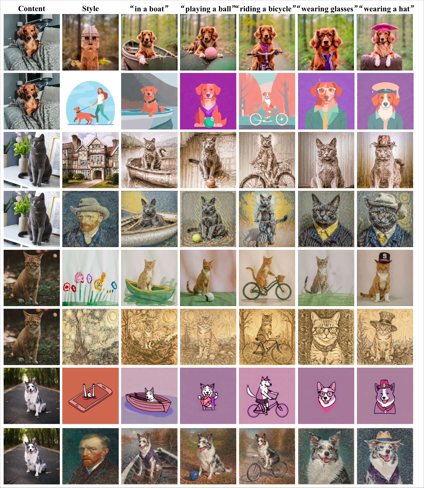

<figcaption>図11: 我々の手法は元のスタイルを維持しながら物体の動作と環境を効果的に修正する。</figcaption>
</figure>

## XII Prompt Control（プロンプト制御）

我々は、プロンプトの調整によって物体の動作・周囲の環境の変更や新しい要素の導入が可能かどうかを評価する実験を行う。図 11 に示すように、プロンプトを修正した後、我々の手法は元の物体の特性と様式的属性を効果的に保存しつつ、新しい要素やシーンの詳細をシームレスに統合する。

<figure>

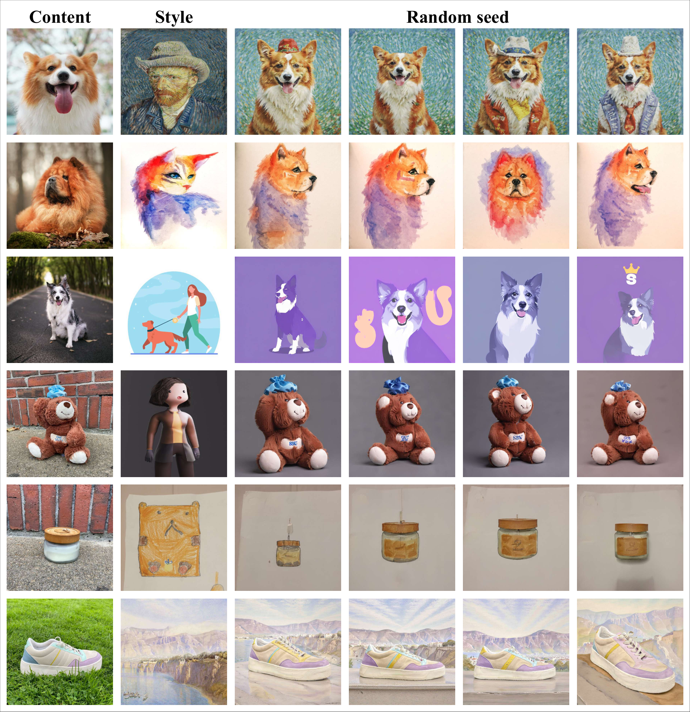

<figcaption>図12: ランダムに選ばれたシードで得られた結果は、我々の NP-LoRA の安定性と頑健性を実証する。</figcaption>
</figure>

## XIII Robustness Test（頑健性の検証）

我々は異なるランダムシードで実験を走らせ、確率的な条件にわたる安定性を調べることで手法の頑健性を評価する。図 12 に示すように、我々のアプローチは様々なシードのもとで一貫して安定した結果を生み、本文で観察された定性的な傾向と一致する。具体的には、NP-LoRA はコンテンツの保存とスタイルの一貫性の間の均衡のとれたトレードオフを達成し、最も視覚的に調和のとれた結果をもたらす。

## XIV Further Generalization Validation on FLUX（FLUX 上のさらなる汎化性の検証）

NP-LoRA の一般性をさらに検証するため、多様な被写体とスタイルをカバーする公開 LoRA を用いて FLUX バックボーンに我々の手法を適用する。図 13・14 に示すように、NP-LoRA は様々な領域にわたって被写体の同一性と様式的忠実度の均衡を一貫して保存する。これらの結果は、我々の射影ベースの融合機構が異なる拡散アーキテクチャのもとでも有効であり続けることを実証し、提案アプローチの頑健性と一般的な適用可能性を浮き彫りにする。

## XV Details for GPT-5 Evaluation Protocol（GPT-5 評価プロトコルの詳細）

本文では、被写体の忠実度とスタイルの一貫性を最もよく均衡させる候補画像を自動的に評価・選択するために GPT-5 モデルを採用した。完全な再現性を保証するため、GPT-5 に用いた正確なプロンプトを以下に示す。

```
Task: Evaluate and select the candidate image that best balances Subject Fidelity and Style Consistency.
Inputs:
– First image = A.jpg (Subject Fidelity reference): core subject content to preserve.
– Second image = B.jpg (Style reference): artistic style, colors, lighting to apply.
– Next six images are candidates, named [Model_1]..[Model_6] in the given order.
Candidate mapping (fixed):
[Model_1] = Direct
[Model_2] = Klora
[Model_3] = LoRArar
[Model_4] = B-LoRA
[Model_5] = ziplora
[Model_6] = NP-LoRA
Evaluation Criteria:
1) Subject Fidelity: retain key characteristics/structure/recognizability from A.jpg.
2) Style Consistency: apply style/texture/colors/lighting present in B.jpg.
Crucial Requirement:
Do not choose images that only retain the subject without the style, or only mimic the style with distorted subject. Select the one with the BEST BALANCE.
Output Rules (IMPORTANT):
You MUST respond with ONLY ONE of the following exact strings (case-sensitive):
Direct
Klora
LoRArar
B-LoRA
ziplora
NP-LoRA
Do NOT output anything else. Do NOT include punctuation, brackets, markdown, or explanation.
```

評価の間、GPT-5 は参照被写体画像（A.jpg）・参照スタイル画像（B.jpg）・異なるマージ戦略による 6 つの生成候補を受け取った。次に上記のプロンプトに従って、最もよく均衡した画像を独立に選択した。**各ケースは交差サンプルのバイアスを防ぐため個別に判定された**。報告される最終的な GPT-5 の選好スコアは、各手法が最良の総合結果として選ばれた場合の割合を表す。

<figure>

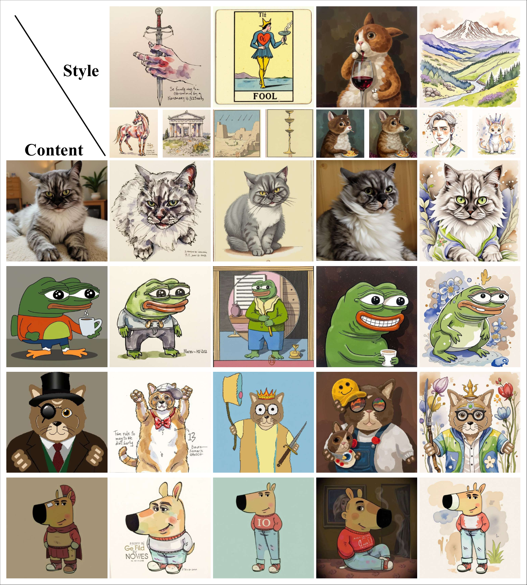

<figcaption>図13: 多様な公開 LoRA を用いた Flux バックボーン上の NP-LoRA の定性的結果。各画像は上に示されたコンテンツ LoRA と左に示されたスタイル LoRA の組合せに対応し、我々の手法が生成した結果を図解する。</figcaption>
</figure>

<figure>

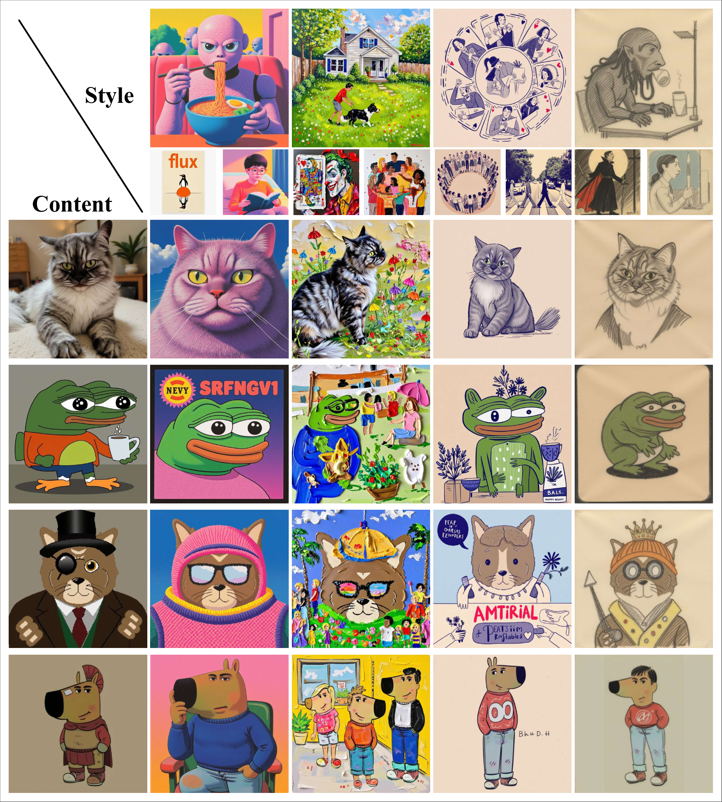

<figcaption>図14: 多様な公開 LoRA を用いた Flux バックボーン上の NP-LoRA の定性的結果。各画像は上に示されたコンテンツ LoRA と左に示されたスタイル LoRA の組合せに対応し、我々の手法が生成した結果を図解する。</figcaption>
</figure>
