# Wan: オープンで先進的な大規模動画生成モデル

> 原題: Wan: Open and Advanced Large-Scale Video Generative Models
> 著者: Wan Team, Alibaba Group（貢献者一覧は §7）
> 出典: arXiv:2503.20314

<figure>

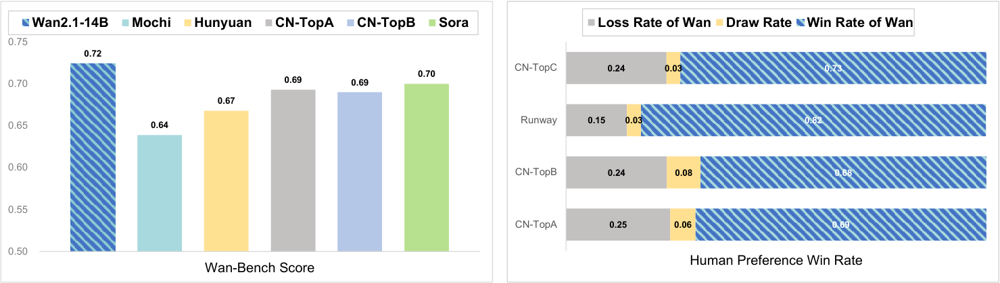

<figcaption>図1: Wan と最先端のオープンソースおよびクローズドソースのモデルとの比較。ベンチマーク評価と人間による評価の双方において、一貫して優れた結果を示した。なお HunyuanVideo はオープンソース版を用いて評価している。</figcaption>
</figure>

## Abstract（要旨）

本レポートは、動画生成の限界を押し広げるべく設計された、包括的でオープンな動画基盤モデル群である Wan を提示する。主流の diffusion transformer パラダイムの上に構築された Wan は、我々の新しい時空間変分オートエンコーダ（VAE）、スケーラブルな事前学習戦略、大規模なデータキュレーション、自動評価指標を含む一連の革新を通じて、生成能力において顕著な進展を達成する。これらの貢献は総体として、モデルの性能と多用途性を高める。具体的には、Wan は 4 つの主要な特徴によって特徴づけられる。*先導的な性能*: 数十億の画像と動画から成る膨大なデータセット上で学習された Wan の 14B モデルは、データ規模とモデル規模の双方に関して動画生成のスケーリング則を実証する。それは複数の内部および外部のベンチマークにわたって、既存のオープンソースモデルおよび最先端の商用ソリューションを一貫して上回り、明確かつ有意な性能上の優位性を示す。*包括性*: Wan は効率性と有効性のためにそれぞれ 1.3B と 14B のパラメータを持つ 2 つの有能なモデルを提供する。それはまた image-to-video、指示誘導型の動画編集、個人向け動画生成を含む複数の下流応用をカバーし、最大 8 つのタスクを包含する。同時に Wan は、中国語と英語の双方で視覚的テキストを生成できる最初のモデルであり、その実用的価値を大きく高めている。*コンシューマ級の効率性*: 1.3B モデルは卓越したリソース効率を示し、わずか 8.19 GB の VRAM しか必要とせず、幅広いコンシューマ級 GPU との互換性を持つ。それはまた、より大きなオープンソースモデルと比較して優れた性能を示し、text-to-video において顕著な効率性を示す。*オープン性*: 我々は動画生成コミュニティの成長を促進することを目標に、ソースコードとすべてのモデルを含む Wan シリーズ全体をオープンソース化する。このオープン性は、業界における動画制作の創造的可能性を大きく広げ、学術界に高品質な動画基盤モデルを提供することを目指す。加えて、我々は提案する Wan の様々な側面をカバーする広範な実験的分析を実施し、詳細な結果と洞察を提示する。我々はこれらの知見と結論が動画生成技術を大きく前進させると確信している。すべてのコードとモデルは [https://github.com/Wan-Video/Wan2.1](https://github.com/Wan-Video/Wan2.1) で入手可能である。

## 1 Introduction（はじめに）

OpenAI による Sora の導入以来、動画生成技術は産業界と学術界の双方から多大な注目を集め、この分野の急速な進展をもたらしてきた。専門的に制作されたコンテンツに匹敵する動画を生成できるモデルの出現は、コンテンツ制作の効率を大幅に改善すると同時に、動画制作に伴うコストを削減してきた。動画生成技術のこれら急速な進展は、オープンソースコミュニティの発展にも大きく帰せられる。HunyuanVideo、Mochi、CogVideoX といった注目すべきプロジェクトは、動画基盤モデルのコードと重みを公開し、オープンソースモデルと商用の対応物との間の隔たりを徐々に狭めてきた。しかしながら、これら優れたオープンソースモデルと最新のクローズドソースモデルとの間に持続的な隔たりが存在することは認めねばならない。この隔たりは主に 3 つの側面で明らかである。*最適でない性能*: 商用モデルの開発ペースは現在のオープンソースモデルのそれをはるかに上回り、著しく優れた能力をもたらしているため、顕著な性能差が残っている。*限られた能力*: 大半の基盤モデルは一般的な text-to-video（T2V）タスクに限定されているが、動画制作の需要は多面的である。その結果、基本的な T2V モデルではこれら多様な要求に対応するには不十分である。*不十分な効率性*: 印象的な性能と規模にもかかわらず、これらのモデルは計算資源の限られた制作チームにとってしばしば非実用的であり、そのアクセシビリティと使いやすさを妨げている。これらの課題は総体として、オープンソースコミュニティ内での持続的な成長と革新に制約を課している。

前述の課題に対処するため、本レポートは Wan と呼ばれる、高性能な基盤動画生成モデルの新しいシリーズを紹介し公開する。これはこの分野に新たな基準を打ち立てる。Wan の中核設計は、Diffusion Transformers（DiT）と Flow Matching の組み合わせの成功に着想を得ている。これは text-to-image（T2I）および text-to-video（T2V）の両タスクにおいて、スケーリングによって達成可能な有意な性能向上を実証してきた枠組みである。このアーキテクチャのパラダイム内で、テキスト条件を埋め込むために cross-attention が用いられ、モデルの設計は計算効率と精密なテキスト制御性を確保するよう入念に最適化されている。複雑なダイナミクスを捉えるモデルの能力をさらに高めるため、完全な時空間注意（full spatio-temporal attention）機構が組み込まれている。広範な実験を通じて、このモデルは 140 億パラメータに達する規模で検証されている。続いて Wan は、数十億の画像と動画から成る大規模データ、総計 $\mathcal{O}(1)$ 兆トークンに相当するデータを見てきた。この広範な学習はモデルの能力の創発を促し、動きの振幅と品質、視覚的テキスト生成、カメラ制御、指示追従、様式的多様性といった複数の次元にわたって頑健な性能を示すことを可能にしている。この強力な基盤モデルの上に、我々はその能力を多数の下流タスクへ拡張した。image-to-video 生成（I2V）、指示誘導型の動画編集（V2V）、zero-shot の個人向けカスタマイズ、リアルタイム動画生成、音声生成といった重要な応用が含まれる。推論コストを最小化するため、我々は T2V と I2V の双方について 14B モデルと並んで 1.3B モデルも導入する。どちらも 480p 解像度をサポートし、推論効率を大きく高める。注目すべきことに、1.3B モデルはわずか 8.19G の VRAM しか必要とせず、多くのコンシューマ級 GPU 上で動作できる一方、その性能は多くのより大きなオープンソースモデルを上回る。

さらに我々は、大規模なデータ構築パイプライン、動画変分オートエンコーダ（VAE）、学習戦略、加速技術、自動評価アルゴリズムを含む学習プロセス全体を公開し、コミュニティが専門的な基盤動画モデルを開発できるようにする。加えて、包括的な設計の詳細と実験結果を提供し、大規模生成モデルの資源集約的な学習の過程で観測された現象について、我々の主要な知見と結論とともに洞察を提供する。これらの貢献が動画生成技術の進展を加速する上で極めて重要な役割を果たすと確信している。

<figure>

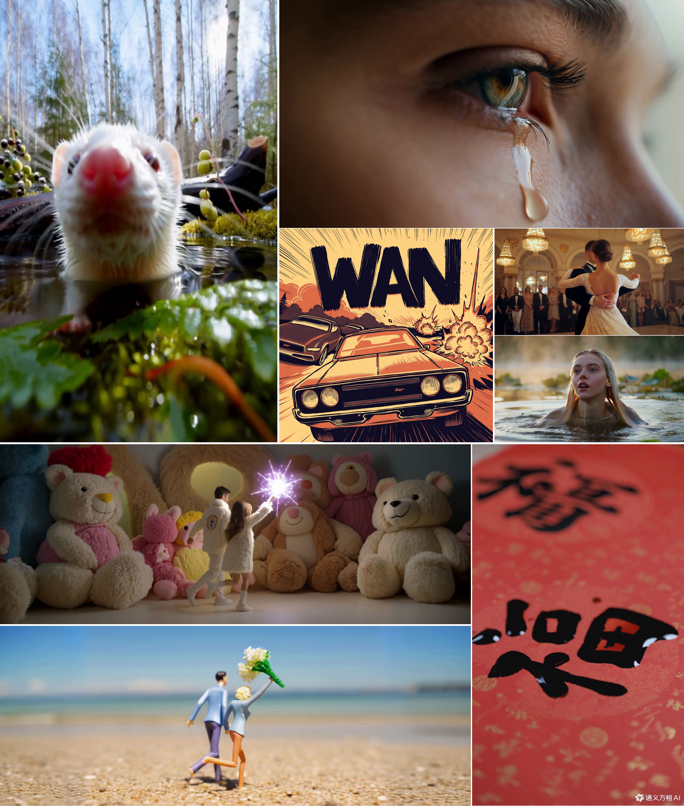

<figcaption>図2: Wan が生成したサンプル。大きな動き、高い忠実度、写実的な細部を持つ動画を生成できる。また、動画内に中国語と英語の双方のテキストを生成する最初のモデルでもある。加えて text-to-video、image-to-video、動画編集を含む様々な機能を提供する。</figcaption>
</figure>

## 2 Related Work（関連研究）

生成モデリングの進展に牽引されて、大規模動画モデルの地形は、とりわけ拡散ベースの枠組みにおいて大きく進化してきた。我々のレビューは 2 つの広いカテゴリに焦点を当てる：クローズドソースのモデルと、オープンソースコミュニティからの貢献である。

クローズドソースモデル。クローズドソースモデルは主に大手テクノロジー企業によって開発されたもので、投入された広範な資源により高品質で専門的な動画生成を目指している。我々は過去 1 年間に公開された注目すべきモデルを時系列で整理する。2024 年 2 月、OpenAI が Sora を導入し、AI 生成コンテンツにおける大きな飛躍を画した。2024 年 6 月には、Kuaishou の Kling と LUMA AI の Luma 1.0 が公開テストのために開放され、強力な動画生成能力を提供した。同時期に Runway が Gen-2 を土台とする Gen-3 を発表し、動画制作の基準をさらに引き上げた。2024 年 7 月、Shengshu AI が自社設計の U-ViT アーキテクチャを備えた Vidu を公開した。2024 年 9 月には Kling と Luma の双方がバージョン 1.5 へ更新された。同じ時期に MiniMax が Hailuo Video を導入し、印象的な視覚的結果を公衆に届けた。2024 年 10 月、Pika Labs が Pika 1.5 を発表し、ユーザーが動画の視覚的・物理的属性をカスタマイズできるようにした。加えて Meta が Movie Gen を導入し、その学習プロセスと応用を詳述した一連の動画基盤モデルを示した。2024 年 12 月、Kling がバージョン 1.6 へ進み、同時に Google が実世界の物理と人間の動きの機微についての理解を改善した Veo 2 を公開した。

これらの発展は、動画生成分野における熾烈な世界的競争を浮き彫りにする。この文脈において、我々のオープンソースの Wan は、内部および外部の両ベンチマークにわたってこれら商用モデルに対して競争力のある、あるいはそれを上回る性能を示し、複数の属性で先導している。

オープンソースコミュニティからの貢献。一方、オープンソースコミュニティは、全体的な動画生成モデルだけでなく、本質的なモデル構成要素の探求にも実質的な貢献をしてきた。拡散ベースの動画生成モデルは典型的に Stable Diffusion のアーキテクチャの上に構築される。それは主に 3 つの重要なモジュールを含む：元の動画をコンパクトな潜在空間へ写像するオートエンコーダ、テキスト埋め込みを抽出するテキストエンコーダ、そしてこれら動画潜在の分布を学習するために拡散モデルによって最適化されるニューラルネットワークである。ネットワーク構造については、当初画像生成に用いられた U-Net が、時間次元を組み込むことによって動画生成に適応された。VDM は 2D U-Net を 3D 版へ拡張し、別のパラダイムは計算コストを削減するために 1D の時間的注意と 2D の空間注意ブロックを組み合わせて導入した。特筆すべきことに、transformer ブロックのみに依拠する Diffusion Transformers（DiT）は、視覚生成タスクにおいて U-Net より優れている。この構造は動画モデルにも移植され、2 つの一般的な変種を生んだ：テキスト埋め込みに cross-attention を用いる元の DiT と、テキスト埋め込みを視覚埋め込みに連結して完全注意で処理する MM-DiT である。オートエンコーダについては、初期のアプローチが標準的な VAE を採用する一方、VQ-VAE や VQGAN といった最近のオートエンコーダは、より良い再構成と圧縮のためにモデル設計を改善している。LTX-Video は VAE デコーダを改変して最終のノイズ除去ステップを実行させ、潜在をピクセルへ変換する。そこでは欠落した高周波の詳細が復号の際に生成される。テキストエンコーダもテキストベースの動画生成にとって重要である。現在の強力な動画生成モデルは主に T5 系列を主要なテキストエンコーダとして利用し、しばしば CLIP と併用する。HunyuanVideo の場合、テキスト埋め込みと視覚特徴の間のより頑健な整合を達成するため、T5 がマルチモーダル大規模言語モデルに置き換えられている。

これらの重要なモジュールを効果的な拡散ベースの最適化技術と統合することによって、複数の有望なオープンソース動画生成モデルが現れてきた。Wan では、高品質な動画合成を確保するために各々の重要な構成要素を入念に設計あるいは選択した。我々は詳細な設計情報とアブレーション研究を提供しており、これらは将来の動画生成モデルの設計を助けうる。

加えて、多数の研究が動画生成における下流タスクを探求してきた。これらのタスクには repainting、編集、可制御生成、フレーム参照生成が含まれ、しばしばアダプタベースおよび ControlNet 的なアーキテクチャを活用してユーザー指定の条件を組み込む。我々もまた Wan に基づく様々な下流応用を開発し、優れた性能を実証している。

## 3 Data Processing Pipeline（データ処理パイプライン）

高品質なデータは大規模生成モデルの学習に不可欠であり、自動化されたデータ構築パイプラインは学習プロセスの効率を大きく高める。データセットの開発にあたり、我々は 3 つの中核原則を優先した：*高品質*、*高多様性*、*相当な規模*である。これらの原則に従い、我々は数十億の動画と画像から成るデータセットをキュレートした。本節では、Wan に用いたデータ構築パイプラインを詳細に紹介する。

### 3.1 Pre-training Data（事前学習データ）

我々は内部の著作権付き情報源と公開アクセス可能なデータの双方から得た候補データセットをキュレートし重複除去した。事前学習段階では、この広大だがノイズの多いデータセットから高品質かつ多様なデータを選択し、効果的な学習を促進することが目標である。データマイニングのプロセス全体を通じて、我々は基本的次元・視覚的品質・動きの品質に焦点を当てた 4 段階のデータクリーニングプロセスを設計した。続いて、視覚的テキストデータを構築するためのデータ処理ワークフローについても強調する。

基本的次元。我々のデータフィルタリング枠組みの基本的次元は、元となる動画および画像データの本質的属性に焦点を当て、不適切なデータすべての効率的な予備的除外を可能にする。具体的には、我々の多次元フィルタリングのアプローチは以下の重要な側面を包含する。*テキスト検出*: 軽量な OCR 検出器を実装してテキストの被覆率を定量化し、視覚的な明瞭さを保つために過剰なテキスト要素を含む動画や画像を効果的に除外する。*美的評価*: 広く採用されている LAION-5B の美的分類器を用いて画像の初期品質評価を行い、低品質なデータを素早く除外する。*NSFW スコア*: 内部の安全性評価モデルを通じて、全学習データにおいて計算された NSFW スコアに基づき不適切なコンテンツを体系的に評価しフィルタリングする。*透かしとロゴの検出*: 動画や画像が透かしやロゴを含むかを検出し、学習の際にこれらの要素を切り取る。*黒縁の検出*: ヒューリスティックに基づく検出手法を用いて、内容の豊かな領域に焦点を保つよう余分な黒縁を自動的に切り取る。*露出過多の検出*: 学習済みの専門家分類器が異常な階調分布を持つデータを評価し除外することで、学習データセットにおける最適な視覚的品質を確保する。*合成画像の検出*: 経験的証拠は、生成画像によるごくわずかな混入（$<10\%$）でもモデルの性能を著しく劣化させうることを示している。したがって我々はこれら「汚染する」画像を除外するために専門家分類器を学習する。*ぼけ検出*: 内部開発したモデルが学習素材に定量的なぼけスコアを割り当て、視覚的に不鮮明なコンテンツの体系的な除去を可能にする。*長さと解像度*: 動画の長さは 4 秒を超えねばならないという制約も課し、解像度の閾値は学習段階ごとに適用して低品質なデータを除外する。これら効率的な前処理戦略の実装を通じて、我々は初期データセットの約 50% を首尾よく除去した。残された高品質なデータは、その後さらなる精錬のため、より上位の意味論駆動の選択段階へ進む。

視覚的品質。これは主に、候補データセットから比較的高品質で事前学習の基準を満たすデータを選択することを含む。この部分集合のデータは良好な視覚的品質を持ち、その全体的な分布が自然なデータのそれと整合していなければならない。このプロセスにおいて、我々はタスクを 2 つの部分に分ける：*クラスタリング*と*スコアリング*である。*クラスタリング*は全データをより小さな部分集合に分割し、各部分集合を個別に処理できるようにするために用いる。このアプローチの利点は、ロングテール分布のために生じうる、小規模だが重要なデータ断片の喪失を防ぎ、それによって元のデータ分布を維持できることである。具体的には、データを 100 のクラスタに分割し、次の段階のデータ処理のために各クラスタから一定量のデータを選択する。*スコアリング*は各動画あるいは画像に品質スコアを割り当て、異なる段階でのデータの選択と処理を容易にするために用いる。具体的には、各クラスタからサンプルを選んで人手でスコア付けし（1 から 5 の範囲で、1 が最低、5 が最高）、その後アノテートされた全データを用いて専門家評価モデルを学習し、データセット全体をスコア付けする。

動きの品質。動き品質評価の目標は、自然で完結しており、かつ有意な動きを伴う動画を選択する一方、静的あるいは震えのある動きを避けることである。我々は動画データを 6 つの異なる動き品質の段階に分類する。*最適な動き*: この段階は、有意な動きのレイアウト・視点・振幅といった最適な属性に加え、クリーンで滑らかな動きを持つ動画を表す。*中程度の品質の動き*: このカテゴリの動画は目立った動きを示すが、複数の被写体や部分的な遮蔽といった軽微な問題を持ちうる。このデータは動きの多様性を確保し、モデルが時空間的関係をよりよく理解するのを助けるために事前学習で用いることができる。*静的な動画*: このカテゴリは主に、チャットやインタビュー形式の動画から成る動画に焦点を当てる。これらの動画は最小限の動き情報しか含まないが、品質は高い。したがって我々はそれらを別個に識別し、サンプリング比率を下げる必要がある。*カメラ駆動の動き*: 被写体の動きが最小限で、カメラの動きが支配的な映像（例：空撮）。静止画像との類似性から、これらは実質的に低いサンプリング優先度を受ける。*低品質の動き*: 過剰な被写体、深刻な遮蔽、あるいは主被写体が不明瞭な動画（例：混雑した街路のシーン）。そのようなコンテンツは学習効率と動き生成品質への悪影響のため除外される。*手ぶれ映像*: 顕著なカメラの震えを伴う素人の記録で、しばしば動きのぼけと前景・背景の区別の曖昧さを引き起こす。このカテゴリは学習の対象から体系的に除外される。

視覚的テキストデータ。加えて、我々は Wan の視覚的テキスト生成を強化するための新しいデータ処理アプローチも導入する。このアプローチは、テキストレンダリングの正確性と調和の双方を改善するよう設計された 2 つの異なる処理系統から成る。一方では、純白の背景上に漢字をレンダリングすることによって、数億のテキストを含む画像を合成する。他方では、膨大な実世界データからテキストを含む画像を大量に収集する。我々は複数の OCR モデルを用いて画像と動画から英語と中国語の双方のテキストを正確に認識し、続いてこれら抽出されたテキスト内容をマルチモーダル言語モデル Qwen2-VL に入力する。このプロセスは画像の自然な記述を生成し、その記述ができる限り正確なテキスト内容を組み込むことを保証する。我々はこの処理パイプラインを活用して、大量の実世界の画像-テキストペアを収集する。事前学習段階で合成データと実データの双方を統合することにより、我々のアプローチは動画中の稀な語を正確な字形と高い写実性で生成するよう効果的に汎化し、視覚的テキスト生成において有意な優位性を示す。

<figure>

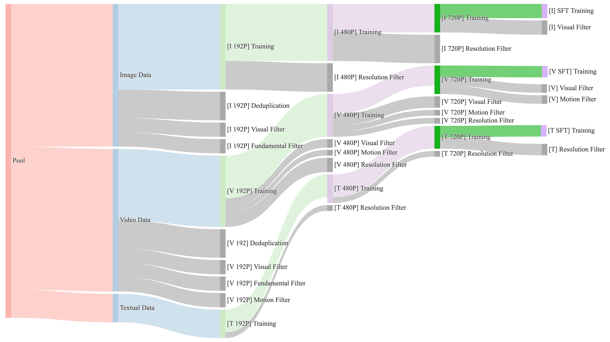

<figcaption>図3: 異なる学習フェーズにわたるデータの供給。各段階について、データのスループットに基づいて動き・品質・カテゴリに関するデータの比率を動的に調整する。</figcaption>
</figure>

### 3.2 Post-training Data（事後学習データ）

事後学習の中核目標は、高品質なデータを通じて生成される動画の視覚的忠実度と動きのダイナミクスの双方を改善することである。この段階における我々のデータ処理パイプラインは、静的データと動的データに対して別個の戦略を採用する：画像データは視覚的品質の改善のために最適化され、動画データは動きの品質を精錬するために特に処理される。

画像処理。高スコアの画像データのプールから、我々は品質・構図・細部といった側面で優れた最上位品質のサンプルを特定するための追加の精錬プロセスを実行する。具体的には、2 つの手法を用いてキュレートされたデータセットを構築する：*専門家ベースの収集*と*人手による収集*である。前者の手法は、専門家モデルによって予測されたスコアに基づいて上位 20% の画像を選択することを含む。この部分集合については、データ分布の多様性を確保するために様式やカテゴリといった要因も考慮する。後者のアプローチは、様々なカテゴリと情報源から最上位品質の画像を人手で収集すると同時に、データセットに欠けている概念を埋めてモデルの汎化能力を高めることを含む。このプロセスを通じて、我々は合計で数百万のキュレートされた画像を収集した。

動画処理。この段階では、画像に用いたのと類似の戦略を用いて最上位品質の動画を収集する。まず、視覚的品質分類器を用いて候補データセットから上位にランクされた動画を絞り込む。次に、動き品質分類器に基づいて、単純な動きを特徴とする動画を数百万本、複雑な動きを持つ動画を数百万本選択する。すべての動画選択はカテゴリのバランスと高い多様性を重視する戦略に従う。同時に、一般的に用いられるカテゴリに対するモデルの生成能力を高めるため、技術・動物・芸術・人間・乗り物などを含む 12 の主要カテゴリからデータを選択する。

### 3.3 Dense Video Caption（密な動画キャプション）

我々のデータセットは多くの画像と動画について元のウェブページからのテキスト記述を含むが、それらは詳細な視覚的内容を伝えるには単純すぎることが多い。DALL-E 3 は、高度に記述的な生成された視覚キャプションで学習することにより、視覚生成モデルのプロンプト追従能力が大きく高まりうることを実証した。したがって我々は、データセットの各画像と動画に密なキャプションを生成する内部キャプションモデルを開発する。このモデルを学習するため、オープンソースの視覚言語データセットと、追加で内部収集したデータの双方を組み込む。

#### 3.3.1 Open Source Dataset（オープンソースのデータセット）

我々は画像と動画の双方について、広く用いられている視覚言語データセットを収集する。我々の収集にはキャプションのデータセットだけでなく、動作・計数・OCR といった視覚的内容に焦点を当てた視覚的 Q&A データセットも含まれる。一部のシナリオでは、ユーザーの指示に基づいて特定の様式や内容のキャプションを生成することをキャプションモデルに要求する。したがって我々は、モデルの指示追従能力を高めるために純粋なテキストの指示データも収集した。

#### 3.3.2 In-house Dataset（内部データセット）

我々は特定の領域におけるモデルの能力を高めるため、様々なタスクについて内部データセットを収集する。

*著名人、ランドマーク、映画のキャラクター。* 著名人・ランドマーク・キャラクターを認識するようモデルを学習させるため、数千の同一性から成るデータセットを収集する。まず大規模言語モデル（LLM）を用いて名前を収集し、次に CLIP 系のモデルを用いて画像-テキストデータベースから対応する画像を検索する。我々は様々な CLIP 系のモデルを検証し、TEAM が個人の認識、とりわけ中国の著名人において優れていることを見出した。データセット内のノイズをさらに減らすため、画像-テキストペアの記述に対してキーワード照合を実装した。画像は TEAM モデルによって検索され、かつ指定されたキーワードに一致する場合にのみ保持される。

*物体の計数。* モデルの視覚的な計数能力を高めるため、「one」「two」「three」といった語を含むテキスト記述を持つ画像を検索して計数データセットを編纂した。これらの数字は画像に対する粗いアノテーションを提供する。次に LLM を用いて対応するテキストから（*カテゴリ*, *個数*）の対を抽出する。最後に Grounding DINO を用いてそれらのカテゴリの物体を数える。画像はそのテキスト記述が Grounding DINO の結果と一致する場合にのみ保持される。

*OCR。* テキスト記述を生成するモデルの能力を改善するため、OCR で拡張された画像キャプションのデータセットを収集する。最初に既製の OCR 検出器を用いて画像からテキストを抽出する。次にこれら OCR の結果に基づいて記述を生成するようキャプションモデルに促す。このアプローチは、抽出された OCR テキストを事前知識として用いることにより、正確なテキスト記述を保証する。現在は英語と中国語のテキストのみを含む。

*カメラアングルと動き。* 我々は、GPT-4o や Google Gemini Pro のような最先端の商用モデルを含め、現行のマルチモーダル言語モデル（MLLM）がカメラアングルと動きの予測に苦戦することを観測した。これらの予測を改善するため、まずカメラアングルと動きについて一連の動画をアノテートする。このデータセットは 2 通りに活用できる：最終学習段階で用いるキャプションモデルを直接学習するか、あるいはより多くの動画データをアノテートする専門家モデルを学習して、学習の初期段階でモデルを助けるかである。このデータセットは我々の動きとアングルの記述の正確さを高め、それによって動画生成モデルのカメラ動き制御性を改善する。

*細粒度のカテゴリ。* 動物・植物・乗り物といった細粒度のカテゴリを認識するモデルの能力を高めるため、これらのカテゴリにわたる数百万の画像を含むデータセットを作成した。

*関係の理解。* 既存の物体検出データセットを組み込むことにより、左・右・上・下といった空間的関係に焦点を当てたデータセットを集めて、モデルの関係理解を強化する。

*再キャプション。* キャプションモデルの重要な能力の 1 つは、既存のタグや簡潔なキャプションを活用して密なキャプションを生成することである。これを促進するため、画像内容に基づいて簡潔なテキストタグやキャプションを詳細な記述へ拡張する再キャプションのデータセットをキュレートする。

*編集指示のキャプション。* 2 枚の画像間の差異あるいは変換を記述するデータセットを収集する。この種のキャプションは画像編集タスクにとって価値がある。

*画像群の記述。* 画像の集まりに対する記述を提供するデータセットを収集する。各キャプションは画像が共有する共通の特徴の記述で始まり、続いて類似の言い回しを用いて各画像の個別の記述が続く。

*人手アノテーションによる画像・動画キャプション。* 画像と動画の双方について人手でアノテートされた密なキャプションを集める。これらは我々の最高品質のキャプションデータであり、モデル学習の最終段階で用いられる。

> 図4: 我々のキャプションモデルは全体として Google Gemini 1.5 Pro に匹敵する性能を達成している。とりわけ、事象・カメラアングル・カメラの動き・様式・色といった領域で優れている。（訳注: ar5iv・arXiv HTML のいずれでも本図の画像が生成されておらず、取得できなかった）

#### 3.3.3 Model Design（モデル設計）

アーキテクチャ。我々のキャプションモデルは LLaVA 形式のアーキテクチャを採用する。画像と動画フレームの視覚埋め込みを抽出するために ViT エンコーダを用いる。これらの埋め込みは 2 層のパーセプトロンを通じて射影され、その後 Qwen LLM へ入力される。

画像入力については、LLaVA と同様に動的高解像度を採用する。1 枚の画像は最大 7 つのパッチに分割されうる。各パッチについて、計算を削減するために視覚埋め込みを適応的にプーリングして 12 $\times$ 12 のグリッド表現にする。

動画については、毎秒 3 フレームをサンプリングし、上限は 129 フレームとする。計算をさらに削減するため、slow-fast 符号化戦略を採用する：4 フレームごとに 1 枚は元の解像度を維持し、残りのフレームの埋め込みには大域平均プーリングを適用する。長尺動画のベンチマークにおける実験は、slow-fast 機構が限られた数の視覚トークンで理解を高める（例：字幕なしの VideoMME で性能を 67.6% から 69.1% へ改善）ことを示している。

学習。最近の最先端手法に従い、我々の学習プロセスは 3 段階に分けられる。第 1 段階では ViT と LLM を凍結し、視覚埋め込みを LLM の入力空間へ整合させるために多層パーセプトロンのみを学習率 1e-3 で学習する。第 2 段階では全パラメータを学習可能にする。最終段階では、少量の高品質データについてエンドツーエンドの学習を行う。後の 2 段階については、学習率を LLM と MLP に対して 1e-5、ViT に対して 1e-6 に設定する。

#### 3.3.4 Evaluation（評価）

自動評価はキャプションモデルの開発にとって極めて重要であり、各モデル版の長所と短所を特定することを可能にする。CAPability に従い、我々は自動キャプション評価パイプラインを開発する。動画生成における 10 の主要な視覚的次元に焦点を当てる：動作、カメラアングル、カメラの動き、物体カテゴリ、物体の色、物体の計数、OCR、シーン、様式、事象である。各次元について、1,000 本の動画とモデルが生成した対応するキャプションを無作為に抽出した。また Google Gemini 1.5 Pro を用いてこのデータセットに対する密な動画キャプションを生成した。CAPability に従って各次元の F1 指標を計算することにより、我々のキャプションと Gemini が生成したキャプションを評価する。結果は図 4 に示される。我々のキャプションは動画の事象・カメラアングル・カメラの動き・様式・物体の色において優れる一方、Gemini は動作・OCR・シーン・物体カテゴリ・物体の計数において優れている。

## 4 Model Design and Acceleration（モデル設計と加速）

### 4.1 Spatio-temporal Variational Autoencoder（時空間変分オートエンコーダ）

<figure>

<figcaption>図5: 我々の Wan-VAE の枠組み。Wan-VAE は動画の時空間次元を 4 × 8 × 8 倍圧縮できる。橙色の矩形は 2 倍の時空間圧縮を、緑色の矩形は空間圧縮を表す。</figcaption>
</figure>

変分オートエンコーダ（VAE）は、高次元の視覚データ（とりわけ動画）からコンパクトな潜在表現を学習する上で極めて重要な役割を果たし、拡散モデルのような生成モデルのスケーラブルで効率的な学習を促進する。しかしながら、動画生成タスクのための効果的な VAE の設計はいくつかの課題に直面する。第一に、動画は本質的に空間次元と時間次元の双方を持ち、VAE が複雑な時空間依存関係を捉えることを要求する。第二に、動画の本質的に高次元な性質（例：高解像度ピクセルの複数フレーム）はメモリ消費と計算コストを増大させ、VAE を長い動画系列へスケールさせることを困難にする。第三に、時間的因果性（すなわち未来のフレームが過去のフレームに影響しないこと）を確保することは、写実的で一貫した動画内容を生成するために極めて重要だが、この制約は追加のアーキテクチャ上の複雑さを持ち込む。

これらの課題に対処するため、我々は動画生成のために特別に設計された新しい 3D causal VAE アーキテクチャ（Wan-VAE）を提案する。我々は時空間圧縮を改善し、メモリ使用量を削減し、時間的因果性を確保するために複数の戦略を組み合わせる。これらの強化は Wan-VAE をより効率的でスケーラブルにし、DiT のような拡散ベースの生成モデルとの統合により適したものにする。次に、我々の Wan-VAE のネットワーク設計、学習の詳細、効率的な推論、実験的比較を紹介する。

#### 4.1.1 Model Design（モデル設計）

高次元のピクセル空間と低次元の潜在空間の間の双方向の写像を達成するため、我々は図 5 に示す 3D causal VAE を設計する。入力動画 $V\in\mathbb{R}^{(1+T)\times H\times W\times 3}$ が与えられると、Wan-VAE はその時空間次元を $[1+T/4,H/8,W/8]$ へ圧縮する一方、チャネル数 $C$ を 16 へ拡大する。具体的には、MagViT-v2 に従い、画像データをよりよく扱うために最初のフレームは空間的にのみ圧縮される。アーキテクチャの点では、時間的因果性を保つためにすべての GroupNorm 層を RMSNorm 層に置き換える。この改変は特徴キャッシュ機構（4.1.3 節を参照）の使用を可能にし、推論効率を大きく改善する。さらに、空間アップサンプリング層における入力特徴チャネルを半減させ、その結果として推論時のメモリ消費を 33% 削減する。

基本チャネル数をさらに入念に調整することにより、Wan-VAE はわずか 127M パラメータというコンパクトなモデルサイズを達成する。この最適化は符号化時間とメモリ使用量を削減し、それによって後続の diffusion transformer モデルの学習に恩恵をもたらす。

#### 4.1.2 Training（学習）

我々は Wan-VAE を学習するために 3 段階のアプローチを採用する。まず、同じ構造を持つ 2D 画像 VAE を構築し、画像データ上で学習する。次に、よく学習された 2D 画像 VAE を 3D causal な Wan-VAE へと膨張（inflate）させ、初期の空間圧縮の事前知識を与える。これは動画 VAE をゼロから学習するのと比べて学習速度を劇的に改善する。この段階では、収束速度を加速するために低解像度（128 $\times$ 128）かつ少フレーム数（5 フレーム）の動画で Wan-VAE を学習する。学習損失には $L1$ 再構成損失、KL 損失、LPIPS 知覚損失が含まれ、それぞれ 3、3e-6、3 の係数で重み付けされる。最後に、3D 識別器からの GAN 損失を統合しつつ、異なる解像度とフレーム数の高品質な動画でモデルを微調整する。

<figure>

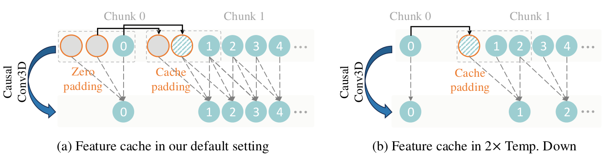

<figcaption>図6: 我々の特徴キャッシュ機構。(a) と (b) はそれぞれ、通常の因果畳み込みと時間的ダウンサンプリングにおいてこの機構をどのように用いるかを示す。</figcaption>
</figure>

#### 4.1.3 Efficient Inference（効率的な推論）

任意の長さの動画の符号化と復号を効率的に支えるため、我々は Wan-VAE の因果畳み込みモジュール内に特徴キャッシュ機構を実装する。

具体的には、動画系列のフレーム数は $1+T$ の入力形式に従うので、動画を $1+T/4$ 個のチャンクに分割する。これは潜在特徴の数と一致する。入力動画系列を処理する際、モデルはチャンク単位の戦略を採用し、各々の符号化・復号操作は単一の潜在表現に対応する動画チャンクのみを扱う。時間圧縮率に基づき、各処理チャンクのフレーム数は最大 4 に制限され、メモリのオーバーフローを効果的に防ぐ。

文脈のチャンク間の時間的連続性を確保するため、我々のモデルは先行するチャンクからのフレームレベルの特徴キャッシュを戦略的に保持する。これらキャッシュされた特徴は、後続のチャンクの因果畳み込み計算へ体系的に統合される。具体的なプロセスは図 6 に示され、特徴キャッシュ機構における 2 つの典型的な状況を示す。図 6 (a) では、既定の設定において因果畳み込みはフレーム数を変えないので、過去のフレームから 2 つのキャッシュ特徴（畳み込みカーネルサイズは 3）を保持する必要がある。最初のチャンクについては、キャッシュバッファを初期化するために 2 つのダミーフレームでゼロ埋めを適用する。後続のチャンクは、旧い履歴データを破棄しつつ、先行するチャンクの最後の 2 フレームをキャッシュ特徴として体系的に再利用する。図 6 (b) は 2 $\times$ の時間的ダウンサンプリング（ストライドが 2）を伴う状況を示す。ここでは異なるキャッシュ管理が必要となる：次元の一貫性を確保するため、最初のチャンク以外に対してのみ単一フレームのキャッシュ埋めを実装する。この構成は、チャンクの境界をまたいで因果関係を維持しながら、出力系列長がダウンサンプリング比に正確に従うことを保証する。

この特徴キャッシュ機構はメモリ利用を最適化するだけでなく、チャンク境界をまたぐ特徴の一貫性も保ち、それによって無限長の動画に対する安定した推論を支える。

#### 4.1.4 Evaluation（評価）

<figure>

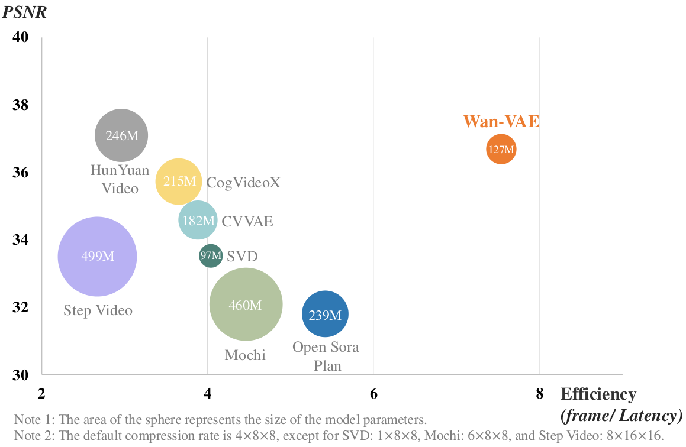

<figcaption>図7: 720 × 720 解像度・25 フレームにおける動画再構成性能の比較。</figcaption>
</figure>

定量的結果。本研究は、様々な最先端（SOTA）の動画 VAE モデルの性能を、ピーク信号対雑音比（PSNR）と処理効率（単位遅延（秒）あたりのフレーム数）を分析することによって包括的に評価する。特筆すべきことに、公平な比較のため、大半のモデルは我々のアプローチと同じ圧縮率と潜在特徴次元、すなわち $4\times 8\times 8$ の圧縮率と 16 の潜在次元を採用している。Open Sora Plan は我々と同じ圧縮比を持つが、潜在次元は 4 である。SVD は $1\times 8\times 8$ の圧縮率と 4 の潜在次元を用い、Step Video は $8\times 16\times 16$ の圧縮率と 64 の潜在次元を用い、Mochi は $6\times 8\times 8$ の圧縮率と 12 の潜在次元を用いる。評価は 200 本の動画について実施される。これらの動画は 25 フレームから成り、解像度は $720\times 720$ に設定される。図 7 において、円の大きさはモデルのパラメータ数と正に相関する。

実験結果は、Wan-VAE が両方の指標にわたって高い競争力のある性能を示し、優れた動画品質と高い処理効率という説得力のある二重の優位性を示すことを示している。特筆に値するのは、同じハードウェア環境下で、我々の VAE の再構成速度が既存の SOTA 手法（すなわち HunYuan Video）の 2.5 倍速いことである。この速度上の優位性は、我々の VAE モデルの小型設計と特徴キャッシュ機構により、より高い解像度でさらに際立つであろう。

この進展は動画再構成タスクと動画生成の学習に効率的な解決策を提供する。これらの知見は提案するモデル設計の有効性を検証するだけでなく、VAE 技術の将来の発展に対する価値ある洞察も提供する。

<figure>

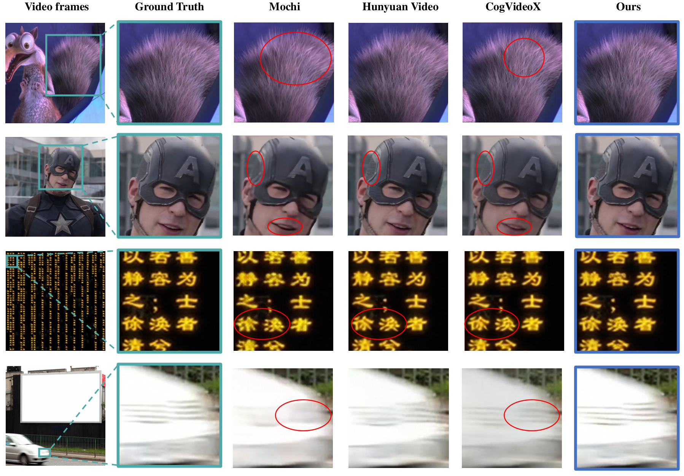

<figcaption>図8: 異なるシナリオにわたる動画再構成の可視化結果。テクスチャ（1 行目）、顔（2 行目）、テキスト（3 行目）、高速な動き（4 行目）を含む。上記の動画は豊かな細部を持つが学習には用いられていない。</figcaption>
</figure>

定性的結果。多様なシナリオにわたる我々の手法の動画再構成性能を検証するため、図 8 はテクスチャ・顔・テキスト・高速な動きの場面に対する視覚的結果を提示する。既存の VAE モデルと比較して、Wan-VAE はこれらの文脈で優れた性能を示す。1 行目に示されるテクスチャの場面では、我々の手法は髪の質感や向きといった細部をより正確に捉えることができる。2 行目に描かれる顔の場面では、Wan-VAE は唇周辺のぼけと歪みを減らしながら顔の特徴を保つ。3 行目に示されるテキストの場面では、我々の手法は文字の歪みと欠落の問題を緩和しつつ、テキスト内容を明瞭に復元することに成功している。4 行目に示される高速な動きの場面では、Wan-VAE は動画フレームの動きの鮮鋭さを維持する。これらの結果は、我々の手法が様々な複雑なシナリオを扱う上で有意な優位性を提供することを示している。

<figure>

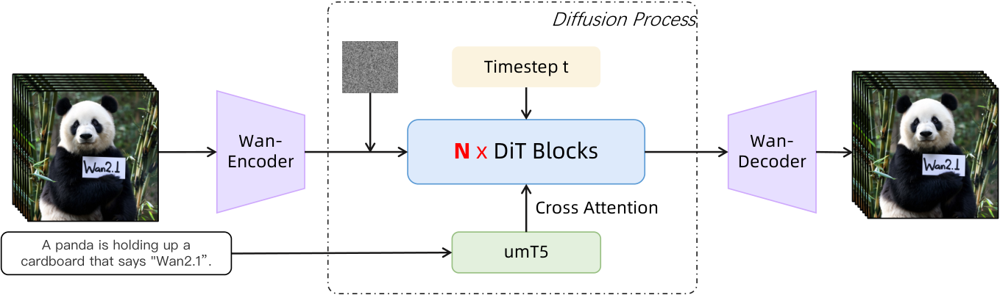

<figcaption>図9: Wan のアーキテクチャ。</figcaption>
</figure>

### 4.2 Model Training（モデル学習）

本節では、text-to-video タスクに特化した基盤動画モデルのアーキテクチャ設計を、事前学習と事後学習の各フェーズの詳細とともに詳しく紹介する。

図 9 に、現在主流の DiT アーキテクチャに基づいて設計された Wan のアーキテクチャを示す。これは典型的に 3 つの主要構成要素から成る：Wan-VAE、diffusion transformer、テキストエンコーダである。与えられた動画 $V\in\mathbb{R}^{(1+T)\times H\times W\times 3}$ について、Wan-VAE のエンコーダはそれをピクセル空間から潜在空間 $x\in\mathbb{R}^{1+T/4\times H/8\times W/8}$ へ符号化し、それが後続の diffusion transformer の構造へ入力される。

#### 4.2.1 Video Diffusion Transformer（動画 Diffusion Transformer）

<figure>

<figcaption>図10: Wan の Transformer ブロック。</figcaption>
</figure>

Diffusion transformer。diffusion transformer は主に 3 つの構成要素から成る：パッチ化モジュール、transformer ブロック、脱パッチ化モジュールである。各ブロック内で、我々は時空間の文脈的関係を効果的にモデル化し、テキスト条件とタイムステップを埋め込むことに焦点を当てる。パッチ化モジュールでは、カーネルサイズ $(1,2,2)$ の 3D 畳み込みを用い、平坦化操作を適用して $x$ を形状 $(B,L,D)$ の特徴系列へ変換する。ここで $B$ はバッチサイズ、$L=(1+T/4)\times H/16\times W/16$ は系列長、$D$ は潜在次元を表す。具体的には図 10 に示すように、入力されるテキスト条件を埋め込むために cross-attention 機構を用いる。これにより、長い文脈のモデリング下でもモデルの指示追従能力を確保できる。加えて、入力される時間埋め込みを処理し 6 つの変調パラメータを個別に予測するために、Linear 層と SiLU 層を持つ MLP を用いる。この MLP は全 transformer ブロックで共有され、各ブロックは異なるバイアスの組を学習する。広範な実験を通じて、この設計がパラメータ数を約 $25\%$ 削減でき、同じパラメータ規模において有意な性能改善を示すことを実証した。

テキストエンコーダ。Wan のアーキテクチャは入力テキストの符号化に umT5 を用いる。広範な実験を通じて、我々は umT5 が我々の枠組みにおいていくつかの利点を持つことを見出した：1) 強力な多言語符号化能力を備え、中国語と英語の双方、および入力される視覚的テキストを効果的に理解できる。2) 同一条件下で、umT5 が他の単方向注意機構の LLM を構成性において上回ることを見出した。3) 優れた収束性を示し、同じパラメータ規模において umT5 がより速い収束を達成する。これらの知見に基づき、我々は最終的に umT5 をテキスト埋め込み器として選択した。

#### 4.2.2 Pre-training（事前学習）

我々は flow matching の枠組みを活用して、画像と動画の両領域にわたる統一的なノイズ除去拡散プロセスをモデル化する。まず低解像度の画像で事前学習を行い、続いて画像と動画の多段階の共同最適化を行う。画像-動画の共同学習は、各段階を通じて漸進的に引き上げられるデータ解像度と延長される時間長を用いて進化する。

学習目的。Flow matching は、拡散モデルにおける連続時間の生成プロセスを学習するための理論的に裏付けられた枠組みを提供する。それは反復的な速度予測を回避し、最尤目的との等価性を保ちながら、常微分方程式（ODE）を通じた安定した学習を可能にする。学習の際、画像あるいは動画の潜在 $x_{1}$、ランダムノイズ $x_{0}\sim\mathcal{N}(0,I)$、および logit-normal 分布からサンプリングされたタイムステップ $t\in[0,1]$ が与えられると、中間の潜在 $x_{t}$ が学習入力として得られる。Rectified Flows（RFs）に従い、$x_{t}$ は $x_{0}$ と $x_{1}$ の間の線形補間として定義される。すなわち

$$
x_{t}=tx_{1}+(1-t)x_{0}.
$$

正解の速度 $v_{t}$ は

$$
v_{t}=\frac{dx_{t}}{dt}=x_{1}-x_{0}.
$$

モデルは速度を予測するよう学習されるので、損失関数はモデル出力と $v_{t}$ の間の平均二乗誤差（MSE）として定式化できる。

$$
\mathcal{L}=\mathbb{E}_{x_{0},x_{1},c_{txt},t}||u(x_{t},c_{txt},t;\theta)-v_{t}||^{2},
$$

ここで $c_{txt}$ は 512 トークン長の umT5 テキスト埋め込み系列、$\theta$ はモデルの重み、$u(x_{t},c_{txt},t;\theta)$ はモデルが予測する出力速度を表す。

画像事前学習。我々の実験的分析は、高解像度画像と長時間の動画系列で直接共同学習を行う際の 2 つの重要な課題を明らかにした：(1) 系列長の延長（$1280\times 720$ の動画で典型的に $81$ フレーム）は学習スループットを実質的に低下させる。固定された GPU 時間の予算の下では、これはデータスループットの不足をもたらし、それによってモデルの収束速度を妨げる。(2) 過剰な GPU メモリ消費は最適でないバッチサイズを強い、勾配分散のスパイクによって引き起こされる学習の不安定性を誘発する。これらの問題を緩和するため、我々は 14B モデルの学習を低解像度（$256\penalty\ px$）の text-to-image 事前学習を通じて初期化し、高解像度の動画モダリティを漸進的に導入する前に、モダリティ横断の意味-テキスト整合と幾何構造の忠実さを課す。

画像-動画の共同学習。大規模な $256\penalty\ px$ の text-to-image 事前学習に続き、解像度が漸進的に上がるカリキュラムを通じて画像データと動画データによる段階的な共同学習を実施する。学習プロトコルは空間解像度の面積によって区別される 3 つの異なる段階から成る：(1) 第 1 段階では、$256\penalty\ px$ 解像度の画像と 5 秒の動画クリップ（$192\penalty\ px$ 解像度、$16$ fps）で共同学習を行う。(2) 第 2 段階では、5 秒という動画の長さを固定したまま、画像と動画の双方の解像度を $480px$ へ引き上げることで空間解像度のスケーリングを開始する。(3) 最終フェーズでは、画像と 5 秒の動画クリップの双方について空間解像度を $720px$ へ引き上げる。

事前学習の構成。我々は bf16 混合精度による効率的な学習を、重み減衰係数 $1e^{-3}$ の AdamW オプティマイザと組み合わせて用いる。初期学習率は $1e^{-4}$ に設定され、FID と CLIP Score の指標の停滞（plateau）を引き金として動的に下げられる。

#### 4.2.3 Post-training（事後学習）

事後学習の段階では、事前学習段階と同じモデルアーキテクチャとオプティマイザの構成を維持し、ネットワークを事前学習済みのチェックポイントで初期化する。3.2 節で詳述した事後学習用の動画データセットを用いて、$480px$ と $720px$ の解像度で共同学習を実施する。

### 4.3 Model Scaling and Training Efficiency（モデルのスケーリングと学習効率）

#### 4.3.1 Workload Analysis（負荷分析）

Wan では、テキストエンコーダと VAE エンコーダに伴う計算コストは DiT モデルのそれより低く、DiT が学習中の全体計算の 85% 以上を占める。DiT モデルについて、主要な計算コストは式 $L(\alpha bsh^{2}+\beta bs^{2}h)$ で与えられる。ここで $L$ は DiT の層数、$b$ はマイクロバッチサイズ、$s$ は系列長、$h$ は隠れ次元のサイズを表す。$\alpha$ は線形層のコストに、$\beta$ は注意層のコストに対応し、Wan で用いられる非因果的な注意については、$\beta$ は順伝播で 4、逆伝播で 8 である。一般的な LLM モデルと異なり、Wan が処理する系列長 $s$ はしばしば数十万以上に達する。注意の計算コストはトークン数に対して二次的に増加する一方、線形層に伴うコストは線形にしか増加しないので、注意機構が次第に学習のボトルネックとなる。系列長が 100 万に達するシナリオでは、注意の計算時間がエンドツーエンドの学習時間の最大 95% を占めうる。

学習プロセスにおいては、DiT モデルのみが最適化され、テキストエンコーダと VAE エンコーダは凍結されたままである。したがって GPU メモリの使用は DiT の学習に集中する。DiT の GPU メモリ使用量は $\gamma Lbsh$ と表せる。ここで $\gamma$ は DiT 層の実装に依存し、$L$ は DiT の層数を表す。動画トークン・入力プロンプト・タイムステップがモデル入力として取られるため、$\gamma$ の値は通常の LLM モデルより一般に大きい。例えば標準的な LLM の $\gamma$ が 34 でありうるのに対し、DiT モデルの $\gamma$ は 60 を超えうる。その結果、系列長が 100 万トークンに達しマイクロバッチサイズが 1 のとき、14B の DiT モデルにおける活性化のための総 GPU メモリ使用量は 8 TB を超えうる。

要約すると、Wan における主要な計算コストは注意機構から生じる。計算コストが系列長 $s$ に対して二次的に増加する一方、GPU メモリ使用量は $s$ に対して線形にしかスケールしない。これは後続の最適化の取り組みを導く上で価値ある指針を与える。

#### 4.3.2 Parallelism Strategy（並列化戦略）

Wan モデルは主に 3 つのモジュールから成る：VAE、テキストエンコーダ、DiT である。4.1.3 節で概説したキャッシュ機構の最適化に従い、VAE モジュールは最小限の GPU メモリ使用量しか示さず、データ並列（DP）をそのまま採用できる。対照的にテキストエンコーダは 20 GB を超える GPU メモリを要し、後続の DiT モジュールのためにメモリを節約すべくモデル重みのシャーディングを必要とする。これに対処するため、我々はデータ並列（DP）のアプローチを Fully Sharded Data Parallel（FSDP）戦略と組み合わせて用いる。DiT のモデルパラメータ・勾配・オプティマイザ状態は単一 GPU の容量を超え、100 万トークンでバッチサイズ 1 というシナリオでは活性化の格納が約 8 TB に達する。さらに DiT の部分は全体の計算負荷の大きな割合を占める。したがって我々は DiT モジュールに特化した効率的な分散戦略の開発に焦点を当てる。

DiT の並列化戦略。DiT モデルのサイズが控えめであること、および計算と通信の重ね合わせの最適化とデータ並列（DP）のサイズの最大化を考慮して、我々はパラメータのシャーディング戦略として FSDP を選択した。

活性化については、DiT ブロックの入力形状は $[b,s,h]$ であり、$b$ 次元はデータ並列に対応し、$s$ は系列長、$h$ は隠れ次元を表す。したがって $s$ 次元と $h$ 次元についてのシャーディング戦略を検討する必要がある。$s$ 次元に沿ったシャーディングは Context Parallelism（CP）によって達成され、一般的な手法には Ulysses と Ring Attention がある。$h$ 次元に沿ったシャーディングは主に、重みを分割することで活性化の隠れ次元をシャードする Megatron のテンソル並列（TP）と系列並列（SP）の組み合わせを含む。CP の通信オーバーヘッドは（TP $+$ SP）のそれより小さいので、我々は各 GPU 上の活性化のメモリ占有量を削減しつつバッチレベルの計算を加速するために CP を用いることを提案する。我々は USP と同様に、Ulysses と Ring Attention の特性を組み合わせた二次元（2D）の CP を設計した。この設計では外層が Ring Attention を用い、内層が Ulysses を活用する。この組み合わせは Ulysses に内在する遅いマシン間通信を緩和し、Ring Attention におけるシャーディング後の大きなブロックサイズの必要性に対処し、それによって外層の通信と内層の計算の重ね合わせを最大化する。系列長 256K・2 マシンにまたがる 16 GPU というシナリオでは、2D Context Parallelism の通信オーバーヘッドは Ulysses での 10% 超から 1% 未満へ削減される。

> 図11: DiT の並列化の図解。合計 128 GPU を仮定すると、最内層は Ulysses=8 と Ring=2 の組み合わせから成る。外層は FSDP=32 を用い、最外層は DP=4 を利用する。グローバルバッチサイズはマイクロバッチサイズの 8 倍である。（訳注: ar5iv・arXiv HTML のいずれでも本図の画像が生成されておらず、取得できなかった）

FSDP グループと CP グループは FSDP グループ内で交差し、DP のサイズは FSDP のサイズを CP のサイズで割ったものに等しい。メモリと単一バッチのレイテンシの要件を満たした後、スケーリングのために DP を用いる。図 11 は DiT モジュールの分散方式を図解する。例えば 128 GPU の構成では、CP のサイズは 16 で、Ulysses は 8、Ring Attention は 2 に設定され、FSDP は 32 でバッチサイズ $2b$ に対応し、DP は 4 で結果としてグローバルバッチサイズは $8b$ となる。

異なるモジュール間での分散戦略の切り替え。学習の際、異なるモジュールが同じ資源を利用する。具体的には、VAE とテキストエンコーダには DP を適用する一方、DiT モジュールは DP と CP の組み合わせを用いる。したがって学習中に VAE とテキストエンコーダの出力が DiT モジュールへ入力されるとき、資源の浪費を避けるために分散戦略を切り替える必要がある。具体的には、CP は CP グループ内のデバイスが同じバッチのデータを読むことを要求する。しかし VAE とテキストエンコーダの部分でもデバイスが同じデータを読むと、冗長な計算につながる。この冗長性を排除するため、CP グループ内のデバイスは最初に異なるデータを読む。次に CP の前に、CP のサイズに等しい回数のループ走査を行い、CP グループ内の異なるデバイスが読んだデータを順次ブロードキャストして、CP 内の入力が同一になるようにする。このようにして、単一のモデル反復における VAE とテキストエンコーダの時間比率が $1/CP$ へ削減され、それによって全体の性能が高まる。

#### 4.3.3 Memory Optimization（メモリ最適化）

既に紹介したように、Wan における計算コストは系列長 $s$ に対して二次的に増加する一方、GPU メモリ使用量は $s$ に対して線形にスケールする。これは、長い系列のシナリオでは計算時間が最終的に活性化のオフロードに要する PCIe 転送時間を上回りうることを意味する。具体的には、1 つの DiT 層の活性化をオフロードする PCIe 転送時間は、わずか 1 から 3 の DiT 層の計算と重ね合わせることができる。勾配チェックポインティング（GC）戦略と比較して、計算の重ね合わせを可能にする活性化オフロードは、エンドツーエンドの性能を犠牲にすることなく GPU メモリ使用量を削減する効果的な方法を提供する。したがって我々は GPU メモリを削減するために活性化オフロードを優先する。長い系列のシナリオでは CPU メモリも枯渇しやすいので、オフロードを GC 戦略と組み合わせ、GPU メモリと計算量の比が高い層に対して勾配チェックポインティングを優先する。

#### 4.3.4 Cluster Reliability（クラスタの信頼性）

学習クラスタ内での Alibaba Cloud の先進的なインテリジェント・スケジューリング、低速マシンの検出、頑健な自己修復能力を活用することにより、高い安定性が確保される。ハードウェアの問題はジョブ起動フェーズで特定され、健全なノードのみが学習タスクに割り当てられることが保証される。学習を通じて、故障したノードは速やかに隔離され修復され、タスクは自動的に再起動されて学習がシームレスに再開される。この効率的なオーケストレーションは信頼性と高い性能を効果的に組み合わせ、システム全体の安定性を確保する。

### 4.4 Inference（推論）

推論最適化の主目的は動画生成のレイテンシを最小化することである。学習と異なり、推論プロセスは典型的に約 50 の複数のサンプリングステップを含む。したがって我々は、個々のステップに要する時間を削減するために量子化と分散計算といった技術を用いる。加えて、全体の計算負荷を減らすためにステップ間の注意の類似性を活用する。さらに classifier-free guidance（CFG）については、それに内在する類似性を利用して計算要件をさらに最小化する。

#### 4.4.1 Parallel Strategy（並列化戦略）

<figure>

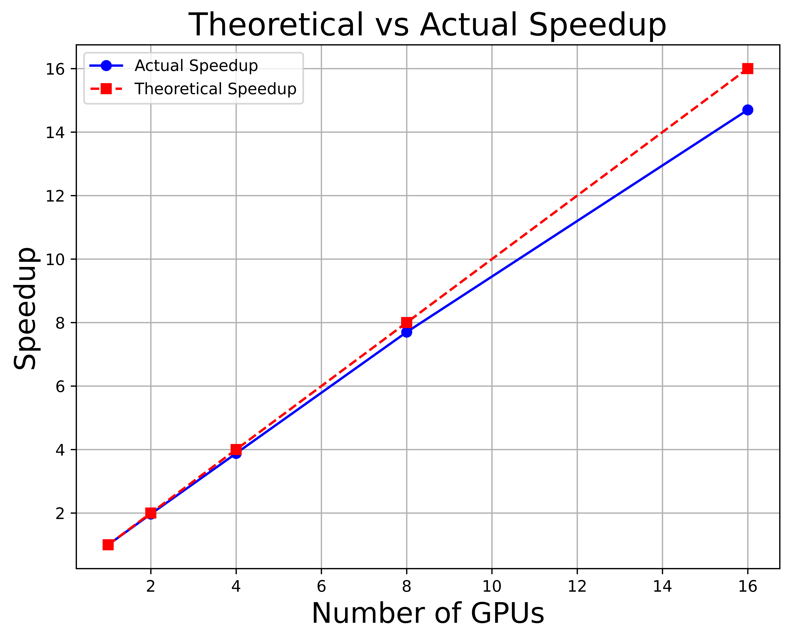

<figcaption>図12: 複数 GPU による推論のスケーリング。</figcaption>
</figure>

4.3.2 節で議論したように、複数 GPU へスケールする際に単一の動画を生成するレイテンシを削減するために Context Parallel を利用する。加えて Wan 14B のような大きなモデルについては、GPU メモリの制約を緩和するためにモデルシャーディングを採用する。*モデルシャーディング戦略*: 推論時の長い系列長を考えると、FSDP は TP や SP と比べて通信オーバーヘッドが少なく、計算の重ね合わせを可能にする。したがって我々は学習時のアプローチと一貫して、モデルシャーディングに FSDP 法を採用する。*Context Parallel 戦略*: 学習段階と同じ 2D Context Parallelism を用い、RingAttention を外側のループ、Ulysses を内側の演算とする。2D Context Parallel と FSDP の並列化戦略を備えることで、図 12 に示すように、DiT は Wan 14B モデルにおいてほぼ線形の高速化を達成する。

#### 4.4.2 Diffusion Cache（拡散キャッシュ）

我々は Wan モデルの徹底的な分析を行い、その推論プロセスにおいて以下の特徴を特定した。

- 注意の類似性: 同じ DiT ブロック内で、異なるサンプリングステップにまたがる注意の出力は有意な類似性を示す。
- CFG の類似性: サンプリングの後期段階では、条件付きの DiT 出力と無条件の DiT 出力の間に顕著な類似性がある。

これらの知見は DiTFastAttn や FasterCache といった最近の研究でも強調されている。我々はこれらの特徴を活用して、計算負荷を減らすために拡散キャッシュを実装する。実践において、性能を損なわないよう Wan モデルに合わせて拡散キャッシュを調整する。具体的には、検証集合を用いてキャッシュする特定のステップを選択する。

- 注意キャッシュ: 注意の部分については、数ステップごとに注意の順伝播を実行して結果をキャッシュし、他のステップではキャッシュされた結果を再利用する。
- CFG キャッシュ: 無条件の部分については、数ステップごとに DiT の順伝播を実行し、他のステップでは条件付きの結果を再利用する。加えて、細部の劣化を防ぐために FasterCache と同様の残差補償手法を適用する。

Wan 14B の text-to-video モデルに拡散キャッシュを適用した結果、推論性能を 1.62× 改善した。

#### 4.4.3 Quantization（量子化）

FP8 GEMM。我々は、GEMM 演算に FP8 精度を用い、サンプリングステップにおいて重みにテンソル単位の量子化を、活性化にトークン単位の量子化を組み合わせることで、性能の損失が最小限に留まることを見出した。そこで DiT ブロック内のすべての GEMM 演算に FP8 量子化を適用する。FP8 GEMM は BF16 GEMM の 2 倍の性能を届け、DiT モジュールにおいて 1.13× の高速化を達成する。

8-Bit FlashAttention。FlashAttention3 は高い性能を達成するものの、そのネイティブな FP8 実装は、我々の実験で観測されたように動画生成において有意な品質劣化を被る。逆に SageAttention は精度の損失を減らすために int8 と fp16 の混合精度を用いるが、Hopper GPU 向けの特定の適応は提供していない。本レポートの公開時点で、SageAttention への後続の最適化は Hopper 互換性の改善を実証している。将来の研究ではこれら性能強化の統合を探求する。

我々は数値的安定性と計算効率の双方に焦点を当てて、FA3-FP8 実装に適用した最適化を提示する。

精度。FA3-FP8 量子化下の Wan で観測された注意の数値誤差を緩和するため、2 つの主要な手法を適用する。

- 混合 8 ビット最適化。FA3 のネイティブ実装はすべての入力テンソル（$Q$, $K$, $V$）に FP8（E4M3）を用いる。データ分布の分析と SageAttention からの経験的証拠の双方に基づき、我々はハイブリッドな量子化戦略を採用する：$S=QK^{T}$ には Int8 を、$O=PV$ には FP8 を用いる。
- ブロック間の縮約のための FP32 累算。ネイティブな FP8 WGMMA 実装は 14 ビットの累算器を用いており、長い系列の処理中にオーバーフローを起こしやすい。この制約に対処するため、我々のアプローチはブロック内の $PV$ の縮約には FP8 WGMMA を活用しつつ、ブロック間の累算は Float32 レジスタを持つ CUDA コアを通じて実装する。これは DeepSeek-V3 の FP8 GEMM の方法論に着想を得た戦略である。

性能。混合 INT8-FP8 量子化下でカーネル性能を維持しつつ $O=PV$ の累算精度を高めるため、2 つの手法を用いる。

- Float32 累算をワープグループ内のパイプライン処理と融合する。FlashAttention3 は WGMMA を softmax とスケーリングに重ね合わせるワープグループ内のパイプラインを用いる。ブロック間の Float32 $PV$ 累算によって導入される性能上の代償を緩和するため、Float32 累算を $rescale\_o$ 操作と融合する。
- ブロックサイズの調整。ブロック間の Float32 $PV$ 累算レジスタによって導入される追加のレジスタ圧のため、レジスタのスピルを減らすようブロックサイズを調整する。最適化の後、我々の 8 ビット FlashAttention は NVIDIA H20 GPU 上で 95% の MFU を達成する。

その結果、8 ビット FlashAttention により推論効率を 1.27× 以上引き上げた。

**表1**: ユーザープロンプトとその書き換え結果の例。これらの例はもともと中国語であり、提示のために英語へ翻訳されている。

| ユーザープロンプト | 書き換え結果 |
| --- | --- |
| ヴァイキングの戦士が両手で大斧を振るい、夕暮れ時にマンモスと戦っている。雪景色の中、雪片が空中に舞っている。 | 壮大な戦闘の場面が展開する。背が高く筋骨隆々のヴァイキングの戦士が両手で重い大斧を振るい、巨大なマンモスと対峙している。戦士は革の鎧と角付きの兜を身につけ、際立った筋肉と獰猛で決然とした表情を持つ。マンモスは長い毛に覆われ、鋭い牙を持ち、怒って咆哮している。時は夕暮れで、雪景色は舞う雪片で満たされ、張り詰めた劇的な雰囲気を作り出している。背景には不毛の氷原と、遠くの山々のかすかな輪郭が広がる。寒色系の照明が強さと勇敢さを強調する。この場面は高い角度からの視点によるダイナミックなクローズアップショットで捉えられている。 |
| カメラが海でイルカを追うモーターボートを追いかける。 | ドキュメンタリー写真の様式で、カメラは広大な海から跳ね上がるイルカの群れを追うモーターボートを追いかける。モーターボートには救命胴衣と安全ヘルメットを着用した運転手がおり、集中し興奮した表情を浮かべている。イルカは滑らかで艶やかな肌を持ち、時折水面から跳ね上がり、敏捷に水中へ潜り込む。空は明るい青で、太陽が輝き、海は光でちらめいている。遠くの空にはいくつかの白い雲が点在する。この場面はダイナミックでエネルギーに満ち、追跡する視点のミディアムショットから捉えられている。 |
| 小さなジャガイモの王が荘厳な王冠をかぶり、玉座に座り、ジャガイモの臣民たちが敬意を表している。 | シュルレアリスムの様式で、小さなジャガイモの王が豪華な金の王冠をかぶり、そびえ立つ玉座に座っている。その肌は自然な土色の黄色を帯び、微妙な凹凸の質感を持つ。ジャガイモの臣民たちは両側に並び、王に敬意を表して頭を垂れている。背景には宮殿の壮大な内部が広がり、金と赤の装飾が豪華かつ荘厳に見える。上方から一条の光が降り注ぎ、神聖な雰囲気を作り出している。この場面は高い角度からの視点によるクローズアップショットで捉えられている。 |

### 4.5 Prompt Alignment（プロンプトの整合）

プロンプトの整合は、ユーザーの入力プロンプトを学習に用いたキャプションの形式と様式に揃えることで、モデル推論の有効性を高めるために設計されている。我々はこのプロセスにおいて 2 つの主要な戦略を用いる。第一に、各動画に多様なキャプションを付与して多様性を高める。第二に、学習段階の動画キャプションの分布に揃えるようユーザープロンプトを書き換える。以下、これらの戦略を詳述する。

多様なユーザー入力に対応するため、各画像あるいは動画には様々な様式と長さを反映する複数のキャプションが対応づけられる。例えば、異なる長さ（長・中・短など）と様式（形式的・くだけた・詩的など）のキャプションを用いて、学習データに対する多様なサンプル-キャプション対の集合を作る。これらのキャプションはテキストと動画の間に異なる写像関係を確立し、ユーザーが与えうるプロンプトの範囲を効果的に覆う。

キャプションの多様性にもかかわらず、データセットのキャプションとユーザー入力プロンプトの間にはしばしば分布のずれが存在する。典型的にユーザーは、学習キャプションよりも著しく短い、いくつかの単純な語から成る簡潔なプロンプトを好む。この不一致は生成される動画の品質に悪影響を及ぼしうる。この問題に対処するため、我々は大規模言語モデル（LLM）を活用してユーザープロンプトを洗練することでプロンプトを書き換える。我々の主目的は、これら洗練されたプロンプトの分布を学習キャプションの分布に揃え、それによって推論性能を改善することである。LLM はユーザープロンプトを書き換える際に以下の原則に導かれる。

1. 元の意味を変えずにプロンプトに詳細を加え、生成される場面の完全性と視覚的魅力を高めるよう LLM に指示する。
2. 書き換えられたプロンプトは自然な動きの属性を組み込むべきであり、生成される動画における動きをより滑らかで流麗にするために、被写体のカテゴリに基づいて適切な動作を加える。
3. 書き換えられたプロンプトを事後学習のキャプションと同様に構成することを推奨する。すなわち動画の様式から始め、続いて内容の概略、最後に詳細な記述で締めくくる。この方法はプロンプトを高品質な動画キャプションの分布に揃えるのを助ける。

我々は LLM 支援によるプロンプト書き換えの有効性を我々のベンチマーク上で評価し、いくつかの結果を表 1 に示す。我々の知見は、強い指示追従能力を持つ LLM が動画生成を高める適切なプロンプトを生成できることを示唆する。速度と性能のバランスを取るため、書き換えモデルとして Qwen2.5-Plus を用いる。

> 図13: Wan-Bench がカバーする次元。（訳注: ar5iv・arXiv HTML のいずれでも本図の画像が生成されておらず、取得できなかった）

> 図14: Wan-Bench の様々な次元にわたるプロンプト数の分布。（訳注: ar5iv・arXiv HTML のいずれでも本図の画像が生成されておらず、取得できなかった）

### 4.6 Benchmarks（ベンチマーク）

Fréchet Video Distance（FVD）や Fréchet Inception Distance（FID）といった既存の動画生成の評価手法は、人間の知覚との整合を欠いている。我々は動画生成モデルを評価するための、自動化され包括的で人間と整合した Wan-Bench を提案する。

Wan-Bench は 3 つの中核次元から構成される：動的品質、画像品質、指示追従であり、14 の細粒度の指標を持つ。我々は各次元に特化したスコアリングのアルゴリズムを設計し、単純なタスク（例：物体検出）には従来型の検出器を、複雑なタスクにはマルチモーダル大規模言語モデル（MLLM）を用いる。

動的品質。動的品質は、非静的な場面におけるモデルの品質と安定性を評価することを目指す。

大きな動きの生成。動き生成の上限を測るため、有意な動きを促すようプロンプトが設計される。RAFT を用いて生成された動画のオプティカルフローを計算し、正規化されたオプティカルフローの大きさによって動きのスコアを評価する。

人間のアーティファクト。既存の評価手法は AI 生成のアーティファクトを検出する能力を欠く。そこで我々は人間がアノテートした 20,000 枚の AI 生成画像で YOLOv3 ベースのモデルを学習し、アーティファクトの位置を特定する。アーティファクトのスコアは予測された尤度、バウンディングボックス、および対応する持続時間を考慮する。

物理的妥当性と滑らかさ。物理的妥当性を評価するため、物理に関連する動き（例：ボールの跳ね返り、物体の相互作用、水の流れ）を生成するプロンプトを設計し、Qwen2-VL の広範な実世界の物理知識を活用する。動画の質問応答モデルを通じて、物体のめり込み、非現実的な衝突、重力に反する動きといった物理法則の違反を検出する。滑らかさを評価するため、複雑な動きを含むようプロンプトを作り、Qwen2-VL がアーティファクトを特定して動きの流麗さを評価する。

ピクセルレベルの安定性。ピクセルレベルの安定性は、動画にノイズが頻繁に現れるかどうかを判定するために用いる。オプティカルフローを用いて静的な領域を特定し、それらの領域内でフレーム間の差分を計算する。安定した動画では、静的領域内のこれらの差分は比較的小さい。

ID 一貫性。3 種類の下位次元が考慮される：人間の一貫性、動物の一貫性、物体の一貫性であり、それぞれ異なるプロンプトの集合をカバーする。フレームレベルの DINO 特徴を抽出し、フレーム間の類似度を一貫性スコアとして比較する。

画像品質。画像品質の次元の目的は、視覚的品質と美的知覚を評価することである。

包括的な画像品質。視覚的品質の測定には忠実度と美しさの評価が必要である。忠実度については MANIQA を用いる。これはぼけとアーティファクトを効果的に検出し、精密な明瞭さの評価を保証する。美しさについては、確立された 2 つのモデル、LAION ベースの美的予測器と MUSIQ を利用する。最終的な画像品質スコアはこれら 3 つの評価器を平均して計算する。

シーン生成の品質。2 つの主要な側面を評価する：フレーム単位のシーン一貫性とシーンとテキストの整合である。一貫性については、時間的な整合を確保するために連続するフレーム間の CLIP 類似度を測る。整合については、意味的な正確さを検証するためにフレームと対応するテキストの間の CLIP 類似度を計算する。これらの指標を重み付き平均して品質スコアを計算する。

様式化。フレームレベルの質問応答を通じて芸術的な動画生成能力を評価するために Qwen2-VL を用いる。

指示追従。指示追従は、テキストの指示を理解し実行するモデルの能力を評価する。

単一物体・複数物体・空間的位置。動画内の物体カテゴリ・個数・空間的関係を予測するために Qwen2-VL を用いる。評価スコアは、与えられたプロンプトに正確に対応するフレームの平均数を表す。

カメラ制御。130 の調整されたプロンプトにより、5 つのカメラ移動の様式を評価する：パン、リフト、ズームイン／アウト、空撮、追跡ショットである。パン・リフト・ズームについては、RAFT を通じてオプティカルフローを分析し移動の様式を評価する。複雑な空撮と追跡ショットについては、動画の質問応答を通じてカメラの移動を推論するために Qwen2-VL を用いる。

動作の指示追従。動きを人間（例：走る）、動物（例：這う）、物体の移動（例：飛ぶ）に分類する。これらの動きの評価にはその実行の事前知識を要するので、キーフレームを与えて Qwen2-VL を用いる。テキストと動画の整合を包括的に評価するため、動作の整合、動作の完了、アーティファクトの有無についてモデルに問い合わせる。

人間のフィードバックによる重み付け戦略。各次元がユーザーの選好に及ぼす影響が異なることを考慮し、単純に平均するのではなく、人間のフィードバックを利用して包括的な動画品質スコアを割り当てる。Wan を含む異なるモデルが生成した動画について 5,000 を超えるペアワイズ比較を収集する。ユーザーは与えられたテキストに基づいて対を評価し、選好を示しておおよそのスコアを付ける。次元の選好重み付けは、モデルが生成したスコアと人間が評価したスコアの間のピアソン相関から導かれ、最終スコアの計算における重み係数として機能する。

**表2**: Wan-Bench を用いた商用モデルとオープンソースモデルの性能比較。

| Wan-Bench の次元 | CNTopB | Hunyuan | Mochi | CNTopA | Sora | Wan 1.3B | Wan 14B |
| --- | --- | --- | --- | --- | --- | --- | --- |
| 大きな動きの生成 | 0.405 | 0.413 | 0.420 | 0.284 | 0.482 | 0.468 | 0.415 |
| 人間のアーティファクト | 0.712 | 0.734 | 0.622 | 0.833 | 0.786 | 0.707 | 0.691 |
| ピクセルレベルの安定性 | 0.977 | 0.983 | 0.981 | 0.974 | 0.952 | 0.976 | 0.972 |
| ID 一貫性 | 0.940 | 0.935 | 0.930 | 0.936 | 0.925 | 0.938 | 0.946 |
| 物理的妥当性 | 0.836 | 0.898 | 0.728 | 0.759 | 0.933 | 0.912 | 0.939 |
| 滑らかさ | 0.765 | 0.890 | 0.530 | 0.880 | 0.930 | 0.790 | 0.910 |
| 包括的な画像品質 | 0.621 | 0.605 | 0.530 | 0.668 | 0.665 | 0.596 | 0.640 |
| シーン生成の品質 | 0.369 | 0.373 | 0.368 | 0.386 | 0.388 | 0.385 | 0.386 |
| 様式化の能力 | 0.623 | 0.386 | 0.403 | 0.346 | 0.606 | 0.430 | 0.328 |
| 単一物体の正確さ | 0.987 | 0.912 | 0.949 | 0.942 | 0.932 | 0.930 | 0.952 |
| 複数物体の正確さ | 0.840 | 0.850 | 0.693 | 0.880 | 0.882 | 0.859 | 0.860 |
| 空間的位置の正確さ | 0.518 | 0.464 | 0.512 | 0.434 | 0.458 | 0.476 | 0.590 |
| カメラ制御 | 0.465 | 0.406 | 0.605 | 0.529 | 0.380 | 0.483 | 0.527 |
| 動作の指示追従 | 0.917 | 0.735 | 0.907 | 0.783 | 0.721 | 0.844 | 0.860 |
| 重み付きスコア | 0.690 | 0.673 | 0.639 | 0.693 | 0.700 | 0.689 | 0.724 |

### 4.7 Evaluation（評価）

#### 4.7.1 Metrics and Results（指標と結果）

ベースラインと指標。本稿執筆時点で、市場には多数の競合が存在する。Kling、Hailuo、Sora、Runway、Vidu といった商用モデルに加え、Mochi、CogVideoX、Hunyuan といったオープンソースモデルがある。本節では、ベンチマークを通じて評価され比較的良好なユーザーからの反応を得ている商用モデルおよびオープンソースモデルと我々のモデルを比較する。

定量的結果。Wan-Bench のプロンプトを用いて各候補モデルについて 1,035 のサンプルを収集し、Wan-Bench でモデルをスコア付けすることによって公平な評価を実施した。評価は 3 つの主要指標に焦点を当てた：動的品質、画像品質、指示追従の正確さである。人間の選好に従って重み付けした合計スコアを計算することにより、異なる生成モデルの性能を順位付けする。表 2 の結果は、Wan が既存の商用モデルおよびオープンソースモデルを上回ることを示している。

定性的結果。図 15 に示すように、Wan はテキスト記述から直接、多様で高品質な動画を効果的に生成する。Wan は大規模で複雑な動きを含む動的な場面、および物理的相互作用を反映するシナリオの合成に優れる。さらに様々な芸術様式を巧みに扱い、一貫して映画品質の映像を生み出す。加えて Wan は頑健な多言語のテキスト生成能力を示し、中国語と英語のテキストをアニメーションに統合して映画レベルのテキスト効果を生じさせる。

<figure>

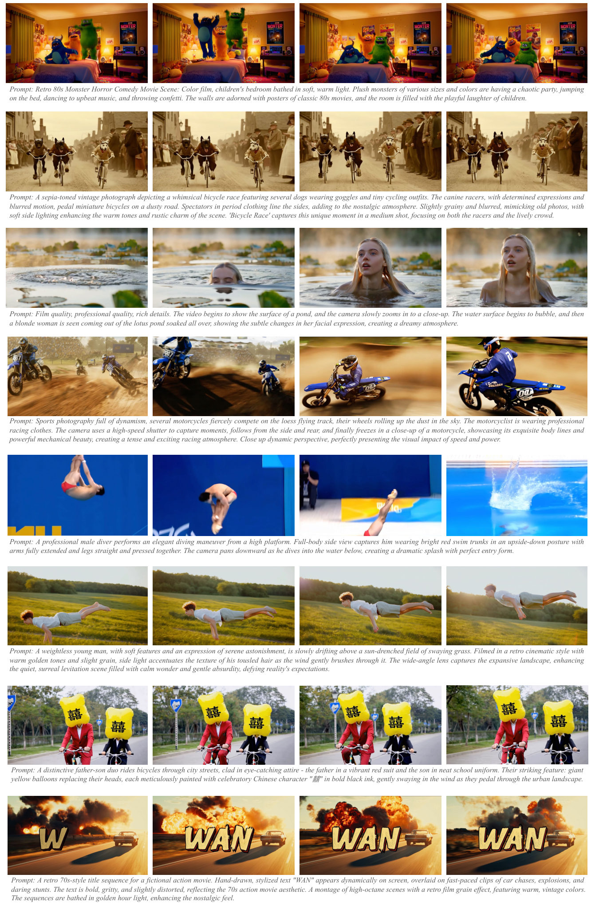

<figcaption>図15: Wan-T2V の結果。我々のモデルは複雑な動き、創造的な遷移、映画品質の動画の生成に優れ、中国語と英語の双方のテキストを正確に生成する。</figcaption>
</figure>

人間による評価。我々は 700 を超える評価タスクを設計した。これらは 20 名以上によってアノテートされ、4 つの主要次元によって評価される：整合、画像品質、動的品質、総合品質である。表 3 の結果は、T2V タスクにおいて Wan 14B モデルがすべての視覚的品質の次元にわたって一貫して優れており、その優れた性能を示すことを実証している。

**表3**: T2V の勝率差。表は、Wan 14B モデルがペアワイズ比較で他のモデルを上回った事例の割合を、比較の総数に対して示している。

|  | CN-TopA | CN-TopB | CN-TopC | Runway | 全ラウンド数 |
| --- | --- | --- | --- | --- | --- |
| 視覚的品質 | 30.6% | 15.9% | 27.8% | 48.1% | 5710 |
| 動きの品質 | 16.1% | 9.7% | 14.9% | 40.3% | 5785 |
| 一致度 | 46.0% | 57.9% | 56.7% | 69.1% | 5578 |
| 総合順位 | 44.0% | 44.0% | 48.9% | 67.6% | 5560 |

公開リーダーボードにおける Wan。Wan は、動画生成タスクに広く用いられる評価アプローチである VBench リーダーボードで最先端の性能を示した。VBench は、美的品質・動きの滑らかさ・意味的一貫性にまたがる 16 の異なる人間と整合した次元へ動画品質の評価を分解する、多次元の評価アーキテクチャを採用する。

我々の分析は 2 つのモデル変種に焦点を当てる：14B パラメータの Wan 14B と Wan 1.3B の変種である（表 4 参照）。Wan 14B モデルは総合スコア 86.22%（視覚的品質 86.67%、意味的一貫性 84.44% を含む）というベンチマーク首位の性能を達成し、OpenAI の Sora や MiniMax の Hailuo といった競合を有意に上回る。効率的な Wan 1.3B の変種も 83.96% を記録して競争力を保ち、HunyuanVideo や Kling 1.0 といった商用モデル、およびオープンソースの CogVideoX1.5-5B を上回っている。

**表4**: VBench におけるモデルの性能スコア。

| モデル名 | 品質スコア | 意味スコア | 総合スコア |
| --- | --- | --- | --- |
| MiniMax-Video-01 | 84.85% | 77.65% | 83.41% |
| Hunyuan（オープンソース版） | 85.09% | 75.82% | 83.24% |
| Gen-3 (2024-07) | 84.11% | 75.17% | 82.32% |
| CogVideoX1.5-5B (5s SAT prompt-optimized) | 82.78% | 79.76% | 82.17% |
| Kling (2024-07 高性能モード) | 83.39% | 75.68% | 81.85% |
| Sora | 85.51% | 79.35% | 84.28% |
| Wan 1.3B | 84.92% | 80.10% | 83.96% |
| Wan 14B (2025-02-24) | 86.67% | 84.44% | 86.22% |

#### 4.7.2 Ablation Study（アブレーション研究）

我々は、アーキテクチャ全体の貢献についての洞察を提供するため、モデル設計内の主要モジュールについてアブレーション研究を提供する。実験は迅速な評価のため 1.3B 版で実施される。

適応正規化層についてのアブレーション。DiT における適応正規化層（adaLN）のパラメータの負荷が大きいことを踏まえ、我々は adaLN のパラメータ量に注力するのと、ネットワーク層の深さを増やすのとで、どちらがより効果的かを探る。パラメータ量を調整するため、PixArt の設定に従い、adaLN を共有するか否かを研究する。非共有の構成では、各ブロックのスケールとシフトのパラメータが、時間埋め込みを入力とするブロック固有の MLP によって予測される。対して共有 AdaLN の構成（PixArt では AdaLN-single と呼ばれる）は、最初のブロックにおいてスケールとシフトの値の予測を含む単一の大域パラメータの組を計算し、それが全ブロックで共有される。この共有はパラメータ数を大きく削減する。

我々は 4 つの構成を評価する：(i) Full-shared-adaLN-1.3B：これは我々の元のモデルで、adaLN が全 30 の注意ブロックにわたって完全に共有される。(ii) Half-shared-adaLN-1.5B：adaLN は最初の 15 の注意ブロックで共有され、残りのブロックでは共有されない。その結果 0.2B のパラメータ増を伴う 1.5B モデルとなる。(iii) Full-shared-adaLN-1.5B（拡張）：adaLN は全注意ブロックで共有されるが、モデルの深さが 35 層に増やされ、1.5B のパラメータ数が保たれる。(iv) Non-shared-AdaLN-1.7B：adaLN はどのブロックでも共有されず、モデルの深さは 30 層のままで、結果として 1.7B モデルとなる。他のパラメータは変えないまま、text-to-image タスクを実行するようモデルをゼロから 200,000 ステップ、グローバルバッチサイズ 1536 で学習する。比較のため、学習段階における生成画像と実画像の潜在空間での L2 損失を用いて性能を測る。より小さい学習損失がより良い収束を示す。

<figure>

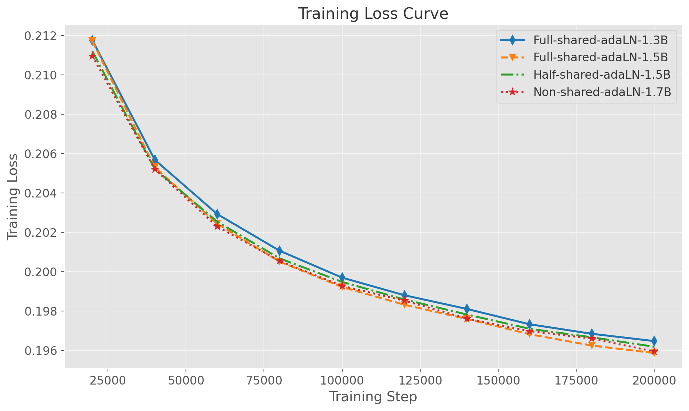

<figcaption>図16: 異なる構成による学習損失曲線。</figcaption>
</figure>

図 16 に示すように、パラメータが少ない Full-shared-AdaLN-1.3B モデルは、他と比べてわずかに高い学習損失となる。同じパラメータ数を持つ Half-shared-AdaLN-1.5B と Full-shared-AdaLN-1.5B を比較すると、Full-shared-AdaLN-1.5B が一貫して最も低い学習損失を達成する。これは、AdaLN のパラメータよりもモデルの深さに注力する方がより良い性能につながることを示唆する。加えて、より多くのパラメータを持つにもかかわらず Non-shared-AdaLN-1.7B は Full-shared-AdaLN-1.5B を上回らず、この考えをさらに裏付ける。したがって我々は、性能を保ちつつパラメータ数を効果的に削減するため、完全共有の AdaLN 設計を採用する。

テキストエンコーダについてのアブレーション。我々は二言語入力を扱える 3 つのテキストエンコーダを選ぶ：umT5（5.3B）、Qwen2.5-7B-Instruct、GLM-4-9B である。T5 系列は動画生成モデルにおいて人気の選択肢であり、後の 2 つのエンコーダは言語理解、とりわけ 10B 未満のすべての LLM モデルの中で優れている。このアブレーションでは他の設定を変えず、グローバルサイズ 1536 で text-to-image タスクを学習する。テキスト埋め込みは Qwen2.5-7B-Instruct と GLM-4-9B の最後から 2 番目の層から得る。図 17 に示すように学習損失を測る。

**表5**: VAE と VAE-D の FID スコア（$\downarrow$）。

| Model | VAE | VAE-D |
| --- | --- | --- |
| 10k steps | 42.60 | 44.21 |
| 15k steps | 40.55 | 41.16 |

他の強力な LLM ベースのエンコーダと比較して、umT5 は優れたテキスト埋め込み性能を示す。特筆すべきことに、HunyuanVideo は decoder-only の LLM が因果注意を用いるのに対し umT5 は双方向注意を採用しており、それが拡散モデルに適していると強調している。HunyuanVideo の戦略に従い、我々は双方向のトークン精錬器をアダプタ層として組み込む。この構成を Qwen2.5-7B-Instruct と GLM-4-9B の双方に適用したが、学習損失と可視化は依然として umT5 が最も好ましい性能を示すことを表している。さらに我々は umT5 を事前学習済みのマルチモーダル大規模言語モデル、すなわち Qwen-VL-7B-Instruct と比較する。表 6 に示すように、Qwen-VL の最後から 2 番目の層の特徴を用いると umT5 に匹敵する生成性能となるが、モデルサイズはより大きい。

<figure>

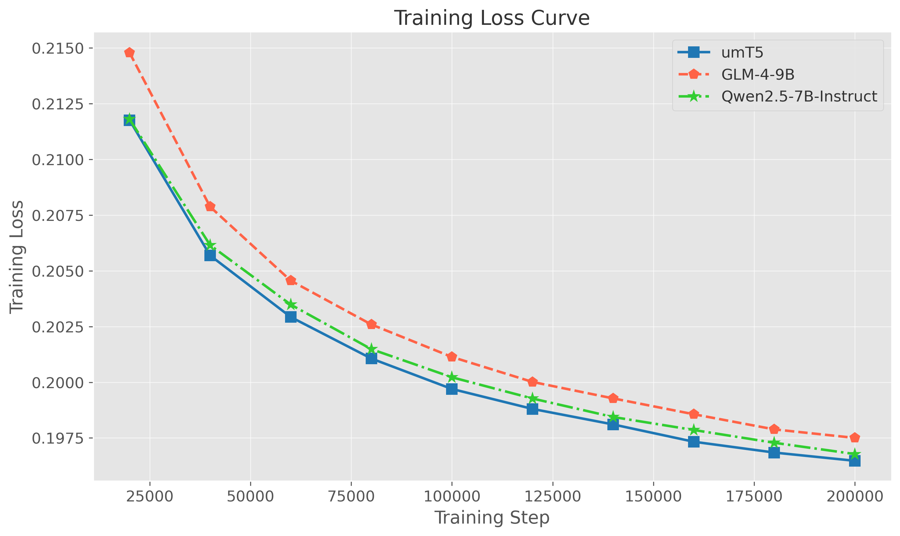

<figcaption>図17: 異なるテキストエンコーダによる学習損失曲線。</figcaption>
</figure>

**表6**: 異なるテキストエンコーダの FID スコア。「last layer」と「second last layer」は、エンコーダの最終層および最後から 2 番目の層から抽出されたテキスト特徴を指す。

| Models | umT5 | Qwen-VL-7B (last layer) | Qwen-VL-7B (second last layer) |
| --- | --- | --- | --- |
| FID($\downarrow$) | 43.01 | 43.72 | 42.91 |

オートエンコーダについてのアブレーション。我々の VAE に加え、再構成損失を拡散損失に置き換えた VAE-D と呼ぶ変種を設計する。事前学習済みの VAE と VAE-D の双方を text-to-image 生成タスクに適用し、収束するまで 150,000 ステップ学習する。100,000 ステップと 150,000 ステップの双方で FID スコアを測る。表 5 に示すように、VAE モデルは VAE-D と比べて一貫してより低い FID を達成する。

## 5 Extended Applications（拡張応用）

### 5.1 Image-to-Video Generation（image-to-video 生成）

image-to-video（I2V）生成のタスクは、テキストプロンプトに導かれて静的な入力画像から動的な動画系列を合成することに焦点を当てる。このアプローチは、出力を特定の初期フレームに錨づけることによって動画生成の制御性を大きく高め、それによって研究コミュニティから実質的な関心を集めている。I2VGen-XL、SVD、CogVideo といった既存のアプローチは、条件となる潜在表現をノイズ潜在とチャネル方向に連結することによって T2V の枠組みを I2V へ拡張する。このパラダイムの上に構築される我々の Wan-I2V モデルも同様の戦略を採用し、基盤となる T2V モデルに埋め込まれた頑健な事前知識を活かして高品質な I2V 生成を達成する。

#### 5.1.1 Model Design（モデル設計）

我々は動画の合成を制御するため、追加の条件画像を最初のフレームとして導入する。具体的には、条件画像 $I\in{R^{C\times 1\times H\times W}}$ をゼロ埋めされたフレームと時間軸に沿って連結し、これらの誘導フレーム $I_{c}\in{R^{C\times T\times H\times W}}$ を Wan-VAE によって条件潜在 $z_{c}\in{R^{c\times t\times h\times w}}$ へ圧縮する（$c=16$ は潜在チャネル、$t=1+(T-1)/4$、$h=H/8$、$w=W/8$ を表す）。加えて、$1$ が保持されるフレームを、$0$ が生成されるべきフレームを示す二値マスク $M\in\{0,1\}^{1\times T\times h\times w}$ を導入する。マスク $M$ の空間サイズは条件潜在 $z_{c}$ と一致するが、$M$ は目標動画と同じ時間長を共有し、その後 ${s\times t\times h\times w}$ の形状に並べ替えられる。ここで $s$ は Wan-VAE の時間ストライドである。ノイズ潜在 $z_{t}$、条件潜在 $z_{c}$、並べ替えられたマスク $m$ はチャネル軸に沿って連結され、その後 Wan の DiT モデルを通過する。I2V の DiT モデルの入力は T2V より多くのチャネルを持つ（すなわち $2\times c+s$ 対 $c$）ので、追加の射影層が用いられ、これはゼロ値で初期化される。さらに、条件画像から特徴表現を抽出するために CLIP の画像エンコーダを利用し、抽出された特徴は 3 層の多層パーセプトロン（MLP）によって射影され、大域的文脈としての役割を果たす。生成された大域的文脈は、分離された（decoupled）cross-attention を介して DiT モデルへ注入される。

実践において、図 18 に示す前述のアプローチは、first-last frame 変換や動画継続といった他の可制御生成タスクへ拡張可能である。提案するマスク機構は、入力条件と生成されるべきフレームを明示的に区分する。マスク戦略の有効性を最適化するため、我々は image-to-video 生成、動画継続、first-last frame 変換、ランダムなフレーム補間という複数のタスクを統一された枠組みへ組み込む。具体的には、I2V モデルについて以下の学習パラダイムを採用する。共同学習フェーズでは、これら多様なタスクにわたってマスク誘導のモデルを統一的に事前学習する。このフェーズは、入力内容に応じてどの位置を保持しどの位置を生成すべきかを識別するモデルの能力を促進する。続く微調整の段階では、各個別タスクにおけるモデルの性能の精錬に集中する。

#### 5.1.2 Dataset（データセット）

共同学習フェーズでは、T2V の事前学習に用いたのと同じ学習データセットを利用する。このフェーズは、参照画像に条件づけられた動きを生成する基礎的能力をモデルに備えさせる。微調整フェーズでは、各個別タスクの固有の特性に合わせたタスク固有のデータセットをキュレートする。

image-to-video のデータセット。初期の実験で、学習データにおける最初のフレームが動画の内容と大きく異なる場合、モデルが安定した画像駆動の動画生成を学習するのに苦戦することを見出した。この観点から、学習データにおける最初のフレームと動画内容の差が小さいことがモデルの学習に有益である。我々は SigLIP の特徴に基づいて最初のフレームと動画内容の差を計算する。具体的には、最初のフレームの特徴と残りのフレームの特徴の平均との間のコサイン類似度を計算し、その後、類似度が事前定義された閾値より大きい動画のみを保持する。

<figure>

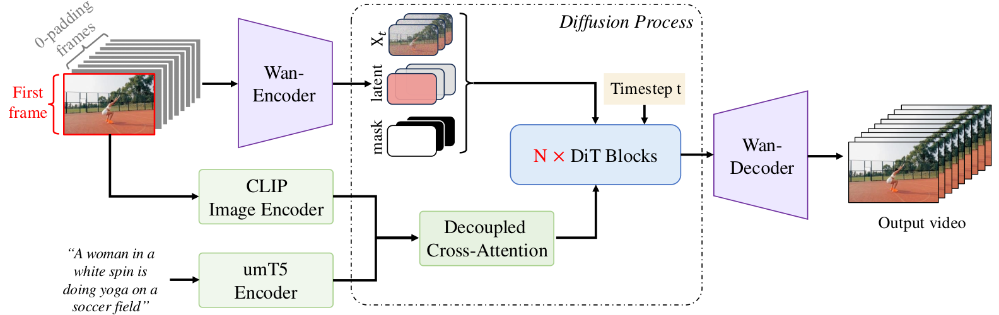

<figcaption>図18: Wan-I2V モデルの枠組み。マスク機構はモデルが入力フレームに選択的に注目することを可能にし、提案する枠組みは動画継続および first-last frame 変換のタスクとの互換性を示す。</figcaption>
</figure>

動画継続のデータセット。同様に、我々の知見は時間的に一貫した動画で学習することが動画継続タスクの性能を大きく改善することも示している。動画の最初と最後の区間（すなわち最初の 1.5 秒と最後の 3.5 秒）の間の一貫性を定量化するため、それぞれの SigLIP 特徴のコサイン類似度を計算し、続いて計算された類似度スコアを用いて必要な学習データセットを絞り込み選択する。

first-last frame 変換のデータセット。I2V タスクと異なり、画像遷移のタスクではコミュニティは最初と最後のフレームの間の滑らかな遷移をより重視する。この目的のため、学習データセットにおいて最初と最後のフレームの間に有意な遷移を持つデータサンプルの比率を高める。

<figure>

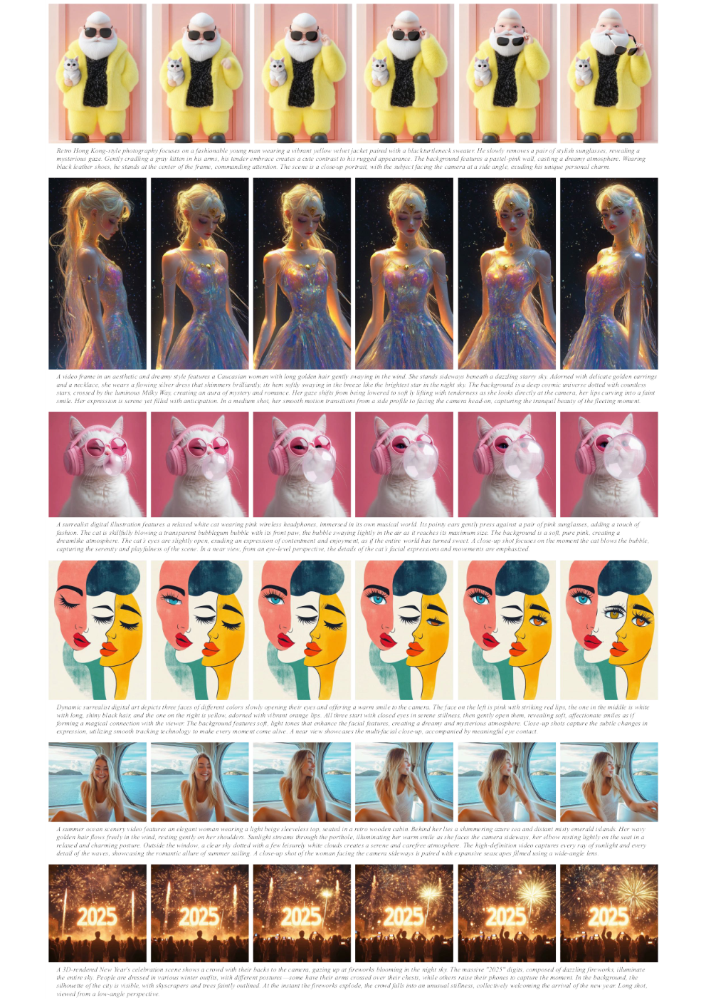

<figcaption>図19: Wan-I2V モデルが生成した動画。結果は、我々の I2V モデルが実世界の場面のダイナミクスを効果的に捉え再現することを示している。</figcaption>
</figure>

<figure>

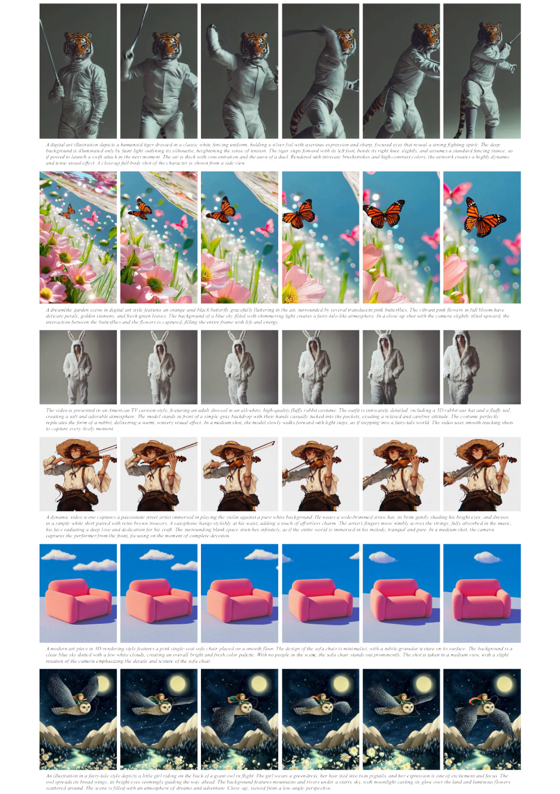

<figcaption>図20: Wan-I2V モデルが生成した動画。結果は、我々の I2V モデルが多様な種類の画像を高度に写実的で動的な動画へ効果的にアニメーション化できることを示している。</figcaption>
</figure>

#### 5.1.3 Evaluation（評価）

I2V モデルの学習は、first-last frame 変換および動画継続とともに 2 つの段階に構成される。初期の事前学習段階では、T2V タスクに用いたのと同じデータセットを用いる。この段階では扱うフレーム数がやや多いことを踏まえ、画像エンコーダの枝は除外される。これは、テキスト入力と視覚出力の間の強い整合を維持し、モデルが微妙なテキストの意味への感度を保つ必要があることに動機づけられている。事前学習段階が安定すると、モデルは既に I2V 生成、動画継続などを含む様々な能力を発現している。これは、空間的・時間的理解の双方に対する頑健な基礎を確立する上での事前学習プロセスの有効性を実証する。

我々の経験的観測は、image-to-video 生成、動画継続、first-last frame 変換といった特定のタスクにおいて最適な性能を達成するには、フレームレベルの情報のみに依拠することが不十分であることを明らかにする。

この洞察は、事前学習済みモデルがフレームベースの動画生成の基礎的な枠組みを提供する一方で、とりわけ条件づけるフレーム数が極めて限られている場合に、動的な動画系列の時間的一貫性を完全に捉えるために必要な文脈的・意味的な深さを欠くことを示している。

この制約に対処するため、SFT の段階で、分離された cross-attention を通じて画像特徴を抽出する画像エンコーダを組み込み、モデルの能力を高めるための大域的な文脈情報を提供した。480p と 720p の解像度における 2 つの事前学習済みチェックポイントに基づいて実験を行い、image-to-video 生成、動画継続、first-last frame 変換のタスクの学習をカバーした。

T2V モデルに対する人間評価と同様に、我々は視覚的品質・動きの品質・一致度といった主要な側面に焦点を当てた包括的な比較を提供するため、I2V モデルを最先端の手法と比較評価する。表 7 に示す結果は、我々のモデルが評価されたすべての次元にわたって好ましい性能を示すことを実証している。図 19 と図 20 は I2V モデルの追加の可視化を提示し、画像を高品質な動画へアニメーション化する上での優れた性能を明確に示している。

**表7**: I2V モデルの勝率差。表中の値は、Wan-I2V モデルが他のモデルとのペアワイズ比較で選好された事例の割合を、実施された比較の総数に対して表す。

|  | CN-TopA | CN-TopB | CN-TopC | CN-TopD | 全ラウンド数 |
| --- | --- | --- | --- | --- | --- |
| 視覚的品質 | 29.2% | 60.8% | 24.6% | 55.6% | 896 |
| 動きの品質 | 21.7% | 21.7% | 32.5% | 67.0% | 890 |
| 一致度 | -4.2% | 35.0% | 51.7% | 72.2% | 896 |
| 総合順位 | 10.8% | 47.5% | 50.8% | 81.6% | 890 |

### 5.2 Unified Video Editing（統一的な動画編集）

text-to-image および text-to-video 生成のための基盤事前学習済みモデルは、repainting、編集、可制御生成、カスタマイズ生成、フレーム参照生成、効率的生成、ID 参照の動画合成を含む様々な下流タスクと応用の拡大を促進してきた。タスクの柔軟性を高め、複数モデルの展開に伴うオーバーヘッドを最小化するため、研究者は ACE や OmniGen といった統一的なモデルアーキテクチャの開発にますます焦点を当ててきた。これら統一アーキテクチャは多様なタスクを単一の画像モデル内に統合し、それによって使いやすさを保ちつつ様々な応用ワークフローの作成を容易にすることを目指す。動画の領域では、時間次元と空間次元の双方における協調的な変換が、統一モデルの活用が動画制作に無限の可能性を解き放ちうることを示唆している。

我々の先行研究 VACE では、参照から動画への生成、動画から動画への編集、マスク付き動画から動画への編集といったタスクに対処する、可制御な動画生成と編集のための統一枠組みを導入した。Wan の事前学習済みモデルの上に構築し、我々は編集・参照・マスクのための画像と動画を含む複数のモダリティを Video Condition Unit（VCU）へ統合し、多様な入力形式に対応する。VACE は概念分離（concept decoupling）戦略を用い、モデルがどの側面を保持しどの側面を修正すべきかを識別できるようにして、それによって編集タスクと参照タスクにおける視覚モダリティ情報を明確に分離する。我々は 2 つの学習モードを提供する。第一のモードは VCU を入力として学習し、Wan モデル全体を完全に微調整することを含む。第二のモードは Res-Tuning の方式で着脱可能な Context Adapter 構造を利用し、基盤モデルの重みを改変することなく、しかしモデル全体の規模を増やして可制御タスクと編集タスクに対応できるようにする。Wan の頑健な動画生成能力を活かし、この革新的な枠組みは定量的・定性的な評価の双方において有意な競争力を示す。それは基礎的タスクの合成的な拡張を促進し、長尺動画の再レンダリングといったシナリオを可能にする。その結果、この枠組みは動画合成に対する多用途で効率的な解決策を提供し、ユーザー駆動の動画コンテンツ制作と編集に新たな道を開く。

<figure>

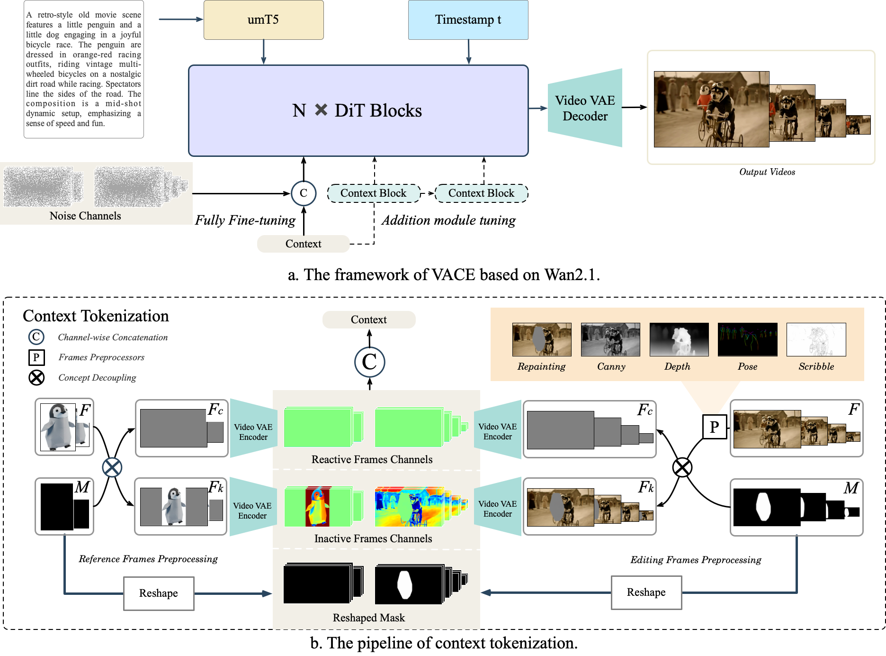

<figcaption>図21: 統一的な可制御生成・編集の枠組み。フレームとマスクは Concept Decoupling、Context Latent Encode、Context Embedder を通じてトークン化される。我々は Wan に対して 2 つの学習戦略を提案する：Fully Fine-tuning と Context Adapter Tuning である。</figcaption>
</figure>

#### 5.2.1 Model Design（モデル設計）

VACE で提案された Video Condition Unit（VCU）は、多様な入力条件をテキスト入力・フレーム系列・マスク系列へ統一する入力パラダイムとして機能する。それは以下のように形式的に表せる。

$$
V=[T;F;M],
$$

ここで $T$ はテキストプロンプトであり、$F$ と $M$ はそれぞれ文脈動画フレームの系列 $\{u_{1},u_{2},...,u_{n}\}$ とマスクの系列 $\{m_{1},m_{2},...,m_{n}\}$ である。ここで $u$ は RGB 空間にあり $[-1,1]$ に正規化され、$m$ は二値で、「1」と「0」はどこを編集しどこを編集しないかを象徴する。$F$ と $M$ は空間サイズ $h\times w$ と時間サイズ $n$ の双方において整合している。このパラダイムの下で、我々は前述の Wan-VAE を用いて入力動画フレームとマスク情報を文脈トークンへトークン化する。図 21 (a) に示すように、これら文脈トークンはノイズ付き動画トークンと結合され、Wan モデルを微調整する。加えて Context Adapter Tuning 戦略が提案され、これは文脈トークンが Context Block を通過して元の DiT ブロックへ再統合されることを可能にする。このアプローチは文脈情報のシームレスな統合を促進し、基盤モデルの重みを変えることなく多様な編集・生成タスクを扱うモデルの能力を高める。

<figure>

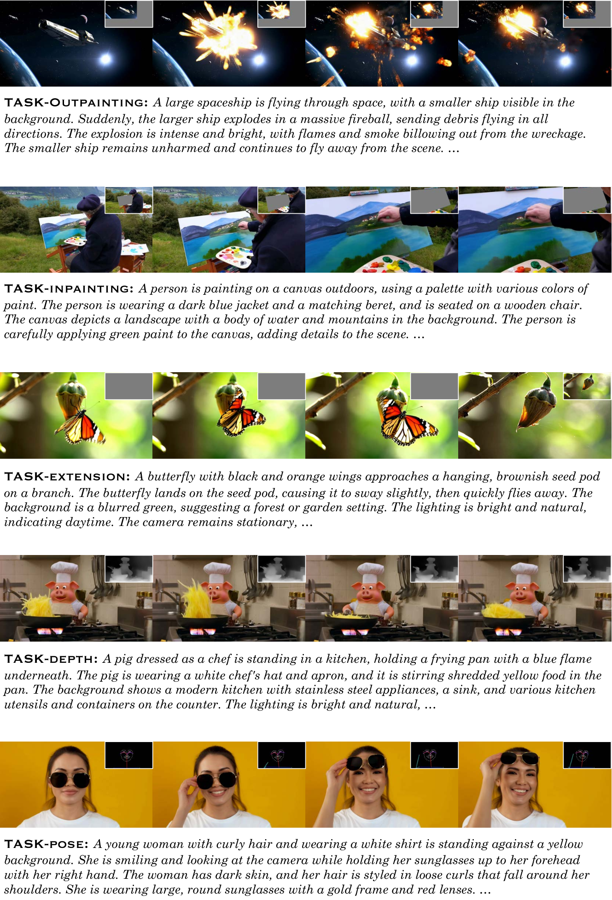

<figcaption>図22: 提案する VACE の可視化結果。</figcaption>
</figure>

<figure>

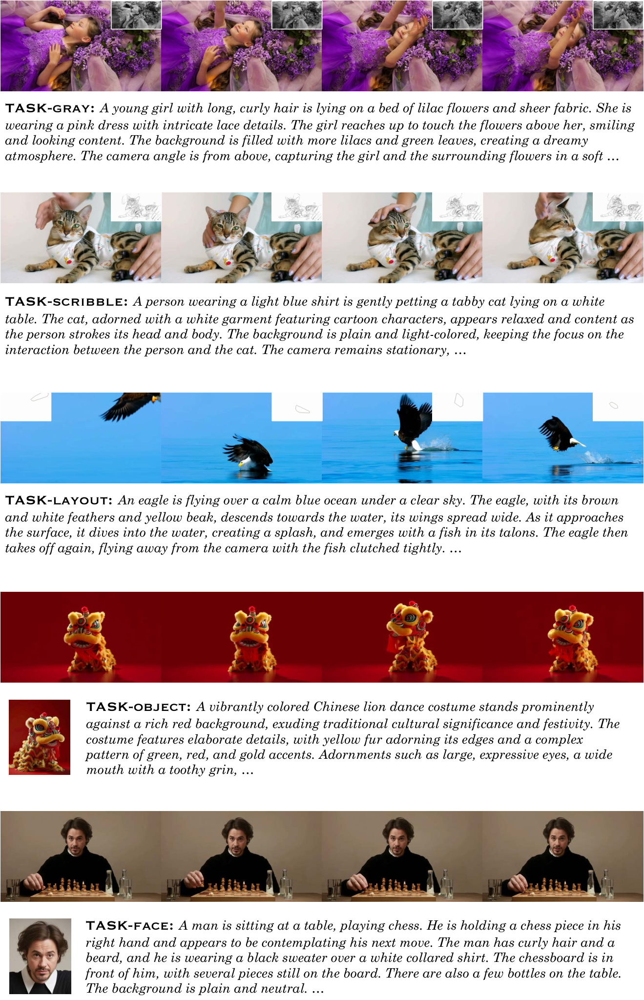

<figcaption>図23: 提案する VACE の可視化結果。</figcaption>
</figure>

トークン化に先立ち、ピクセルレベルの文脈フレームとマスクは概念分離戦略を用いて前処理され、その後潜在空間へ符号化される。図 21 (b) に示すように、概念分離戦略はマスクに基づいて異なるモダリティと分布のデータを、同一形状の 2 つのフレーム系列へ明示的に分離する：$F_{c}=F\times M$ と $F_{k}=F\times(1-M)$ である。ここで $F_{c}$ は修正されるべきすべてのピクセルを含む反応的（reactive）フレームを指し、$F_{k}$ は保持されるべきすべてのピクセルを保つ非反応的（inactive）フレームを表す。この機構は明確なタスク定義を確保し、異なるタスクにわたるモデルの収束を保証する。$F_{c}$、$F_{k}$ は Wan-VAE によって処理され、$X$ と同じ潜在空間へ写像され、その時空間的一貫性が維持される。画像と動画の混ざり合いを避けるため、参照画像は Wan-VAE エンコーダによって別個に符号化され時間次元に沿って連結し戻される。一方、復号の際には対応する部分を除去する必要がある。$M$ は直接に形状変更され補間される。その後 $F_{c}$、$F_{k}$、$M$ は潜在空間へ写像され、$n^{\prime}\times h^{\prime}\times w^{\prime}$ の形状で $X$ と時空間的に整合される。

<figure>

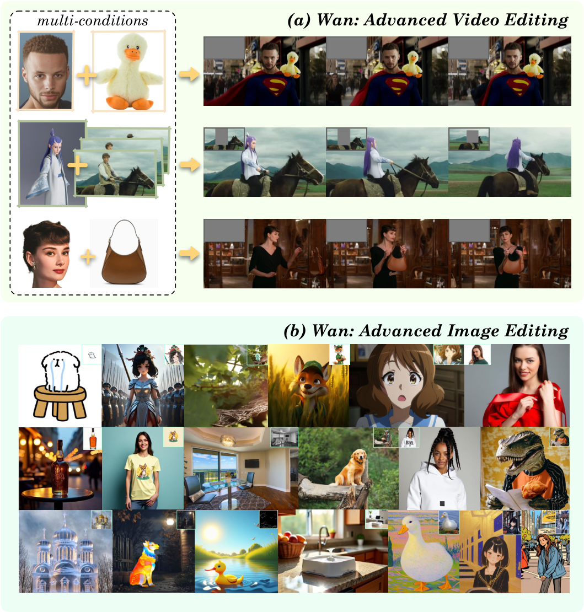

<figcaption>図24: 高度な動画／画像編集の可視化結果。</figcaption>
</figure>

#### 5.2.2 Datasets and Implementation（データセットと実装）

データ構築。オールインワンのモデルを開発するには、データ構築の多様性と複雑さが増さねばならない。可制御な動画生成と編集のタスクについては、入力モダリティが目標動画・元動画・局所マスク・参照などを含むよう拡張される。様々なタスクに対する効率的で迅速なデータ取得は、動画品質を維持しつつインスタンスレベルの分析と理解を行うことを必要とする。我々はまず動画データにショット分割を施し、解像度・美的スコア・動きの振幅に基づいて初期のフィルタリングを行う。次に最初のフレームを RAM でラベル付けし、Grounding DINO で処理して検出を行い、対象領域が小さすぎるか大きすぎる動画の二次的なフィルタリングを可能にする。加えて SAM2 の伝播操作を動画のセグメンテーションに利用して、動画全体を通じたインスタンスレベルの情報を得る。セグメンテーション結果に基づき、マスク面積の閾値に従って有効フレーム比を計算することにより、インスタンスを時間的にさらに絞り込む。異なるタスクのための構築は、各タスクの固有の特性に合わせて調整されねばならない。詳細な情報は当該研究を参照されたい。

実装の詳細。我々は Wan-T2V-14B で事前学習された可制御・編集モデルを、多段階の学習プロセスを通じて 720p までの解像度に対応するよう学習する。最初は、事前学習済みの text-to-video モデルを補完するために inpainting や拡張といった基礎的タスクに焦点を当てる。このフェーズはマスクを組み込み、空間・時間の双方の次元における文脈的生成能力を発達させる。続いて、単一入力から複数入力の参照フレームへ、また個別タスクから複合タスクへと移行することによってタスクを拡張する。最後に、より高品質なデータとより長い系列で微調整することによってモデルの品質を高める。

#### 5.2.3 Evaluation（評価）

図 22 と図 23 に、様々なタスクにわたる Wan の単一モデルの結果を提示する。モデルが動画品質と時間的一貫性において高い水準の性能を達成していることは明らかである。加えて、図 24 (a) に示すように、異なる生成能力の組み合わせから生じる新しい応用を実証する。我々のモデルはこれらのタスクで効果的に機能し、能力拡張の有意な可能性を示す。VACE が提案する統一的な可制御生成・編集の枠組みは、図 24 (b) に示すように、画像生成と編集にも適用可能である。

### 5.3 Text-to-Image Generation（text-to-image 生成）

Wan は画像データセットと動画データセットの双方で共同学習されており、それによって先進的な動画生成能力だけでなく、卓越した画像合成性能も備えている。この二重学習の戦略はモダリティ横断の知識転移を促進し、両領域で強力な結果を達成する高度に多用途な枠組みを作り出す。実践において、我々のモデルは動画のそれのほぼ 10 倍の規模の画像データセットで学習されており、画像生成タスクと動画生成タスクの間の相乗効果を可能にしている。この広範な学習の体制は、画像合成の様々な側面において傑出した性能をもたらした。図 25 に示すように、Wan は芸術的なテキストベースの視覚表現、写実的な肖像、想像力豊かな創造的デザイン、専門級の製品写真を包含する多様なカテゴリにわたって高忠実な画像を生成する。

<figure>

<figcaption>図25: Wan モデルが生成した画像サンプル。</figcaption>
</figure>

### 5.4 Video Personalization（動画の個人化）

動画の個人化は、ユーザーが提供する参照と一貫した同一性を保つ動画を生成することを目指す。本節では、先進的な個人化技術を動画生成パイプラインへ統合し、最先端の性能を達成する。以下の議論は、モデルアーキテクチャ、個人化データ、実験的検証を包含する我々のアプローチの包括的な詳述を提供する。

#### 5.4.1 Model Design（モデル設計）

動画個人化の背後にある中核技術は 2 つの主要な課題に取り組む：(1) 高忠実な個人化された同一性の獲得と、(2) これら同一性の特徴の動画生成パイプラインへのシームレスな統合である。

我々は Wan-T2V の基盤モデルから始め、まず個人化された同一性の情報を取得する。既存の動画個人化のアプローチは通常、同一性情報を得るために ID 抽出器（例：ArcFace）や汎用の視覚抽出器（例：CLIP）に依拠する。それらは有望な進展を遂げているものの、その性能は特徴抽出器の限界によってボトルネックとなる。例えば ID 抽出器は主に顔認識のための特徴に焦点を当てるが、傷跡やステッカーといった他の重要な視覚的手がかりを捉えないかもしれない。さらに、低解像度の顔、照明の変動、部分的な遮蔽（眼鏡、マスク、髪など）の影響を受けやすい。他方、汎用の視覚抽出器は顔の領域に特化しておらず、粗粒度の意味情報に焦点を当てる傾向がある。したがって我々は情報の損失を避けるためにいかなる特徴抽出器にも依拠しないことを選び、我々の生成プロセスは Wan-VAE の潜在空間において入力される顔画像に直接条件づけられる。

個人化された同一性の情報を動画生成プロセスへ注入する方法は多数ある。我々の実験では、cross-attention 操作が同一性抽出器から得られる密な表現との相互作用に適する一方、self-attention は同じ潜在空間にあるデータのモデリングにより適切であることを見出した。図 26 は、self-attention のパラダイムに従う我々の動画個人化アプローチの設計を図解する。具体的には、潜在空間において、まずセグメンテーションされた顔画像を用いて与えられた動画に $K$ 個の追加フレームを先頭に付加する。これらの顔画像は、顔検出とセグメンテーションを用いて対になる動画から抽出され、さらに顔のランドマークが動画フレームと同じサイズの黒いキャンバスへ整列される。次に、この拡張された動画のチャネル次元に沿って、最初の $K$ フレームについては顔画像を全 1 のマスクと、残りのフレームについては空白画像を全 0 のマスクと連結する。これら連結された信号が条件として機能する。最後に、この時間的に拡張された動画に対して、チャネル方向の条件信号に条件づけられた inpainting の方式で拡散プロセスが実行される。なお、我々の Wan-T2V モデルには他のいかなる改変も適用されていない。

学習の際、$K$ 個の拡張フレームにおける顔画像の一部をランダムに落とすことで、$0$ から $K$ 枚の参照顔による動画生成に対応する。推論の段階では、拡張された動画の純粋なノイズから始めて、ユーザーが提供する顔画像（$K$ 枚以下）をチャネル次元で拡張フレームへ連結し、対応するマスクを全 1 に設定する。目標は最初の $K$ フレームにおいて顔画像を再構成し、続くフレームにおいて与えられた同一性を保つ新しい個人化された動画を合成することである。

<figure>

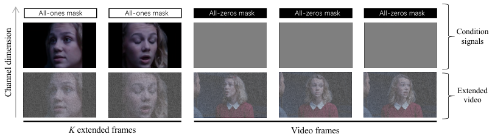

<figcaption>図26: Wan-VAE の潜在空間における動画個人化アプローチの中核設計。</figcaption>
</figure>

#### 5.4.2 Dataset（データセット）

我々は入念なフィルタリングと自動的なデータ合成を通じて、T2V 基盤モデルの学習データセットから個人化データの集合をキュレートする。まず内部の人物分類器を用いて約 $\mathcal{O}(100)$ M の動画を絞り込み、これらの動画について 1 FPS で顔検出を行う。いずれかのフレームで複数の顔が検出された場合、あるいは 10% を超えるフレームで顔が検出されなかった場合、その動画は破棄される。次に連続するフレーム間の ArcFace 類似度を計算し、類似度の低い動画を破棄する。その後、邪魔な背景を除去するために顔のセグメンテーションを行い、学習時のキャンバス整列を容易にするために顔のランドマーク検出を行う。なお、面積の小さい顔は除外しない。そのような動画は通常、全身の人物像を含むことを見出しているためである。最終的に約 $\mathcal{O}(10)$ M の個人化動画を構築し、各動画には平均して 5 枚のセグメンテーションされた顔が伴う。

我々はまた、顔の多様性を改善するために自動的なデータ合成にも頼る。具体的には、上記から $\mathcal{O}(1)$ M の個人化動画を無作為に選び、各動画について多様な顔を合成するために Instant-ID を採用する。特筆すべきことに、我々はアニメ、線画、映画的、Minecraft などを含む 100 を超えるプロンプトからなるテキストのテンプレートを構築する。毎回このテンプレートからランダムなプロンプトを取り、また残りの動画から推定されたランダムな人物姿勢を取って、Instant-ID への入力とする。さらに生成された顔について ArcFace 類似度を測り、類似度の低いものを除外する。合計で約 $\mathcal{O}(1)$ M の合成顔を持つ動画を集め、これが我々の個人化データセットにおける様式・姿勢・照明・遮蔽の多様性を大きく改善する。

**表8**: 他の先導的な動画個人化手法との比較。

|  | Wan | CN-TopA | CN-TopB | CN-TopC |
| --- | --- | --- | --- | --- |
| ArcFace 類似度 | 0.5526 | 0.5655 | 0.5197 | 0.4998 |

#### 5.4.3 Evaluation（評価）

図 27 に我々の動画個人化の結果を提示する。左側が入力される同一性を、右側が合成された個人化動画を表す。すべてのテスト画像は Pexels から無作為に選ばれている。我々はまた未見の評価集合でモデルを評価し、動画から 1 FPS で顔をサンプリングすることによって入力顔と出力される個人化動画の間の ArcFace 類似度を測る。最終的な類似度スコアはこれらサンプリングされた顔から平均される。対応する結果は表 8 に示され、そこで我々のアプローチは他の先導的な商用およびクローズドソースの中国の競合と比べて競争力のある動画個人化性能を示す。

<figure>

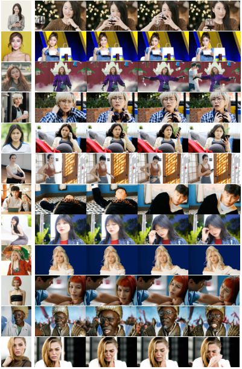

<figcaption>図27: 我々の動画個人化アプローチの可視化。</figcaption>
</figure>

<figure>

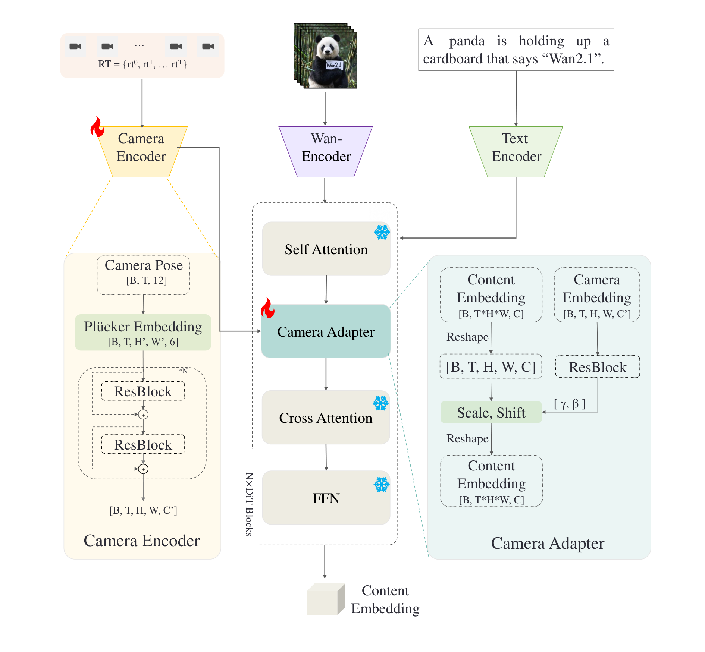

<figcaption>図28: カメラの動きに誘導される動画生成の枠組み。</figcaption>
</figure>

### 5.5 Camera Motion Controllability（カメラの動きの制御性）

カメラの動きの制御モジュールは、カメラ軌道を活用して動画の動きと視点を正確に合わせるよう設計されている。具体的には、各フレームについて外部パラメータ $[R,t]\in\mathbb{R}^{3\times 4}$ と内部パラメータ $K_{f}\in\mathbb{R}^{3\times 3}$ を利用する。我々のアプローチは、図 28 に示すように、カメラの動きの条件を効果的に注入するための 2 つの主要構成要素から成る：カメラ姿勢エンコーダとカメラ姿勢アダプタである。

<figure>

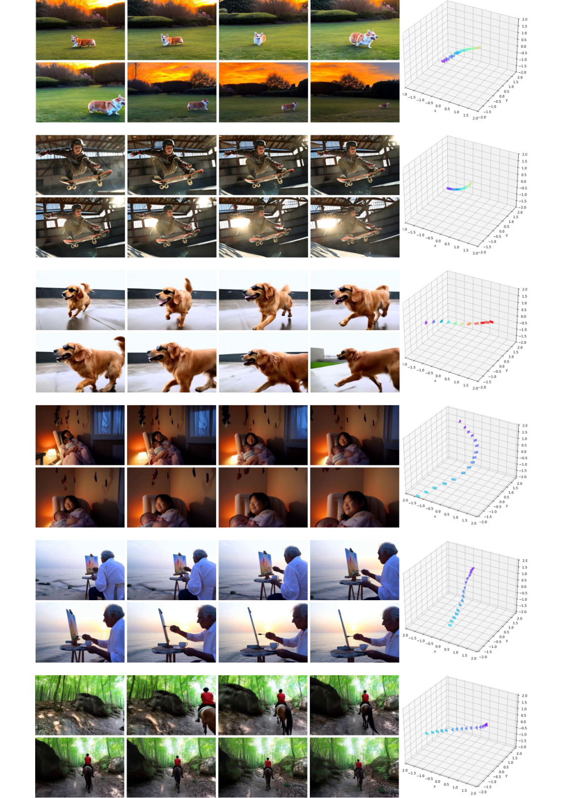

<figcaption>図29: カメラの動きに誘導されて生成された動画の結果。</figcaption>
</figure>

カメラ姿勢エンコーダ。まず、各動画フレームの各ピクセルについて、与えられた外部・内部パラメータを細粒度の位置の系列 $P\in\mathbb{R}^{6\times F\times H\times W}$ へ変換するために Plücker 座標を用いる。動画潜在特徴の圧縮解像度に合わせるため、Pytorch の PixelUnshuffle 操作を適用して $P$ の空間解像度を下げつつチャネル数を増やす。最後に、DiT ブロック数と揃えられた一連の畳み込みモジュールを用いて出力を符号化し、多段階のカメラ動き特徴を抽出する。

カメラ姿勢アダプタ。カメラの動き特徴を動画潜在特徴へ統合するため、適応正規化層を採用する。具体的には、入力されるカメラ動き特徴の系列を、2 つのゼロ初期化された畳み込み層を用いてスケーリング係数 $\gamma_{i}$ とシフトパラメータ $\beta_{i}$ へ変換する。次に $\gamma_{i}$ と $\beta_{i}$ を、$f_{i}=(\gamma_{i}+1)*f_{i-1}+\beta_{i}$ という式で定義される単純な線形射影を通じて各 DiT ブロックへ組み込む。ここで $f_{i}$ は層 $i$ における動画潜在特徴を表す。

学習データについては、有意なカメラの動きを示す我々の学習動画からカメラ軌道を抽出するために VGG-SfM という先進的なカメラ姿勢推定アルゴリズムを利用する。このプロセスは約 $\mathcal{O}(1)$ 千の動画断片をもたらす。我々はこのモジュールを text-to-video 生成の枠組み内で Adam オプティマイザを用いて学習する。図 29 は、カメラの動きの誘導の下で生成された動画の様々な例の結果を提示する。

### 5.6 Real-time Video Generation（リアルタイム動画生成）

現在の動画生成手法は、短い動画クリップを 1 本作るのにさえ、しばしば有意な計算資源と相当の時間を要する。高性能なハードウェアに依拠するシステムでも依然として遅く、わずか数秒の動画を生成するのに数分を要することが多い。これら生成された動画の視覚的品質は近年大きく改善されてきたが、長い処理時間は実践的な応用と反復的な設計のワークフローにおいて大きなボトルネックとなる。インタラクティブなエンターテインメント、バーチャルリアリティ、動画制作といった、迅速な試作とリアルタイムの調整が極めて重要な分野では、これら長い生成時間が創造的な柔軟性を制限し、視覚的コンテンツを精錬するプロセスを遅らせる。

さらに、現行手法の速度の遅さは、リアルタイムのフィードバックが不可欠な動的環境での利用を制限する。ライブ配信やゲームのような文脈では、ユーザーの行動や変化する入力に応じて合成された場面やキャラクターを即座にレンダリングできるシステムへの需要が高まっている。高品質な動画クリップの生成における遅延は、没入感と対話性を減じ、最適でないユーザー体験をもたらしうる。リアルタイム生成に焦点を当てることにより、Wan は動画生成技術の性能と適用可能性の双方を高め、テンポの速い対話的な環境におけるその潜在力を広げることを目指す。図 30 と 31 は、そのようなリアルタイムの長尺動画ストリーム生成の事例を提供する。次に、我々の Wan モデルを用いてこれをどう達成するかを紹介する。

<figure>

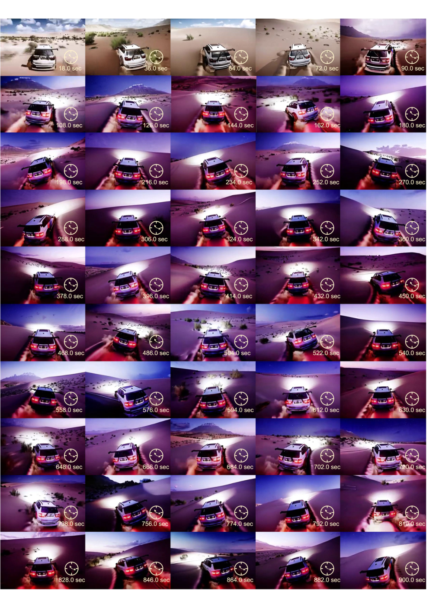

<figcaption>図30: 8 台の A100 GPU でリアルタイム 8 FPS により生成された 15 分の動画。</figcaption>
</figure>

<figure>

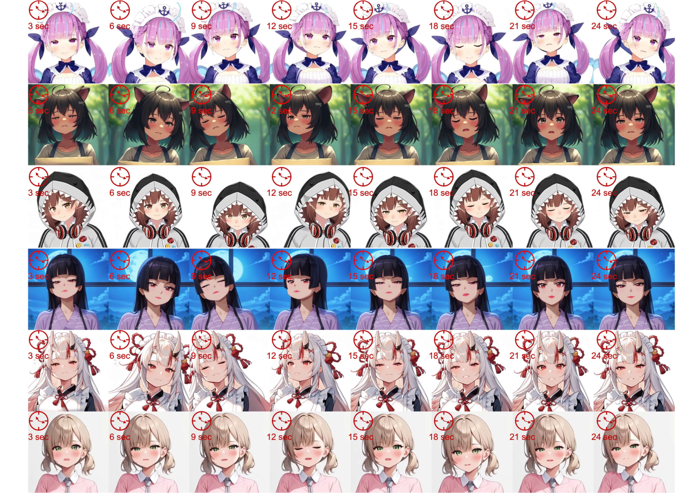

<figcaption>図31: 単一の RTX 4090 GPU、int8 および TensorRT 量子化により、リアルタイム 20 FPS で生成された動画。</figcaption>
</figure>

#### 5.6.1 Method（手法）

リアルタイム生成のパイプラインを構築するため、我々は事前に学習された Wan モデルの版の上に構築する。この設計上の選択は 2 つの主要な利点を提供する。第一に、よく学習されたモデルから始めることは、モデルが既に強い初期化を備えているため、収束を大きく加速し学習の安定性を改善する。第二に、事前学習済みモデルは動きのパターンと連続的な時間ダイナミクスについての価値ある知識を既に捉えており、これを新しいパイプラインが直接継承して、生成されるコンテンツの滑らかさと一貫性を高められる。したがって我々は事前学習済みの Wan モデルをリアルタイムパイプラインの基礎として採用する。

事前学習済みの Wan モデルは、典型的に 5 から 10 秒の固定長の動画クリップを生成するよう設計されている。これを、事前に定められた長さを持たない（潜在的に無限の）連続的な動画ストリームを生成できるリアルタイムのストリーミングモデルへ変換するには、2 つの主要な改変が必要である。

- ストリーミングパイプラインへの適応。固定長の動画トークン系列を 1 回のパスで生成する静的な生成プロセスを、動画トークンを漸進的に生成するストリーミング機構へ置き換える。このストリーミングの構成では、動画トークンはノイズ除去の待ち行列（denoising queue）を通じて処理される——最も古いトークンが生成されて待ち行列から出るたびに、新しいトークンが待ち行列の末尾に加えられ、長さの制約なしに連続的な生成が可能になる。
- リアルタイムの加速。ストリーミングを可能にすることに加え、システムがリアルタイム性能の要件を満たすよう、すなわちパイプラインがリアルタイム再生に追いつくのに十分な速さで新しいフレームを生成するよう、生成速度を最適化する。

以下の節では、これら各々の改変について、設計の論拠、技術的実装、経験的性能を含めて詳述する。

#### 5.6.2 Streaming Video Generation（ストリーミング動画生成）

従来の Diffusion Transformer（DiT）モデルは、変分オートエンコーダ（VAE）を通じて有意な空間的・時間的圧縮を用いた場合でさえ、数秒より長い動画を生成する能力において制約される。この制約は主に、延長された時間系列にわたる注意機構の計算・メモリ集約的な性質に由来する。この課題を克服するため、我々は Streamer を導入する。これは時間依存関係を効率的に管理するために滑動する時間窓を活用する新しいアプローチであり、長尺あるいは無限長の動画をストリーミング方式で生成することを可能にする。

##### 窓を滑らせるノイズ除去プロセスのモデル。

Streamer の主要な革新は、時間依存関係が限られた時間窓の内部に収まるという仮定にある。注意計算をこの窓の内部に集中させることにより、Streamer は動画の連続性を保ちつつ計算のオーバーヘッドを大きく削減する。具体的には、Streamer は動画トークンを待ち行列で処理し、窓の内部で複数のノイズレベルにわたってそれらをノイズ除去する。一定回数のノイズ除去ステップの後、（最も低いノイズレベルを持つ）最左のトークンが待ち行列から出てキャッシュされ、ガウスノイズを持つ新しいトークンが最右の位置に付加される。この滑動の機構は、連続的な動画フレームの生成を促進しつつ、窓が一定の長さを保つことを保証する。

##### 学習と推論。

Streamer は事前学習済みの DiT モデルから微調整される。学習の際、$2w$ 個の動画トークンの系列がサンプリングされる。ここで $w$ は滑動窓のサイズ（典型的には拡散ソルバーのステップ数 $T$ に設定される）である。最初の $w$ 個のトークンはモデルを「暖機」するためだけに用いられ、損失の計算には寄与しない。損失は最後の $w$ 個のトークンについてのみ計算され、それによってモデルが窓の内部で一貫した動画フレームを生成するよう学習することを保証する。推論時にも同じ暖機の戦略が用いられる：最初の $w$ 個のトークンは破棄され、生成される動画は $(w+1)$ 番目のトークンから始まる。

##### 学習と推論における連続性の確保。

連続する窓の間の滑らかな遷移を保つため、キャッシュされたトークンはノイズレベル 0 でトークンの待ち行列へ再導入される。これにより、以前に生成されたトークンが後続の窓のノイズ除去プロセスに参加でき、生成される動画における時間的一貫性と連続性が確保される。

Streamer は、DiT モデルをストリーミング応用へ適応させることによって動画生成における有意な進展を表す。その滑動時間窓のアプローチは従来の DiT モデルの制約に対処し、高い品質と時間的一貫性を保ちながら無限長の動画の効率的な生成を可能にする。この手法はリアルタイムの動画生成と長尺コンテンツ制作に新たな可能性を開く。その利点を以下に要約する。

- 無限長の動画生成: 滑動窓の機構を活用することにより、Streamer は法外な計算コストを被ることなく任意の長さの動画を生成できる。
- 効率的な注意計算: 注意計算を限られた時間窓に制限することが、メモリと処理の需要を削減する。
- シームレスな連続性: トークンのキャッシュと再導入が窓間の滑らかな遷移を確保し、長時間にわたって動画品質を保つ。

#### 5.6.3 Consistency Model Distillation（一貫性モデルの蒸留）

DiT モデルを無限長の動画生成のための Streamer へ首尾よく拡張した後、次の重要なステップはシミュレートされた世界のリアルタイムなレンダリングを達成するという課題に対処することである。Streamer は滑動窓の内部で時間依存関係を効率的に管理することによって長尺あるいは無限の動画の生成を可能にするが、拡散プロセスの計算需要は依然としてリアルタイム応用のボトルネックとなる。これを克服するため、我々は Streamer と Consistency Models——拡散ベースの生成プロセスを加速する最先端のアプローチ——の新しい統合を提案する。具体的には、Latent Consistency Model（LCM）とその動画版（VideoLCM）を活用する。これらは元の拡散プロセスと classifier-free guidance を蒸留して、高効率な 4 ステップの一貫性モデルにする。この蒸留プロセスは、Streamer に内在する時間的一貫性とストリーミング能力を保ちながら、高品質な生成に必要なサンプリングステップ数を大きく削減する。

LCM と Streamer の統合は、ノイズ除去窓の機構を保つよう設計されており、滑動時間窓が依存関係を効果的に管理し続けることを保証する。学習の際、効率と品質のバランスを取るようこの組み合わせた枠組みを最適化する。その結果は推論速度の 10 - 20 $\times$ の加速であり、モデルが 8 - 16 FPS のレンダリング率を達成することを可能にする。この劇的な性能の改善は、対話的なシミュレーション、ライブ動画合成、仮想環境における動的コンテンツ生成といったリアルタイム応用にとってシステムを実用的なものにする。Streamer の強み——時間的一貫性を伴う無限長の動画を生成する能力——と LCM の強み——拡散プロセスを加速する効率性——を組み合わせることにより、我々は高品質な動画生成とリアルタイムの応答性の間の隔たりを埋める。この進展は、ストリーミング応用に対する拡散モデルの実用性を高めるだけでなく、没入的で対話的なリアルタイムのメディア制作に対する新たな可能性も開く。

##### コンシューマ級デバイスで動作させるための量子化。

生成速度はリアルタイムの水準まで加速されたものの、NVIDIA 4090 のような高性能 GPU であっても、高い計算・メモリ要件のためにコンシューマ級デバイスへのモデルの展開は依然として困難である。これに対処するため、効率的な展開に向けてモデルを最適化する量子化技術を導入する。具体的には、2 つの異なる量子化戦略を用いる：注意層と線形ヘッドに対する int8 量子化と、モデル全体に対する TensorRT 量子化である。int8 量子化のアプローチは、全体の生成品質を保ちつつ、重みと活性化を 8 ビット整数へ変換することでメモリ消費を大きく削減する。しかしこの手法は、計算の最適化ではなく主にメモリ効率に焦点を当てるため、生成速度の加速は最小限である。他方、TensorRT 量子化はより包括的な解決策を提供し、生成速度の実質的な加速を可能にする。この技術により、モデルは単一の 4090 GPU 上でさえ 8 FPS のリアルタイム性能を達成でき、コンシューマ級デバイスにとって実現可能なものとなる。しかしながら TensorRT 量子化はネットワーク誤差の緩やかな増加を導入し、これは組み込みの誤差検査機構を有効にした場合でさえ観測されうる。この誤差は、生成される動画における軽微なアーティファクトや不整合といった、出力品質のわずかなずれとして現れる。場合によっては、ちらつきや時間的な不整合といった測定可能な不安定性にもつながりうる。これらのトレードオフにもかかわらず、int8 と TensorRT の量子化の組み合わせは、リアルタイムかつコンシューマ級の展開に向けてモデルを最適化するバランスの取れたアプローチを提供し、許容可能な生成品質を保ちつつ効率性と実用性の双方を確保する。量子化のパラメータを入念に調整し TensorRT の誤差検査機能を活用することにより、これらの問題を最大限に緩和し、コンシューマ級ハードウェア上での頑健で効率的な性能を可能にする。

### 5.7 Audio Generation（音声生成）

本研究における音声生成の主目的は、動画クリップに同期したサウンドトラックを生成することであり、video-to-audio（V2A）生成の枠組みとして定式化される。生成されるサウンドトラックは環境音と背景音楽から成り、発話や歌声の要素は明示的に除外される。text-to-audio モデルと対照的に、video-to-audio モデルが生成する環境音は動画の視覚的内容と時間的に整合していなければならず、一方で伴奏する音楽は、自然に期待されるように、動画の感情的な調子と文脈的な設定を正確に反映すべきである。さらに、音響設計に対するユーザーの制御を高めるため、我々の枠組みは動画とテキストの双方のプロンプトを統合し、ユーザーが画面内あるいは画面外の音を指定し、背景音楽の様式と有無を定義できるようにする。

#### 5.7.1 Model Design（モデル設計）

我々の動画生成の枠組みと一貫して、video-to-audio モデルもまた音声領域におけるノイズ除去拡散プロセスをモデル化するために flow matching に基づく diffusion transformer（DiT）を利用する。我々の V2A モデルの詳細なパイプラインは図 32 に示される。

<figure>

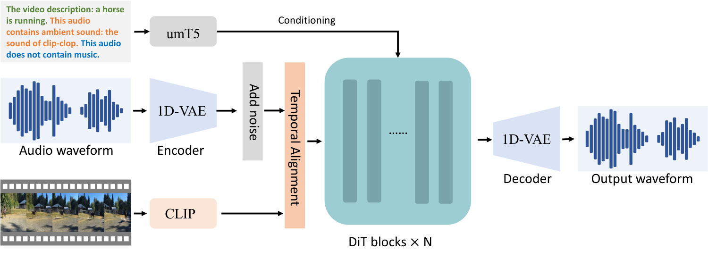

<figcaption>図32: video-to-audio 生成の枠組み。我々のモデルは動画チャンクとそれに関連するテキスト記述を二重の入力として処理し、高品質で意味的に一貫した音声を合成する。</figcaption>
</figure>

<figure>

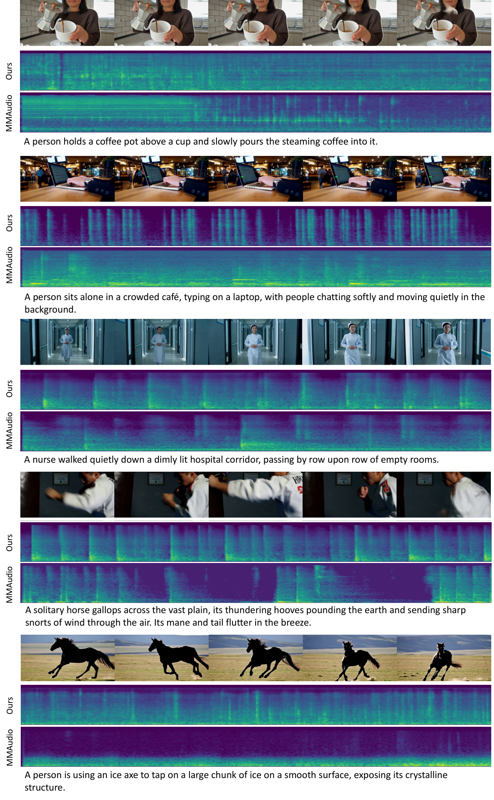

<figcaption>図33: MMAudio と我々の手法の音声生成サンプル。</figcaption>
</figure>

音声オートエンコーダ。広く採用されている音声圧縮のアプローチは、生の波形をメルスペクトログラムへ変換し、続いてそれらを画像ベースの変分オートエンコーダを用いて $H^{a}\times W^{a}\times C^{a}$ の潜在特徴へ符号化することを含む。しかしながら diffusion transformer をバックボーンとする文脈では、これらの潜在特徴はパッチへ分割され $(H^{a}\cdot W^{a})\times C^{a}$ のサイズのテンソルへ形状変更されねばならない。このパッチ化と形状変更のプロセスは、対応する動画内容との時間的整合を乱しうるため、同期にとって重大な課題となる。この制約を考慮し、我々は生の波形上で直接動作する圧縮モデルを学習する。我々の 1D-VAE は $T^{a}\times C^{a}$ のサイズの潜在特徴を生成する。ここで $T^{a}$ は時間軸に沿った系列長を表し、正確な同期に不可欠な明示的な時間情報を保存する。

動画とテキストのエンコーダ。合成される音声と視覚系列の間のフレーム精度の同期を達成するため、我々はマルチモーダルな特徴融合を通じて時間的一貫性を確立する。我々のアーキテクチャはまず CLIP モデルを用いてフレーム単位の視覚埋め込みを抽出し、次に特徴の複製を通じて音声特徴のサンプリング率に合わせるよう時間的レート適応を行う。同期された視覚特徴と音響特徴は、線形射影層を介して DiT の潜在空間に揃うよう次元変換され、続いてマルチモーダル融合のために要素単位の総和が取られる。言語をまたぐ言語的理解については、事前学習済みの umT5 モデルをテキストエンコーダとして活用し、パラメータを凍結したままその言語横断の表現能力を活かす。

データ。我々の V2A モデルの学習データは、厳密なフィルタリングのプロセスを通じて動画生成のデータセットから導かれる。サウンドトラックを欠く、あるいは発話や歌声の音楽を含む動画を体系的に除去し、その結果として $\mathcal{O}(1)$ 千時間の精錬された部分集合を得る。マルチモーダル表現を高めるため、我々は包括的なキャプション付けの戦略を用いる：密な動画記述が、Qwen2-audio によって生成される音声固有のキャプションで補完される。これら音声キャプションは環境音と音楽的構成に分類され、後者は様式・リズム・旋律・楽器編成によって特徴づけられる。最終的な構造化されたキャプションは 3 つの構成要素を統合する：(1) 密な動画記述、(2) 環境音の特徴づけ、(3) 背景音楽の分析であり、学習のための統一されたマルチモーダル表現を提供する。

実装の詳細。我々の V2A アーキテクチャは、44.1 kHz のサンプリングレートで最大 12 秒の高忠実なステレオ音声を生成する。モデルは専用のエンコーダを通じてマルチモーダル入力を処理する：umT5-XXL が 4096 次元のテキスト埋め込みを生成し、CLIP がフレームあたり 1024 次元の視覚埋め込みを抽出する。音声特徴と動画特徴は DiT バックボーン内の統一された 1536 次元の潜在空間へ射影される。時間的整合のため、入力動画をダウンサンプリングして 12 秒のクリップに対して正確に 48 フレームを生成し、視覚と音声のモダリティ間のフレーム精度の同期を確保する。システムは 1 バッチで長さ 256 の潜在系列を処理する。視覚的手がかりのみから音声を生成するモデルの能力を高めるため、学習の際に環境音と音楽のキャプションを事前定義された確率で選択的に省略するランダムマスキングの戦略を実装する。この条件付けの機構は、テキスト記述が利用可能なときにはそれを活用する柔軟性を保ちつつ、視覚的内容と対応する音声パターンの間の頑健なモダリティ横断の関連をモデルに確立させる。

#### 5.7.2 Evaluation（評価）

図 33 に音声生成の定性的評価を提供する。そこで我々の手法を、最近公開されたオープンソースのアプローチ MMAudio と比較する。MMAudio は音声生成タスクにおいて印象的な性能を示しており、我々の手法にとって最も類似し競争力のあるベースラインを表すため、この比較分析はとりわけ意味がある。動画は我々の text-to-video モデルによって 5 秒の長さで生成されている。

我々の V2A モデルは、比較結果が示すように、音声生成のいくつかの主要な側面で優れた性能を示す。具体的には、モデルは長期的な一貫性の向上を示し、これは特に「コーヒーを注ぐ」のシナリオ（図 33 の最初の事例）で顕著である。「タイピング」の 2 番目の事例では、我々のアプローチは MMAudio が生成するノイズの多い結果と比べて著しくクリーンな音声出力を生成する。さらに我々の手法は、「歩行」「ボクシング」「蹄の音」の例（図 33 の最後の 3 事例）に示されるように、リズミカルな音のパターンの合成に優れ、より自然で一貫した音声生成を達成する。

限界。我々の手法は、笑い声・泣き声・発話を含むがそれらに限らない人間の声の生成において限界を示す。この限界は主に我々のデータ準備のプロセスに帰せられる。そこでは発話に関連する声のデータが学習データセットから意図的に除外されている。MMAudio モデルがランダムな発話らしき音を生成できるのは、その学習コーパスに発話関連のデータを保持していることに由来する。今後の研究では、この限界に対処するために発話生成の能力を組み込むことを計画している。

## 6 Limitation and Conclusion（限界と結論）

限界。本研究は、複数のベンチマークにわたって注目すべき進展を達成した基盤動画生成モデル Wan を提示する。具体的には、動きの振幅（例：スポーツ、ダンス）と指示追従能力において有意な改善が観測されている。それにもかかわらずいくつかの限界が残っており、Wan のより大きな可能性を実現するにはこれらに対処せねばならない。第一に、大きな動きを伴うシナリオにおいて細粒度の細部を保つことは、我々の手法にとって、また動画生成の分野におけるより広い問題として、依然として課題である。大規模な動きのダイナミクスを伴う動画の忠実度を改善するには相当の努力が必要である。第二に、大規模モデルに伴う計算コストは依然として法外である。14B モデルの推論は現在、追加の最適化なしでは単一のハイエンド GPU 上でおよそ 30 分を要する。動画生成を普遍的にアクセス可能な AI ツールとして民主化するには、効率性とスケーラビリティのさらなる研究が不可欠である。最後に、領域固有の専門性が依然として欠けている。基盤動画モデルとして我々は Wan の一般的な能力を高めることに専心しているが、教育や医療といった特定の局所的シナリオにおける性能は不十分でありうる。我々は最新のモデルをオープンソース化し、多様な専門領域にわたるコミュニティ主導の発展を促進することによって、この限界に対処することを目指す。

結論。本レポートで我々は、動画生成の新たな基準を打ち立てる最新の動画モデル Wan を公開する。我々は Wan-VAE と DiT モデルのアーキテクチャ設計について、その学習アプローチ、データキュレーションのプロセス、評価手法、経験的結果に関する詳細な洞察を含む包括的な概観を提供する。さらに、データ前処理のパイプラインと、モデル学習を最適化するために実装された戦略的な適応を綿密に分析する。この全体的なアプローチは、動画生成の領域における進展を推進するよう設計されている。我々はまた、多様なシナリオにわたる Wan の多用途性と実践的な有用性を実証するため、image-to-video 生成、動画編集、個人化された動画生成といった下流応用も広く調査する。14B モデルのオープンソース化に加え、効率的な動画生成のために小規模なモデルを活用する実現可能性も探る。特筆すべきことに、我々の 1.3B モデルはより大きな対応物と比べて競争力のある性能を達成するだけでなく、コンシューマ級 GPU 上でのシームレスな推論も可能にし、コンテンツ制作者にとってのアクセシビリティと実用性を大きく高める。今後我々は、動画生成における最も差し迫った課題に取り組むため、データとモデルアーキテクチャの双方のスケーリングに焦点を当てる計画である。我々の継続的な取り組みは、研究コミュニティにより頑健で多用途な動画制作のツールを提供し、この急速に進化する分野における革新とより広い普及を促進することを目指す。
