# ERNIE-Image テクニカルレポート

> 原題: ERNIE-Image Technical Report
> 著者: ERNIE Team, Baidu（貢献者一覧は §6）
> 出典: arXiv:2605.25347

<figure>

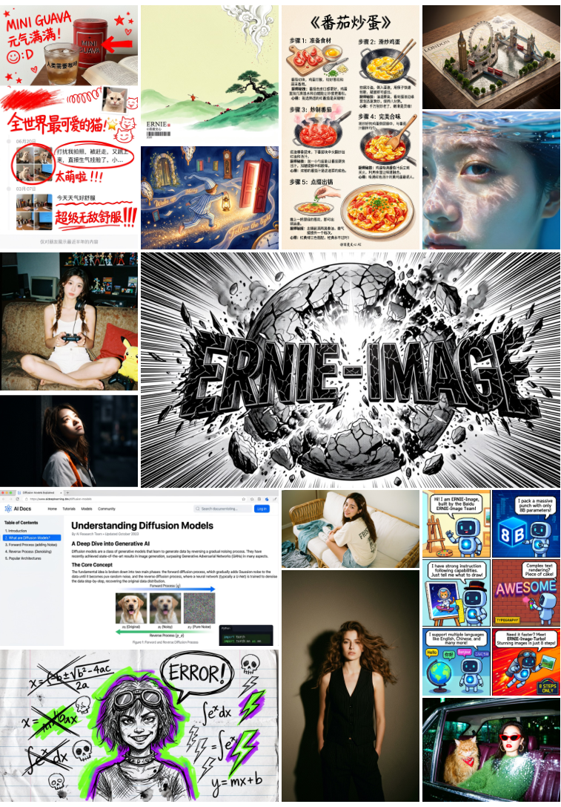

<figcaption>図1: ERNIE-Image が生成した作例。</figcaption>
</figure>

<figure>

<figcaption>図2: ERNIE-Image が生成した作例。</figcaption>
</figure>

## 1 Introduction（はじめに）

近年、text-to-image 生成は目覚ましい節目を達成し、視覚的にもっともらしい画像の生成から、自然言語のプロンプトから写実的な場面・様式化されたイラスト・デザイン志向のコンテンツを確実に合成することへと進化してきた。単なる娯楽から実用的なコンテンツ制作へ移行することにより、この技術は広く社会的な関心を集める変革的な道具となっている。しかしながら、多くの最先端モデルが現在クローズドソースの戦略を採用しているため、学術界とコミュニティは踏み込んだ研究・プライベートな展開・垂直領域への微調整を行う上で課題に直面している。現在のオープンソースの解決策はこのギャップを効果的に埋められていない。Qwen-Image や HunyuanImage といった研究が探求してきたようにパラメータ規模を増やすことは分野を前進させてきたが、素朴なスケーリングはしばしば限界収穫の逓減に直面し、より広いアクセシビリティを制限しかねない高い計算需要をもたらす。逆に、6B の Z-Image のような密で効率的な小規模モデルは有意な可能性を実証しコミュニティから強い評価を得ているが、とりわけ複雑な指示追従と中国語のテキストレンダリングにおいて、極めて困難なタスクを扱う際には依然として明確な限界を示す。

本稿において我々は ERNIE-Image を導入する。これは我々のチームの究極の目標——オープンソースで、強力で、誰にとっても使いやすいモデルを構築すること——を実現することを目指している。ERNIE-Image は、80 億パラメータの単一ストリーム DiT アーキテクチャの上に構築された潜在拡散モデル（LDM）である。我々は変分オートエンコーダとして FLUX.2 VAE を採用しており、これは高忠実な画像生成のための強力なオープンソースの潜在空間を提供する。他のオープンソースモデルと異なり、我々はテキストエンコーダとして Ministral-3（3B）を採用し、全体のメモリ消費をさらに削減して利用の障壁を下げている。実験を通じて我々は、小さいサイズのテキストエンコーダでも、効果的な条件付け空間を提供しながら長く複雑な指示入力を支えられることを見出した。

ERNIE-Image の中核的な設計目標は、現在オープンソースモデルに欠けている 3 つの基礎的能力——複雑な指示追従、テキストレンダリング、美的な画像生成——をさらに高めることである。我々は、学習の初期段階で詳細な画像記述を与えることが、モデルの複雑な指示追従能力を強化するだけでなく、その世界知識を大きく豊かにすることも観測した。この洞察に基づき、我々は領域固有のデータを意図的に合成するのではなく、事前学習データの収集の際により的を絞ったアノテーション戦略を採用する。長尾のサンプルについては、学習中のサンプル均衡を達成するために極めて細粒度の分類モデルを学習する。複雑な指示追従については、画像中に存在する構造的な記述とテキスト内容を抽出するために、強力な VLM をキャプションモデルとして微調整する。美的な選好を引き上げるため、我々は効率的なアノテーション体系を設計して頑健なモデル ERNIE-Image-Aes を学習し、それをデータのクリーニングに用いた。これらの手法はデータのノイズを実質的に減らし、膨大だが低品質な画像プールから潜在的で細粒度の情報を採掘することを可能にし、それによってモデルの豊かな実世界の概念に対する理解と保持を強化する。

事後学習の段階では、我々はトップダウンのデータ構築パイプラインを用い、需要の高いシナリオについて高度に一貫した学習データを入念にキュレートする。同時に、指示追従をさらに改善するため、SFT データのアノテーションを多様化して様々なユーザー入力の様式をカバーする。この手順は実シナリオにおけるモデルの頑健性を高め、キャプションモデルが持ち込むバイアスを緩和した。続いて、モデルを人間の美的選好によりよく整合させるため、改良した DPO を適用してモデルの分布をわずかに調整する。我々は、ベースモデルと報酬モデルの双方が十分に強力であるとき、望ましい状態に達するのに必要な DPO のステップはごくわずかであり、報酬ハッキングを最小化できることを見出した。最後に我々は ERNIE-Image-Turbo を学習する。これは画像を生成するのにわずか 8 回の関数評価（NFE）しか必要としない。データの部分集合で学習する際に生じるわずかな能力の漂流を防ぐため、我々は MT-DMD 戦略を提案する。具体的には、異なる能力を持つ複数の専門家の変種を用いて共同で教師信号を提供し、モデルの最終的な最適性能を確保する。

もう 1 つの目標は、ユーザーがモデルの複雑な指示追従能力を容易に享受できるようにすることである。この目的のため、我々はモデルに軽量なプロンプトエンハンサを装備し、生成に先立って簡潔なユーザーの意図をより豊かで構造化された視覚的記述へ展開する。この設計は ERNIE-Image が物体の属性・空間関係・場面の構成・テキスト内容・様式的意図をよりよく扱うのを助ける。その結果、モデルは高い視覚品質を保ちながらユーザーの実際のニーズを満たせる。

全体として、ERNIE-Image は強力なオープンソースの text-to-image モデルであると同時に、実践的な産業向けの解決策としても機能する。その主要な貢献を以下に要約する。

- 強い指示追従と最先端のテキストレンダリング。我々のモデルは多様で複雑なユーザー要求に従いつつ長文テキストをレンダリングでき、それによって商業ポスターや広告デザインといった実世界の制作シナリオにおける実用的価値を示す。
- 産業級の美的モデルと高い美的品質。ERNIE-Image-Aes は現在最先端の美的モデルであり、美的品質を極めて現実に即した形で反映できる。これに基づき、我々のモデルは高度に写実的な写真を生成し、異なるフィルム・照明条件・色調を模倣できる。
- コミュニティへのオープンソース化。我々は ERNIE-Image、ERNIE-Image-Turbo、プロンプトエンハンサ、ERNIE-Image-Aes を含む、学習したすべてのモデルの重みを公開する。また、開かれた学術研究とコミュニティにおける技術的進歩を促進するため、入念に人手でアノテートされた美的ベンチマーク ERIA-1K も公開する。

4 節において、広範な定性的実験と比較が ERNIE-Image の進展を実証する。図 1 と図 2 は、多様なシナリオにわたって写実的かつデザイン志向のコンテンツを生成する能力を示す。さらに表 3、表 5、表 6、表 7 は、我々のモデルが最上位のクローズドソース商用モデルの性能に迫っていることを示している。これは、我々の簡潔なデータと学習の戦略が従来のモデルサイズの限界を突破できることを証明し、将来の技術的反復に対する新しい道筋を提供する。我々は研究者と開発者コミュニティによるさらなる探求と最適化を促進するため、モデルの重みと美的データセットを公開する。

## 2 Model Training（モデルの学習）

### 2.1 Pre-training（事前学習）

##### データ。

ERNIE-Image では、大規模な事前学習のためにボトムアップのデータ構築とサンプリングの戦略を採用する。あらかじめ定義されたデータ層の上で動作するトップダウンの再サンプリングのパイプラインと異なり、我々のパイプラインは内部のデータプールから収集された膨大な生の画像コーパスから始まり、細粒度の分類・キャプションの充実・美的スコアリング・階層的サンプリングを通じて漸進的に構造を課していく。この設計は、カテゴリの不均衡とサンプル品質に対するより精密な制御を提供しつつ、より広い意味的カバレッジを可能にする。

我々はまず、各画像を 10,000 の細粒度の視覚カテゴリの 1 つに割り当てる画像分類モデルを学習する。この分類の手順はコーパス全体のスケーラブルな意味的分割を提供し、後続の段階におけるデータ均衡化の基礎として機能する。粗粒度のサンプリングと比べ、このような細粒度の分類体系は長尾の概念をよりよく保存し、支配的な視覚カテゴリが事前学習の分布を圧倒することを防ぐ。

次に我々は、視覚言語モデル（VLM）を用いてすべての画像にキャプションを生成する。一般的な視覚的記述に加えて、我々は**画像内部に現れるテキスト内容を忠実に認識し記述すること**に特に重点を置く。これは、スライド・説明図・ポスター・インターフェースのスクリーンショット・文書形式の画像といったテキストが豊富で知識中心のサンプルにおいて特に重要である。そこではテキストの欠落や不正確さが、学習の際の画像とテキストの整合を実質的に弱めうる。

続いて、我々の美的評価モデルである ERNIE-Image-Aes を用いてすべての画像に美的スコアを割り当てる。結果として得られる美的スコアは、大規模なフィルタリングとサンプリングのための統一された品質信号として用いられる。ヒューリスティックな規則のみに頼るのではなく、この学習された品質推定により、広い意味的多様性を保ちながら、視覚的によりクリーンで情報量が多く視覚的に魅力的なサンプルを優先できる。

カテゴリラベルと美的スコアに基づき、我々は 2 段階の階層的データサンプリングを行う。カテゴリ間の水準では、各カテゴリのサンプリング重みが、そのコーパスの規模と集約された美的品質の双方を同時に考慮して決定される。この設計は高頻度のカテゴリが学習分布を支配することを防ぎつつ、一貫して視覚品質の強いカテゴリにより多くの確率質量を割り当てる。カテゴリ内の水準では、個々の画像がその美的スコアに従ってサンプリングされ、より高品質な事例が学習中により頻繁に提示される。これらを組み合わせることで、この階層的サンプリングの戦略は意味的な均衡とサンプル品質の双方を改善し、高忠実で知識を意識した画像生成という目標によりよく整合した事前学習コーパスをもたらす。

##### 学習戦略。

我々は解像度を漸進的に上げる 3 段階の学習戦略を採用する。第 1 段階では $256\times 256$ でモデルを学習する。第 2 段階では $512\times 512$ で学習を継続する。最終段階では学習解像度をさらに $1024\times 1024$ へスケールさせる。すべての段階において、モデルを正方形の画像のみに制限せず、多様なアスペクト比で学習する。この多段階・多アスペクト比のカリキュラムは、初期段階における最適化の効率を改善しつつ、柔軟な構図とレイアウトを伴うより高解像度の画像を生成するモデルの能力を保持する。

### 2.2 Post-training（事後学習）

#### 2.2.1 Supervised Fine-Tuning (SFT)（教師ありファインチューニング）

大規模な事前学習に続き、我々は実世界のユーザーシナリオにとって特に重要な領域における生成品質と指示の整合をさらに改善するため、教師ありファインチューニング（SFT）を行う。事前学習で用いたボトムアップの戦略とは対照的に、SFT の段階では**トップダウン**のデータ構築のパイプラインを採用する。まず優先領域の集合を特定し、次にそれぞれについて高品質で高い一貫性を持つ学習データを意図的にキュレートする。現在の我々の焦点には、ポスターデザイン、ゲームのスクリーンショット、人物写真、物撮り、アニメ様式のコンテンツ、その他の需要の高い視覚カテゴリが含まれる。

各対象領域について、我々は視覚品質と様式の一貫性の双方を重視してデータを収集する。これが重要なのは、事後学習が全体の忠実度を改善するだけでなく、構図・レンダリング様式・被写体の提示・領域固有の慣習に対するモデルの制御を鋭くすることも期待されているからである。したがって、広範な事前学習データと比べ、SFT コーパスはより選択的であり、望ましい生成の挙動により固く整合している。

我々は SFT コーパスのすべての画像に対し、視覚言語モデル（VLM）を用いてキャプションを生成する。これらのキャプションは画像の内容・場面のレイアウト・物体の属性・可視のテキストについて構造化された教師信号を提供する。高品質なキャプション付けは事後学習において特に価値がある。そこでの目的は単なる一般的な画像-テキストの一致ではなく、対象となる生成領域におけるより精密な挙動の整合だからである。

実際のユーザー入力によりよく合わせるため、我々はさらにより大きな VLM である *K2.5* を用いて、元のキャプションを書き換え、多様なプロンプトの集合へダウンサンプリングする。具体的には、各画像について、キャプションを様式・粒度・長さに相当な変化を持つ複数のユーザー向けの形式へ変換する。これら書き換えられたプロンプトには、短いキーワード様式の記述、自然言語の要求、指示的なプロンプト、そしてより詳細な構成の仕様が含まれる。このプロンプトの多様化の手順は、多種多様なユーザーの表現に対する頑健性を改善し、合成された学習キャプションと実世界のプロンプティングの振る舞いの間のずれを減らす。

#### 2.2.2 Direct Preference Optimization (DPO)（直接選好最適化）

ERNIE-Image を人間の美的選好にさらに整合させるため、我々は Direct Preference Optimization（DPO）による強化学習を行う。高品質な人手アノテーション付きデータを活用することにより、我々の枠組みにおける DPO は、選好されたペアと拒否されたペアの間の暗黙の選好マージンを最大化することによって方策を直接最適化する。

##### Flow Matching における直接選好最適化

Flow Matching（FM）の文脈において、DPO の目的関数は速度場の観点から再定式化される。先行研究に着想を得て、我々は DPO の目的関数を次のように構成する：プロンプトの隠れ状態 $h$、勝利画像 $x_{0}^{win}$、敗北画像 $x_{0}^{lose}$ が与えられたとき、予測された速度 $v_{\theta}$ の L2 再構成誤差に基づいて暗黙の報酬を定義する。方策モデル $\theta$ と凍結された参照モデル $\mathrm{ref}$ についての選好ギャップは以下のように定義される。

$$
\displaystyle\text{Diff}_{\mathrm{policy}}
$$

$$
\displaystyle=\|v_{\mathrm{pol}}(x_{t}^{win},h,t)-v_{t}^{win}\|_{2}^{2}-\|v_{\mathrm{pol}}(x_{t}^{lose},h,t)-v_{t}^{lose}\|_{2}^{2}
$$

$$
\displaystyle\text{Diff}_{\mathrm{ref}}
$$

$$
\displaystyle=\|v_{\mathrm{ref}}(x_{t}^{win},h,t)-v_{t}^{win}\|_{2}^{2}-\|v_{\mathrm{ref}}(x_{t}^{lose},h,t)-v_{t}^{lose}\|_{2}^{2}
$$

DPO の目的関数は次に、これらのマージンの間の相対的なギャップを最大化するよう定式化される。

$$
\mathcal{L}_{\mathrm{DPO}}=-\mathbb{E}[\log\sigma(-\beta(\text{Diff}_{\mathrm{policy}}-\text{Diff}_{\mathrm{ref}}))]
$$

ここで $\text{Diff}_{\mathrm{policy}}$ と $\text{Diff}_{\mathrm{ref}}$ は、それぞれのモデルについて勝利サンプルと敗北サンプルの間の $L_{2}$ 再構成誤差の差を特徴づけ、$\beta$ はスケーリングのパラメータ、$\sigma(\cdot)$ はシグモイド関数である。

##### Anchor Loss による安定化

素朴な DPO を DiT モデルに適用する際の重大な課題は**報酬ハッキング**であり、そこではモデルが L2 損失の非有界な性質を悪用して、拒否サンプルの誤差の尺度を過剰に増大させる。これはしばしば表現の崩壊につながる。これを緩和するため、我々はモデルの基礎的な生成能力を接地させる正則化の機構として **Anchor Loss** を導入する。

$$
\mathcal{L}_{\mathrm{total}}=\mathcal{L}_{\mathrm{DPO}}+\lambda_{win}\mathbb{E}[\ell_{\mathrm{policy}}^{win}]+\lambda_{lose}\mathbb{E}[\ell_{\mathrm{policy}}^{lose}]
$$

ここで $\ell=\|v_{\theta}(x_{t},h,t)-v_{t}\|_{2}^{2}$ であり、我々は $\beta=0.05$、anchor の重みを $\lambda_{win}=0.35$、$\lambda_{lose}=0.15$ と設定する。

#### 2.2.3 Multi-Teacher Distribution Matching Distillation (MT-DMD)（多教師分布マッチング蒸留）

##### DMD から DMDR へ

Distribution Matching Distillation（DMD）は、反復的な拡散のプロセスを高効率な少ステップの生成器へ圧縮する支配的なパラダイムとして現れてきた。Decoupled DMD のような現代的な反復は、勾配の干渉を緩和するために最適化を 2 つの直交する目的関数へ明示的に分岐させる：教師の誘導された経路との軌道の整合を強制する **Classifier-Free Guidance Augmentation（CA）** と、生成された分布と経験的なデータ分布の間の乖離を最小化する **Distribution Matching（DM）** である。この敵対的に似た地形を安定化させるため、DMD2 は分離された比率更新の機構——生成器の 1 回の更新ごとにスコアモデルの更新を 5 回実行する——を導入した。

これらの基礎の上に構築し、DMDR は強化学習（RL）の原理と動的なガイダンスの機構を統合することにより、蒸留のプロセスをさらに強化した。初期の最適化多様体を安定化させるため、DMDR は教師スコアモデルに対して動的でステップを意識した Low-Rank Adaptation（LoRA）のスケーリングを用いる。実経路のガイダンス強度 $\alpha_{real}(t)$ は、動的な地平 $T_{dynamic}$ にわたるコサインスケジュールで変調される。

$$
\alpha_{real}(t)=\frac{\alpha_{init}}{2}\left[1+\cos\left(\frac{\pi\min(t,T_{dynamic})}{T_{dynamic}}\right)\right]
$$

##### 能力の漂流というボトルネック

DMDR が導入した系統的な安定性と RL 駆動の精錬にもかかわらず、これらの一枚岩のパラダイムは、高度に異種混合のデータセットを処理する際、本質的に**能力の漂流（Capability Drift）** に陥りやすいままである。単独の教師は、動的な LoRA ガイダンスと報酬信号で増強されていてさえ、多様な意味的領域にわたって一様に最適な教師信号を提供することにしばしば苦戦する。この根本的な限界は、専門化された生成の部分空間（例：判読可能なタイポグラフィのレンダリングや、様式化された美しさの維持）における最適でない収束につながる。

##### 全粒度の多教師教師信号

これらのボトルネックを無効化するため、我々は **Multi-Teacher Distribution Matching Distillation（MT-DMD）** を提案する。我々は専門家教師の委員会 $\mathcal{E}=\{E_{1},E_{2},\dots,E_{K}\}$ を編成する。各々はタイポグラフィ生成（Text-Rendering Expert）、美的な様式化（Digital Art Expert）、あるいはマクロな構図の調和といった、異なる領域の熟達度に対して暗黙的に最適化されている。アンサンブルされたノイズ除去後の予測 $\hat{x}_{0}$ は、一般化された動的ルーティング多様体 $\mathcal{W}$ を介して次のように定式化される。

$$
\hat{x}_{0}=\sum_{k=1}^{K}\mathcal{W}_{k}(x_{t},\sigma,c,\mathcal{O})\cdot E_{k}(x_{t},\sigma,c)
$$

ここでゲーティング確率 $\mathcal{W}_{k}\in[0,1]$ は、ノイズ付き潜在 $x_{t}$、ノイズ尺度 $\sigma$、意味的条件 $c$、そして特定の最適化目的 $\mathcal{O}\in\{CA,DM\}$ の同時状態空間に適応する。

サンプルの領域と拡散のタイムステップを孤立した基準として扱うのではなく、我々の MT ルーティング多様体は統一された高次元の多重化の戦略を編成する。大域的に様式化された文脈の内部に入り組んだ局所構造を要求する複雑な意味的プロンプト（$c$）で条件付けられたとき、この多様体は最も適合する領域専門家から動的に教師信号の勾配を合成する。この定式化は、単一の学習インスタンスの内部で**非対称な勾配のトポロジー**を可能にする：DM のペナルティは Digital Art Expert に問い合わせることによって大域的な様式の一貫性を強制でき、その一方で CA の制約は専門化された意味の専門家（例：Text-Rendering）を介して局所的な綴りや解剖学的な忠実さを独立に最適化する。さらにゲーティングの機構は、拡散の軌道に沿って**シームレスな専門家の引き継ぎ**を実行する——高ノイズの水準では Spatial Layout の専門家によってマクロな構図を確立し、低ノイズの局面では高周波のレンダリングの専門家（例：写実的な照明や材質のテクスチャの専門家）へ移行する。この全粒度のパラダイムは、単独の託宣者が持つ能力のボトルネックを実効的に除去し、生徒に最先端の生成的な多用途性を与える。

## 3 Aesthetic Scoring（美的スコアリング）

### 3.1 Swiss-Tournament Based Annotation Method（スイス式トーナメントに基づくアノテーション手法）

大規模な画像データセットの正確な美的評価は、text-to-image 生成のための高品質な学習コーパスを構築する前提条件である。既製の美的予測器はいくつか存在するが、我々はそれらが系統的なバイアスを示し、我々の設定における有用性を制限することを見出した。LAION-Aesthetic は AI 生成コンテンツに不釣り合いに高いスコアを割り当てる傾向があり、これはその学習データの分布を反映している。ArtiMuse と UniPercept は、より強い一般的性能を持つにもかかわらず、多様な画像種別にわたる汎化の乏しさに苦しむ。例えば我々は、ArtiMuse が日常的な活動の飾らない写真——公園で撮られた素人の集団ダンス写真や、大半の人間の評価者が美的に傑出しているとは考えないであろう白黒写真など——に一貫して高い美的スコアを割り当てることを観測している。これらの失敗のモードが、我々のデータ分布と品質目標に合わせて専用に構築された美的スコアリングモデルの構築を動機づける。

データ収集。汎化を最大化し分布のバイアスを最小化するため、我々は事前学習コーパスから、テキストが支配的な画像・AI 生成コンテンツ・製品写真・アニメイラスト・専門的な写真・日常のスナップショットなどにまたがる明示的なカテゴリの均衡をもってアノテーションの候補をサンプリングする。これにより、結果として得られるモデルが限られた領域に不用意に較正されることがないよう保証される。

アノテーションの方法論。美的アノテーションに関する先行研究は 2 つの広いパラダイムに分かれる。しばしば Likert 尺度のスコアリングとして実装される**絶対評価**の手法では、アノテータが各画像に独立に数値的な評点（例：1〜10）を割り当てる。**ペアワイズ比較**では、アノテータが 2 枚の画像のどちらがより美的に心地よいかを判断する。絶対評価は直感的で効率的だが、**スコアドリフト**——アノテータの暗黙の基準点が時間とともに移動し、単一のセッション内でさえ初期と後期のアノテーションが不整合になる現象——を被りやすい。ペアワイズ比較は、各判断を局所的に接地された二値の決定へ還元することによってこの問題を回避し、より安定して再現可能なラベルをもたらす。したがって我々はペアワイズのパラダイムを採用する。

<figure>

<figcaption>図3: アノテーションのインターフェースのスクリーンショット。2 枚の画像の上には、このセッションのラベル付けの規則をアノテータに思い出させる一行のテキストがある：「基準はただ一つです：どちらがより美的に心地よく見えると思いますか？」</figcaption>
</figure>

<figure>

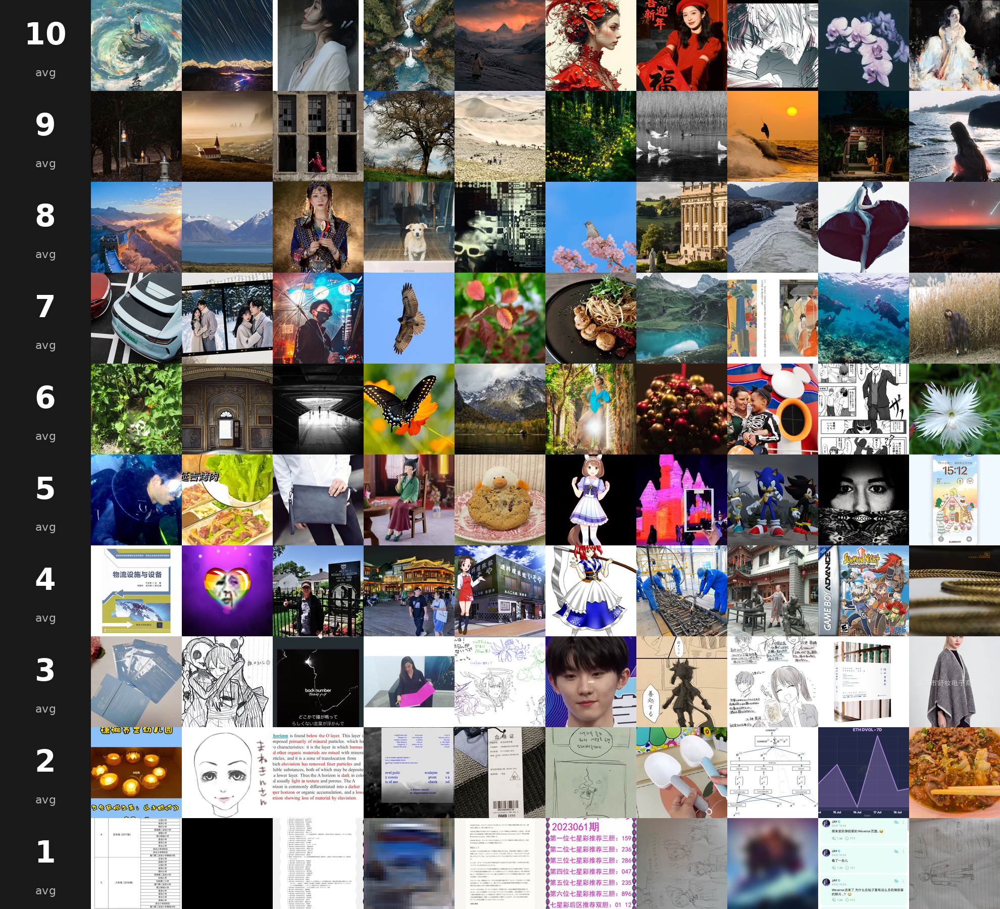

<figcaption>図4: 美的アノテーションの結果のプレビュー。</figcaption>
</figure>

トーナメントの設計。ペアワイズの枠組みの内部で、我々は 2 つの候補プロトコルを評価する。第一は **ELO ベースのレーティングシステム**であり、そこでは各比較が標準的な ELO 更新規則に従って両方の画像のスコアを更新する。理論的には十分に裏付けられているものの、我々は ELO が安定したランキングを生成するのに画像あたり法外に多くの比較を要し、我々のアノテーションの規模では非実用的であることを見出した。第二のプロトコル——我々が採用するもの——は、ゲーム（例：League of Legends のランクマッチング）における利用に着想を得た**スイス式トーナメント**である。スイス式では、図 3 に示すように各ラウンドで現在の順位によって画像が組み合わされ、推定品質が近い画像どうしの比較に集中させることで、大幅に少ない総比較数で信頼できるランキングを可能にする。

アノテーションの品質管理。アノテーションのプロセスの中で、我々はラベル品質に実質的な影響を与える 2 つの決定的な要因を特定した。第一に、アノテータは参加前に**美的較正テスト**に合格せねばならない。我々は美的感度が個人によって相当に異なり、訓練だけでは確実には改善できないことを見出しており、そのため選抜が必要な前提条件となる。第二に、我々は**単一のスイス式トーナメントの内部で複数のアノテータが同じ画像プールを共同でアノテートすると不整合な結果が生じる**ことを見出した。異なるアノテータの暗黙の基準が互いに干渉するためである。代わりに、各アノテータが指定された画像の部分集合について完全なトーナメントを独立に完走する。異なるアノテータからのラベルは、単一のトーナメント内で併合されるのではなく、後にデータセットの水準で集約される。

### 3.2 ERIA-1K Benchmark（ERIA-1K ベンチマーク）

既存の美的ベンチマークは、しばしば Flickr や DPChallenge といったプラットフォームから収集された、キュレートされた高い制作価値を持つ画像コレクションから主に構築されている。これらのデータセットは専門的あるいは準専門的な写真コミュニティ、西洋の写真の伝統、そして視覚的に洗練されたコンテンツへ偏る傾向があり、したがって実世界の展開で遭遇する画像の多様性を十分に反映していない。その結果、そのようなベンチマークで強い性能を達成するモデルであっても、日常のスナップショット・白黒画像・AI 生成コンテンツ・その他の過小に表現された視覚領域では依然として系統的なバイアスを示しうる。

このギャップに対処するため、我々は **ERIA-1K ベンチマーク**（ERNIE-Image-Aes-1K）を導入する。これは現実的な画像分布を反映し、より展開志向の評価プロトコルを提供するよう設計された、オープンソースの人手アノテーション付き美的ベンチマークである。

このベンチマークは 6 つのカテゴリにまたがる 1,000 枚の画像から成り、その比率は専門的に制作されたコンテンツを過剰に表現するのではなく、実世界の分布に近似するよう較正されている。表 1 に示すように、写真が最大の部分（約 49%）を構成しており、これは実世界の画像コーパスにおけるその支配性を反映している。フィルム写真の部分集合は、高品質なフィルムの美的基準を提供するためにキュレートされている。

**表1**: ERIA-1K ベンチマークのカテゴリ分布。

| カテゴリ | % |
| --- | --- |
| 写真 | 49.28 |
| イラスト／アニメ | 23.16 |
| グラフィックデザイン／ポスター | 11.14 |
| 混合的な Web 画像 | 10.44 |
| フィルム写真 | 5.42 |
| 製品／コレクタブル | 0.56 |

すべてのアノテーションはペアワイズのスイス式プロトコルを用いて生成され、1 から 10 の階層ラベルをもたらす。アノテータは美術・デザイン・写真の専門的背景を持つ者から募集され、中央美術学院、四川美術学院、中国伝媒大学、およびいくつかの国際的なプログラムを含む機関にまたがる。すべてのアノテータは参加に先立ち、3.1 節で述べた較正の選抜に合格している。この設計により、ERIA-1K は美的スコアリングモデルの汎化能力と実践的な頑健性を評価するための高品質な held-out ベンチマークとして機能できる。

### 3.3 ERNIE-Image-Aes Evaluation（ERNIE-Image-Aes の評価）

実装の詳細。我々の美的スコアリングモデルは 8B の視覚言語モデルである ArtiMuse から初期化され、内部でアノテートされたデータセットで微調整される。我々は入念な人手アノテーションを通じて美的スコアリングのデータセットを構築し、2 つの軸に沿った多様性を確保する。第一は美的品質の事前分布であり、第二は画像内容のカテゴリの分布——商業写真、フィルム写真、日常のスナップショット、アニメイラスト、デザイングラフィック、ポスターなどを含む——である。我々は**学習データの多様性が汎化にとって決定的である**ことを見出した。より狭い分布で学習されたモデルは、分布外の画像カテゴリへ一貫して汎化に失敗する。

評価プロトコル。我々は主要な評価を、3.2 節で導入した held-out ベンチマークである ERIA-1K の上で実施する。ERIA-1K は現実的な画像分布を反映するよう設計され、較正された専門的アノテータによってアノテートされているため、従来のキュレートされた美的ベンチマークよりも展開志向の評価設定を提供する。したがって我々はこれを ERNIE-Image-Aes の能力を評価するためのベンチマークとして用いる。

**表2**: ERIA-1K ベンチマークにおける美的スコアリングモデルの比較。

| Model | SRCC | PLCC |
| --- | --- | --- |
| LAION AES | 0.2944 | 0.3138 |
| ArtiMuse | 0.4277 | 0.4704 |
| UniPercept | 0.4533 | 0.4748 |
| ERNIE-Image-Aes | 0.7445 | 0.7598 |

結果。表 2 に示すように、ERNIE-Image-Aes は Spearman の順位相関係数（SRCC）と Pearson の線形相関係数（PLCC）の双方において既存のすべてのモデルを実質的に上回り、それぞれ 0.7445 と 0.7598 を達成している。これは次点のモデル UniPercept の 0.4553 および 0.4748 と比べたものである。

> 図5: 各バープロットは、対応する美的モデルが我々の内部データセット上で予測したスコアの確率密度を示し、低いスコアが左に、高いスコアが右にある。ダイヤ形のマーカーは、現在の画像の予測スコアがこの分布のどこに位置するかを示す。各バーの下には、モデル名・予測スコア・データセット全体における画像のパーセンタイル順位を報告する。例えば「Top 6.4%」は、その画像が美的品質の点で全サンプルの 93.6% より高いスコアを得ていることを意味する。（訳注: ar5iv・arXiv HTML のいずれにおいても、本図の 4 種のバープロットは 9 パネル全体で同一の SVG ファイルが重複参照される形に変換されており、**パネルごとの予測スコアとマーカー位置は失われている**。本文が「image 6」「images 4 and 8」等と番号で参照している標本画像 9 枚のみ、文書順で以下に掲げる）

<figure>

<figcaption>図5 の image 1（訳注により補完）</figcaption>
</figure>

<figure>

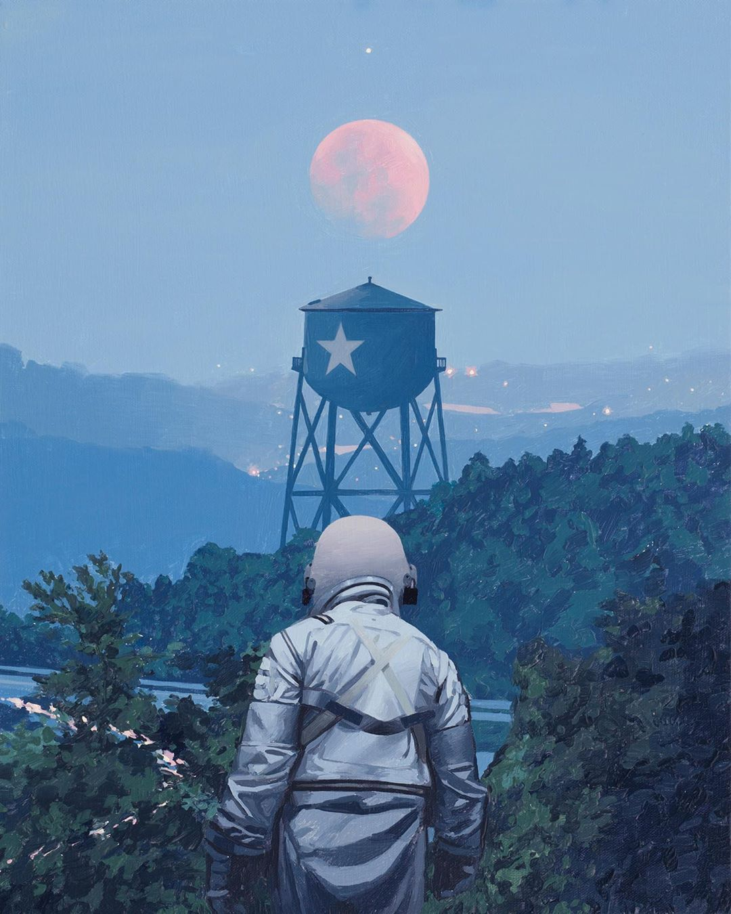

<figcaption>図5 の image 2（訳注により補完）</figcaption>
</figure>

<figure>

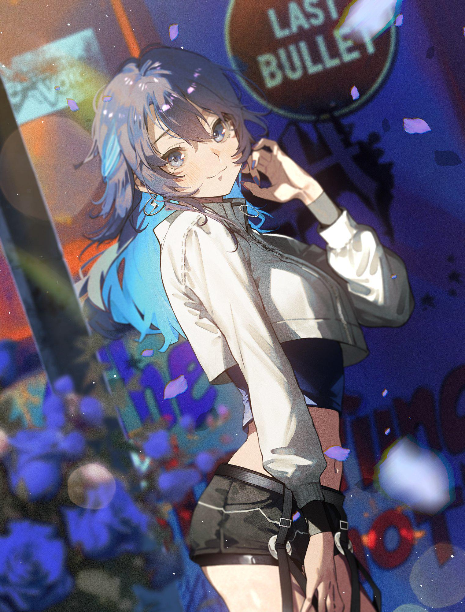

<figcaption>図5 の image 3（訳注により補完）</figcaption>
</figure>

<figure>

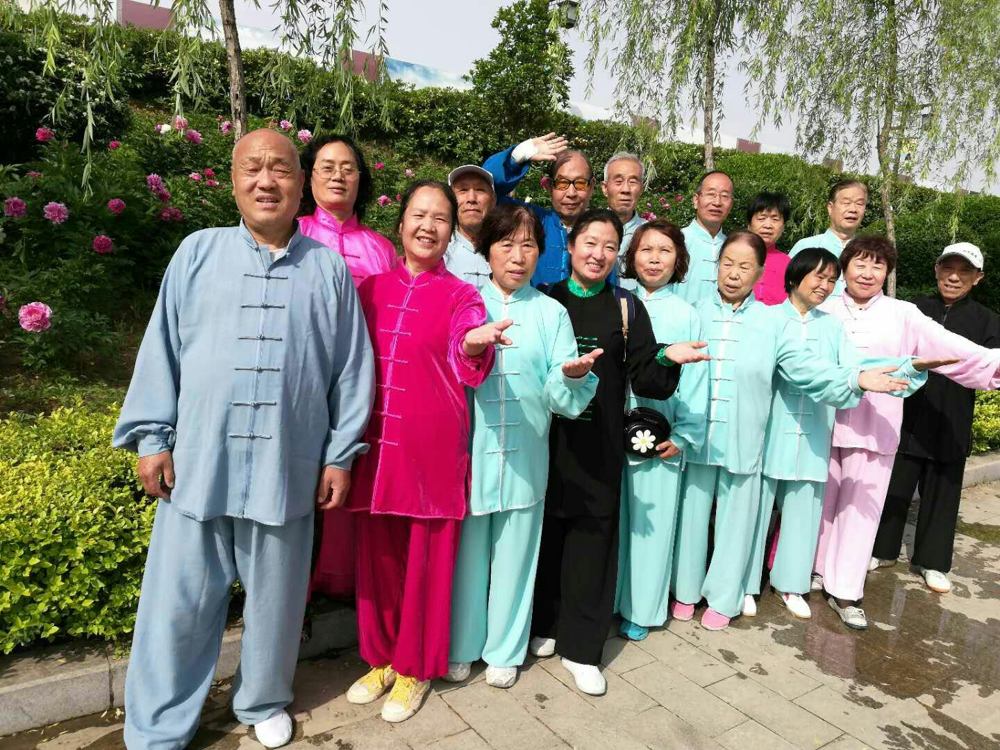

<figcaption>図5 の image 4（訳注により補完）</figcaption>
</figure>

<figure>

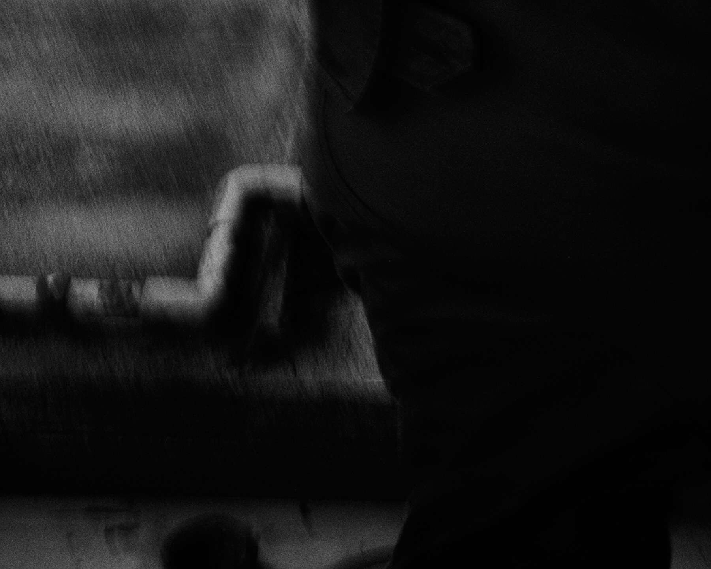

<figcaption>図5 の image 5（訳注により補完）</figcaption>
</figure>

<figure>

<figcaption>図5 の image 6（訳注により補完）</figcaption>
</figure>

<figure>

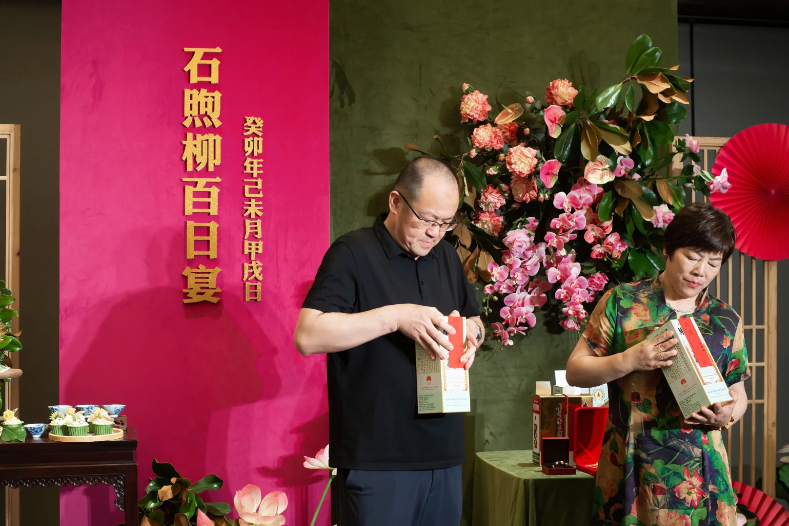

<figcaption>図5 の image 7（訳注により補完）</figcaption>
</figure>

<figure>

<figcaption>図5 の image 8（訳注により補完）</figcaption>
</figure>

<figure>

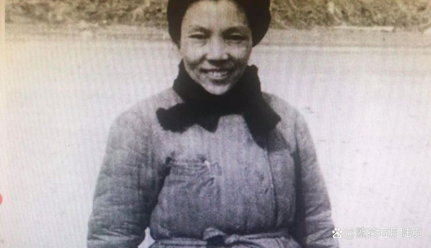

<figcaption>図5 の image 9（訳注により補完）</figcaption>
</figure>

既製の美的予測器のバイアス。既存の美的予測器の特徴的なバイアスを明るみに出すため、我々は写真・カジュアルなスナップショット・白黒画像・アニメにまたがる代表的な画像の集合をキュレートし、そのスコアを図 5 で可視化する。結果は各予測器に特徴的なバイアスを明らかにする。

LAION-Aesthetic はアニメ（image 6）とカジュアルなスナップショット（images 4 と 8）に不釣り合いに高いスコアを割り当てる。その学習データが AI 生成コンテンツのコミュニティに由来することを考えれば、非写真的な素材へのこのバイアスは驚くべきことではない。

ArtiMuse と UniPercept はどちらも**白黒写真への強い選好**を示し、最上位のスコアを得る予測がモノクロ画像（images 5 と 9）に支配される。UniPercept はさらにカジュアルな日常のスナップショット（image 7）を過大評価する。

対照的に ERNIE-Image-Aes は、画像カテゴリにわたってよく分布した予測を生成し、専門的な写真・高品質なアニメイラスト・フィルム様式の画像に高いスコアを割り当てつつ、低品質なスナップショットのスコアを適切に抑制する。このより均衡の取れた挙動は、表 2 で報告したより高い SRCC と PLCC の値と整合的であり、我々のアノテーションのパイプラインの意図的な多様性を反映している。

## 4 Performance（性能）

### 4.1 Prompt Enhancement Comparison（プロンプト拡張の比較）

ERNIE-Image は、長く詳細で構造の整ったプロンプトを条件としたときに最も良い性能を発揮する。より豊かなプロンプトは通常、より強い指示忠実度、構造化されたレイアウトのより完全なレンダリング、そして物語やテキストの細部のより良い保存につながる。しかしながら実践では、ユーザーの入力はしばしば短く不特定である。このギャップを埋めるため、我々は ERNIE-Image に組み込みの軽量な**プロンプトエンハンサ（PE）** を装備する。これは簡潔なユーザーの要求を、根底にあるユーザーの意図を変えることなく、より詳細で構造化された記述へ展開する。

我々の観察は、プロンプト拡張が**潜在的な知識の注入**や**明示的な構造の計画**を要するタスクにとって特に重要であることを示している。図 6 は 3 つの代表的なシナリオにおけるこの効果を図解する：ホワイトボード上の数学問題を解くこと、HD-2D RPG のスクリーンショット生成、そして Web ページのレイアウト生成である。プロンプト拡張がない場合、モデルはしばしばプロンプトに文字通り従うが、それは表層的な水準にとどまる。要求された主題は存在するが、決定的な構造が欠けている。これは数学的な場面における不完全な推論の痕跡、RPG スクリーンショットにおける弱いゲームインターフェースの意味論、あるいは Web ページ風のレイアウトにおける判読不能で低忠実なテキストとして現れることが多い。

我々の 3B プロンプトエンハンサを適用した後、生成されるプロンプトはレイアウト・構図・テキスト内容・場面の構造についてより明示的になる。その結果、3 つのシナリオすべてにわたって出力が顕著に改善される。ホワイトボードの問題はより明確な段階的導出を示し、RPG スクリーンショットは適切な HUD 要素とより強いジャンルの同一性を獲得し、Web ページの生成は実質的により判読可能で機能的になる。これらの例は、比較的軽量なプロンプト書き換えのモデルが既に、構造化された画像生成に対して実践的で信頼できる利得を提供することを示唆している。

<figure>

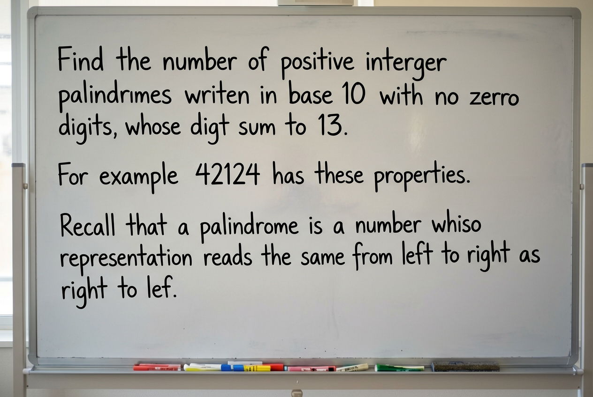

<figcaption>図6（1/9）: 数学問題（PE なし）。</figcaption>
</figure>

<figure>

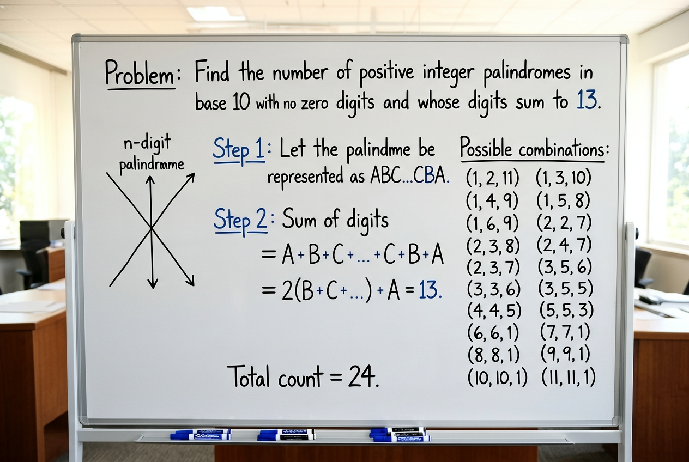

<figcaption>図6（2/9）: 数学問題（3B PE あり）。</figcaption>
</figure>

<figure>

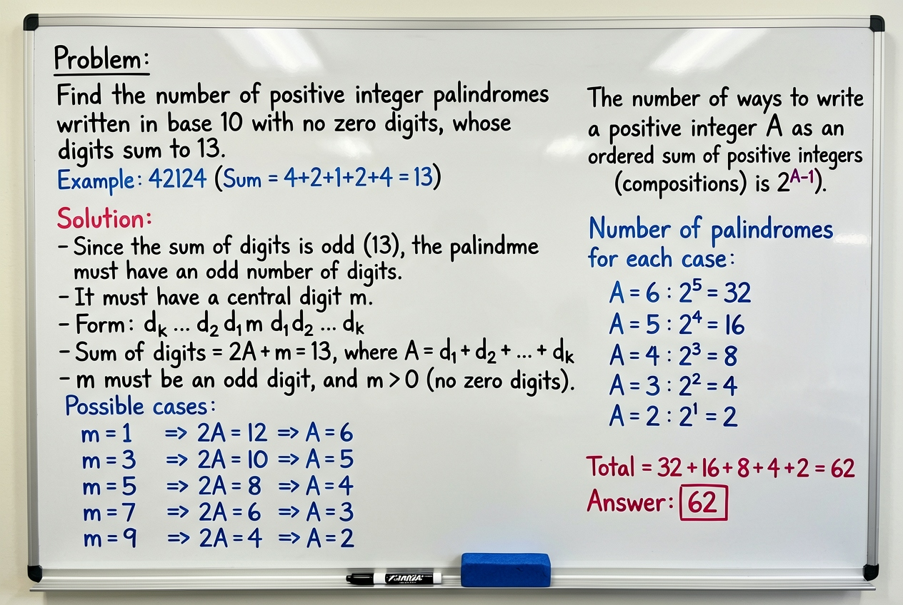

<figcaption>図6（3/9）: 数学問題（より大きな LM の PE あり）。</figcaption>
</figure>

<figure>

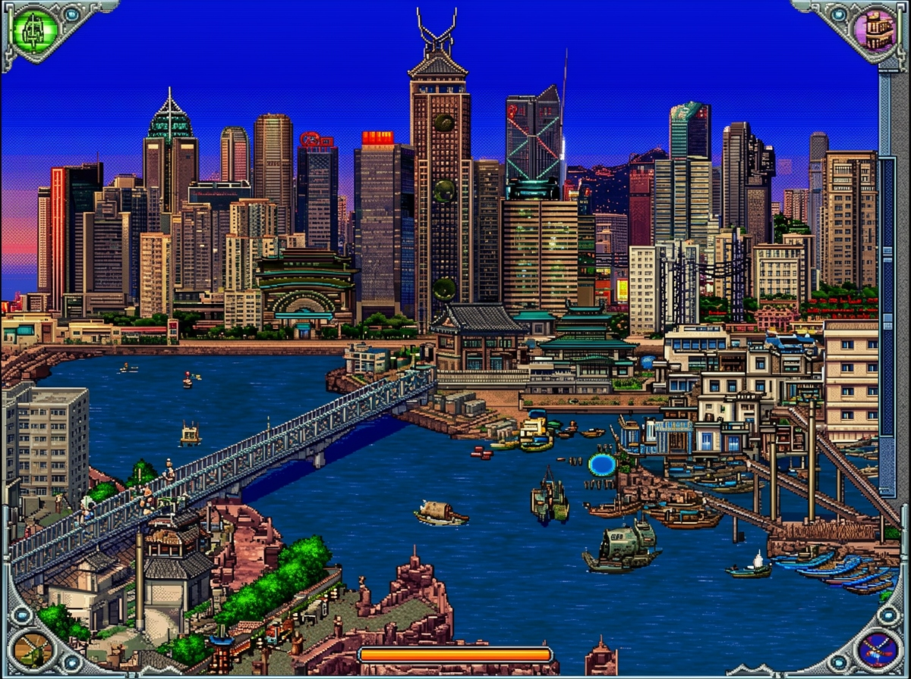

<figcaption>図6（4/9）: RPG スクリーンショット（PE なし）。</figcaption>
</figure>

<figure>

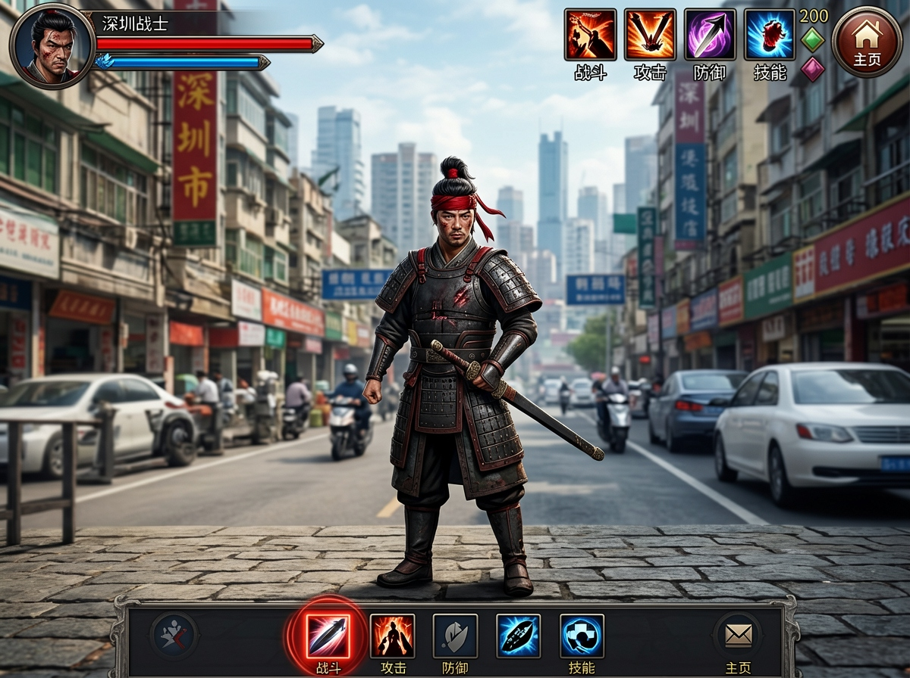

<figcaption>図6（5/9）: RPG スクリーンショット（3B PE あり）。</figcaption>
</figure>

<figure>

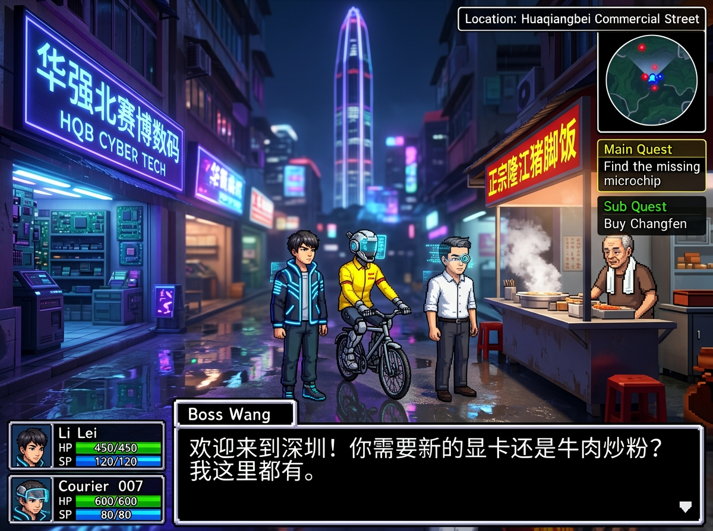

<figcaption>図6（6/9）: RPG スクリーンショット（より大きな LM の PE あり）。</figcaption>
</figure>

<figure>

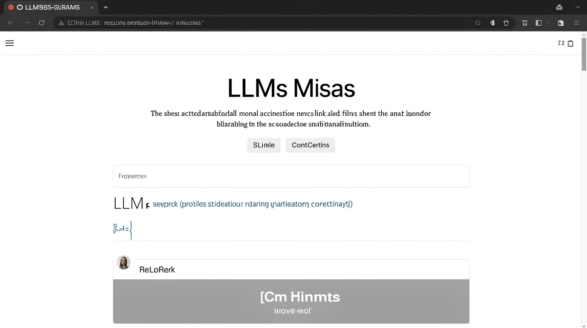

<figcaption>図6（7/9）: Web ページのレイアウト（PE なし）。</figcaption>
</figure>

<figure>

<figcaption>図6（8/9）: Web ページのレイアウト（3B PE あり）。</figcaption>
</figure>

<figure>

<figcaption>図6（9/9）: Web ページのレイアウト（より大きな LM の PE あり）。原キャプション「図6: 3 つの代表的なタスクにおけるプロンプト拡張の定性的比較。左から右へ：プロンプト拡張なしの直接生成、我々の 3B プロンプトエンハンサによる生成、より大きな LM の PE による生成。プロンプト拡張は構造的な完全性・テキストの忠実度・タスク固有の写実性を一貫して改善し、より大きな LM の PE はより強い推論やより豊かな世界知識を要するタスクでさらに助けとなる。」（訳注: ar5iv 側では 9 枚のうち 1 枚のみが変換されていたため、残り 8 枚を arXiv HTML から回収した）</figcaption>
</figure>

我々はさらに、**より大きな LM の PE** がこの効果を増幅しうることを観測する。3B の PE と比べ、より大きな LM の PE はより密な世界知識・より良い推論・より精密な構造的制約を持つプロンプトを生成し、これは自明でない推論やより豊かな領域の事前知識を要するタスクにとって特に有益である。ホワイトボードの例では、この差は数学的導出の正確さと完全性に反映される。RPG と Web ページの場合には、より強い環境の具体性とより写実的なインターフェース設計として現れる。これらの結果は、プロンプト拡張が単なる表面的な前処理の手順ではなく、**ERNIE-Image の長いプロンプトによる生成能力を解き放つための実践的な機構**であることを示している。

### 4.2 Human Evaluation（人間による評価）

**表3**: 社内テストセットにおける人間選好の評価。ERNIE-Image は全体で 2 位、オープンソースの中では 1 位のスコアを達成した。

| Model | Total HP（総合） | Spatial Structure（空間構造） | World Understanding（世界理解） | Physics Consistency（物理的一貫性） | Aesthetic Design（美的デザイン） | Style Match（様式の一致） | Creativity Ability（創造性） | Knowledge Accuracy（知識の正確さ） |
| --- | --- | --- | --- | --- | --- | --- | --- | --- |
| Nano Banana 2.0 | 5.39 | 95.54 | 98.51 | 95.24 | 91.37 | 90.77 | 67.86 | 99.40 |
| ERNIE-Image | 5.07 | 89.88 | 94.05 | 92.56 | 83.04 | 84.82 | 62.80 | 95.24 |
| Seedream 5.0 | 5.03 | 90.48 | 97.32 | 91.96 | 80.65 | 81.55 | 61.01 | 97.02 |
| Wan2.7-Image | 4.96 | 88.39 | 93.45 | 90.18 | 81.25 | 83.33 | 59.82 | 95.24 |
| Qwen-Image-2512 | 4.78 | 85.12 | 91.37 | 88.39 | 77.98 | 79.76 | 55.65 | 95.83 |
| ERNIE-Image-Turbo | 4.65 | 83.33 | 90.18 | 83.63 | 75.60 | 74.70 | 57.14 | 94.64 |
| FLUX.2-klein-9B | 4.59 | 81.55 | 84.23 | 84.82 | 75.00 | 79.17 | 54.46 | 85.71 |
| Z-Image-Turbo | 4.56 | 81.25 | 87.20 | 79.46 | 76.19 | 78.87 | 55.36 | 89.29 |
| Qwen-Image | 4.52 | 81.85 | 87.20 | 81.55 | 72.02 | 72.32 | 57.44 | 90.48 |

実世界のシナリオにおける ERNIE-Image の性能を評価するため、我々の評価チームはユーザーのフィードバックに基づく社内テストセットを構築した。それは写真・広告ポスター・グラフィックデザインといった様々なシナリオをカバーする。テストは画像品質・美的選好・テキストレンダリング・指示追従を含む中核能力に焦点を当てる。評価次元は 7 つある：空間構造、世界理解、物理的一貫性、美的デザイン、様式の一致、創造性、そして世界知識の正確さである。プロセスにおいて、参加者は匿名化されたモデルからの画像をこれらの次元にわたって独立に判断し、「合格」か「不合格」を選んで最終的な合格率を計算する。真の人間の選好を反映するため、プロセスは客観性と独立性の原則に従い、モデルの漏洩を防ぐ厳格な措置が取られる。

我々は比較のためにいくつかの最先端のオープンソースおよびクローズドソースのモデルを選んだ：Nano Banana 2.0、Wan 2.7-Image、Seedream 5.0、Qwen-Image シリーズ、Z-Image-Turbo、Flux.2-Klein である。表 3 に示すように、クローズドソースの Nano Banana 2.0 が全カテゴリで先導する一方、ERNIE-Image は現在それに最も近いオープンソースモデルである。特筆すべきことに、わずか 80 億パラメータで ERNIE-Image はより大きな Qwen-Image シリーズを上回り、最新の商用クローズドソースモデルに匹敵する。この結果は小規模モデルのさらなる性能探求の可能性を実証し、我々のパイプラインが単純にモデルサイズを拡大するよりも費用対効果が高いことを示している。

### 4.3 Quantitative Results（定量的結果）

ERNIE-Image の評価は 2 つの本質的な能力に焦点を当てる：一般的な画像合成とテキストレンダリングである。一般的な生成能力を評価するため、我々は GenEval と OneIG-Bench で包括的な評価を実施する。これらのベンチマークは、複雑で多属性のプロンプトにわたって意味的一貫性と高忠実な視覚品質を維持するモデルの能力の測定を提供する。次に、複雑なテキスト合成と言語横断の習熟に対する ERNIE-Image の能力を十分に評価するため、我々は LongText-Bench で評価を実施した。我々がこのベンチマークを意図的に選んだのは、英語と中国語の双方で密で長文のテキスト内容をレンダリングする能力——精密な空間的協調と文字水準の正確さを要求する厳しいシナリオ——を評価するためである。結果は ERNIE-Image が最先端の性能を達成することを確認している。

GenEval。表 4 は GenEval における一般的な画像合成の定量的比較を報告する。このベンチマークは単一／二物体の生成、計数、属性の結合を含む複数の次元にわたってモデルを評価する。表に示すように、ERNIE-Image（PE なし）は最高の総合スコア 0.89 を達成し、とりわけ空間的な位置決めと物体-属性の協調において強い性能を示しており、その優れた指示追従能力を裏付けている。

LongText-Bench。表 5 は LongText-Bench における結果を報告する。これは密で長いテキストをレンダリングするモデルの能力を評価するために特別に設計されたベンチマークである。英語と中国語の両方の部分集合にわたって、ERNIE-Image は 0.973 という競争力のある総合精度を獲得している。2 つの言語の間の性能差が際立って狭いことは、ERNIE-Image の頑健な言語横断のテキストレンダリング能力と、文字水準の正確さのための精密な空間的協調を示している。

OneIG-Bench。表 6 と表 7 は OneIG-Bench における定量的結果を報告する。このベンチマークは意味的整合・推論・視覚品質の全体的な測定を提供する。英語と中国語の部分集合における 3 つの指標すべてにわたって、ERNIE-Image は複雑な意味的推論と様式の一貫性において高い忠実度を維持する。これらの部分集合にわたる一貫した最先端の性能は、ERNIE-Image が均衡の取れた画像-テキストの構成における主導的なモデルであることを確認している。

**表4**: GenEval ベンチマークにおける定量的比較。

| Model | Open Weights | Single Object | Two Object | Counting | Colors | Position | Attribute Binding | Overall Score $\uparrow$ |
| --- | --- | --- | --- | --- | --- | --- | --- | --- |
| Qwen-Image | ✓ | 0.99 | 0.92 | 0.89 | 0.88 | 0.76 | 0.77 | 0.87 |
| FLUX.2-klein-9B | ✓ | 0.93 | 0.96 | 0.83 | 0.91 | 0.72 | 0.74 | 0.85 |
| Seedream 3.0 | – | 0.99 | 0.96 | 0.91 | 0.93 | 0.47 | 0.80 | 0.84 |
| Z-Image | ✓ | 1.00 | 0.94 | 0.78 | 0.93 | 0.62 | 0.77 | 0.84 |
| GPT Image 1 | – | 0.99 | 0.92 | 0.85 | 0.92 | 0.75 | 0.61 | 0.84 |
| HiDream-I1-Full | ✓ | 1.00 | 0.98 | 0.79 | 0.91 | 0.60 | 0.72 | 0.83 |
| Z-Image-Turbo | ✓ | 1.00 | 0.95 | 0.77 | 0.89 | 0.65 | 0.68 | 0.82 |
| Janus-Pro-7B | ✓ | 0.99 | 0.89 | 0.59 | 0.90 | 0.79 | 0.66 | 0.80 |
| SD3.5-Large | ✓ | 0.98 | 0.89 | 0.73 | 0.83 | 0.34 | 0.47 | 0.71 |
| FLUX.1 [Dev] | ✓ | 0.98 | 0.81 | 0.74 | 0.79 | 0.22 | 0.45 | 0.66 |
| JanusFlow | ✓ | 0.97 | 0.59 | 0.45 | 0.83 | 0.53 | 0.42 | 0.63 |
| SD3 Medium | ✓ | 0.98 | 0.74 | 0.63 | 0.67 | 0.34 | 0.36 | 0.62 |
| Emu3-Gen | ✓ | 0.98 | 0.71 | 0.34 | 0.81 | 0.17 | 0.21 | 0.54 |
| Show-o | ✓ | 0.95 | 0.52 | 0.49 | 0.82 | 0.11 | 0.28 | 0.53 |
| PixArt-$\alpha$ | ✓ | 0.98 | 0.50 | 0.44 | 0.80 | 0.08 | 0.07 | 0.48 |
| ERNIE-Image-Turbo (w/ PE) | ✓ | 0.99 | 0.94 | 0.84 | 0.84 | 0.80 | 0.70 | 0.85 |
| ERNIE-Image-Turbo (w/o PE) | ✓ | 1.00 | 0.96 | 0.79 | 0.92 | 0.80 | 0.73 | 0.87 |
| ERNIE-Image (w/ PE) | ✓ | 0.99 | 0.96 | 0.82 | 0.88 | 0.86 | 0.72 | 0.87 |
| ERNIE-Image (w/o PE) | ✓ | 1.00 | 0.96 | 0.78 | 0.93 | 0.86 | 0.79 | 0.89 |

**表5**: LongText-Bench における定量的評価。

| Model | Open Weights | LongText Bench-EN | LongText Bench-ZH | Overall Score $\uparrow$ |
| --- | --- | --- | --- | --- |
| Seedream 4.5 | – | 0.989 | 0.987 | 0.988 |
| GLM-Image | ✓ | 0.952 | 0.979 | 0.966 |
| Nano Banana 2.0 | – | 0.981 | 0.949 | 0.965 |
| Qwen-Image-2512 | ✓ | 0.956 | 0.965 | 0.960 |
| Qwen-Image | ✓ | 0.943 | 0.946 | 0.945 |
| Z-Image | ✓ | 0.935 | 0.936 | 0.936 |
| Seedream 4.0 | – | 0.921 | 0.926 | 0.924 |
| Z-Image-Turbo | ✓ | 0.917 | 0.926 | 0.922 |
| Seedream 3.0 | – | 0.896 | 0.878 | 0.887 |
| GPT Image 1 [High] | – | 0.956 | 0.619 | 0.788 |
| FLUX.2-klein-9B | ✓ | 0.864 | 0.218 | 0.541 |
| BAGEL | ✓ | 0.373 | 0.310 | 0.342 |
| Kolors 2.0 | ✓ | 0.258 | 0.329 | 0.294 |
| HiDream-I1-Full | ✓ | 0.543 | 0.024 | 0.284 |
| BLIP3-o | ✓ | 0.021 | 0.018 | 0.020 |
| Janus-Pro | ✓ | 0.019 | 0.006 | 0.013 |
| ERNIE-Image-Turbo (w/o PE) | ✓ | 0.960 | 0.968 | 0.964 |
| ERNIE-Image-Turbo (w/ PE) | ✓ | 0.968 | 0.964 | 0.966 |
| ERNIE-Image (w/o PE) | ✓ | 0.968 | 0.959 | 0.964 |
| ERNIE-Image (w/ PE) | ✓ | 0.980 | 0.966 | 0.973 |

**表6**: OneIG-EN ベンチマークにおける定量的比較。

| Model | Open Weights | Alignment | Text | Reasoning | Style | Diversity | Overall Score $\uparrow$ |
| --- | --- | --- | --- | --- | --- | --- | --- |
| Nano Banana 2.0 | – | 0.888 | 0.944 | 0.334 | 0.481 | 0.245 | 0.578 |
| Seedream 4.5 | – | 0.891 | 0.998 | 0.350 | 0.434 | 0.207 | 0.576 |
| Seedream 4.0 | – | 0.892 | 0.983 | 0.347 | 0.453 | 0.191 | 0.573 |
| Z-Image | ✓ | 0.881 | 0.987 | 0.280 | 0.387 | 0.194 | 0.546 |
| Qwen-Image | ✓ | 0.882 | 0.891 | 0.306 | 0.418 | 0.197 | 0.539 |
| GPT Image 1 [High] | – | 0.851 | 0.857 | 0.345 | 0.462 | 0.151 | 0.533 |
| FLUX.2-klein-9B | ✓ | 0.887 | 0.866 | 0.312 | 0.442 | 0.156 | 0.532 |
| Seedream 3.0 | – | 0.818 | 0.865 | 0.275 | 0.413 | 0.277 | 0.530 |
| Qwen-Image-2512 | ✓ | 0.876 | 0.990 | 0.292 | 0.338 | 0.151 | 0.530 |
| GLM-Image | ✓ | 0.805 | 0.969 | 0.298 | 0.353 | 0.213 | 0.528 |
| Z-Image-Turbo | ✓ | 0.840 | 0.994 | 0.298 | 0.368 | 0.139 | 0.528 |
| HiDream-I1-Full | ✓ | 0.829 | 0.707 | 0.317 | 0.347 | 0.186 | 0.477 |
| Kolors 2.0 | ✓ | 0.820 | 0.427 | 0.262 | 0.360 | 0.300 | 0.434 |
| BAGEL | ✓ | 0.769 | 0.244 | 0.173 | 0.367 | 0.251 | 0.361 |
| BLIP3-o | ✓ | 0.711 | 0.133 | 0.223 | 0.361 | 0.229 | 0.307 |
| Janus-Pro | ✓ | 0.553 | 0.001 | 0.139 | 0.276 | 0.365 | 0.267 |
| ERNIE-Image-Turbo (w/o PE) | ✓ | 0.880 | 0.949 | 0.291 | 0.428 | 0.123 | 0.534 |
| ERNIE-Image-Turbo (w/ PE) | ✓ | 0.868 | 0.967 | 0.354 | 0.419 | 0.221 | 0.566 |
| ERNIE-Image (w/o PE) | ✓ | 0.891 | 0.967 | 0.295 | 0.447 | 0.169 | 0.554 |
| ERNIE-Image (w/ PE) | ✓ | 0.868 | 0.979 | 0.357 | 0.431 | 0.241 | 0.575 |

**表7**: OneIG-ZH ベンチマークにおける定量的比較。

| Model | Open Weights | Alignment | Text | Reasoning | Style | Diversity | Overall Score $\uparrow$ |
| --- | --- | --- | --- | --- | --- | --- | --- |
| Nano Banana 2.0 | – | 0.843 | 0.983 | 0.311 | 0.461 | 0.236 | 0.567 |
| Seedream 4.0 | – | 0.836 | 0.986 | 0.304 | 0.443 | 0.200 | 0.554 |
| Seedream 4.5 | – | 0.832 | 0.986 | 0.300 | 0.426 | 0.213 | 0.551 |
| Qwen-Image | ✓ | 0.825 | 0.963 | 0.267 | 0.405 | 0.279 | 0.548 |
| Z-Image | ✓ | 0.793 | 0.988 | 0.266 | 0.386 | 0.243 | 0.535 |
| Seedream 3.0 | – | 0.793 | 0.928 | 0.281 | 0.397 | 0.243 | 0.528 |
| Qwen-Image-2512 | ✓ | 0.823 | 0.983 | 0.272 | 0.342 | 0.157 | 0.515 |
| GLM-Image | ✓ | 0.738 | 0.976 | 0.284 | 0.335 | 0.221 | 0.511 |
| Z-Image-Turbo | ✓ | 0.782 | 0.982 | 0.276 | 0.361 | 0.134 | 0.507 |
| GPT Image 1 [High] | – | 0.812 | 0.650 | 0.300 | 0.449 | 0.159 | 0.474 |
| FLUX.2-klein-9B | ✓ | 0.820 | 0.492 | 0.260 | 0.417 | 0.163 | 0.430 |
| Kolors 2.0 | ✓ | 0.738 | 0.502 | 0.226 | 0.331 | 0.333 | 0.426 |
| BAGEL | ✓ | 0.672 | 0.365 | 0.186 | 0.357 | 0.268 | 0.370 |
| HiDream-I1-Full | ✓ | 0.620 | 0.205 | 0.256 | 0.304 | 0.300 | 0.337 |
| BLIP3-o | ✓ | 0.608 | 0.092 | 0.213 | 0.369 | 0.233 | 0.303 |
| Janus-Pro | ✓ | 0.324 | 0.148 | 0.104 | 0.264 | 0.358 | 0.240 |
| ERNIE-Image-Turbo (w/o PE) | ✓ | 0.833 | 0.909 | 0.258 | 0.400 | 0.132 | 0.506 |
| ERNIE-Image-Turbo (w/ PE) | ✓ | 0.826 | 0.939 | 0.304 | 0.421 | 0.228 | 0.544 |
| ERNIE-Image (w/o PE) | ✓ | 0.842 | 0.898 | 0.266 | 0.421 | 0.177 | 0.521 |
| ERNIE-Image (w/ PE) | ✓ | 0.830 | 0.954 | 0.306 | 0.434 | 0.248 | 0.554 |

<figure>

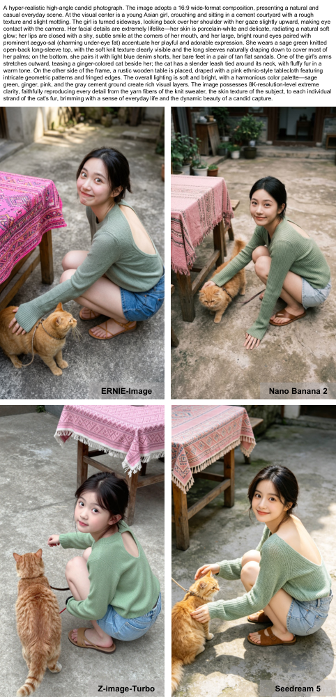

<figcaption>図7: ERNIE-Image と最先端のオープンソースおよびクローズドソースのモデルとの比較。</figcaption>
</figure>

<figure>

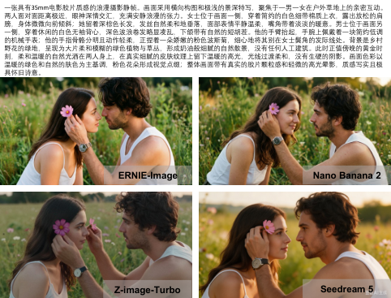

<figcaption>図8（1/2）: ERNIE-Image と最先端のオープンソースおよびクローズドソースのモデルとの比較。</figcaption>
</figure>

<figure>

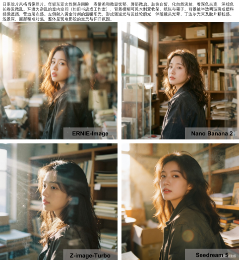

<figcaption>図8（2/2）: 同上。（訳注: ar5iv 側では 2 枚のうち 1 枚のみが変換されていたため、残りを arXiv HTML から回収した）</figcaption>
</figure>

<figure>

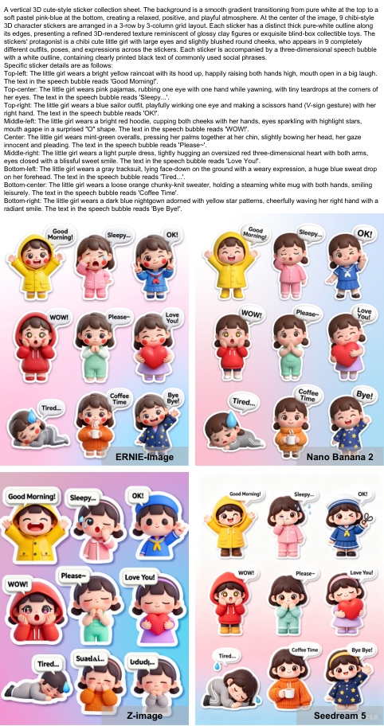

<figcaption>図9: ERNIE-Image と最先端のオープンソースおよびクローズドソースのモデルとの比較。</figcaption>
</figure>

<figure>

<figcaption>図10: ERNIE-Image と最先端のオープンソースおよびクローズドソースのモデルとの比較。</figcaption>
</figure>

<figure>

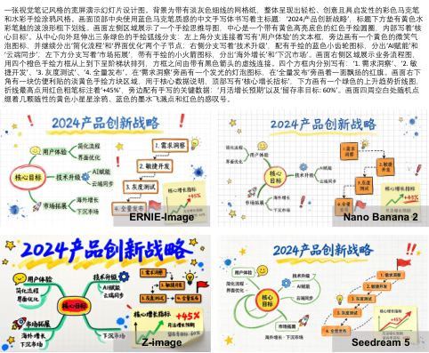

<figcaption>図11（1/2）: ERNIE-Image と最先端のオープンソースおよびクローズドソースのモデルとの比較。</figcaption>
</figure>

<figure>

<figcaption>図11（2/2）: 同上。（訳注: ar5iv 側では 2 枚のうち 1 枚のみが変換されていたため、残りを arXiv HTML から回収した）</figcaption>
</figure>

### 4.4 Qualitative Analysis（定性的分析）

ERNIE-Image の能力をさらに実証するため、我々は Z-Image シリーズ、Seedream 5.0、Nano Banana 2.0 を含む、オープンソースとプロプライエタリの双方のモデルに対する一連の比較例を提示する。評価は 3 つの主要な側面に焦点を当てる：人物写真、複雑な指示追従、テキストレンダリングである。

人物写真。図 7 に示すように、ERNIE-Image は高度に写実的で生き生きとした画像を生成し、プロンプトで指定された「遊び心があって愛らしい表情」を正確に捉えている。Nano Banana 2.0 と Seedream 5.0 も意味的に一貫した結果を生成するものの、えくぼ・肌の質感・顎のしわといった細粒度の顔の細部を欠いており、その結果として洗練されてはいるが自然さに欠ける画像となる。比較すると、Z-Image-Turbo はより劣った結果を生成し、姿勢の品質と画像の明瞭さに顕著な弱さがある。

複雑な指示追従。複雑な指示に従う能力は、細粒度の制御を要する実世界のデザイン応用にとって決定的である。図 9 に図解するように、プロンプトは 9 体のキャラクタのステッカーを、それぞれ異なる姿勢・服装・関連するテキストとともに生成することを要求する。明確な指示の下では、ERNIE-Image と Nano Banana はおおむね類似した出力を生成する。しかしながら Nano Banana は最後のキャラクタについて「bye bye!」を「bye!」と誤ってレンダリングする。Seedream 5.0 は 3 番目のキャラクタについて「シザーズハンド（ピースサイン）」を「ハサミを持つ」と誤解し、意味的な誤りにつながる。Z-Image は複雑な指示への追従にほぼ失敗し、誤ったテキストを生成する。対照的に ERNIE-Image は正しい細部とテキストを伴ってすべてのキャラクタを正確に生成し、実践的な展開に適した品質水準を達成している。

中国語のテキストレンダリング。漢字の構造的な複雑さと多様性のため、テキストレンダリングは text-to-image 生成における主要な課題であり続けている。我々の評価において、ERNIE-Image は頑健な性能を実証し（図 10 と図 11 を参照）、指定された中国語のテキストを正確にレンダリングする。しかしながら他のモデルはしばしばアーティファクトや誤った文字を生成し、複数回の試行を要して利用コストを増大させる。

## 5 Conclusion（結論）

本レポートで我々は、text-to-image 拡散モデル、プロンプトエンハンサ、そして産業級の美的モデルを含む ERNIE-Image シリーズを提示した。我々は**モデルサイズのスケーリング則に挑戦**し、事前学習データをさらに採掘することが従来の理解の限界を超えて押し進めうることを示す。学習の初期段階でより複雑で詳細な指示を導入することにより、我々のモデルは精密な指示追従と強いテキストレンダリングの能力を自然に創発させ、はるかに極端なパラメータ規模とコストを持つ多くのオープンソースおよび商用モデルを実効的に凌駕している。美しさの点では、ERNIE-Image-Aes はオープンソースのデータセットと特定の集団によるアノテーションが持ち込むバイアスを削減し、一般大衆の選好に整合した美的品質をより忠実に反映でき、ERNIE-Image が多様な様式の写実的な写真を生成することを可能にする。これら複数の能力にわたる改善により、我々のモデルは複数のベンチマークと人間評価においてオープンソースモデルの中で主導的な性能を達成している。最後に我々は、開かれた学術研究を促進し AIGC コミュニティに資するため、学習したすべてのモデルを公開する。新しい技術を誰もが容易に利用できるようにすることが究極の展望である。
