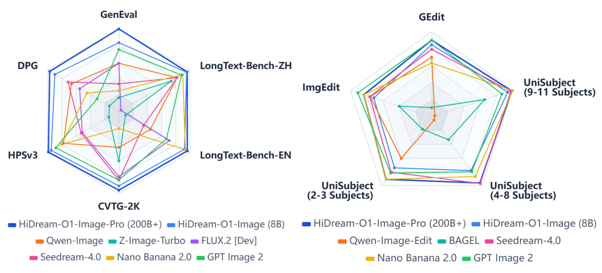
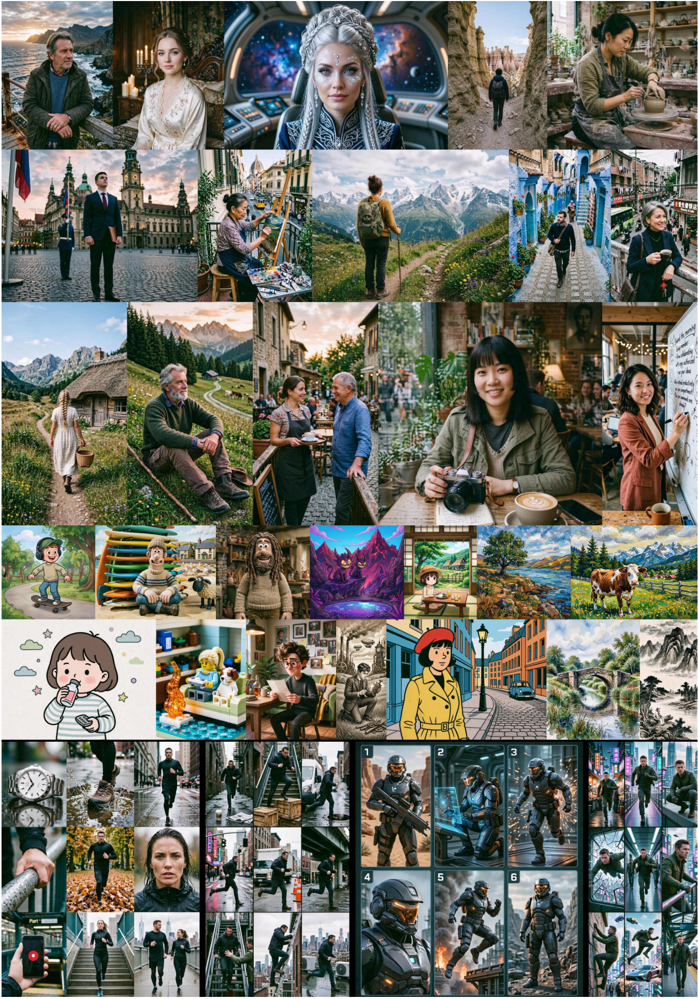
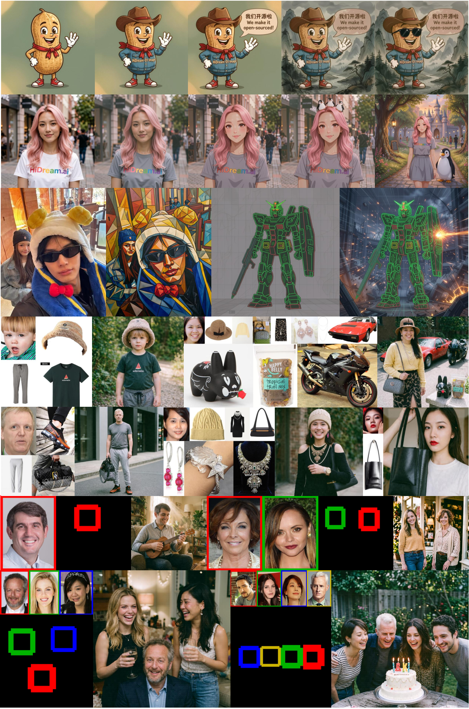
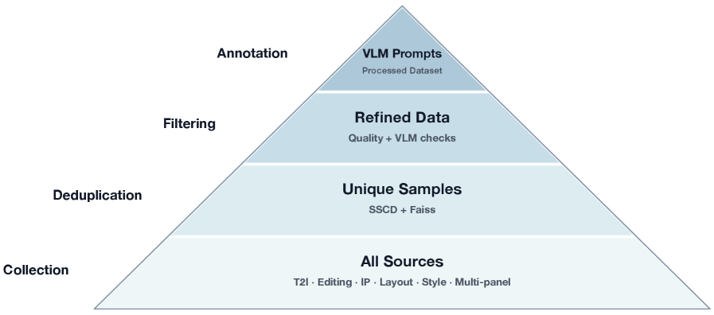
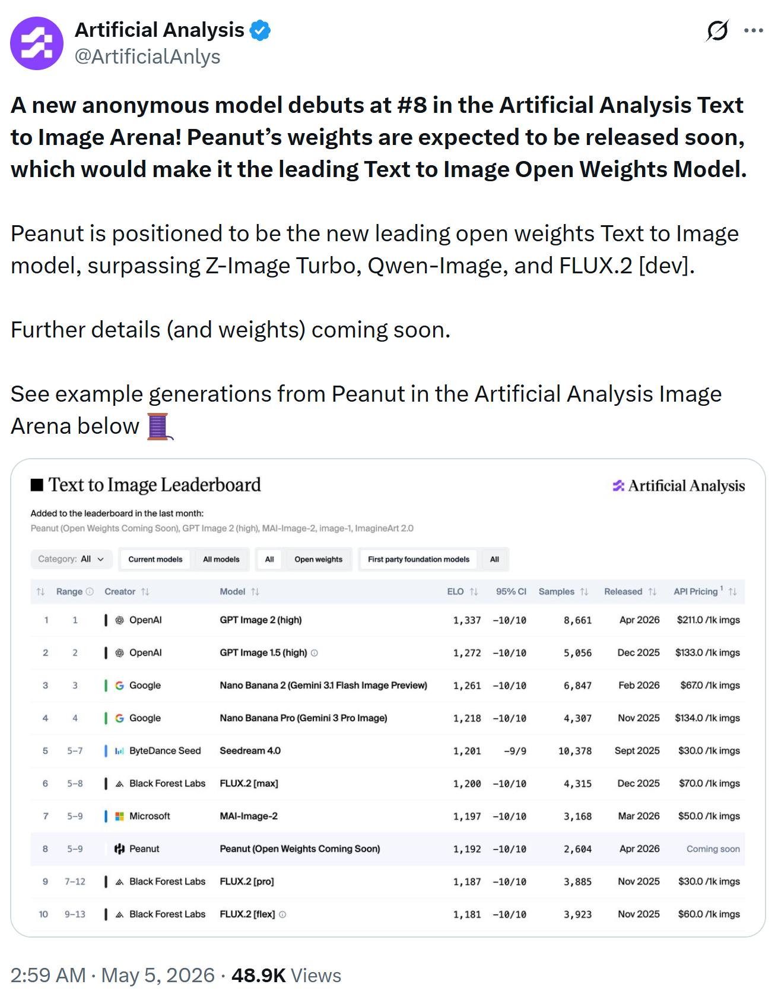
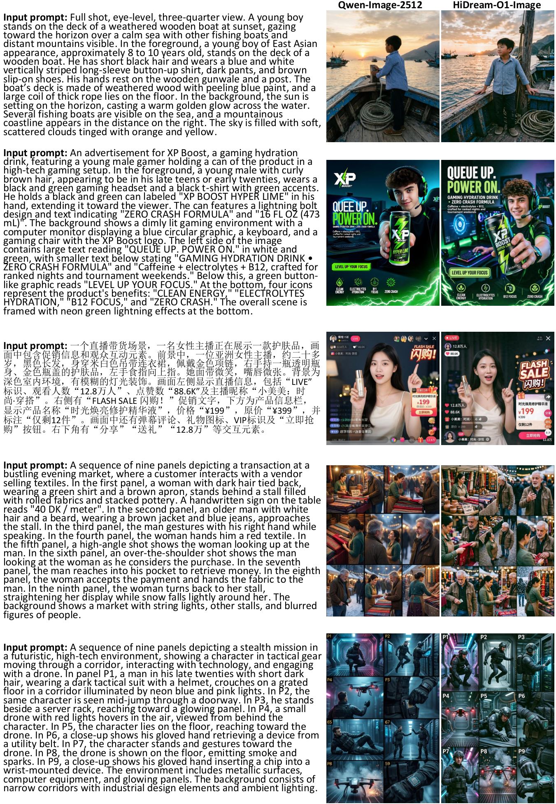
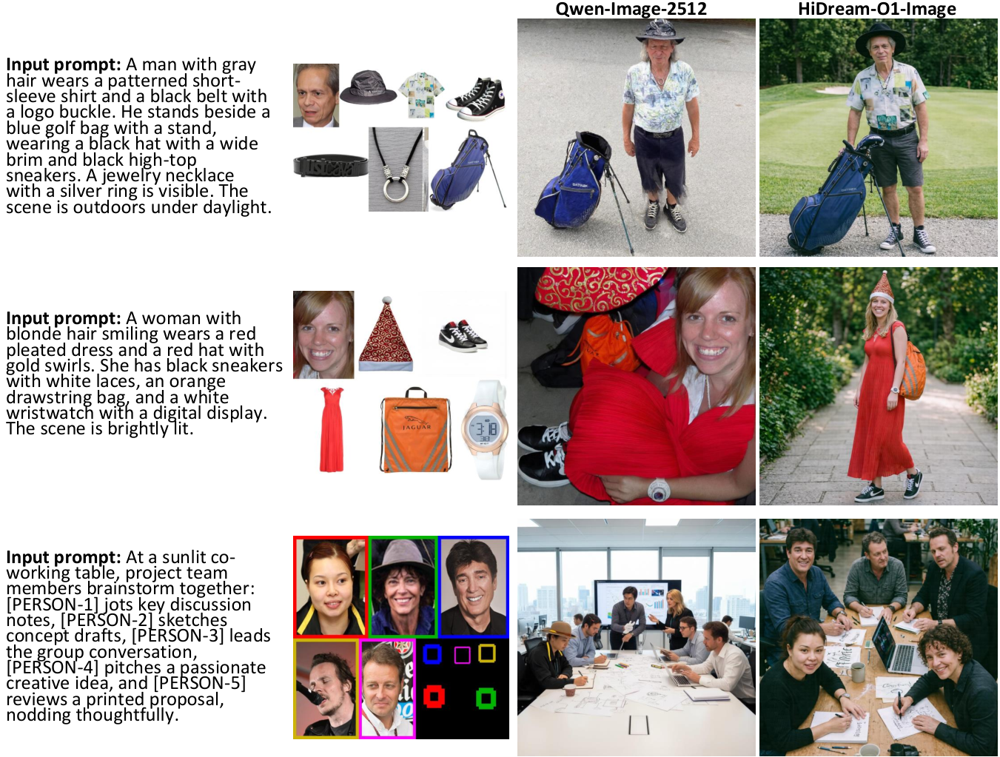

# HiDream-O1-Image: ピクセルレベルの Unified Transformer を備えた、ネイティブに統一された画像生成基盤モデル

> 原題: HiDream-O1-Image: A Natively Unified Image Generative Foundation Model with Pixel-level Unified Transformer
> 著者: HiDream.ai（貢献者一覧は Appendix A。責任著者: Ting Yao, Tao Mei）
> 出典: arXiv:2605.11061

## Abstract（要旨）

視覚生成モデルの進化は長らく、分断されたテキストエンコーダと外部の VAE に依存する断片化されたアーキテクチャによって制約されてきた。本レポートでは、ピクセル空間の Diffusion Transformer によってネイティブに統一された生成基盤モデル HiDream-O1-Image を提示する。これはモジュール型アーキテクチャからエンドツーエンドの文脈内視覚生成エンジンへのパラダイムシフトを先導する。生の画像ピクセル・テキストトークン・タスク固有の条件を単一の共有トークン空間へ写像することにより、HiDream-O1-Image は Unified Transformer（UiT）アーキテクチャ内でマルチモーダル入力の構造的な統一を達成する。このネイティブな符号化パラダイムは、別個の VAE や分断された事前学習済みテキストエンコーダを不要にし、多様な生成・編集タスクを一貫した文脈内推論プロセスとしてモデルが扱えるようにする。広範な実験により、HiDream-O1-Image が text-to-image 生成・指示ベース編集・被写体駆動の個人化を含む様々な生成タスクにおいて卓越することが示された。特筆すべきは、わずか 80 億パラメータで、HiDream-O1-Image（8B）が、はるかに大きなパラメータを持つ確立された最先端モデル（例：270 億の Qwen-Image）と同等、あるいはそれを超える性能を達成することである。決定的に重要な点として、このパラダイムの計り知れないスケーラビリティを検証するため、我々はアーキテクチャを 2,000 億パラメータ超まで首尾よくスケールさせた。実験結果は、この超大規模版 HiDream-O1-Image-Pro（200B+）が前例のない生成能力と優れた性能を解き放ち、新たな最先端のベンチマークを打ち立てることを実証している。最終的に、HiDream-O1-Image はネイティブに統一されたアーキテクチャの計り知れない潜在能力を浮き彫りにし、次世代のマルチモーダル AI へ向けた高度にスケーラブルな道筋を描き出す。Github: [https://github.com/HiDream-ai/HiDream-O1-Image](https://github.com/HiDream-ai/HiDream-O1-Image) Huggingface: [https://huggingface.co/HiDream-ai/HiDream-O1-Image](https://huggingface.co/HiDream-ai/HiDream-O1-Image)

<figure>

<figcaption>図1: HiDream-O1-Image は様々なベンチマークとタスクにわたって強力な能力を示す。</figcaption>
</figure>

<figure>

<figcaption>図2: 複雑なテキストレンダリングを伴う text-to-image タスクにおける HiDream-O1-Image の作例。</figcaption>
</figure>

<figure>

<figcaption>図3: 多様な映画的ショット・多用途な芸術スタイル・マルチパネル画像生成のシナリオにおける text-to-image タスクでの HiDream-O1-Image の作例。</figcaption>
</figure>

<figure>

<figcaption>図4: 指示ベース編集および被写体駆動の個人化タスクにおける HiDream-O1-Image の作例。</figcaption>
</figure>

## 1 Introduction（はじめに）

視覚コンテンツ生成の風景は、拡散モデルの急速な進化によって根底から作り変えられてきた。近年、生成モデルのアーキテクチャは伝統的な U-Net から Diffusion Transformer（DiT）への大きな移行を目撃し、画像および動画合成の限界を押し広げている。この進展の只中にあって、支配的なパラダイムは依然として Latent Diffusion Models（LDM）に錨を下ろしている。LDM はモジュール型で断片化されたパイプラインに依存する：事前学習済みの Variational Autoencoder（VAE）を用いて生の画像を潜在空間へ圧縮し、テキストプロンプトを符号化するために分断された事前学習済み言語モデル（例：CLIP や T5）と組み合わせる（図 5 (a)）。計算効率は良いものの、この分断された符号化アプローチは不可避的に情報のボトルネックを持ち込む——例えば潜在空間圧縮の際の高周波の視覚的詳細の損失であり、それによって生成忠実度の上限が頭打ちになる。

潜在空間圧縮の構造的限界を回避するため、近年の先駆的な取り組みはピクセル空間の Diffusion Transformer を探求してきた。生の画像ピクセル上で直接に拡散過程をモデル化することにより、これらのアプローチは Text-to-Image（T2I）生成において有望な視覚的忠実度と入り組んだ細部の保存を実証してきた。しかし、VAE の画像エンコーダを捨てたにもかかわらず、既存のピクセル空間 DiT の大半（図 5 (b)）は、依然として分断された既製のテキストエンコーダに大きく依存している。この視覚符号化空間とテキスト符号化空間の分離は、モダリティが根本から共同で最適化されていないため、本質的に意味的なずれ（semantic misalignment）に苦しむ。さらに、これらのモデルは典型的に単一タスクの合成（主に T2I）に特化したままであり、指示ベース画像編集や被写体駆動の個人化といった、より広くより複雑なシナリオへの汎化に苦戦する。

自然言語処理の領域では、多様なタスクを単一の共有トークン空間へ統一することが、強力な文脈内推論（in-context reasoning）が可能な大規模言語モデル（LLM）への道を開いた。この成功は、視覚生成基盤モデルにとって決定的な問いを自然に動機づける：ピクセル空間の拡散モデルを、特化した生成器から多用途で汎用的な推論フレームワークへとスケールさせられるか？ これを達成するには、我々は異なる符号化モジュール間の境界を取り壊し、マルチモーダル入力を基礎レベルで構造的に統一し、モジュール型パイプラインからエンドツーエンドのアーキテクチャへ移行しなければならない。

<figure>

<figcaption>図5: (a) 潜在空間の VAE 圧縮を用いる latent DiT や (b) 典型的に分断されたテキストエンコーダに依存する pixel-space DiT とは異なり、(c) 我々の HiDream-O1-Image における Unified Transformer は、生の画像ピクセル・テキスト・タスク固有の条件を共有トークン空間内でネイティブに符号化し、それによってより広くより複雑な生成タスクへ汎化する。</figcaption>
</figure>

本研究において、我々は HiDream-O1-Image を提示する。これは新しい Pixel-level Unified Transformer によって駆動される、ネイティブに統一された生成基盤モデルである。HiDream-O1-Image は伝統的な断片化された符号化パラダイムを完全に放棄する。別個の VAE や分断された事前学習済みテキストエンコーダに依存する代わりに、我々のモデルは生の画像ピクセル・離散的なテキストトークン・補助的なタスク固有条件を、単一の連続な共有トークン空間へ直接写像する（図 5 (c)）。この構造的統一により、すべてのマルチモーダル入力がそのような Unified Transformer アーキテクチャ内でエンドツーエンドに相乗的に処理される。そうすることで、このネイティブな符号化パラダイムは、多様な生成・編集タスクを、専門化されたモジュールを要する孤立した問題としてではなく、一貫した文脈内視覚推論プロセスとして扱う力を HiDream-O1-Image に与え、入力間のより深く柔軟なマルチモーダル相互作用を育む。

アーキテクチャの統一は視覚推論のための強力なエンジンを提供するが、高度に複雑で抽象的なユーザーの意図をモデルが好む入力へ翻訳することは、実践的な課題として残る。この意味的ギャップを埋めるため、我々はさらに「思考（thinking）」機構を備えた Reasoning-Driven Prompt Agent を導入する。このエージェントは、複雑なユーザー指示を生成パイプラインへ入力する前に、明示的に推論して洗練する。この機構は、とりわけ深い論理的演繹を要する入り組んだ視覚生成タスクにおいて、モデルの汎化能力と指示追従能力を大幅に高める。

我々の知る限り、HiDream-O1-Image は、(i) 様々なマルチモーダルな原始的入力（画像、テキスト、追加条件／参照の系列）と (ii) text-to-image 生成・指示ベース編集・被写体駆動の個人化のための統一システムを同時にサポートしつつ、高解像度の 2,048 $\times$ 2,048 出力へ効果的にスケールする Pixel-level Unified Transformer アーキテクチャを探求した最初期の取り組みの 1 つである。

要約すると、本研究の主要な貢献は以下の通りである：

- ネイティブに統一された生成アーキテクチャ：我々は HiDream-O1-Image を提案する。これは伝統的なモジュール型パイプライン（すなわち外部 VAE と分断されたテキストエンコーダ）を完全に捨て去るエンドツーエンドの Pixel-level Unified Transformer である。生の画像ピクセル・テキストトークン・タスク条件を単一の共有トークン空間へ写像することにより、我々は多様な視覚生成・編集タスクを一貫した文脈内視覚推論プロセスとして再定義する。
- Reasoning-Driven Prompt Agent：生のユーザー意図とモデルが好む入力の間の意味的ギャップを埋めるため、我々は「思考」機構を備えた Prompt Agent を導入し、オープンソース化する。複雑なユーザー指示を明示的に推論して洗練することにより、このエージェントは、とりわけ入り組んだ推論負荷の高い視覚生成タスクにおいて、モデルの指示追従能力を大幅に高める。
- 8B 規模での卓越した効率性と多用途性：我々は、統一パラダイムが高効率のもと最先端の性能を達成し、様々な生成シナリオにわたる包括的なカバレッジを解き放つことを実証する。具体的には、HiDream-O1-Image は多様な映画的ショット・多用途な芸術スタイル・複雑な長文テキストレンダリング・指示ベース画像編集・被写体駆動の個人化・絵コンテ制作のためのマルチパネル画像生成をシームレスに扱う。これら多面的なシナリオを通じて、我々のモデルは、はるかに大きなパラメータを持つ確立されたオープンソースの潜在空間 DiT（例：27B の Qwen-Image）と、先導的なクローズドソース商用モデル（例：Nano Banana 2.0）の両方に対して、同等かそれを上回る性能を達成する。
- 2,000 億パラメータ超への計り知れないスケーラビリティ：我々は HiDream-O1-Image アーキテクチャを 2,000 億パラメータ超まで首尾よくスケールさせることにより、ネイティブに統一されたパラダイムのスケーリング則を検証する。この超大規模での実験結果は、優れた生成能力・視覚的忠実度・入り組んだ推論を解き放ち、幅広い生成タスクにわたって新たな最先端のベンチマークを打ち立てる。

<figure>

<figcaption>図6: データキュレーションとプロンプト構築の概観。</figcaption>
</figure>

## 2 Data Curation and Prompt Construction（データキュレーションとプロンプト構築）

高品質かつ大規模な学習データは、汎用的な画像生成をスケールさせるために不可欠である。text-to-image 合成・指示ベース編集・被写体駆動の個人化のための単一モデルを学習するには、標準的な画像-テキストペアを超えた教師信号が追加で必要になる。そこで我々は、異種の生の情報源を高品質な画像-テキストペア・編集三つ組・被写体参照サンプルへ変換する専用のデータエンジンを構築する。図 6 に要約されるように、パイプラインは情報源データ収集・データ重複除去・データ品質と安全性のフィルタリング・VLM ベースのプロンプト構築から成る。

### 2.1 Source Data Collection（情報源データの収集）

我々はまず、公開の Web コーパスと社内でライセンスされたコレクションから大規模な候補プールを組み立てる。標準的な画像-テキストペアに加え、HiDream-O1-Image が必要とするすべての主要な学習シナリオを網羅するよう、情報源の分布を意図的に広げる。text-to-image 合成については、プレゼンテーションスライド・ポスター・文書・長文テキスト画像といった複雑なグラフィックレイアウトのデータを含める。これらは高密度なタイポグラフィ・構造化された構図・画像とテキストが混在するレイアウトに対する教師信号を提供する。また、写真スタイル・イラストスタイル・デザインテンプレート・レンダリングの美学・ドメイン固有の視覚的アイデンティティを含む、スタイル志向のサンプルの割合も増やす。

text-to-image 生成を超えて、我々は指示ベース編集と被写体駆動の個人化のためのタスク固有データを収集する。編集の学習データは、公開の編集データセット・社内で合成した before-after ペア・動画由来のサンプルから構築される。動画由来のサンプルでは、異なるフレームが物体の変化・背景の遷移・動作の変化・局所的な属性の修正に対する自然な教師信号を提供する。IP 志向の個人化については、人物中心と物体中心の両方の参照集合を集める。人物 IP データは、姿勢・表情・視点・照明条件・シーンをまたいだ同一人物の複数枚の写真を含み、物体 IP データは、様々な背景と構成のもとでの同一アイテムの繰り返し出現を扱う。最後に、我々はマルチパネルデータを 2 つの相補的な情報源から収集する：インターネットからクロールしたグリッド画像と、同一動画の異なるクリップから構築したフレーム構成のサンプルである。これらのマルチパネルデータは、単一画像の構図を超えた、逐次的な変化・パネル間の一貫性・より豊かな空間的構成にモデルを触れさせる。

### 2.2 Data Deduplication（データ重複除去）

大規模な Web スケールのコレクションには不可避的に重複あるいは高度に類似した画像が含まれるため、我々は学習効率を高め記憶（memorization）のリスクを減らすために重複除去の手続きを適用する。この規模で全ペアの直接比較は実行不可能なので、我々は 2 段階で重複除去を行う：

1. 視覚特徴のグループ化。SSCD モデルを用いて画像表現を抽出する。次に 200 万サンプルの代表的な部分集合を用いて k-means の重心を当てはめ、特徴空間を 16,000 個のクラスタに分割して、重複の可能性が高いものが同じ局所的探索空間へ振り分けられるようにする。
2. クラスタレベルの類似度検索。各クラスタ内で GPU 加速された Faiss による最近傍検索を実施する。類似度スコアが事前定義された閾値を超えるサンプルは準重複として扱われ、代表画像 1 枚のみが保持される。

この冗長性制御の段階により、収集データの意味的カバレッジを保ちながら、当初の候補の約 20% が除去される。

### 2.3 Data Quality and Safety Filtering（データ品質と安全性のフィルタリング）

重複除去の後、我々は残りのデータを一組の相補的なモデルでさらにフィルタリングする。その目的は、有害または低品質な画像を除去することだけでなく、視覚的に情報量が多く高解像度のピクセル空間モデリングに有用な学習サンプルを残すことにもある：

- 安全性評価。潜在的に不適切な画像は、事前学習済みの NSFW 分類器によって検出・除去される。
- 美的評価。美的スコアリングモデルを用いて視覚的魅力の乏しい画像を抑制する一方、写実的・芸術的・デザイン志向の各領域にまたがるスタイルの多様性は維持する。
- 透かし検出。目立つ透かしを含む画像は、専用の透かし検出器によってフィルタリングされる。
- タスク整合性評価。編集および IP 志向のデータについては、サンプルが妥当なタスク事例を成すかどうかを検証するために VLM をさらに用いる。編集データについては、VLM はソース画像と目標画像が解釈可能な視覚的変化を伴う意味のある before-after ペアを構成するかどうかを判断する。IP 関連のデータについては、参照画像が同一人物あるいは同一物体に対応するかどうかを調べ、同一性の合わないグループや関連の弱いグループを除去する。
- 技術的品質評価。Top-IQ スコアの低いサンプルを除去する。加えて、各画像を一時的に JPEG 形式へ符号化してピクセルあたりのバイト比を推定し、その比が異常に低い画像は、重い圧縮アーティファクトや視覚的詳細の不足を示すことが多いため破棄する。

### 2.4 Prompt Construction（プロンプト構築）

大規模なプロンプト生成のため、我々は Qwen3-VL を用いて、フィルタリング済みの各サンプルのメタデータと抽出された視覚-テキスト信号を学習用プロンプトへ変換する。このモデルは、ユーザータグ・情報源の説明文・OCR テキスト・レイアウトの手がかり・スタイルラベルといった利用可能な補助情報を受け取り、生成モデルが期待する指示形式によく合致する記述的プロンプトを生成する。自動プロンプティングが失敗した場合、あるいは結果のテキストが事前設定した機微な語のリストに合致した場合には、少数のサンプルを落とす。

プロンプト構築のプロセスは、異なるタスク形式にわたって事実性・視覚的具体性・制御可能な多様性を強調するよう設計されている。自然画像については、生成されるプロンプトは目立つ物体・属性・空間関係・シーンの文脈・スタイルを記述する。グラフィックレイアウトおよび長文テキストのサンプルについては、プロンプトは加えて主要なテキスト内容・読み順・レイアウト構造を保持する。編集サンプルについては、Qwen3-VL はソース画像と目標画像を比較し、保存されるべき領域への不要な変更を避けながら意図された視覚的変換を説明する簡潔な編集指示を生成するよう指示される。IP 志向のサンプルについては、参照される人物または物体の同一性を定める属性を要約し、その外観を明示的に保存しながら被写体を新しいシーンに置くプロンプトを構築する。マルチパネルのサンプルについては、Qwen3-VL は大域的な配置とパネルごとの差異の両方を記述し、モデルがグリッド構図と時間的なフレームの一貫性を学習できるようにする。我々はまたプロンプトの粒度を短い・中程度・詳細の間で変化させ、最終的な学習コーパスが実際のユーザー入力の多様性をよりよく反映するようにする。

<figure>

<figcaption>図7: HiDream-O1-Image の概観。タスク固有の条件・テキストプロンプト・生ピクセルを共有トークン空間へ写像することにより、マルチモーダル入力の構造的統一を可能にする。これらに対応する異種のトークン（すなわち条件トークン、テキストトークン、タイムステップ埋め込みとともにノイズ付きの目標サンプルとして定式化される生成トークン）が Unified Transformer バックボーンへ入力される。このようにして HiDream-O1-Image は、多様なタスク（text-to-image、画像編集、被写体駆動の個人化）を共有トークン空間における文脈内推論プロセスとして扱う。最後に、Transformer バックボーンはクリーンな画像パッチを予測し、それらが再組み立てされて目標画像が生成される。</figcaption>
</figure>

## 3 Model Architecture: HiDream-O1-Image（モデルアーキテクチャ）

本節では、高忠実なピクセル空間合成と汎用的な画像生成のための多用途な文脈内推論の間のギャップを架橋する Pixel-level Unified Transformer である HiDream-O1-Image を紹介する。なお、我々の統一 Pixel Diffusion Transformer パラダイムの構造的なスケーラビリティと多用途性を実証するため、HiDream-O1-Image を 2 つの異なる規模で具体化する：機敏な展開のための効率的な 80 億パラメータ版と、生成品質の限界を押し広げる巨大な 2,000 億パラメータ超の版である。

具体的には、複雑なユーザーの意図をモデルが好む入力へ効果的に翻訳するため、まず 3.1 節で Reasoning-Driven Prompt Agent を導入する。次に 3.2 節で統一マルチモーダル・トークン化の概観を提示する。続いて 3.3 節で、バックボーンの設計とハイブリッドな Unified Attention 機構を含む、我々の HiDream-O1-Image の Unified Transformer（UiT）アーキテクチャを詳述する。最後に 3.4 節で全体の目的関数を紹介する。

### 3.1 Reasoning-Driven Prompt Agent（推論駆動のプロンプトエージェント）

現在の画像生成モデルにおける重大なボトルネックは、生の、しばしば曖昧なユーザー指示と、生成パイプラインが要求する密で記述的なプロンプトの間の意味的ギャップである。これに対処するため、我々は Gemma の上に構築された「思考」機構を備えた Reasoning-Driven Prompt Agent を導入する。複雑なユーザークエリを提示されたとき、このエージェントは単にテキストを転送するのではなく、タスクが含意する空間配置・被写体の属性・物理的な論理・文脈的な関係を明示的に推論する。最終的なプロンプトを出力する前に思考の連鎖（chain of thought）を明示的に生成することにより、このエージェントは生の入力を効果的に洗練し豊かにする。この推論プロセスにより、後続の HiDream-O1-Image は高度に曖昧さのない、構造的に整合したテキスト条件を受け取ることが保証され、入り組んだ推論負荷の高い視覚生成・編集タスクを扱うモデルの能力を大幅に引き上げる。

### 3.2 Unified Multimodal Tokenization（統一マルチモーダル・トークン化）

HiDream-O1-Image の中核は、異種のモダリティを単一の共有トークン空間へ構造的に統一することである。図 7 に示すように、学習の際、我々は様々な入力（すなわち洗練された入力テキストプロンプト $y$、タスク固有の条件 $c$、目標画像 $x$）を共有トークン空間へ符号化するための包括的な統一マルチモーダル・トークン化スキームを定義する。具体的には、入力ストリームを 3 つの原始的なトークン型に分解する：

- テキストトークン（$y$）：Reasoning-Driven Prompt Agent が出力した洗練済みテキストプロンプト $y$ は、バックボーンのネイティブな語彙を介して離散トークンへ変換され、さらに共有空間へ写像される。
- 条件トークン（$c$）：視覚的接地を要する生成タスク（例：編集や被写体駆動の個人化）については、入力される文脈画像 $c$（例：編集のソースや参照被写体）が視覚エンコーダ（SigLip-2）を用いて意味的に豊かなトークンへ射影される。我々はさらに、学習可能な射影を介して意味的に豊かなトークンを共有空間へ整合させる。
- 生成トークン（$x_{t}$）：各目標画像 $x$ について、クリーンな画像 $x$ とガウスノイズ $\varepsilon\sim\mathcal{N}(0,I)$ の間の線形補間により生成トークン $x_{t}$（すなわちノイズ付きサンプル）を構成する：$x_{t}=tx+(1-t)\varepsilon$、ここで $t$ は拡散のタイムステップを表す。生成トークンはその後、重なりのないパッチへ分割され、さらに学習可能なパッチ埋め込み層を通じて共有空間へ射影される。

これら 3 種類すべてのトークンを連結することにより、我々はそれらを続く統一 Transformer ブロックの積み重ねによって文脈的に符号化し、これがすべてのモダリティにまたがる共同の文脈的推論をネイティブに可能にする。最後に、線形の予測ヘッドが各出力トークンを対応するクリーンな画像パッチへ写像し戻し、再構成された画像の推定を生成する。

### 3.3 Unified Transformer (UiT) Architecture（Unified Transformer アーキテクチャ）

バックボーン。我々のバックボーンは、大規模言語モデルから受け継いだデコーダのみの Transformer アーキテクチャ（すなわち統一 Transformer ブロックの積み重ね）の上に構築されている。多様な応用シナリオに対応するため、我々は HiDream-O1-Image の 2 つの派生版を設計する：80 億パラメータのモデルと 2,000 億パラメータ超のモデルである。具体的には、8B 版はマルチモーダル理解のバックボーン（Qwen3-VL-8B-Instruct）から初期化され、その頑健なマルチモーダルの事前整合能力を高効率で活用する。一方、200B+ 版はピクセルレベル Unified Transformer アーキテクチャの限界を 2,000 億パラメータ超へスケールさせることで押し広げ、複雑な視覚推論と高解像度合成のためのより強い容量を解き放つ。

いずれの派生版も、正規化に RMSNorm、活性化関数に SwiGLU、位置符号化に RoPE を採用する。事前学習された自己回帰能力をよりよく受け継ぐため、我々は拡散のタイムステップを追加の特別なトークンとして符号化する。ピクセル空間の拡散過程を支えるため、図 7 に示すように、我々はさらに学習可能な入力および出力のパッチ埋め込みをバックボーンへ組み込む。このアプローチにより、異なる規模にわたって中核の Transformer 構造を改変することなく、ピクセル空間での直接的なモデリングが可能になる。

ハイブリッドな Unified Attention 機構。因果的注意（causal attention）のパラダイムは自己回帰的な言語モデリングの中心であり、自己回帰性を維持するために各トークンが先行するトークンのみに注意を向けることを保証する。対照的に、画像合成のための Diffusion Transformer は典型的に完全な自己注意のパラダイムを採用し、各視覚トークンが他のすべてのトークンに注意を向けて大域的な空間依存関係を捉えられるようにする。

HiDream-O1-Image において、我々はこれら 2 つのパラダイムを、異種のモダリティに合わせて調整されたハイブリッドな unified attention 機構を通じて調停する。具体的には、条件トークンとテキストトークンは因果マスキングに従い、系列内の先行するマルチモーダルトークンのみに注意を向ける。対照的に生成トークンは完全な注意を採用し、すべてのトークンに注意を向けられるため、拡散プロセスの間に大域的な文脈の集約が可能になる。このような設計は、統一 Transformer フレームワーク内で空間的に整合した画像合成を促進しながら、言語モデリングのための自己回帰的構造を洗練された形で保存する。

### 3.4 Overall Objective（全体の目的関数）

生のピクセル空間で高忠実な画像合成を達成するため、我々は構造的な回帰と知覚的な整合のバランスを取る共同の最適化目的を採用する。ピクセル空間での拡散過程は細粒度の空間的詳細を捉える一方、長距離の意味的一貫性のモデル化にはしばしば苦戦する。我々の戦略はこれに対処するため、画像予測のための flow matching 損失を知覚的な教師制約（LPIPS 損失および知覚的 DINO 損失）と結合する。

## 4 Model Training（モデル学習）

### 4.1 Progressive Generalist Pre-training（段階的な汎用事前学習）

ここでは、基礎的な整合から高解像度の汎用合成へと移行する 3 段階の段階的学習戦略を通じて HiDream-O1-Image をスケールさせる。なお、学習データは粗いものから細かいものへとキュレートされ、画像解像度は徐々に上げられる。すべての段階を通じて、柔軟な多解像度生成を支えるため、画像の元のアスペクト比を保持する。

Stage I: 基礎的整合（512 $\times$ 512）。第 1 段階では、HiDream-O1-Image を 3 つのタスク上で共同で最適化する：text-to-image 生成（T2I）、言語モデリング（LM）、マルチモーダル理解（MMU）である。この共同最適化は、画像-テキストペアとテキストのみのコーパスの混合の上で実施される。このようにして、モデルはネイティブなピクセルパッチを言語的概念と意味的に関連づけることを学ぶだけでなく、強い言語能力も保持する。特筆すべきは、この段階では比較的低い画像解像度（512 $\times$ 512）と大きなバッチサイズを採用しており、これによりモデルを数十億の画像-テキストペアへスケールさせられることである。

Stage II: 汎用的な文脈内学習（1,024 $\times$ 1,024）。第 2 段階では、画像合成における空間的忠実度と細粒度の詳細生成を高めることを目的に、画像解像度を 1,024 $\times$ 1,024 へ拡大する。より重要なことに、学習タスク（T2I、LM、MMU）を、文脈内生成および編集のタスク（例：画像編集、被写体駆動の個人化）を含むように拡張する。この段階は Prompt Agent の明示的な推論プロセスを多様な合成シナリオとシームレスに統合し、それによって推論駆動の条件付き生成と統一的な文脈内学習を強化する。

Stage III: 高忠実な洗練（2,048 $\times$ 2,048）。この段階では、HiDream-O1-Image の学習を 2,048 $\times$ 2,048 を超える画像解像度の超高解像度部分集合に限定する。この段階は、超高解像度における細粒度の詳細と知覚品質の洗練のみに焦点を当てる。

### 4.2 Post-training（事後学習）

次に、我々はモデルの事後学習の最適化を 2 段階のパラダイム、すなわち Supervised Fine-Tuning（SFT）と Reinforcement Learning from Human Feedback（RLHF）で実施する。これらは共に、推論能力と生成品質の両方を段階的に洗練する。

Stage I: SFT。この段階は、データ中心の最適化戦略を通じて視覚的な美しさ・写実性・プロンプト推論を高めることを目指す。具体的には、数十万サンプルから成るハイブリッドな学習コーパスを構築する。これらは高品質な構図の一貫性・照明の整合性・写真的な写実性、さらには多様な芸術領域にわたるスタイルの忠実さを反映している。決定的に重要な点として、我々は高品質な推論の軌跡（reasoning trajectory）も含めて Prompt Agent を微調整し、構造的に整合し曖昧さのないプロンプトを一貫して生成するようにする。さらに、事前学習で採用した Logit-Normal サンプリング戦略を一様サンプリングに置き換える。これによりタイムステップの被覆が均衡し、細粒度の視覚的詳細を捉える後期のノイズ除去ステップに対する実効的な学習の重みが増す。

Stage II: RLHF。この段階では、強化学習を介してモデルを人間の選好へさらに整合させるために GRPO を採用する。特に、我々は報酬モデルが生成する複数の報酬信号を集約して複合的なアドバンテージ関数を構成する。報酬信号には OCR 正確性・美的評価・指示追従の忠実度・推論品質が含まれる。この集約された目的により、写実性・美的品質・テキストレンダリングの正確性・意味的一貫性・論理的推論における的を絞った改善が可能になると同時に、アーティファクトが効果的に抑制される。

<figure>

<figcaption>図8: HiDream-O1-Image（コードネーム: Peanut）は Artificial Analysis Text to Image Arena に第 8 位でデビューし、新たな主導的オープンウェイト text-to-image モデルに位置づけられている（日付: 2026/5/5）。</figcaption>
</figure>

**表1**: GenEval における定量的結果。最良の結果を太字、次点を下線で示す（本翻訳では書式を省略）。

| Model | #Params | Single-Obj | Two-Obj | Count | Color | Position | Attr | Overall |
| --- | --- | --- | --- | --- | --- | --- | --- | --- |
| Nano Banana 2.0 | - | 1.00 | 0.96 | 0.71 | 0.84 | 0.86 | 0.65 | 0.83 |
| Seedream-4.0 | - | 1.00 | 0.92 | 0.71 | 0.93 | 0.78 | 0.68 | 0.84 |
| GPT Image 1 [High] | - | 0.99 | 0.92 | 0.85 | 0.92 | 0.75 | 0.61 | 0.84 |
| GPT Image 2 | - | 0.99 | 0.98 | 0.85 | 0.93 | 0.85 | 0.77 | 0.89 |
| PixArt | 4.3B + 0.6B | 0.98 | 0.50 | 0.44 | 0.80 | 0.08 | 0.07 | 0.48 |
| Show-o | 1.3B | 0.95 | 0.52 | 0.49 | 0.82 | 0.11 | 0.28 | 0.53 |
| Emu3-Gen | 8B | 0.98 | 0.71 | 0.34 | 0.81 | 0.17 | 0.21 | 0.54 |
| SD3-Medium | 5.5B + 2B | 0.98 | 0.74 | 0.63 | 0.67 | 0.34 | 0.36 | 0.62 |
| JanusFlow | 1.3B | 0.97 | 0.59 | 0.45 | 0.83 | 0.53 | 0.42 | 0.63 |
| FLUX.1 [Dev] | 4.8B + 12B | 0.98 | 0.81 | 0.74 | 0.79 | 0.22 | 0.45 | 0.66 |
| SD3.5 Large | 5.5B + 8.1B | 0.98 | 0.89 | 0.73 | 0.83 | 0.34 | 0.47 | 0.71 |
| Janus-Pro-7B | 7B | 0.99 | 0.89 | 0.59 | 0.90 | 0.79 | 0.66 | 0.80 |
| Z-Image-Turbo | 4B + 6B | 1.00 | 0.95 | 0.77 | 0.89 | 0.65 | 0.68 | 0.82 |
| FLUX.2 [Dev] | 24B + 32B | 1.00 | 0.99 | 0.79 | 0.93 | 0.73 | 0.78 | 0.87 |
| Qwen-Image | 7B + 20B | 0.99 | 0.92 | 0.89 | 0.88 | 0.76 | 0.77 | 0.87 |
| HiDream-O1-Image | 8B | 1.00 | 0.99 | 0.79 | 0.89 | 0.93 | 0.78 | 0.90 |
| HiDream-O1-Image-Pro | 200B+ | 1.00 | 0.99 | 0.85 | 0.94 | 0.94 | 0.79 | 0.92 |

**表2**: DPG における定量的結果。

| Model | #Params | Global | Entity | Attribute | Relation | Other | Overall |
| --- | --- | --- | --- | --- | --- | --- | --- |
| GPT Image 1 [High] | - | 88.89 | 88.94 | 89.84 | 92.63 | 90.96 | 85.15 |
| GPT Image 2 | - | 87.27 | 91.91 | 90.85 | 91.59 | 91.58 | 85.98 |
| Nano Banana 2.0 | - | 85.17 | 92.55 | 91.16 | 90.45 | 91.08 | 86.90 |
| Seedream-4.0 | - | 87.17 | 92.41 | 92.29 | 93.33 | 95.48 | 88.63 |
| SD v1.5 | 0.12B + 0.86B | 74.63 | 74.23 | 75.39 | 73.49 | 67.81 | 63.18 |
| PixArt | 4.3B + 0.6B | 74.97 | 79.32 | 78.60 | 82.57 | 76.96 | 71.11 |
| Lumina-Next | 2B + 2B | 82.82 | 88.65 | 86.44 | 80.53 | 81.82 | 74.63 |
| SDXL | 0.81B + 2.6B | 83.27 | 82.43 | 80.91 | 86.76 | 80.41 | 74.65 |
| Hunyuan-DiT | 4.8B + 1.5B | 84.59 | 80.59 | 88.01 | 74.36 | 86.41 | 78.87 |
| Emu3-Gen | 8B | 85.21 | 86.68 | 86.84 | 90.22 | 83.15 | 80.60 |
| DALL-E 3 | - | 90.97 | 89.61 | 88.39 | 90.58 | 89.83 | 83.50 |
| FLUX.1 [Dev] | 4.8B + 12B | 74.35 | 90.00 | 88.96 | 90.87 | 88.33 | 83.84 |
| SD3 Medium | 5.5B + 2B | 87.90 | 91.01 | 88.83 | 80.70 | 88.68 | 84.08 |
| Janus-Pro-7B | 7B | 86.90 | 88.90 | 89.40 | 89.32 | 89.48 | 84.19 |
| Z-Image-Turbo | 4B + 6B | 91.29 | 89.59 | 90.14 | 92.16 | 88.68 | 84.86 |
| HiDream-I1-Full | 13.5B + 17B | 76.44 | 90.22 | 89.48 | 93.74 | 91.83 | 85.89 |
| FLUX.2 [Dev] | 24B + 32B | 92.20 | 91.36 | 93.28 | 93.52 | 89.72 | 87.57 |
| Qwen-Image | 7B + 20B | 91.32 | 91.56 | 92.02 | 94.31 | 92.73 | 88.32 |
| HiDream-O1-Image | 8B | 95.15 | 92.32 | 93.74 | 92.88 | 90.25 | 89.83 |
| HiDream-O1-Image-Pro | 200B+ | 94.97 | 95.42 | 92.59 | 90.82 | 89.50 | 90.30 |

**表3**: HPSv3 における定量的結果。

| Models | #Params | All | Characters | Arts | Design | Architechture | Animals | NaturalScenery | Transportation | Products | Plants | Food | Science | Others |
| --- | --- | --- | --- | --- | --- | --- | --- | --- | --- | --- | --- | --- | --- | --- |
| Seedream-4.0 | - | 9.32 | 9.83 | 9.20 | 8.83 | 9.95 | 8.99 | 9.40 | 9.58 | 9.12 | 9.26 | 9.75 | 9.11 | 9.51 |
| Nano Banana 2.0 | - | 10.01 | 10.18 | 9.18 | 9.58 | 10.96 | 9.71 | 10.04 | 10.38 | 10.36 | 10.14 | 10.61 | 9.14 | 9.89 |
| GPT Image 2 | - | 10.21 | 10.75 | 9.91 | 10.15 | 10.59 | 10.05 | 10.29 | 10.17 | 10.26 | 10.07 | 10.75 | 10.05 | 10.00 |
| Z-Image-Turbo | 4B + 6B | 8.35 | 8.98 | 8.29 | 7.65 | 9.26 | 8.51 | 8.33 | 8.81 | 7.83 | 8.46 | 8.64 | 7.93 | 8.57 |
| FLUX.2 [Dev] | 24B + 32B | 9.28 | 10.23 | 9.56 | 8.80 | 9.73 | 9.43 | 9.21 | 9.44 | 8.93 | 9.23 | 9.82 | 8.67 | 9.11 |
| Qwen-image | 7B + 20B | 9.94 | 10.91 | 10.47 | 9.56 | 10.22 | 10.61 | 9.87 | 10.10 | 9.15 | 9.99 | 10.08 | 9.19 | 9.83 |
| HiDream-O1-Image | 8B | 10.37 | 10.59 | 10.44 | 10.29 | 11.02 | 10.34 | 10.37 | 10.54 | 10.50 | 10.38 | 10.85 | 9.68 | 10.09 |
| HiDream-O1-Image-Pro | 200B+ | 10.47 | 10.63 | 10.51 | 10.33 | 11.11 | 10.08 | 10.45 | 10.37 | 10.75 | 10.29 | 11.13 | 10.09 | 10.39 |

## 5 Adversarial Diffusion Distillation for Fast Inference（高速推論のための敵対的拡散蒸留）

HiDream-O1-Image のフル版は、推論時に典型的におよそ 50 のノイズ除去ステップを採用する。このサンプリング設定は強い視覚品質を保証する一方、反復的なプロセスはレイテンシに敏感なシナリオでの実践的な展開を制限しうる。推論効率を改善するため、我々はさらにフルモデルを、より短いサンプリング軌道を持つ加速版へ蒸留する。具体的には、HiDream-O1-Image の効率的な派生版として HiDream-O1-Image-Dev を構成する。これはより高速な生成のために 28 ステップのサンプラーを採用する。

蒸留プロセスは、削減されたステップ数のもとで教師モデルの生成挙動を近似するよう生徒モデルを学習する。我々は中核の目的関数として DMD（$\mathcal{L}_{\text{DMD}}$ と表記）を採用し、生徒が予測する軌道分布をフル版 HiDream-O1-Image のそれと整合させる。この目的により、HiDream-O1-Image-Dev は、はるかに短いサンプリングスケジュールを用いながら教師の主要な生成的ダイナミクスを受け継ぐことができる。加えて、我々は標準的な拡散損失を補助的な教師項として保持する。これは学習の安定性を改善し、蒸留の際の最適化の振動を緩和する。

HiDream-O1-Image-Dev における知覚的忠実度と画像の鮮鋭さをさらに保つため、我々は敵対的学習を蒸留フレームワークへ組み込む。生徒モデルは生成器とみなされ、識別器ネットワークとともに最適化される。識別器は実画像と、生徒のピクセル空間予測から再構成された画像とを比較し、その分類は凍結された教師バックボーンから抽出された多段階の特徴によって導かれる。この GAN を用いた蒸留の最終的な目的は、DMD・標準の拡散損失・敵対的損失の重み付き結合として定式化される：$\mathcal{L}_{\text{total}}=\mathcal{L}_{\text{DMD}}+\lambda_{\text{diff}}\mathcal{L}_{\text{diff}}+\lambda_{\text{adv}}\mathcal{L}_{\text{adv}}$。

**表4**: CVTG-2K における定量的結果。

| Model | # Params | 2 regions | 3 regions | 4 regions | 5 regions | average | NED | CLIP Score |
| --- | --- | --- | --- | --- | --- | --- | --- | --- |
| Nano Banana 2.0 | - | 0.7465 | 0.7720 | 0.8067 | 0.7980 | 0.7875 | 0.8945 | 0.7212 |
| GPT Image 1 [High] | - | 0.8779 | 0.8659 | 0.8731 | 0.8218 | 0.8569 | 0.9478 | 0.7982 |
| Seedream-4.0 | - | 0.8980 | 0.8949 | 0.9044 | 0.9015 | 0.9003 | 0.9511 | 0.8033 |
| GPT Image 2 | - | 0.8904 | 0.8887 | 0.9101 | 0.9044 | 0.9003 | 0.9515 | 0.7798 |
| TextDiffuser-2 | 0.12B + 0.9B | 0.5322 | 0.3255 | 0.1787 | 0.0809 | 0.2326 | 0.4353 | 0.6765 |
| RAG-Diffusion | 4.8B + 12B | 0.4388 | 0.3316 | 0.2116 | 0.1910 | 0.2648 | 0.4498 | 0.7797 |
| AnyText | 0.123B + 1.2B | 0.0513 | 0.1739 | 0.1948 | 0.2249 | 0.1804 | 0.4675 | 0.7432 |
| 3DIS | 0.81B + 2.6B | 0.4495 | 0.3959 | 0.3880 | 0.3303 | 0.3813 | 0.6505 | 0.7767 |
| FLUX.1 [dev] | 4.8B + 12B | 0.6089 | 0.5531 | 0.4661 | 0.4316 | 0.4965 | 0.6879 | 0.7401 |
| SD3.5 Large | 5.5B + 8.1B | 0.7293 | 0.6825 | 0.6574 | 0.5940 | 0.6548 | 0.8470 | 0.7797 |
| TextCrafter | 7B + 20B | 0.7628 | 0.7628 | 0.7406 | 0.6977 | 0.7370 | 0.8679 | 0.7868 |
| Qwen-Image | 7B + 20B | 0.8370 | 0.8364 | 0.8313 | 0.8158 | 0.8288 | 0.9116 | 0.8017 |
| Z-Image-Turbo | 4B + 6B | 0.8872 | 0.8662 | 0.8628 | 0.8347 | 0.8585 | 0.9281 | 0.8048 |
| FLUX.2 [Dev] | 24B + 32B | 0.9261 | 0.8897 | 0.8995 | 0.8732 | 0.8926 | 0.9475 | 0.8104 |
| HiDream-O1-Image | 8B | 0.9085 | 0.9159 | 0.9216 | 0.9015 | 0.9128 | 0.9561 | 0.8076 |
| HiDream-O1-Image-Pro | 200B+ | 0.9133 | 0.9221 | 0.9365 | 0.9175 | 0.9222 | 0.9628 | 0.8349 |

（注: 2〜5 regions と average の列は Word Accuracy（単語正解率）。）

**表5**: LongText-Bench における定量的結果。

| Model | #Params | LongText-Bench-EN | LongText-Bench-ZH |
| --- | --- | --- | --- |
| Seedream-4.0 | - | 0.936 | 0.946 |
| GPT Image 1 [High] | - | 0.956 | 0.619 |
| GPT Image 2 | - | 0.960 | 0.961 |
| Nano Banana 2.0 | - | 0.980 | 0.965 |
| Janus-Pro-7B | 7B | 0.019 | 0.006 |
| BLIP3-o | 7B + 1.4B | 0.021 | 0.018 |
| Kolors 2.0 | - | 0.258 | 0.329 |
| BAGEL | 7B + 7B | 0.373 | 0.310 |
| OmniGen2 | 3B + 4B | 0.561 | 0.059 |
| X-Omni | 7B | 0.900 | 0.814 |
| HiDream-I1-Full | 13.5B + 17B | 0.543 | 0.024 |
| FLUX.1 [Dev] | 4.8B + 12B | 0.607 | 0.005 |
| Z-Image-Turbo | 4B + 6B | 0.917 | 0.926 |
| FLUX.2 [Dev] | 24B + 32B | 0.963 | 0.757 |
| Qwen-Image | 7B + 20B | 0.943 | 0.946 |
| HiDream-O1-Image | 8B | 0.979 | 0.978 |
| HiDream-O1-Image-Pro | 200B+ | 0.982 | 0.980 |

## 6 Performance Comparisons for Text-to-Image Generation（text-to-image 生成の性能比較）

ここでは、一般的な視覚合成から細粒度のテキストレンダリングにわたる、我々の HiDream-O1-Image の text-to-image 生成能力を体系的に評価する。

### 6.1 General Text-to-Image Synthesis（一般的な text-to-image 合成）

我々はまず GenEval・DPG・HPSv3 のデータセット上で一般的な T2I 合成性能をベンチマークする。表 1、表 2、表 3 に定量的に報告されるように、80 億パラメータの我々の HiDream-O1-Image モデルは、同規模の既存のオープンソースの対応手法（例：Z-Image-Turbo、SD3.5 Large、Janus-Pro-7B）を大幅に上回る。さらに、スケールアップした 200B+ のモデルは最先端の忠実度を達成し、GPT Image 2 や Seedream-4.0 といった先導的なクローズドソースモデルを凌駕する。これらの結果は全般に、HiDream-O1-Image における構造的統一の設計の主要な利点を際立たせている。視覚と言語の両方をネイティブに共有されたトークン空間へ射影することにより、HiDream-O1-Image は、分断されたテキストエンコーダと画像生成器を用いる従来のパラダイムに内在する意味的ギャップを回避し、それによって優れたモダリティ間の整合を達成する。

### 6.2 High-Fidelity Text Rendering（高忠実なテキストレンダリング）

我々はさらに CVTG-2K および LongText-Bench のデータセット上でモデルのテキストレンダリング能力を厳密に検証する。表 4 と表 5 に詳述されるように、HiDream-O1-Image は CVTG-2K のほとんどの指標にわたって最高のスコアを獲得する。加えて LongText-Bench では、我々の 8B モデルが、より重いパラメータ（27B）を持つ最良の競合 Qwen-Image と同等の性能を示す一方、200B+ のモデルは超長文テキストレンダリングの限界をさらに押し広げ、新たな最先端を打ち立てる。この文字レベルの正確性における明確な飛躍は、我々のエンドツーエンドのピクセル空間生成フレームワークに直接由来する：分断されたモダリティ符号化に内在する中間的な text-to-vision の翻訳ボトルネックを回避し、損失を伴う VAE 圧縮を迂回することにより、我々のモデルは視覚的テキストレンダリングにおける構造的な歪みを緩和しつつ精密なテキスト-画像の整合を達成する。

### 6.3 Versatility Across Diverse Generation Scenarios（多様な生成シナリオにわたる多用途性）

標準的な定量ベンチマークを超えて、HiDream-O1-Image は様々な実践的な text-to-image 生成シナリオにわたって強い多用途性を実証する。図 9 に視覚的に示されるように、HiDream-O1-Image は多様な映画的ショット・多用途な芸術スタイル・複雑な長文テキストレンダリング・絵コンテ制作のためのマルチパネル画像生成をシームレスに扱う。

決定的に重要なこととして、我々は高品質な静止画生成が下流の動画生成にとってしばしば基礎的な入口（すなわち最初のキーフレーム）として機能することを認識している。この目的のため、HiDream-O1-Image は映画的なカメラ言語と構造的な絵コンテのレイアウトを習得することに特別の重点を置く。最初の画像生成段階で空間的構図とカメラ視点に対する厳密な制御可能性を確保することにより、我々のモデルは制御可能な視覚的アンカーを提供し、それが後続の動画合成タスクを大いに助け、円滑にする。

<figure>

<figcaption>図9: 多様な映画的ショット・複雑なテキストレンダリング・マルチパネル画像のシナリオにおける text-to-image 能力についての、Qwen-Image と HiDream-O1-Image の比較。</figcaption>
</figure>

具体的には、専門的な映画的制御を促進するため、HiDream-O1-Image は 15 種類の異なる映画的ショットとカメラ視点にまたがる細粒度の操作をネイティブにサポートする。これらは包括的に以下を包含する：

- ショットスケール：エクストリーム・フルショット、フルショット、ミディアム・フルショット、ミディアムショット、ミディアム・クローズアップ、クローズアップ、エクストリーム・クローズアップ。
- カメラアングル：ハイアングル、ローアングル、アイレベル、俯瞰（bird's-eye view）。
- 被写体の向き：正面図、側面図、背面図、四分の三図。

さらに、マルチパネル画像生成における頑健な能力により、単一の推論パス内で絵コンテを一貫して作成できる。この包括的なシナリオの網羅により、HiDream-O1-Image は単なる静止画生成器ではなく、映画のプリプロダクションと動画生成のワークフローに合わせて調整された多用途な視覚エンジンとなる。

## 7 Performance Comparisons for Image Editing（画像編集の性能比較）

我々は 2 つの多様なベンチマーク（GEdit と ImgEdit）上で HiDream-O1-Image の編集性能を包括的に評価する。表 6 と表 7 の定量的結果は、我々のモデルが高い生成忠実度を保ちつつ強い指示追従能力を達成することを実証している。特筆すべきは、わずか 80 億パラメータで、我々の HiDream-O1-Image が、はるかに大きないくつかの競合（例：16.8B の FLUX.1 Kontext、27B の Qwen-Image-Edit）に対して同等の結果をもたらすことである。さらに、スケールアップした 200B+ のモデルは新たな最先端を打ち立て、高度に複雑で細粒度の操作を扱う点で最上位のプロプライエタリなモデルを上回る。これは基本的に、我々の中核的な方法論上の選択の有効性を裏付ける：視覚入力と言語入力をネイティブに共有されたトークン空間内で統一することは本質的にモダリティの障壁を溶解させ、意味的概念をそれに対応する空間領域へ精密に接地することを促し、効果的な文脈内生成プロセスを引き起こす。加えて、事前学習の際に課された共同の言語モデリングとマルチモーダル理解の目的は、細部の忠実さのために元の視覚的文脈の意味的な意識を保ちながら、ユーザーの意図を正確に解釈する力をモデルに与える。これらの能力は相まって、両方のモデル規模にわたって、微妙な編集意図を捉え、高度に精密な操作を実行し、編集されない領域の忠実な保存を確保することを我々のフレームワークに促す。

**表6**: GEdit における定量的結果。

| Model | #Params | Q-SC | Q-PQ | Q-O |
| --- | --- | --- | --- | --- |
| Nano Banana 2.0 | - | 7.66 | 7.46 | 7.32 |
| Seedream-4.0 | - | 7.84 | 7.50 | 7.53 |
| GPT Image 2 | - | 7.94 | 7.60 | 7.67 |
| ICEdit | 4.8B + 12B | 5.10 | 7.05 | 4.96 |
| OmniGen | 3.8B | 6.26 | 6.94 | 5.90 |
| FLUX.1 Kontext | 4.8B + 12B | 6.62 | 7.22 | 6.34 |
| OmniGen2 | 3B + 4B | 6.34 | 7.05 | 6.04 |
| BAGEL | 7B + 7B | 7.29 | 6.57 | 6.64 |
| HiDream-E1.1 | 13.5B + 17B | 7.63 | 7.02 | 7.16 |
| Qwen-Image-Edit | 7B + 20B | 7.76 | 7.47 | 7.41 |
| HiDream-O1-Image | 8B | 7.99 | 7.42 | 7.60 |
| HiDream-O1-Image-Pro | 200B+ | 8.05 | 7.47 | 7.67 |

**表7**: ImgEdit における定量的結果。

| Model | #Params | Add | Adjust | Extract | Replace | Remove | Background | Style | Hybrid | Action | Overall |
| --- | --- | --- | --- | --- | --- | --- | --- | --- | --- | --- | --- |
| Seedream-4.0 | - | 4.67 | 4.55 | 2.65 | 4.78 | 4.52 | 4.53 | 4.78 | 3.51 | 4.66 | 4.29 |
| Nano Banana 2.0 | - | 4.56 | 4.41 | 4.04 | 4.62 | 4.74 | 4.54 | 4.87 | 4.01 | 4.81 | 4.51 |
| GPT Image 2 | - | 4.85 | 4.82 | 4.07 | 4.92 | 4.75 | 4.88 | 4.96 | 4.47 | 4.85 | 4.73 |
| ICEdit | 4.8B + 12B | 3.58 | 3.39 | 1.73 | 3.15 | 2.93 | 3.08 | 3.84 | 2.04 | 3.68 | 3.05 |
| OmniGen | 3.8B | 3.47 | 3.04 | 1.71 | 2.94 | 2.43 | 3.21 | 4.19 | 2.24 | 3.38 | 2.96 |
| FLUX.1 Kontext | 4.8B + 12B | 4.25 | 4.15 | 2.35 | 4.56 | 3.57 | 4.26 | 4.57 | 3.68 | 4.63 | 4.00 |
| OmniGen2 | 3B + 4B | 3.57 | 3.06 | 1.77 | 3.74 | 3.20 | 3.57 | 4.81 | 2.52 | 4.68 | 3.44 |
| BAGEL | 7B + 7B | 3.56 | 3.31 | 1.70 | 3.30 | 2.62 | 3.24 | 4.49 | 2.38 | 4.17 | 3.20 |
| Qwen-Image-Edit | 7B + 20B | 4.38 | 4.16 | 3.43 | 4.66 | 4.14 | 4.38 | 4.81 | 3.82 | 4.69 | 4.27 |
| HiDream-O1-Image | 8B | 4.40 | 4.53 | 2.05 | 4.69 | 3.94 | 4.41 | 4.87 | 3.84 | 4.51 | 4.14 |
| HiDream-O1-Image-Pro | 200B+ | 4.48 | 4.57 | 4.35 | 4.74 | 4.66 | 4.49 | 4.83 | 3.8 | 4.71 | 4.51 |

**表8**: UniSubject における定量的結果。

| Model | # Params | 2-3 Subjects Q-PF | Q-SC | Q-O | HPSv3 | 4-8 Subjects Q-PF | Q-SC | Q-O | HPSv3 | 9-11 Subjects Q-PF | Q-SC | Q-O | HPSv3 |
| --- | --- | --- | --- | --- | --- | --- | --- | --- | --- | --- | --- | --- | --- |
| Nano Banana 2.0 | - | 8.81 | 8.19 | 8.50 | 11.08 | 8.35 | 7.09 | 7.72 | 9.51 | 8.63 | 7.33 | 7.98 | 9.26 |
| Seedream-4.0 | - | 8.36 | 7.96 | 8.16 | 10.45 | 8.19 | 7.83 | 8.01 | 9.53 | 8.23 | 7.49 | 7.86 | 9.78 |
| GPT Image 2 | - | 8.73 | 7.66 | 8.20 | 11.91 | 8.66 | 6.39 | 7.52 | 10.89 | 8.97 | 5.56 | 7.26 | 11.33 |
| BAGEL | 7B + 7B | 7.85 | 4.35 | 6.10 | 8.63 | 8.18 | 4.16 | 6.17 | 7.79 | 8.16 | 4.01 | 6.09 | 7.99 |
| OmniGen2 | 3B + 4B | 7.93 | 6.39 | 7.16 | 10.41 | 7.97 | 5.32 | 6.65 | 9.21 | 8.03 | 4.47 | 6.25 | 9.32 |
| Qwen-Image-Edit | 7B + 20B | 8.19 | 6.82 | 7.50 | 8.84 | 5.92 | 4.75 | 5.34 | 5.40 | 3.20 | 2.21 | 2.71 | 2.13 |
| DreamOmini2 | 4.8B + 19B | 7.48 | 6.31 | 6.90 | 10.10 | 7.20 | 4.51 | 5.86 | 8.16 | 6.90 | 4.02 | 5.46 | 8.57 |
| Scone | 7B + 7B | 7.65 | 6.65 | 7.15 | 8.97 | 7.22 | 6.01 | 6.62 | 7.74 | 6.61 | 4.94 | 5.78 | 7.54 |
| Echo-4o | 7B + 7B | 8.08 | 6.84 | 7.46 | 9.99 | 8.09 | 6.29 | 7.19 | 8.61 | 7.99 | 5.46 | 6.73 | 8.78 |
| HiDream-O1-Image | 8B | 8.65 | 7.25 | 7.95 | 10.45 | 8.14 | 6.81 | 7.47 | 9.53 | 8.35 | 6.95 | 7.65 | 9.78 |
| HiDream-O1-Image-Pro | 200B+ | 8.87 | 8.12 | 8.50 | 11.05 | 8.31 | 7.66 | 7.99 | 9.76 | 8.56 | 7.28 | 7.92 | 9.83 |

## 8 Performance Comparisons for Subject-driven Personalization（被写体駆動の個人化の性能比較）

被写体駆動のカスタマイズ生成は、ユーザーが提供する参照物体を新しい文脈的なシーンへ自然に再構成することを目指す。ここで我々は、複数の被写体を保存し構成するモデルの能力を評価するために設計された新しいテストセット UniSubject をキュレートする。UniSubject は 300 のテストケースから成り、合計 1,800 個の被写体を包含する。各ケースは 1 人の人物被写体と 1〜10 個の参照物体（例：衣服、車、家具）を組み合わせ、構成的なプロンプトを伴う。VIEScore の実践に従い、我々は Qwen-VL2.5-72B を用いて 3 つの指標を評価する：Prompt Following（Q-PF、プロンプトと生成画像の整合）、Subject Consistency（Q-SC、各参照画像と生成画像の間の被写体の保存をペアごとに評価）、および Overall Score（O、Q-PF と Q-SC の平均）である。さらに、人間の選好を測定するために HPSv3 を採用する。

表 8 は UniSubject における定量的評価を詳述する。この表に示されるように、我々の HiDream-O1-Image は参照被写体の数が異なる構成にわたって一貫して強い性能を達成する。具体的には、Scone は後期融合による 2 つの協調的なエキスパートを活用する：理解エキスパートが生成エキスパートに意味的な指針を提供し、忠実な被写体の保存を可能にする。Echo-4o はさらに、先進的なクローズドソースモデル GPT-4o から知識を蒸留して多参照の盲点に取り組むことで性能を押し上げる。これらのベースラインと比較して、我々の HiDream-O1-Image（8B）は提案する構造的統一を介して実質的な向上を示し、4〜8 被写体で Q-O を 7.19 から 7.50 へ、9〜11 被写体で 6.73 から 7.48 へと押し上げる。さらに、我々の旗艦の 200B+ モデルはこれらの限界をより一層押し広げ、極端なシナリオにおいてさえ優れた多被写体の構成能力と同一性保持を実証する。両方の規模にわたるこの性能の飛躍の中核的な触媒は我々の共有トークン空間であり、それが言語と視覚の特徴表現を本質的に架橋する。この統一空間内で、テキストプロンプトからの意味的概念は、それに対応する細粒度の視覚的プロンプト（写像された視覚トークン）へ精密に錨づけられ、まとまりのある融合された被写体表現をもたらす。参照被写体の数が増えるにつれ、この表現は、典型的な分断されたエンコーダ設計に内在する指示と参照画像の間の干渉を効果的に緩和する。これにより我々の HiDream-O1-Image は、困難な 4〜8 および 9〜11 被写体の設定において一貫した性能向上を維持できる。図 10 はさらに、我々の HiDream-O1-Image による 3 つの被写体駆動の個人化の結果を示しており、Qwen-Image よりも複数の被写体をよく保存している。

<figure>

<figcaption>図10: 被写体駆動のカスタマイズ生成タスクにおける Qwen-Image と HiDream-O1-Image の比較。</figcaption>
</figure>

## 9 Conclusions（結論）

本レポートでは、典型的な分断された潜在空間の VAE 圧縮とテキスト符号化のパラダイムの限界を超越する、ピクセルレベル Unified Transformer を備えたネイティブに統一された生成モデル HiDream-O1-Image を導入した。VAE と分離されたテキストエンコーダの間の境界を取り壊すことにより、HiDream-O1-Image は生ピクセル・テキスト・タスク条件を単一の共有トークン空間へ写像する。この構造的統一は一貫した文脈内生成プロセスを可能にし、モデルを特化した T2I 生成器から多様な合成タスクのための多用途な汎用フレームワークへと変容させる。複数のベンチマーク（例：GenEval、CVTG-2K、GEdit、UniSubject）にわたる広範な実験は、異なる規模にわたる我々のフレームワークの有効性を確認している。特筆すべきは、我々の高効率な 8B モデルが、はるかに重いパラメータを持つ最先端の潜在空間 DiT に対して様々な生成タスクで競争力のある、あるいは優れた性能を達成する一方、スケールアップした 200B+ モデルが視覚合成の限界をさらに押し広げて新たな最先端の記録を打ち立てることである。
