# Qwen-Image-2.0 テクニカルレポート

> 原題: Qwen-Image-2.0 Technical Report
> 著者: Qwen Team（Alibaba）
> 出典: arXiv:2605.10730（2026年4月22日公開）
> 訳注: 本翻訳は本文（Abstract〜Conclusion）を対象とする（Authors 章は除外）。表は markdown 化した。

## Abstract（要旨）

我々は Qwen-Image-2.0 を提示する。これは高忠実度の画像生成と精密な画像編集を単一の統合フレームワーク内で統一する、全能型（omni-capable）画像生成基盤モデルである。現在の画像生成基盤モデルは高品質な美的生成とテキストレンダリングに秀でているものの、実際の創作ワークフローにおいては依然として重大な課題に直面している。それらには超長文テキストレンダリング、複雑な多言語タイポグラフィ、高解像度の写実性、頑健な指示追従、効率的なデプロイが含まれる。これらの制約は、視覚的忠実度を意味的正確性・タイポグラフィの正しさ・レイアウトの一貫性と同時に維持しなければならない、テキストが豊富で構成的に複雑なシナリオでとりわけ顕著になる。より根本的には、パイプラインの切り替えなしに単一の統一モデル内で画像生成と画像編集の双方についてこれらすべての能力を提供できるシステムはほとんど存在しない。これらの課題に対処するため、Qwen-Image-2.0 は Qwen3-VL を条件エンコーダとして Multimodal Diffusion Transformer と結合し、条件と目標を同時にモデル化する。これを包括的なデータキュレーションとカスタマイズされた多段階学習パイプラインが支える。この設計により、モデルは強力なマルチモーダル理解を活用しつつ、多様な創作・編集タスクに必要な生成の柔軟性を保持できる。具体的には、Qwen-Image-2.0 は最大 1K トークンの指示による超長文テキストレンダリングを可能にし、スライド・ポスター・インフォグラフィック・漫画といったプロフェッショナル級のテキストが豊富な視覚コンテンツを直接生成できる。また多様な言語にわたる多言語テキストレンダリングを大幅に改善し、より高い文字忠実度と、より複雑で視覚的に魅力的なタイポグラフィへの対応を実現する。テキスト中心のシナリオを超えて、本モデルは高解像度の写実的画像生成を前進させ、より豊かな局所的詳細、よりリアルなテクスチャと材質、より一貫した照明と陰影を生み出す。加えて Qwen-Image-2.0 は多様な芸術スタイルにわたってより安定した品質を示し、複雑なプロンプトにより忠実に従い、概念の欠落・構成の失敗・幻覚コンテンツを低減する。広範な人間評価は、Qwen-Image-2.0 が従来の Qwen-Image シリーズのモデルに対して画像生成と編集の双方で大幅な改善をもたらし、全体的な視覚品質・編集能力・実用性において明確な進歩を示すことを実証する。我々は Qwen-Image-2.0 が、より汎用的で信頼でき実用的な画像生成基盤モデルへの意義ある一歩を刻み、現代の視覚創作・編集・マルチモーダル下流応用にわたる統一された生成バックボーンの基礎を築くと信じる。

<figure>

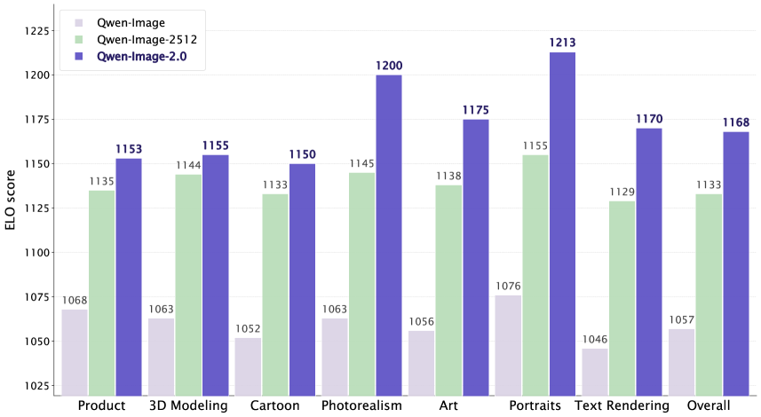

<figcaption>（冒頭ショーケース 1）Qwen-Image-2.0 の生成例。</figcaption>
</figure>

<figure>

<figcaption>（冒頭ショーケース 2）Qwen-Image-2.0 の生成例。</figcaption>
</figure>

<figure>

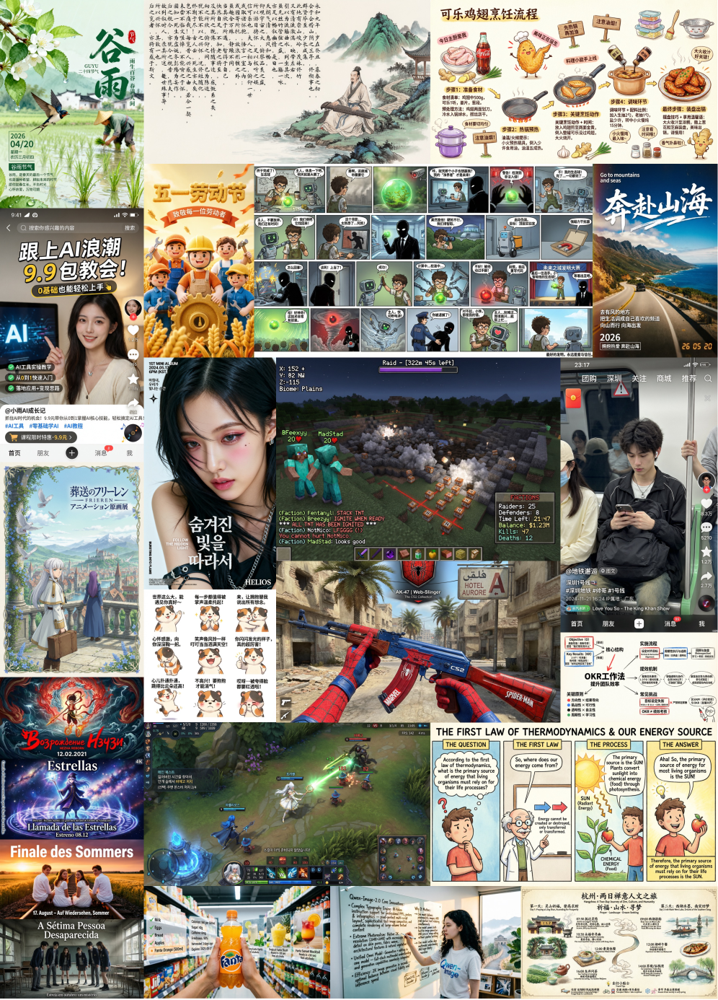

<figcaption>（冒頭ショーケース 3）Qwen-Image-2.0 の生成例。</figcaption>
</figure>

<figure>

<figcaption>（冒頭ショーケース 4）Qwen-Image-2.0 の生成例。</figcaption>
</figure>

## はじめに

画像生成は、マルチモーダル基盤モデル研究の急速な進展に牽引され、大幅に前進した。拡散モデルとフローベース生成モデル、Transformer ベースの視覚生成アーキテクチャ、そして拡散過程の生成能力と Transformer バックボーンのスケーラビリティを組み合わせたそれらの発展的変種が、集合的に高忠実度の視覚合成の強力な基盤を確立した。この分野は初期の潜在拡散モデルから拡散 Transformer へと進化し、さらに最近の枠組みでは視覚言語基盤モデルを条件エンコーダとして採用するようになった。それらのより強い意味的接地とマルチモーダルな世界知識が、より精密な指示追従とテキスト・画像整合を可能にする。並行して商用システムも生成品質とユーザー体験の最前線を押し広げてきた。これらの努力が相まって、高忠実度の画像合成、視覚的テキストレンダリング、指示ベース編集が実世界でのデプロイに向けてますます実現可能な段階へと分野を前進させた。

こうした進歩にもかかわらず、これらのモデルが実世界の創作ワークフローにデプロイされる際にはいくつかのボトルネックが残る。第一に、**超長文テキストレンダリングは依然として脆弱**である。レンダリングされる文字数が増えるにつれて、現在のモデルはグリフの歪み、文字の欠落、レイアウトの崩壊を増大させ、スライド・インフォグラフィック・ポスターといったテキスト密度の高い応用での有用性を制限する。第二に、**多言語タイポグラフィは未発達**である。ほとんどのシステムは主に英語または中国語のグリフで学習されており、その他の文字体系について正確な文字、一貫した字間、正しい読み順を生成するのに苦戦する。さらに高解像度では写実的生成も劣化する。名目上は大きなキャンバスの出力を生成できる場合でも、2K 解像度以上ではしばしば反復的なテクスチャ、一貫性のない照明、細粒度の詳細の喪失が生じる。**複雑な指示追従**については、複数の実体・空間的制約・構成的論理を含むプロンプトが頻繁に概念の欠落や視覚的幻覚を招き、意味理解のギャップを露呈する。さらに、現行アーキテクチャの計算コストは重大な効率のボトルネックとなり、レイテンシに敏感で資源が限られた環境でのデプロイを制約する。

これら個別の制約を超えて、より根本的な課題は**これらの能力を単一モデル内に統一すること**にある。既存システムは典型的に 1 つの軸に沿って秀でる——写実的な画像を生成するか正確なテキストレンダリングを行うか、text-to-image 生成を支援するか画像編集を支援するか——のいずれかであり、別々のパイプラインに頼るか顕著な品質のトレードオフを被ることなく、すべての能力を同時に提供することは稀である。深いマルチモーダル理解と高忠実度の生成を橋渡しし、text-to-image 生成と画像編集を単一の効率的なアーキテクチャの下に統一することは、依然として未解決の問題である。

これらの課題に対処するため、我々は Qwen-Image-2.0 を提示する。これは text-to-image 生成と画像編集を単一の枠組み内で統一する画像生成基盤モデルである。Qwen-Image-2.0 は、異なるタスク型と画像特性に合わせた細粒度キャプショニング枠組みを中心に構築された包括的なデータインフラに基礎を置く。多段階・多解像度のデータパイプラインが、フィルタリングされたコーパス、編集ペア、合成データ、精選された高解像度サンプルを漸進的に組み込む。一方、自動化された**データフライホイール**が評価信号とユーザーフィードバックを活用して失敗モードを特定し、反復的な洗練を駆動する。

アーキテクチャ的には、本モデルは Qwen3-VL エンコーダと Multimodal Diffusion Transformer（MMDiT）バックボーンを結合する。ネイティブな高解像度生成を可能にするため、我々は **16 倍の空間ダウンサンプリング比を持つ高圧縮変分オートエンコーダ（VAE）** を導入する。これは残差オートエンコーディング、拡大された潜在チャネル、意味的整合損失を組み込み、圧縮効率・再構成忠実度・潜在拡散可能性（diffusability）のバランスを取る。MMDiT はテキストと画像のトークンを、モダリティ横断の位置符号化のための MSRoPE とともに同時にモデル化し、同時にテキスト・画像同時学習を安定化するため RMSNorm による QK 正規化、バイアスなし変調（bias-free modulation）、SwiGLU 活性化を用いる。

これらの構成要素を統合するため、我々は大規模事前学習、継続事前学習、教師あり微調整、そして**人間フィードバックからの強化学習（RLHF）** にまたがる漸進的な多段階学習レシピを採用する。解像度カリキュラムが低解像度から高解像度へと段階的にスケールし、最適化を安定化しつつ詳細の忠実度と高解像度の一貫性を改善する。選好整合については、RLHF 段階が美的品質・テキスト画像整合・肖像品質・指示追従・視覚的一貫性のためのタスク特化型報酬モデルを用い、次に **Group Relative Policy Optimization（GRPO）** の上に構築された拡散 RL 枠組みで生成方策を最適化する。

これらの設計選択が相まって、前述のボトルネックを統一アーキテクチャ内で解決するモデルが得られる。Qwen-Image-2.0 の主要な貢献は次のようにまとめられる：

- **長文脈対応のプロ級テキストレンダリング**。Qwen-Image-2.0 は最大 1K トークンのプロンプトを支援し、スライド・ポスター・インフォグラフィックといったテキスト密度の高い視覚出力を直接生成でき、従来システムに対して大幅に改善されたグリフ忠実度を持つ。
- **広範な多言語レンダリング**。本モデルは広範な言語を扱え、より高い文字精度と、より美しく複雑なタイポグラフィへの対応を持つ。
- **高解像度の写実的生成**。ネイティブ 2K 解像度対応により、Qwen-Image-2.0 は肖像・自然風景・建築画像にわたってより細かいテクスチャの詳細、より一貫した照明、よりリアルな材質を生成する。
- **多様なスタイルにわたる頑健な芸術表現**。本モデルは多様な美的設定の下で頑健な品質を維持し、芸術スタイル間の品質のばらつきを効果的に低減する。
- **より精密な指示追従**。Qwen-Image-2.0 は複雑で構成の重いプロンプトに対してより強い意味理解を実証する。
- **生成と編集の統一**。単一のモデルが統一されたアーキテクチャと学習パラダイムの下で text-to-image 生成と指示ベース画像編集の双方を支援する。
- **改善された推論効率**。アーキテクチャと学習戦略の同時最適化により、Qwen-Image-2.0 は視覚品質を保持しつつより高速な推論を達成し、対話的な創作ワークフローに適する。

## データ

### 2.1 データ収集

<figure>

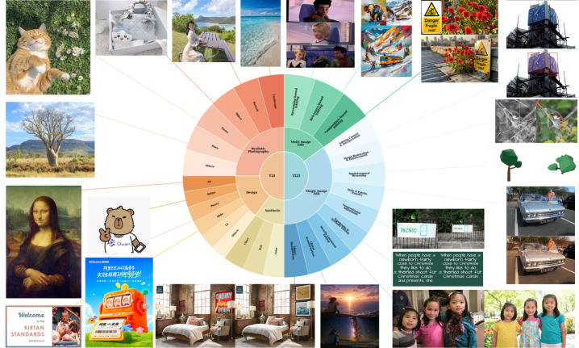

<figcaption>図5: 画像カテゴリにわたる Qwen-Image-2.0 のデータ分布。</figcaption>
</figure>

我々は text-to-image 生成と指示ベース画像編集の双方の統一学習を支援するため、大規模で多様なデータパイプラインを構築する。データ構築は 3 つの原則に導かれる：広範なドメインのカバレッジ、強い指示品質、信頼できるソース・ターゲット間の一貫性。

**Text-to-Image（T2I）生成**については、写実的写真、グラフィックデザイン、芸術的コンテンツ、合成画像にまたがる画像・テキストペアを収集する。写実的サブセットは肖像・風景・物体その他の一般的な視覚ドメインをカバーしつつ、ロングテールの概念と多様なシーン構成を保持する。自然画像を超えて、美的感覚・構成・視覚的意図に対する制御性を改善するため、スライド・ポスター・レンダリング資産といったスタイル豊かでレイアウト感応的なコンテンツも組み込む。

**画像編集（TI2I）**については、単一画像と複数画像の双方の設定で指示条件付きデータをキュレーション・合成する。単一画像サブセットは属性修正、背景置換、スタイル転送、テキスト編集、復元、構造認識的操作を含む。複数画像サブセットは参照ベースの生成と編集、被写体の一貫性、画像間のスタイル転送、構成的な統合に注力する。このカバレッジにより、モデルは単純な外見変更から意味的・空間的推論を要するより複雑な変換まで、幅広い編集挙動を学習できる。

### 2.2 データアノテーション

多様で複雑なシナリオにわたる包括的かつ詳細な画像記述を実現するため、我々は異なるタスク型と画像特性に合わせた細粒度キャプショニング枠組みを構築する。具体的には、**General captions**、**Text captions**、**Knowledge captions**、**Structured captions** のための専用キャプショニング方式を設計する。

#### General captions

General captions は任意の解像度と複雑さの画像向けに設計され、視覚コンテンツの包括的で詳細な自然言語記述を提供することを目指す。この型は画像内の主要な物体、シーン文脈、空間関係だけでなく、存在する場合にはテキストコンテンツとその意味もカバーする。加えて、この型は多言語生成と可変長のキャプションを支援する。

#### Text captions

密なテキストや抽象的な記号を含む画像については、プレゼンテーションスライド、漫画、ポスター、教育教材といった複雑でテキスト中心の視覚資料に特化してキャプションを付けるため、複数のプロンプトテンプレートを開発する。general captions と比較して、この型は密なテキストコンテンツ、レイアウト構造、視覚的記号、およびそれらの意味的関係を正確に抽出することにより重きを置く。結果として、この型はテキストが豊富で構造的に複雑かつ意味的に組織された画像を含むシナリオにより適する。

#### Knowledge captions

Knowledge captions は、画像に関連する背景情報、文脈的手がかり、補助的条件を条件の形で注入することでキャプションを豊かにする。この目的は、画像の意味と関連する世界知識を併せて捉えるモデルの能力を高めることである。明示的に見えるコンテンツのみに注目するキャプションと異なり、この型は画像に関連付けられた補足情報を組み込み、モデルがより豊かな意味的接続と世界知識を構築するのを助ける。

#### Structured captions

関係グラフ、フローチャート、ダイアグラムのように、複雑な関係と多数の要素を持つ画像については、自然言語記述のみでは物体とその相互作用を完全かつ明瞭に表現するには不十分なことが多い。この問題に対処するため、画像内の実体・属性・関係を明示的にモデル化する structured captions を採用する。この型は複雑な視覚構造のより正確な特徴づけを可能にし、視覚要素間の階層的関係、位相的依存関係、意味的相互作用の学習を促進する。

### 2.3 多段階の学習データ戦略

<figure>

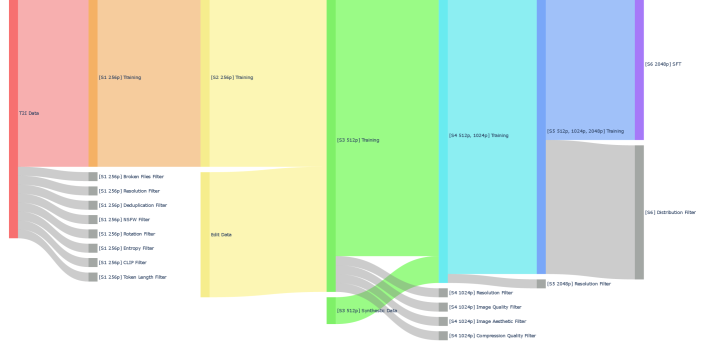

<figcaption>図6: Qwen-Image-2.0 のデータパイプラインの概観。</figcaption>
</figure>

視覚生成モデルの反復的開発を通じて高品質でよくキュレーションされた学習データを確保するため、我々は Qwen-Image に基づき、図6 に示す 6 つの逐次段階からなる多段階フィルタリングパイプラインを設計した。これらのフィルタリング段階は学習過程を通じて漸進的に適用され、データ分布は時間とともに継続的に洗練される。

#### Stage 1: 256P T2I 事前学習

第一段階では、生の T2I データが学習のクリーンな基盤を確立するため、包括的な 8 つの逐次フィルタを通過する。この段階は 256×256 解像度の学習データを対象とするため、まず **Broken Files Filter** で破損または読み取り不能なサンプルを除去し、続いて **Resolution Filter** で必要な 256×256 解像度基準を満たせない画像を破棄する。次に **Deduplication Filter** を適用して冗長なサンプルを排除する。続いて **NSFW Filter** が不適切なコンテンツを除去し、**Rotation Filter** が不適切な向きの画像を補正または破棄する。**Entropy Filter** は情報量が異常に低いまたは高い画像を除外するために用いられ、**CLIP Filter** は類似度スコアの低いペアを除去することで強い画像・テキスト整合を確保する。最後に **Token Length Filter** が、テキスト記述が許容トークン長の範囲を超えるサンプルを除去する。

#### Stage 2: 256P T2I & TI2I 事前学習

Stage 1 のフィルタリング済み 256p T2I データの上に、Stage 2 はテキスト誘導画像編集タスクを支援するため **Edit Data** を導入する。フィルタリング済み T2I データと TI2I データが結合され、Stage 2 の学習に直接使用される。この段階では、すべての学習が 256p 解像度で行われ、統一された低解像度事前学習の設定下でモデルが text-to-image 生成とテキスト誘導画像編集の双方を学習できるようにする。

#### Stage 3: 512P T2I & TI2I 事前学習

Stage 3 は学習解像度を 256p から 512p へスケールする。Stage 2 から引き継いだデータに加え、より高い 512p 解像度で学習分布を豊かにしデータ多様性を改善するため **Synthetic Data** が導入される。フィルタリング済み T2I データ、Edit Data、Synthetic Data からなる結合データセットが Stage 3 の学習に使われ、モデルが 512p での生成・編集能力をさらに改善できるようにする。

#### Stage 4: 512P/1024P T2I & TI2I 事前学習

Stage 4 は事前学習を 512p と 1024p の双方をカバーする混合解像度の設定へさらに拡張する。1024p 解像度での学習を支援するため、選択されたサンプルが高解像度学習に適することを確保する追加のフィルタリング手順が適用される。具体的には、**Resolution Filter** が十分な空間解像度を持つ画像を保持し、**Image Quality Filter** が低忠実度の画像を除去し、**Image Aesthetic Filter** が視覚的に魅力的なサンプルを選択し、**Compression Quality Filter** が激しく圧縮されたまたはアーティファクトの多い画像を破棄する。結果として得られた高品質な 512p/1024p データセットが Stage 4 の学習に使われる。

#### Stage 5: マルチ解像度 T2I & TI2I 事前学習

Stage 5 は学習体制を 512p、1024p、2048p の解像度をカバーするより広いマルチ解像度設定へ拡張する。新たに導入される 2048p の学習データを支援するため、より厳しい 2048p 解像度要件を満たす画像を選択する専用の **Resolution Filter** が適用される。この段階により、モデルは複数のスケールにわたるデータから学習でき、高解像度画像を生成・編集する能力をさらに強化する。

#### Stage 6: 教師あり微調整

最終段階は、モデルを高品質な人間の選好によりよく整合させるため教師あり微調整（SFT）を行う。解像度範囲を 256p から 2048p へ漸進的に拡張する先行の事前学習段階と異なり、Stage 6 は目標の高解像度設定にわたるデータ分布とサンプル品質の洗練に注力する。**Distribution Filter** が、先行段階のフィルタリング演算子をより厳格な閾値で再利用することにより、低品質または不均衡なサンプルを除去するために適用される。洗練されたデータが SFT に使われ、高解像度・高忠実度の視覚生成と編集に最適化された最終的な微調整モデルを生む。

### 2.4 閉ループのデータフライホイールシステム

<figure>

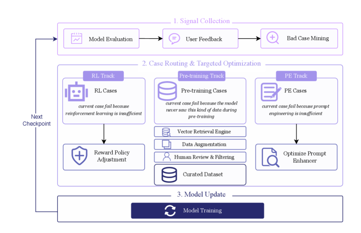

<figcaption>図7: 多トラックの的を絞った最適化のための、誤り帰属駆動型の閉ループ・データフライホイール。</figcaption>
</figure>

画像生成・編集モデルを継続的に最適化し反復的な能力向上を達成するため、我々は高度に自動化された**データフライホイールシステム**を設計・導入する。図7 に示すように、このシステムは 3 つの中核段階からなる閉ループで構成される：

- **Stage 1: 多源信号の収集**。フライホイールはモデルの現在の能力と失敗モードの包括的な評価から始まる。システムは標準化されたモデル評価、的を絞ったバッドケースマイニング、そして実世界のオンライン対話と学習過程で生成された内部自己評価ケースの双方を含む多様な源からのユーザーフィードバックを通じて、フィードバック信号を自動的に収集する。これらの信号が相まって、後続のモデル最適化のための頑健なデータ基盤を確立する。
- **Stage 2: ケースのルーティングと的を絞った最適化**。収集された失敗ケースは一様に処理されない。代わりに、**誤り帰属（error attribution）機構**に従って 3 つの異なる最適化トラックへ自動的に振り分けられる：
	- **RL トラック**。強化学習の不足に起因する整合または方策関連の問題については、システムが該当ケースを RL トラックに割り当て、自動化された報酬方策の調整を通じて対処する。
	- **事前学習トラック**。失敗が知識の欠如、すなわちモデルが事前学習中に類似データに十分に触れていないことに帰属される場合、そのケースは事前学習指向のデータ補償トラックへ振り分けられる。このトラックでは、システムがベクトル検索エンジンを 2 つの目的で自動的に呼び出す：第一に、失敗が特定のデータカテゴリの希少性に起因するかを診断すること。第二に、画像生成のための多様なテキストプロンプト、および画像編集のための包括的な指示・画像ペア（編集プロンプトとそれに対応する元画像を含む）を検索・一般化すること。自動化されたデータ拡張と、パイプライン内で唯一の手動介入である必要な人手のレビュー・フィルタリングを通じて、特定された知識ギャップを埋めるための精選データセットが構築される。
	- **プロンプトエンジニアリング・トラック**。モデルが必要な能力をすでに備えているが、不正確な指示理解や次善のプロンプト定式化のために失敗する場合、そのケースはプロンプトエンジニアリング・トラックへ割り当てられ、システムが最適化されたプロンプトエンハンサを通じて入力を自動的に洗練する。
- **Stage 3: モデル更新と閉ループ**。上記のトラックからの戦略、新しいデータセット、パラメータ更新を集約した後、システムは次の学習ラウンドを自動的に開始する。得られたチェックポイントは評価とデプロイのために Stage 1 へ戻される。この「失敗の発見、的を絞った是正、モデル更新」の反復過程が自己強化的な最適化ループを形成する。

まとめると、このデータフライホイールシステムは継続的なモデル進化のための高度に自動化された閉ループ枠組みを提供する。手動介入を重要なデータフィルタリングに限定することで、データの信頼性を保ちつつエンジニアリングのオーバーヘッドを大幅に削減する。さらに、その誤り帰属機構が的を絞った資源効率の良い最適化を可能にし、ベクトル検索エンジンが学習データの多様性を継続的に豊かにすることで、複雑な生成・編集シナリオにおけるモデルの汎化能力と頑健性を改善する。

## アーキテクチャ

<figure>

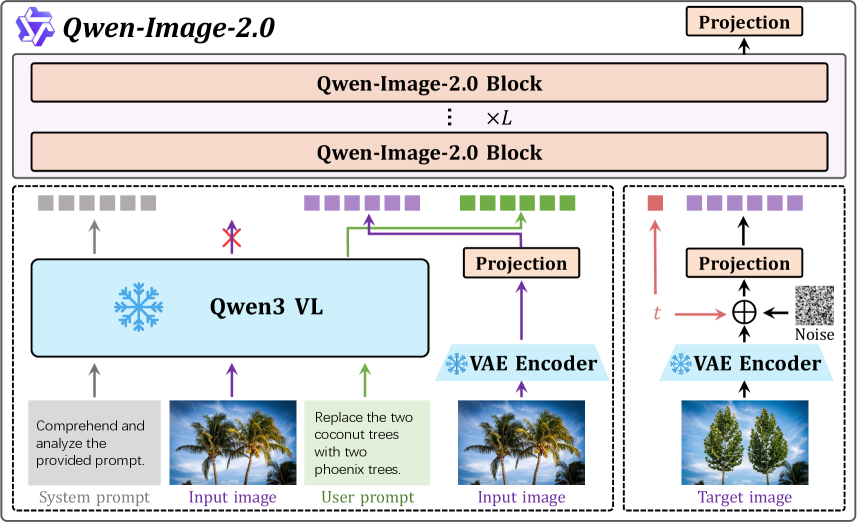

<figcaption>図8: Qwen-Image-2.0 アーキテクチャの概観。本モデルは MMDiT アーキテクチャを採用し、入力表現は凍結された Qwen3-VL と VAE エンコーダによって提供される。QK-Norm に RMSNorm を用い、他のすべての正規化層は LayerNorm を使用する。テキストと画像の両モダリティからなる統一ストリームは、Qwen-Image で導入された MSRoPE 符号化による同時位置計算を採用する。表現力の向上と学習安定性の強化のため、MLP 層の非線形活性化関数として SwiGLU を採用する。</figcaption>
</figure>

図8 に示すように、Qwen-Image-2.0 アーキテクチャは、高忠実度・可制御・効率的な T2I 生成を可能にするために協調して働く 3 つの中核的で密結合した機能構成要素からなる。第一は**マルチモーダル大規模言語モデル（MLLM）**で、我々の実装では Qwen3-VL としてインスタンス化され、条件エンコーダとして機能しユーザー入力から意味的特徴を抽出する。第二は **VAE** で、画像を潜在表現に符号化し生成された潜在を画像空間へ復号する。第三は **MMDiT** で、マルチモーダル表現を条件として潜在空間での中核的なノイズ除去過程を実行する。

### 3.1 変分オートエンコーダ

高圧縮 VAE はネイティブな高解像度画像合成に不可欠である。画像をコンパクトな潜在表現へ射影することで拡散学習コストを大幅に削減するからである。既存のオープンソース VAE が典型的に 8 倍の圧縮率を採用するのに対し、我々は DiT 学習をさらに加速するため **16 倍の圧縮率**を採用する。

しかし高圧縮 VAE は、**圧縮率・再構成忠実度・拡散可能性（diffusability, 潜在空間が拡散モデルでどれだけ容易にモデル化できるか）の三者間トレードオフ**に不可避的に直面する。一方では、積極的な圧縮が深刻な情報ボトルネックを導入し、再構成品質を損なう。他方では、潜在チャネル数を増やして情報を保持すると、拡散しにくい高次元の潜在多様体が生じ、収束の遅延と生成品質の劣化を招く。

再構成のボトルネックを緩和するため、我々は**残差オートエンコーダ**アーキテクチャを採用する。これは細粒度の空間的詳細をよりよく保持するため非パラメトリックなショートカット接続を組み込む。加えて、潜在次元を **64 チャネル**に増やす。この **f16c64** 構成は標準的な f8c16 ベースラインと同じ総チャネルボトルネックを保ち、より高い圧縮率の下で高忠実度の再構成を可能にする。テキストが密なシナリオでの再構成品質をさらに改善するため、テキストが豊富な画像の大規模内部コーパスでモデルを学習する。このコーパスは実世界の文書（PDF、プレゼンテーションスライド、ポスター）と合成された段落を含み、英語のような表音文字と中国語のような表語文字の双方をカバーする。

潜在空間の拡散可能性を高めるため、我々は VA-VAE に従い、従来の再構成目的に加えて**意味的整合損失（semantic alignment loss）** を導入する。具体的には、多様なドメイン・アスペクト比・解像度にまたがる広範な画像コレクションについて、学習された潜在空間を意味的表現と整合させる。VAE は再構成損失、知覚損失、意味的整合損失で最適化される。最適化中、我々は 2 つの重要な観察を行う。第一に、**動的な意味的整合が非常に効果的である**：学習初期に強い意味的整合制約を課すことは拡散可能な潜在空間の確立に不可欠であり、後にこの制約を徐々に緩和することで再構成忠実度と拡散可能性のより良いバランスが可能になる。第二に、**敵対的損失は大規模 VAE 学習ではほぼ冗長である**。これは最近の知見と一致する。したがって我々は学習安定性を改善するため敵対的目的を除去する。

#### VAE の再構成性能

我々は Qwen-Image-2.0-VAE を最先端の画像トークナイザと、再構成指標として PSNR（Peak Signal-to-Noise Ratio）と SSIM（Structural Similarity Index Measure）を用いて定量的に比較する。先行研究に従い、一般ドメインの再構成を ImageNet-1k 検証集合の 256×256 解像度で評価する。小さく密なテキストに対する忠実度を評価するため、多様なテキスト源と言語からなる社内のテキストが豊富なコーパスでの結果もさらに報告する。表1 に示すように、Qwen-Image 2.0-VAE は 16 倍の圧縮率の下ですべての指標にわたって最先端の性能を達成する。

**表1**: 異なる設定下での VAE の定量評価結果。

| モデル | 設定 | Enc (M) | Dec (M) | ImageNet PSNR | ImageNet SSIM | Text PSNR | Text SSIM |
| --- | --- | --- | --- | --- | --- | --- | --- |
| SD-3.5 | f8c16 | 34 | 50 | 31.22 | 0.8839 | 29.93 | 0.9658 |
| Cosmos-CI8x8 | f8c16 | 31 | 46 | 32.23 | 0.9010 | 30.62 | 0.9664 |
| Wan2.1 | f8c16 | 54 | 73 | 31.29 | 0.8870 | 26.77 | 0.9386 |
| HunyuanVideo | f8c16 | 100 | 146 | 33.21 | 0.9143 | 32.83 | 0.9773 |
| FLUX.1-dev | f8c16 | 34 | 50 | 32.84 | 0.9155 | 32.65 | 0.9792 |
| Qwen-Image | f8c16 | 54 | 73 | 33.42 | 0.9159 | **36.63** | **0.9839** |
| HunyuanImage-3.0 | f16c32 | 389 | 871 | 31.08 | 0.8655 | 29.23 | 0.9521 |
| Wan2.2 | f16c48 | 150 | 555 | 31.30 | 0.8784 | 28.19 | 0.9508 |
| Stepvideo-T2V | f16c64 | 110 | 389 | 31.54 | 0.8973 | 29.62 | 0.9641 |
| **Qwen-Image-2.0** | f16c64 | 79 | 259 | **33.42** | **0.9225** | 32.81 | 0.9795 |

### 3.2 マルチモーダル拡散 Transformer

図8 は Qwen-Image-2.0 の全体アーキテクチャを図示する。これは T2I と TI2I 生成のための統一枠組みであり、交互配置された複数画像入力を自然に支援する。テキストと視覚のモダリティを同時かつ効率的にモデル化するため、テキストトークンと画像トークンが共有 Transformer バックボーン内で処理される MMDiT アーキテクチャを採用する。

具体的には、視覚入力 $\bm{x}$ とテキスト入力 $\bm{y}$ が与えられると、Qwen3-VL がまずそれらをモダリティ認識的な表現 $\bm{h}_{\bm{x}}$ と $\bm{h}_{\bm{y}}$ にそれぞれ符号化する。視覚表現 $\bm{h}_{\bm{x}}$ は次に、変分オートエンコーダが抽出した潜在表現 $\mathcal{E}_{\bm{x}}$ で**置き換えられる**。得られたマルチモーダル系列は連結によって構成される：

$$
\bm{h}=\mathrm{Concat}\left(\mathcal{E}_{\bm{x}},h_{\bm{y}}\right),
$$

これが続いて Qwen-Image-2.0 ブロックへ供給される。テキストと視覚の両トークンにわたる位置情報を統一的に符号化するため、注意モジュール内で MSRoPE を採用する。変調モジュールについては、バイアス項を除去し純粋に乗法的な変調の定式化を採用する：

$$
\bm{h}^{\prime}=\alpha\bm{h},
$$

これは従来のアフィン形式 $\bm{h}^{\prime}=\alpha\bm{h}+\beta$ の代わりであり、$\alpha$ と $\beta$ はスカラーの変調パラメータを表す。

実践において、テキスト・画像の同時学習が過度に大きな活性値の大きさを誘発し、モデル内のニューロンの早期飽和を招きうることを観察する。この問題を緩和するため、多層パーセプトロン（MLP）層に **SwiGLU** モジュールを導入する。潜在表現 $\bm{x}$ が与えられると、SwiGLU 変換は次のように定式化される：

$$
\bm{h}=\Phi_{1}\left(\bm{x}\right)\otimes\sigma\left(\Phi_{2}\left(\bm{x}\right)\right),
$$

ここで $\Phi_{1}(\cdot)$ と $\Phi_{2}(\cdot)$ は線形射影関数を表し、$\sigma(\cdot)$ は SiLU 活性化関数、$\otimes$ は要素ごとの乗算を表す。

### 3.3 プロンプトエンハンサ

インフォグラフィック、ポスター、タイポグラフィのレイアウト、複数コマのストーリーボード、データ可視化といった複雑な画像生成タスクでは、生成品質はモデルの視覚合成能力と、プロンプトによるレイアウト・物体関係・視覚的階層・構成的意図の指定の双方に依存する。しかし実世界のユーザープロンプトは粒度と明示性が大きく異なり、高複雑度の視覚創作にとって重要なボトルネックを生む。この目的のため、我々は**プロンプトエンハンサ（Prompt Enhancer, PE）** を導入する。これは様々な具体度のユーザークエリを構造化された詳細豊かなプロンプトへ変換する書き換えモジュールであり、下流の生成器が多様なタスクにわたって意図された視覚デザインをよりよく捉えられるようにする。

#### データ構築

我々は**逆工学パイプライン**を通じてプロンプト強化データを構築する。これは細粒度のアノテーションを多様で口語的なユーザープロンプトへ原子的に劣化させつつ、逆方向の推論トレースを学習の教師信号として記録する。詳細な画像アノテーション $P_{\mathrm{fine}}$ が与えられると、まず LLM を用いてそれを 4 つの画像生成カテゴリ（General、Portrait、Text、Complex Text）のいずれかに分類する。このタスク認識的な分類により、後続の劣化過程が意味的に接地され各プロンプト型の特性に適応することが保証される。予測されたカテゴリに基づき、事前定義された戦略プールから適用可能な劣化戦略の集合 $\mathcal{S}$ をサンプルする。

実世界のユーザー入力のロングテール分布を近似するため、劣化過程に確率性を導入する。具体的には、事前定義された確率分布に従って $\mathcal{S}$ から戦略の部分集合をサンプルする。これらの戦略には、文体の単純化、口語化、そして照明・テクスチャ・レイアウト・背景といった視覚的詳細の除去や過少指定が含まれる。これらを $P_{\mathrm{fine}}$ に適用すると劣化したプロンプト $P_{\mathrm{short}}$ が生成される。サンプリング比率を調整することで、パイプラインは難易度・曖昧さ・情報密度の異なる学習例を生成する。

この構成は自然に**逆方向の推論連鎖**、すなわちプロンプト強化のための **Chain-of-Thought（CoT, 思考連鎖）** を生む。各劣化操作 $s\in\mathcal{S}$ は元のアノテーションから情報を除去または不明瞭にするため、その逆はプロンプトの復元と充実化のための原理的な軌道を定義する。得られる三つ組 $(P_{\mathrm{short}},\mathrm{CoT},P_{\mathrm{fine}})$ により、モデルは強化されたプロンプトと、その根底にある意図拡張の過程（残った属性から照明・材質・空間・文体の手がかりを推論するなど）の双方を学習できる。この逆工学パイプラインは T2I 生成タスクに使われる。画像編集については、入力画像がすでに豊かな視覚的文脈を提供するため、不要な確率的劣化を避け、代わりに MLLM を用いて長文のアノテーションを簡潔な編集プロンプトへ要約する。

#### PE の学習

PE モジュールは Qwen3.5-9B から初期化され、画像生成と画像編集の双方のための統一プロンプト強化モデルとして学習される。学習過程は 2 つの連続する段階からなる：SFT に続く RL。この 2 段階設計は、まず精選された教師データから安定した書き換え挙動をモデルに備えさせ、次に書き換えられたプロンプトを下流の画像生成品質にさらに整合させる。

SFT の間、モデルは標準的な次トークン予測目的で構築されたデータセット上で学習され、生成・編集の双方のシナリオにわたる意図の保持、シーンの充実化、構成の組織化のためのプロンプト強化能力を学ぶ。生成プロンプトはより豊かな視覚的敷衍を要求する一方、編集プロンプトは忠実な指示の保持と既存の視覚的文脈への感応性を要求する。SFT は静的なテキスト参照に依拠し下流の画像品質を直接最適化できないため、我々はさらに GRPO に基づく RL 段階を導入する。PE モデルが候補となる強化プロンプトを生成し、それらが凍結された画像生成器へ供給され、MLLM ベースの視覚的一貫性、MLLM ベースの美的品質、規則ベースのテキスト制約を組み合わせた報酬で最適化される。このエンドツーエンド学習は、ユーザーの意図によりよく整合しつつ生成画像の視覚的結果を改善する書き換えを促す。

教師あり書き換え目的と生成認識的な強化学習を組み合わせることで、PE モジュールはテキストの教師信号と下流の視覚的フィードバックの双方に接地される。結果として、画像生成と編集にとってより忠実で表現豊かで効果的な強化プロンプトを生成する。図9 に示すように、PE モジュールは生成品質、プロンプト追従、推論性能を一貫して改善する。

<figure>

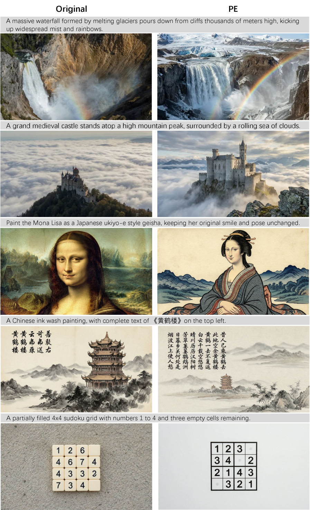

<figcaption>図9: 元のキャプションとプロンプト強化されたキャプションを用いた T2I 結果の定性比較。</figcaption>
</figure>

## 学習

### 4.1 多段階学習

学習中、我々は事前学習、継続事前学習、教師あり微調整の 3 フェーズからなる多段階学習戦略を採用する。これらの段階を通じて、画像解像度、データフィルタリング基準、データ構成を漸進的に調整し、モデルが基本的な意味表現の学習から細粒度の視覚的詳細のモデル化へと進化できるようにする。詳細な構成は表2 にまとめる。

**表2**: 実験で用いた学習構成、データ分布、ハイパーパラメータ。

| 構成 | 事前学習 | 継続事前学習 | 教師あり微調整 |
| --- | --- | --- | --- |
| **学習過程** | | | |
| ステップ数 (K) | 700 | 250 | 10 |
| 解像度 | 256/512 | 512/1024/2048 | 512/1024/2048 |
| バッチサイズ (K) | 32/16 | 16/8/4 | 16/8/4 |
| **データ分布** | | | |
| 型 | T2I/TI2I | T2I/TI2I | T2I/TI2I |
| 比率 | 0.9/0.1 | 0.7/0.3 | 0.7/0.3 |
| **ハイパーパラメータ** | | | |
| オプティマイザ | Adam | Adam | Adam |
| Weight Decay | 0.001 | 0.001 | 0.001 |
| 勾配ノルムクリップ | 1.0 | 1.0 | 1.0 |
| 無条件ドロップアウト | 0.1 | 0.1 | 0.1 |
| 学習率 | $1\times 10^{-4}$ | $2\times 10^{-5}$ | $1\times 10^{-5}$ |

#### 事前学習

事前学習段階では、モデルは主に基本的な意味表現を学習する。データスループットを改善するため、比較的低い解像度で 700K ステップ学習する。学習データは T2I と TI2I データの 9:1 の混合からなる。学習率は $1\times 10^{-4}$ に設定され、大規模な画像・テキストデータから頑健で汎用的な視覚表現をモデルが学習できるようにする。

#### 継続事前学習

継続事前学習段階では、モデルは生成品質をさらに改善し高解像度入力に適応する。モデルは 250K ステップ学習され、その間画像解像度は細粒度の視覚的詳細をよりよく捉えるため 512〜2048 へ徐々に増加される。データ分布は T2I と TI2I データの 7:3 の混合に調整され、強い text-to-image 生成性能を維持しつつ画像編集能力を強化する。この段階での安定した最適化を確保するため、学習率は $2\times 10^{-5}$ に下げられる。

#### 教師あり微調整

教師あり微調整段階では、生成画像の美的品質の改善に注力する。モデルは約 10K ステップ学習される。モデルの世界知識を保持しつつ細粒度の視覚的詳細を強化するため、学習率はさらに $1\times 10^{-5}$ に下げられる。学習データについては、多様なデータカテゴリからサンプルし、高い美的品質を確保するため厳格なフィルタリングと手動でのキュレーションを適用する。

<figure>

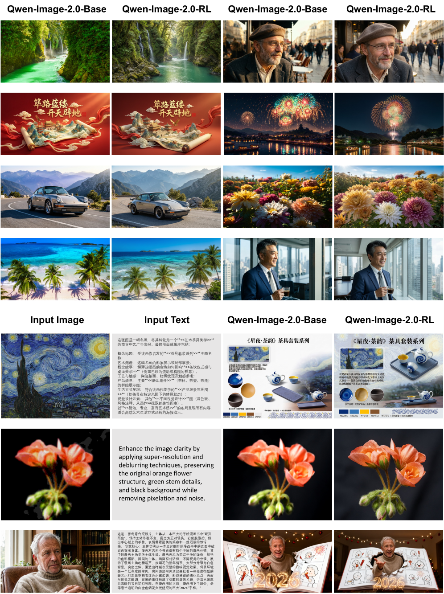

<figcaption>図10: RL 整合の前後における T2I と編集の出力の並列比較。RL による視覚的洗練の改善を図示する。</figcaption>
</figure>

### 4.2 人間フィードバックからの強化学習

Qwen-Image 2.0 を人間の選好により密接に整合させ、T2I と TI2I の双方のタスクにわたる生成品質を高めるため、我々は多次元の報酬信号とサンプル効率の良い最適化アルゴリズムを通じてベース拡散モデルを洗練する RLHF パイプラインを開発する。この手続きは知覚品質とタスク固有の制御性において一貫した改善をもたらす。

#### 報酬モデリング

我々は異なる人間選好アノテーションデータセットからタスク特化型の複合報酬モデルを構築し、各モデルが特定の評価次元を対象とする：

- **美的報酬（T2I 用）**。生成画像の内在的な視覚品質を評価し、構成のバランス、写実的な照明、テクスチャの忠実度、全体的な芸術的一貫性を重視する。
- **画像テキスト整合報酬（T2I 用）**。生成画像と入力プロンプトの間の意味的対応を測定し、ユーザー指定の要求を省略・誤解・矛盾する出力を明示的に罰する。
- **肖像報酬（T2I 用）**。人物被写体の生成のための専門的な最適化信号を提供し、解剖学的な妥当性、顔の比率の正確さ、同一性を保持する顔の詳細、細粒度の肌と髪のテクスチャの写実性を改善する。
- **指示追従報酬（TI2I 用）**。物体置換やスタイル転送といった編集操作をカバーし、ユーザー指定の修正が正確に実行されたかを評価する。
- **視覚的一貫性報酬（TI2I 用）**。元画像と編集画像の間で幾何学的レイアウト、空間的位相、意味的特徴の厳格な一貫性を強制することにより、未修正領域の同一性と構造的完全性を保持する。

すべての報酬モデルは比較可能なスケールで動作するよう較正され、その重みは単一の次元への過剰最適化を避けるため学習を通じて動的に調整される。

#### 学習

我々は適応された GRPO 枠組みを用いてベース拡散モデルを最適化する。拡散ベース強化学習における重要な設計上の考慮点は、ロールアウトのサンプリングと方策最適化の間に **Classifier-free Guidance（CFG）** を用いるべきか否かである。既存研究は異なる戦略を採る：ロールアウトと学習の双方の段階で CFG を適用する手法もあれば、完全に省く手法もある。我々の RLHF パイプラインでは**ハイブリッド戦略**を採用する：報酬評価のための高品質な候補を生成するためロールアウトのサンプリングでは CFG を用いる一方、**無条件分岐は方策最適化の目的からは除外する**。この設計はサンプルされた画像の視覚的忠実度と構造的一貫性を保持し、それによりより信頼できる報酬信号を提供しつつ、無条件モデルの最適化に伴う計算オーバーヘッドを大幅に削減する。得られた RL 整合済みモデルを Qwen-Image-2.0-RL と呼ぶ。実践では、タスク間のプロンプト分布を動的に調整し個々の報酬モデルの相対重みを較正することで最適化過程をさらに洗練し、最終的な視覚品質の改善につなげる。

#### 結果

定性評価は、提案する RLHF パイプラインが T2I 生成と画像編集の双方のタスクにわたって一貫した利得をもたらすことを示す。T2I 生成では、Qwen-Image-2.0-RL がテクスチャの忠実度と全体的な画像の写実性において顕著な改善を実証する。画像編集のシナリオでも同様に、Qwen-Image-2.0-RL はテクスチャ品質と視覚的一貫性を高める。図10 は RL 整合の前後の T2I と編集の出力の並列比較を提示し、結果として得られる視覚的洗練の改善を図示する。

### 4.3 少ステップ蒸留

我々は多ステップのモデルを、視覚品質とプロンプト追従能力を保持しつつより効率的な少ステップの変種へ蒸留することを目指す。しかし大規模マルチモーダルモデルのアーキテクチャの複雑さゆえ、そうした蒸留は依然として非常に困難である。とりわけ、極めて限られた関数評価回数（NFEs）の下で、肖像生成・風景合成・テキストレンダリングといった多様なシナリオにわたるモデルの全能力を保持することが目標である場合はなおさらである。

拡散蒸留の最近の進展は、軌道ベースの最適化や分布レベルのマッチングを含む広範な技術のスペクトルを探求してきた。しかし既存研究のほとんどはクラス条件付きの設定、主に ImageNet に限られており、T2I 生成や画像編集を含むより広く実用的に関連するシナリオでの有効性はほとんど未探求のままである。先進的な拡散蒸留パラダイムの中から、我々は **Distribution Matching Distillation（DMD, 分布マッチング蒸留）** を採用する。その動機は、異種の視覚生成アーキテクチャ（例: Stable Diffusion）における強い経験的安定性と一貫した有効性、および多様な生成シナリオにおける実証された汎用性にある。

具体的には、$\bm{\theta}$ でパラメータ化された条件付き少ステップ生徒生成器 $G_{\bm{\theta}}$、初期ガウスノイズベクトル $\bm{\epsilon}\sim\mathcal{N}(\mathbf{0},\mathbf{I})$、条件 $\bm{c}\sim p(\bm{c})$ が与えられると、対応するクリーン状態の予測を $\bm{x}_{\bm{\theta}}=G_{\bm{\theta}}(\bm{\epsilon},\bm{c})$ と表記する。ここで $G_{\bm{\theta}}$ は広い意味で用いられる：$\bm{x}_{\bm{\theta}}$ は生徒の完全な少ステップ軌道の後に得られる最終的なクリーンサンプルでも、$\bm{c}$ を条件として中間的な生徒状態から直接予測されたクリーン状態でもよい。生徒パラメータ $\bm{\theta}$ に関する DMD 目的 $\ell_{\text{DMD}}(\bm{\theta})$ の勾配は次で与えられる：

$$
\nabla_{\bm{\theta}}\ell_{\text{DMD}}(\bm{\theta})=\mathbb{E}_{\bm{c}\sim p(\bm{c}),\,\bm{\epsilon}\sim\mathcal{N}(\mathbf{0},\mathbf{I}),\,\bm{\xi}\sim\mathcal{N}(\mathbf{0},\mathbf{I}),\,t\sim p(t)}\Big[\big(\bm{s}_{\text{fake}}(\bm{x}_{t},t,\bm{c})-\bm{s}_{\text{real}}(\bm{x}_{t},t,\bm{c})\big)\nabla_{\bm{\theta}}\bm{x}_{\bm{\theta}}\Big],
$$

ここで $\bm{\xi}$ は独立なガウスノイズベクトルを表し、$t\in[0,1]$ は所定の分布 $p(t)$（例: logit-normal 分布）からサンプルされる拡散時刻、$\bm{x}_{t}$ は条件付きで生成されたクリーンサンプル $\bm{x}_{\bm{\theta}}$ とノイズベクトル $\bm{\xi}$ を線形補間して得られる：

$$
\bm{x}_{t}=(1-t)\bm{x}_{\bm{\theta}}+t\bm{\xi}.
$$

ここで $\bm{s}_{\text{fake}}(\bm{x}_{t},t,\bm{c})=\nabla_{\bm{x}_{t}}\log p_{\text{fake},t}(\bm{x}_{t}\mid\bm{c})$ はノイズレベル $t$ における生徒が誘導する分布に関連する条件付きスコア関数を表す。実践では、このスコアは条件付きで生成された生徒サンプル上で flow-matching 目的を用いて学習される補助的な偽スコアモデルによって推定される。一方 $\bm{s}_{\text{real}}(\bm{x}_{t},t,\bm{c})=\nabla_{\bm{x}_{t}}\log p_{\text{real},t}(\bm{x}_{t}\mid\bm{c})$ は同じノイズレベルで事前学習された教師拡散モデルが提供する条件付き目標スコアを表す。

<figure>

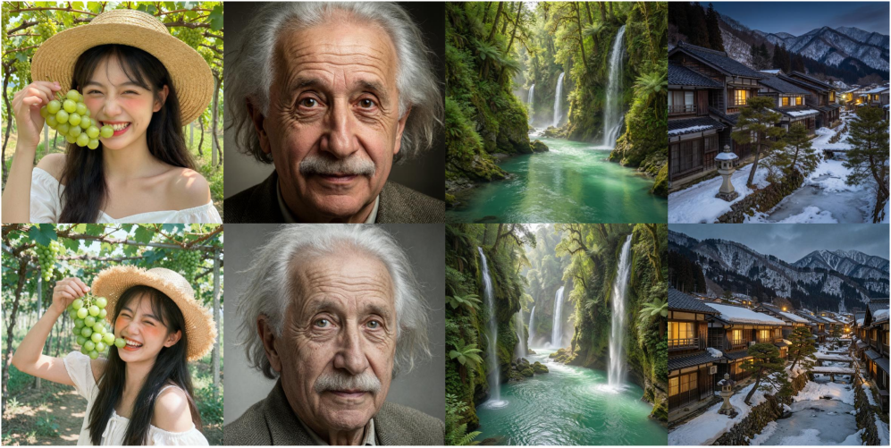

<figcaption>図11: 多ステップの教師と少ステップの蒸留生徒の定性比較。上段は Qwen-Image-2.0-RL が 40 サンプリングステップで生成した画像、下段は Qwen-Image-2.0-Distillation がわずか 4 NFE で生成した画像を示す。肖像・風景・自然シーンを含む多様なプロンプトにわたり、4-NFE の生徒は 40 ステップの教師に匹敵する視覚品質・意味的整合・構成の一貫性を保持しつつ、推論コストを削減する。</figcaption>
</figure>

#### 結果

多ステップの教師として Qwen-Image-2.0-Base から出発し、上記の蒸留手続きを適用して効率的な推論に最適化された少ステップの生徒 Qwen-Image-2.0-Distillation を得る。図11 に示すように、蒸留された 4-NFE の生徒は多様なプロンプトと視覚ドメインにわたって 40 ステップの教師に視覚的に匹敵する結果を生成する。詳細な外見、一貫した構成、忠実な意味的整合を保持しつつ、関数評価回数を大幅に削減する。これらの比較は、我々の DMD ベースの蒸留がサンプリング軌道を効果的に圧縮しつつ知覚品質とプロンプト追従能力を維持することを示す。

## ベンチマークと定性評価

### 5.1 LMArena ベンチマーク評価

Qwen-Image-2.0 の画像生成能力を評価するため、実世界のユーザー選好に基づく主要なベンチマークである **LMArena** で評価する。T2I リーダーボードでは、ユーザーが同じプロンプトから異なるモデルが生成した画像を、生成モデルの正体を知らずに匿名で比較する。このブラインド評価プロトコルは公正性を促進し、ELO ベースのランキングシステムは選好志向のモデル性能の尺度を提供する。

図12 に示すように、Qwen-Image-2.0 はこの広く認知された画像生成ベンチマークで強い性能を達成し、**世界 9 位、中国モデル中 1 位**にランクする。主導的な国際モデルとの直接比較において、Qwen-Image-2.0 は **ELO スコア 1168** でトップ層に到達し、Nano Banana を上回る。図（LMArena レーダー）に示すように、Qwen-Image-2.0 は従来の Qwen-Image シリーズのモデルに対して画像生成と編集の双方で大幅な改善をもたらし、全体的な視覚品質・編集能力・実用性における明確な進歩を実証する。

<figure>

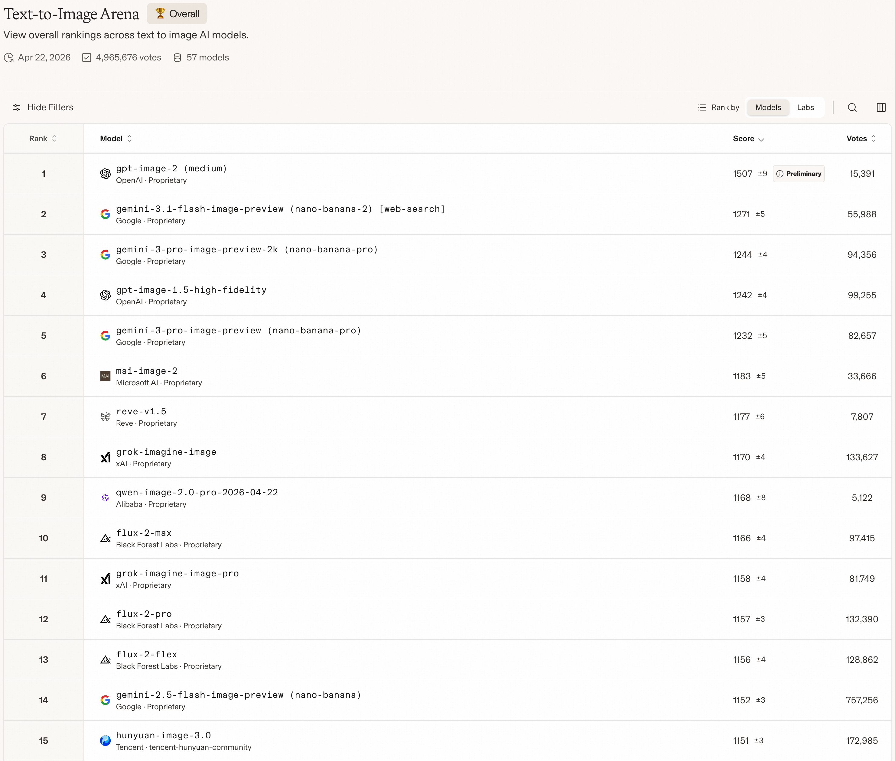

<figcaption>図12: LMArena における Qwen-Image-2.0 の順位（2026年4月22日時点）。</figcaption>
</figure>

### 5.2 Text-to-image 生成の定性的結果

我々は T2I 生成について Qwen-Image-2.0 を定性的に評価し、テキストレンダリング（図13）、肖像生成（図14・15）、多言語テキストレンダリング（図18）、スライド生成（図19）をカバーする。

<figure>

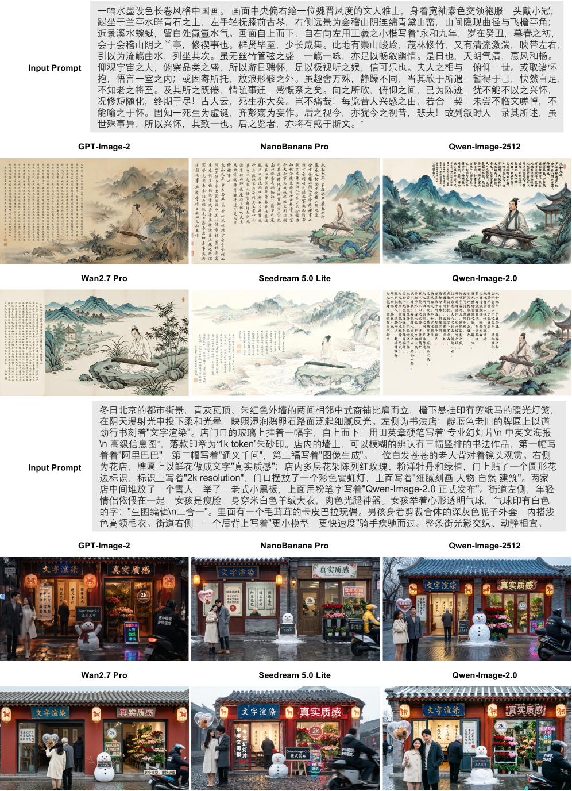

<figcaption>図13: テキストレンダリング結果の定性比較。</figcaption>
</figure>

<figure>

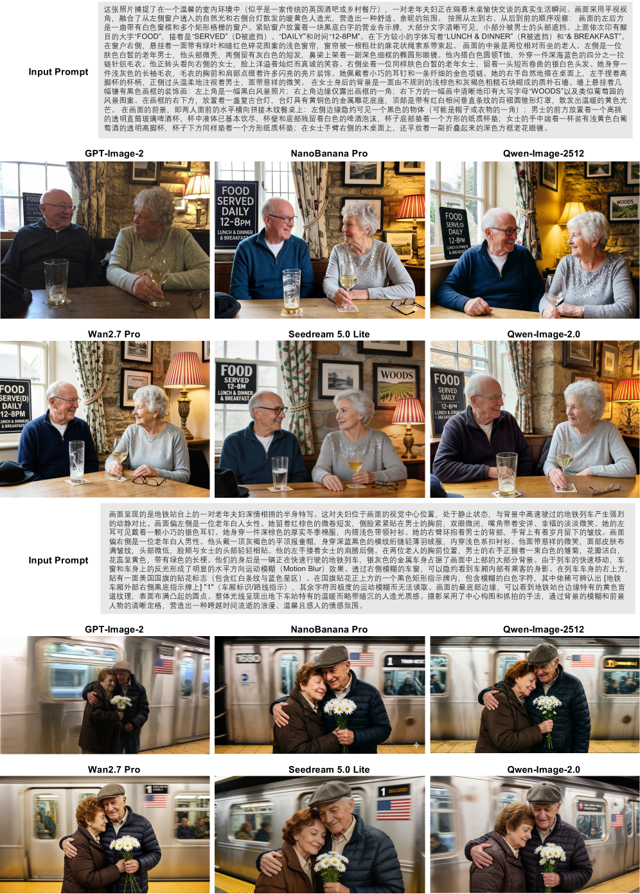

<figcaption>図14: 肖像生成結果の定性比較。</figcaption>
</figure>

<figure>

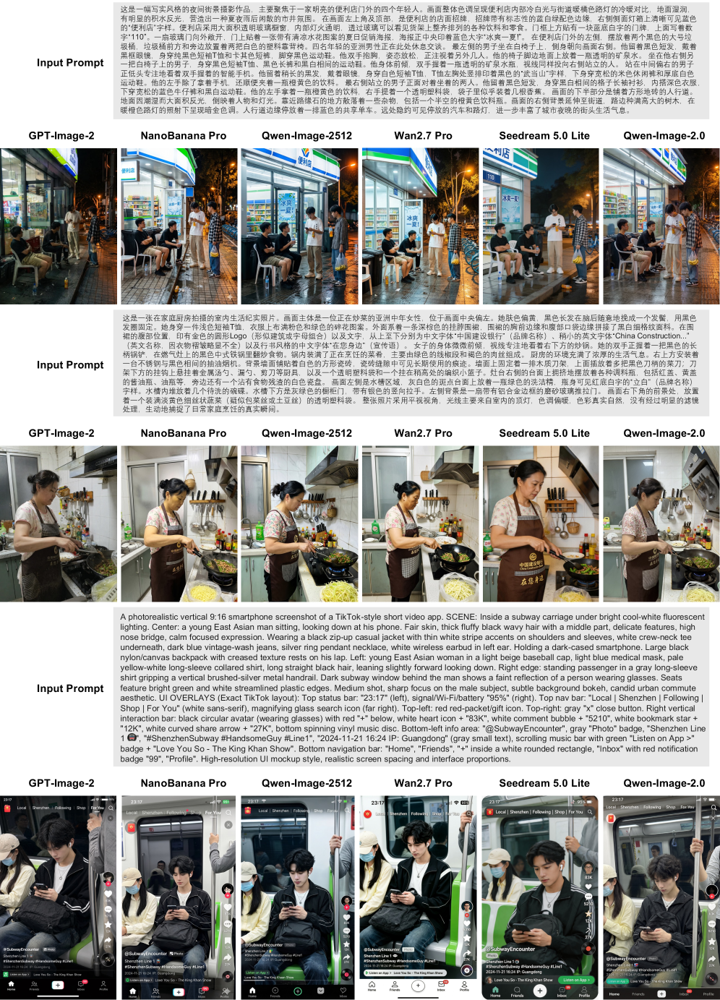

<figcaption>図15: 肖像生成結果の定性比較。</figcaption>
</figure>

#### テキストレンダリング

図13 は異なるモデルにわたる中国語テキストレンダリングの定性比較を提示する。第一の例では、GPT-Image-2 は文字を過度に小さいスケールでレンダリングし、頻繁な文字レベルの誤りを導入する。NanoBanana Pro は完全なプロンプト系列を再現できず、特定のセグメントを誤って重複させつつ複数の誤字も導入する。Qwen-Image-2512 は一貫しないフォントサイズと多数の誤記文字を示す。Wan2.7 Pro は指定されたテキストプロンプトを完全に無視し、代わりに大量の無関係なコンテンツを生成する。Seedream 5.0 Lite は小さすぎて判読困難なテキストを生成し、頻繁な文字の不正確さによってさらに損なわれる。対照的に、Qwen-Image-2.0 のみがテキストレンダリングの目的をほぼ誤りなく達成し、同時に生成されたタイポグラフィのスタイルが全体的な視覚構成と調和的に統合されることを保証する。第二の例では、GPT-Image-2 は主要な見出しはレンダリングするものの、縦のポスターと小さな詳細については大部分が判読不能な文字列を生成する。NanoBanana Pro は左のポスターに支離滅裂なテキストを幻覚する。Qwen-Image-2512 は側面のポスターに判読不能な文字を生成する。Wan2.7 Pro は店の看板を正しくレンダリングするが、乗り手の背中のテキストを空間的に結びつけることに失敗し、その語句を衣服に統合する代わりに右下に切り離された字幕風のオーバーレイとして出力し、シーンの物理的写実性を損なう。Seedream 5.0 Lite は主要な看板をレンダリングするが、縦のバナーに誤った断絶した文字を導入する。注目すべきことに、Qwen-Image-2.0 は文字レベルの正確さ、すべてのテキスト要素の正しい空間的結びつき、そして一貫し物理的に接地されたシーン構成を独自に保持する。

#### 肖像生成

図14 は異なるモデルにわたる肖像生成の定性比較を提示する。第一の例では、GPT-Image-2 は背景の石壁を過度に滑らかで人工的なテクスチャでレンダリングし、伝統的な内装に期待される素朴な不規則性と材質の写実性を欠く。Qwen-Image-2512 と Wan2.7 Pro は遮蔽の指示を誤解し、テキストを文字通り「SERVE(D)」としてレンダリングする。Seedream 5.0 Lite は「DAILY」の語を完全に省略し、文字化けした時刻「12-8M」を生成する。NanoBanana Pro は主要な見出しは捉えるものの、看板を窓枠との物理的統合を欠く平坦で不自然なオーバーレイとしてレンダリングする。対照的に、Qwen-Image-2.0 は看板上の高忠実度のテキストレンダリングを達成すると同時に、正確な材質のテクスチャと自然な照明の一貫性を通じて写実的な雰囲気を保持する唯一のモデルである。第二の例では、NanoBanana Pro は列車の車体に大きく誤った数字（「1680」）を幻覚し、プロンプトで指定されたテキスト制約に違反する。Qwen-Image-2512 は看板に必要な極端なモーションブラーを適用できず、テキストを不自然に歪んだままにする。Wan2.7 Pro は列車に誤って中国語をレンダリングする。Seedream 5.0 Lite は過度に滑らかな髪と肌のテクスチャを生成するだけでなく、数字「1」を完全に判読可能にレンダリングして物理的写実性を損なう。比較して、Qwen-Image-2.0 は列車に強い水平方向のモーションブラーを生成しアメリカ国旗のデカールを正しく配置しつつ、暖かい人工照明とカップルへの親密な感情的焦点を保持できる。

### 5.3 画像編集の定性的結果

TI2I 編集については、単一画像および複数画像の編集タスクにわたる複雑な中国語テキストレンダリングと同一性保持について Qwen-Image-2.0 を評価する。例は図16・17 に示す。

#### 複雑なテキストレンダリング

図16 は異なるモデルにわたる複雑な中国語テキストレンダリングの定性比較を提示する。第一の例では、Qwen-Image-Edit-2511 と NanoBanana Pro が文字を過度に小さいスケールでレンダリングし、風景との視覚的バランスを損なう。Wan2.7 Pro は同じ画像内に 2 つの別々の写しをレンダリングして詩を誤って重複させる。Seedream 5.0 Lite は文字レベルの誤りを示し、詩の冒頭行の一文字を誤記する。対照的に、Qwen-Image-2.0 のみが伝統的な題画詩（ti-hua-shi）の美学に一致するレイアウトを生成し、適切なフォントスケール、縦書き右から左への配置、空の余白内の調和的な配置を特徴とし、同時に文字レベルの正確さも保持する。第二の例は、複数の稀で構造的に複雑な文字を含むより長い 40 文字の詩を含むが、ベースラインモデルは明確な失敗を示す：NanoBanana Pro は対句を並べ替え、詩の正典的な行順を乱す。Seedream 5.0 Lite は詩を元の読み順を壊す不連続な列に断片化する。Qwen-Image-Edit-2511 はレンダリングされたスケールでかろうじて判読可能なテキストを生成する。注目すべきことに、Qwen-Image-2.0 は文字レベルの正確さ、正典的な行順、一貫した縦の構成を同時に保持する唯一のモデルである。

#### 同一性保持

図17 は単一画像と複数画像の双方の編集タスクにおけるモデル間の同一性保持の定性比較を提供する。第一の例では、編集は第一の画像の猫の前にニンジンとティッシュを配置しつつ、第二の画像の帽子をその頭に移すことを要求する。ベースラインモデルは明白な失敗を示す：Qwen-Image-Edit-2511 は猫の毛色と模様を変えてしまう。Wan2.7 Pro は猫の元の姿勢を修正する。Seedream 5.0 Lite はニンジンとティッシュを猫の後ろに誤って配置する。NanoBanana Pro は挿入された物体を不十分な写実性でレンダリングする。対照的に、Qwen-Image-2.0 のみが猫の同一性を保持しつつ編集指示を正確に満たす。第二の例では、コロンビア人の画家が入力画像の人物を描いているスイスの屋外シーンをリアルに生成するタスクである。ベースラインモデルは再び異なる形で失敗する：Qwen-Image-Edit-2511 は描かれる被写体を省略する。Wan2.7 Pro は画家の民族を変え、入力に似ていない女性の人物を生成する。Seedream 5.0 Lite はイーゼルを一貫性なく配置する。NanoBanana Pro は被写体を実質的に異なる顔の特徴と姿勢でレンダリングする。比較して、Qwen-Image-2.0 は被写体の顔の同一性、サングラス、特徴的なカーディガンの模様を独自に保持しつつ複数要素のシーンを正しく構成し、視覚的一貫性を損なわずに精密な物体レベルの編集を行う強い能力を実証する。

<figure>

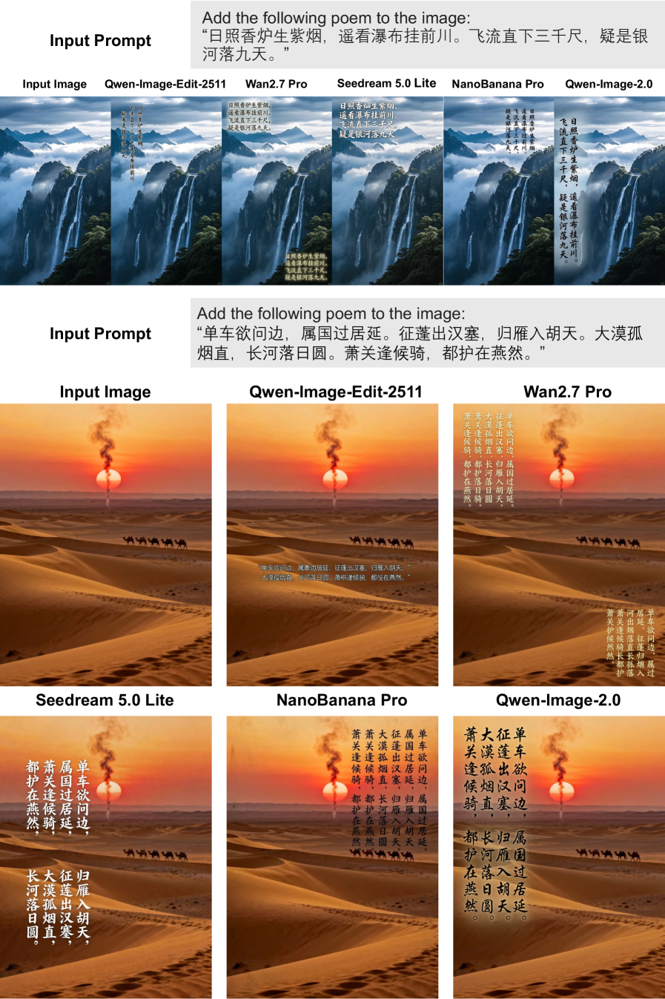

<figcaption>図16: 画像編集タスクにおける複雑な中国語テキストレンダリングの定性比較。Qwen-Image-2.0 は優れた正確さと美的品質を実証し、古典中国詩を正確かつ美的にレンダリングできる唯一のモデルである。</figcaption>
</figure>

> 図17: 同一性保持の定性比較。単一画像・複数画像の編集タスクの双方において、Qwen-Image はユーザー指示に忠実に従いつつ、表情・姿勢・全体的な外見を含む細粒度の物体の詳細を維持する。これらの結果は、視覚的一貫性を犠牲にすることなく精密な物体レベルの編集を行う強い能力を浮き彫りにする。（訳注: 原典のクリップに画像は含まれていない）

> 図18: Qwen-Image-2.0 による多言語レンダリングの可視化。（訳注: 原典のクリップに画像は含まれていない）

> 図19: Qwen-Image-2.0 によるスライド生成の可視化。（訳注: 原典のクリップに画像は含まれていない）

## 結論

本研究では、単一の枠組み内で T2I 生成と指示ベース画像編集の双方を支援する多用途の画像生成基盤モデル Qwen-Image-2.0 を提示する。強力なマルチモーダルエンコーダ、効率的な MMDiT バックボーン、高圧縮 VAE を組み合わせることで、Qwen-Image-2.0 は実世界の画像生成におけるいくつかの主要課題——長文テキストレンダリング、多言語タイポグラフィ、高解像度の写実性、複雑な指示追従、推論効率——に対処する。我々は Qwen-Image-2.0 が、汎用的な画像生成システムの将来の研究と実用的デプロイのための強固な基盤を提供することを願う。
