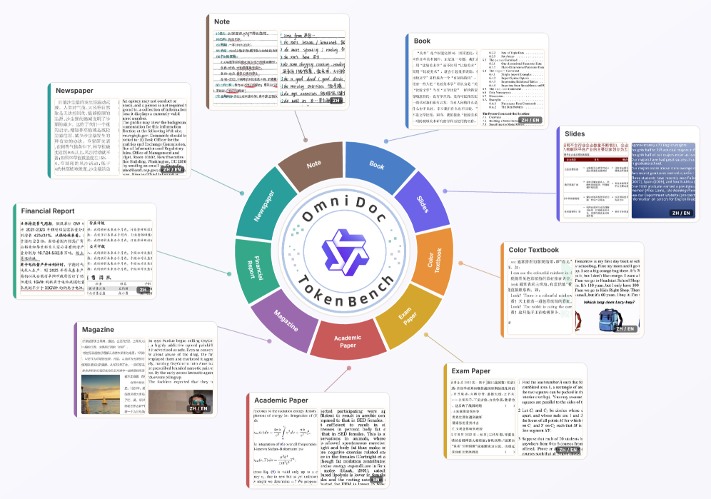
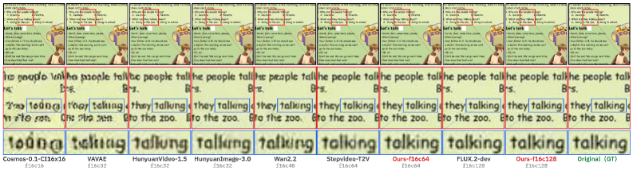
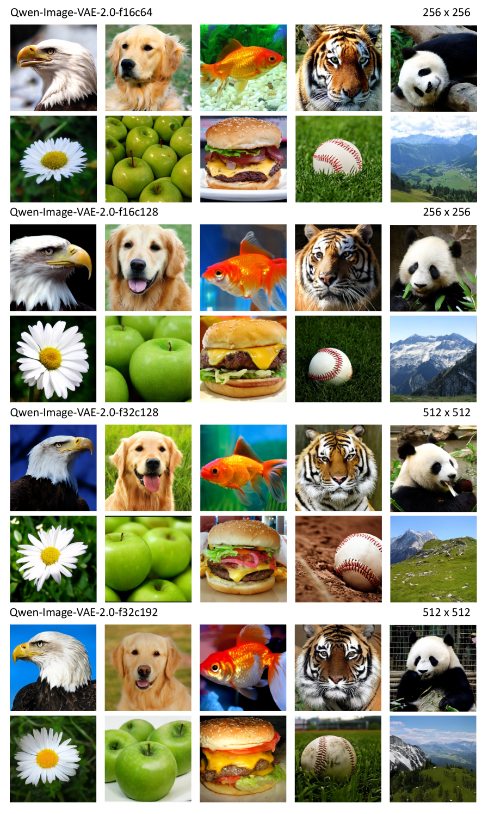

# Qwen-Image-VAE-2.0 テクニカルレポート

> 原題: Qwen-Image-VAE-2.0 Technical Report
> 著者: Qwen Team（Alibaba）
> 出典: arXiv:2605.13565
> 訳注: 本翻訳は本文（Abstract〜Conclusion）を対象とする（Authors 章は除外）。表は markdown 化した。

## Abstract（要旨）

我々は Qwen-Image-VAE-2.0 を提示する。これは再構成忠実度と**拡散可能性（diffusability）**[^1] の双方で大幅な進歩を達成する高圧縮変分オートエンコーダ（VAE）群である。高圧縮の再構成ボトルネックに対処するため、**Global Skip Connection（GSC, 大域スキップ接続）** と拡大された潜在チャネルを特徴とする改良アーキテクチャを採用する。さらに、学習を数十億枚の画像へスケールし、テキストが豊富なシナリオでの性能を改善するため合成レンダリングエンジンを組み込む。高次元の潜在空間における収束の課題に取り組むため、潜在空間を拡散モデリングに極めて適したものにする強化された意味的整合戦略を実装する。計算効率を最適化するため、符号化のオーバーヘッドを最小化する非対称かつ注意機構を持たない（attention-free）エンコーダ・デコーダのバックボーンを活用する。我々は公開の再構成ベンチマークで Qwen-Image-VAE-2.0 の包括的な評価を提示する。テキストが豊富なシナリオでの性能を評価するため、多様な実世界文書の集合と専門的な OCR ベースの評価指標からなる新しいベンチマーク **OmniDoc-TokenBench** を提案する。Qwen-Image-VAE-2.0 は最先端の再構成性能を達成し、高い圧縮率の下で一般ドメインとテキストが豊富なシナリオの双方において卓越した能力を実証する。さらに、下流の DiT 実験は我々のモデルが優れた拡散可能性を有し、既存の高圧縮ベースラインと比較して収束を大幅に加速することを明らかにする。これらは Qwen-Image-VAE-2.0 を、高い圧縮率・優れた再構成・卓越した拡散可能性を備えた主導的モデルとして確立する。

[^1]: 拡散可能性（diffusability）は、ある分布がどれだけ容易に拡散モデルでモデル化できるかを表す。

## はじめに

潜在拡散モデル（Latent Diffusion Models, LDM）は画像合成における支配的なパラダイムとなった。これらのモデルは典型的に変分オートエンコーダ（VAE）を用いて画像を効率的な拡散モデリングのための圧縮された潜在空間へ射影し、そこで広く採用される空間圧縮率は 8（$f8$ と表記）である。しかし、業界がネイティブな高解像度合成へと移行するにつれ、この標準的な比率は重大な計算上のボトルネックに直面する。現代の拡散 Transformer（DiT）の複雑さは潜在トークン数に対して二次的にスケールするため、空間圧縮率を上げることは計算効率にとって不可欠になった。過去数年で、この分野ではいくつかの進展が達成され、高圧縮 VAE の大きな潜在能力が実証されてきた。

こうした進展にもかかわらず、決定的な課題が存在する：**高い圧縮率・再構成忠実度・拡散可能性の間の不可避なトレードオフ**である。具体的には、より高い圧縮率はしばしば再構成品質の深刻な劣化を招き、とりわけ細粒度の詳細が失われるテキストが豊富なシナリオで顕著である。潜在チャネル次元を増やすことでこの情報ボトルネックを緩和できるが、それは頻繁に過度に複雑で構造化されていない潜在分布をもたらし、下流の拡散モデルの収束と生成性能を著しく妨げる。

本研究で我々は Qwen-Image-VAE-2.0 を導入する。これは改良されたアーキテクチャ、包括的なデータエンジニアリング、強化された学習戦略を通じてこれらの課題を克服するよう設計された高圧縮画像 VAE 群（$f16$ および $f32$）である。

高圧縮領域における再構成忠実度の課題に対処するため、我々は **Global Skip Connection（GSC）** を備えた改良 VAE アーキテクチャを採用する。これはピクセルから潜在への大域的なショートカットを確立し、細粒度の詳細を保持する。さらに、我々の設計は高圧縮シナリオに内在する情報ボトルネックを緩和するため、より高い潜在次元を組み込む。データ面では、学習コーパスを数十億枚の画像へスケールし、テキストが豊富な画像の再構成を強化するため専門的な文書コレクション（学術論文、ポスター、スライド、ウェブページ等を含む）を精選する。さらに、文字レベルの再構成のための密な教師信号を提供するため、文書をレンダリングする合成パイプラインを開発する。これらの進歩により、Qwen-Image-VAE-2.0 は高い圧縮率にもかかわらず、とりわけテキストが豊富なシナリオで最先端の再構成性能を達成する。高い圧縮率と拡大された潜在次元がもたらす拡散可能性の課題に対処するため、我々は **DINOv2 の中間特徴との意味的整合**が DiT の収束を効果的に加速できることを実証する。さらに、厳格な意味的整合から再構成と生成のバランスの取れた最適化へと移行する段階的な意味的整合パラダイムを採用する。これらの技術を活用し、Qwen-Image-VAE-2.0 は大きなチャネル次元にもかかわらず、既存の高圧縮 VAE と比較して優れた拡散可能性を達成する。

計算効率を確保するため、我々は拡散学習中の符号化オーバーヘッドを最小化する軽量エンコーダを特徴とする**非対称アーキテクチャ**を活用する。加えて、超高解像度の入力でも高いスループットを維持するため **attention-free バックボーン**を利用する。

我々は Qwen-Image-VAE-2.0 の性能を検証するため、再構成忠実度と潜在空間の拡散可能性という 2 つの主要側面に注目して包括的な評価を実施する。再構成忠実度については、一般的な再構成タスクにわたって評価し、実世界のテキストが豊富な文書の再構成といった困難なシナリオを特に対象とするベンチマーク **OmniDoc-TokenBench** を導入する。潜在空間の拡散可能性については、それを経験的に検証するため広範な下流 DiT 実験も行う。結果は、Qwen-Image-VAE-2.0 が高い圧縮率にもかかわらず、とりわけテキストが豊富なシナリオで優れた再構成忠実度を達成するだけでなく、優れた潜在空間の互換性を示し、大きな潜在次元でも迅速な DiT の収束を促進することを実証する。

Qwen-Image-VAE-2.0 の主要な貢献は次のようにまとめられる：

- **高圧縮 VAE**：効率的でネイティブな高解像度画像生成のための頑健な解として、$f16$ と $f32$ の画像 VAE 群を導入する。
- **優れた再構成性能**：Qwen-Image-VAE-2.0 は複数のベンチマークにわたって最先端の再構成性能を達成する。従来の高圧縮モデルが典型的に失敗するテキストが豊富なシナリオで卓越した判読性を維持する。
- **強化された潜在拡散可能性**：洗練された意味的整合戦略を通じて、大チャネルの VAE が優れた拡散可能性を達成できることを実証する。これは圧縮率・再構成忠実度・拡散可能性の三者間トレードオフに対する有望な解を提供する。

## モデル

本節では Qwen-Image-VAE-2.0 の詳細な設計とアーキテクチャ上の革新を提示する。

### 2.1 設計原則：大チャネルを持つ高圧縮 VAE

下流の DiT の学習効率を最適化するため、我々はより高い空間圧縮率を優先する。入力画像 $I\in\mathbb{R}^{H\times W\times 3}$ が与えられると、VAE はそれを潜在表現 $z\in\mathbb{R}^{\frac{H}{f}\times\frac{W}{f}\times C}$ へ写す。ここで $f$ は空間圧縮率、$C$ はチャネル次元を表す。これにより DiT にとっての系列長は $L=HW/f^{2}$ となる。DiT の計算複雑度は系列長に対して二次的にスケールするため、計算オーバーヘッド $\mathcal{O}(L^{2})=\mathcal{O}(H^{2}W^{2}/{f^{4}})$ は高解像度画像生成における重大なボトルネックとなる。

これを緩和するため、我々は従来の $f8$ パラダイムを超え、DiT の学習コストを大幅に削減する $f16$ と $f32$ のより高い圧縮率を採用する。高い空間圧縮率 $f$ は学習効率を約束する一方、潜在空間の情報容量を不可避的に制約し、しばしば細粒度の構造的詳細の喪失をもたらす。これを緩和するため、我々は**再構成忠実度が主として総情報ボトルネック $N(z)={CHW}/{f^{2}}$ によって支配される**という原則に依拠する。チャネル次元 $C$ を増やすことで、高い圧縮率 $f$ が招く空間的情報の損失を補償する。特筆すべきは、**チャネルの拡大は DiT の学習効率を損なわない**ことである：学習中、DiT はまず線形層を介して潜在を固定の隠れ次元へ射影するため、計算複雑度はチャネル次元にほぼ不変に保たれる。

### 2.2 モデルアーキテクチャ

<figure>

<figcaption>図1: モデルアーキテクチャ、再構成損失、PSNR 性能における No Skip Connection（NSC）、Local Skip Connection（LSC）、Global Skip Connection（GSC）の比較。S2C は Space to Channel モジュールの略。実験は f16c64 モデルをゼロから学習して行われた。</figcaption>
</figure>

##### Global Skip Connection（GSC）

高圧縮 VAE における主要な課題は、積極的なダウンサンプリング過程における細粒度の詳細の保持である。エンコーダ、とりわけその非パラメトリックなダウンサンプリング層は、しばしば元画像の高周波情報を保持するのに苦戦し、最適化の困難とぼやけた再構成を招く。この情報損失を緩和するため、我々は **Global Skip Connection（GSC）** を導入する。

GSC は初期のダウンサンプリング段階を迂回する直接的な残差経路を確立し、ピクセルレベルの情報を深い潜在空間へ直接供給する。図1 に図示するように、我々はこれを **space-to-channel 操作**に続く reshape によって実装し、入力画像の空間的情報をチャネル次元へ効果的に「折り畳む」。

この設計の有効性を検証するため、3 つの構成——No Skip Connection（NSC）、Local Skip Connection（LSC）、Global Skip Connection（GSC）——を比較するアブレーション研究を実施した。f16c64 モデルをゼロから学習した実験は、GSC が入力からの高周波信号をネットワークに提供することで**収束を大幅に加速する**ことを実証する。これらの知見に基づき、Qwen-Image-VAE-2.0 シリーズ全体に GSC を統合する。

##### Attention-Free バックボーン

系列長 $N$ の入力について、自己注意の計算複雑度は $\mathcal{O}(N^{2})$ である一方、カーネルサイズ $k$ の畳み込みの複雑度は $\mathcal{O}(N\cdot k^{2})$ である。ピクセル数に対するこの二次的スケーリングは高解像度画像処理にとって重大なスループットのボトルネックを生む。さらに、自己注意に必要な活性化メモリも $\mathcal{O}(N^{2})$ でスケールし、学習中に深刻なメモリ制約を課す。加えて、我々は注意モジュールを除去しても著しい性能劣化がないことを観察した。したがって、学習効率とスケーラビリティの双方を確保するため、Qwen-Image-VAE-2.0 シリーズ全体に attention-free バックボーンを採用する。

##### エンコーダ・デコーダの非対称性

我々は符号化速度と再構成品質のバランスを取るため非対称アーキテクチャを採用する。軽量なエンコーダを用いることで潜在抽出の過程を効率化し、下流の DiT の学習レイテンシを効果的に削減する。一方、重量級のデコーダが高忠実度の再構成と複雑な画像の詳細の保持を保証する。

### 2.3 モデル構成

Qwen-Image-VAE-2.0 シリーズの詳細な構成を表1 にまとめる。

**表1**: Qwen-Image-VAE-2.0 群の構成。$d_{enc}$ と $d_{dec}$ はエンコーダとデコーダの最初の射影隠れ次元、$n_{\text{layer}}$ は層数を表す。

| モデル | $f$ | $C$ | $d_{enc}$ | $d_{dec}$ | $n_{\text{layer}}$ | Residual | パラメータ数 (Enc/Dec) |
| --- | --- | --- | --- | --- | --- | --- | --- |
| Qwen-Image-VAE-2.0-f16c64 | 16 | 64 | 96 | 144 | 5 | GSC | 76M / 248M |
| Qwen-Image-VAE-2.0-f16c128 | 16 | 128 | 96 | 144 | 5 | GSC | 76M / 248M |
| Qwen-Image-VAE-2.0-f32c128 | 32 | 128 | 96 | 144 | 6 | GSC | 77M / 250M |
| Qwen-Image-VAE-2.0-f32c192 | 32 | 192 | 96 | 144 | 6 | GSC | 78M / 250M |

## データ

### 3.1 データ収集

##### データを十億規模へスケールする

多様なドメインにわたる頑健な汎化を確保するため、VAE の学習コーパスを数十億枚の画像を包含する規模へスケールする。この大規模データセットは、様々なカテゴリ・解像度・アスペクト比にまたがる幅広い視覚コンテンツをカバーする。しかしこの規模のデータは不可避的に、エッジのぼけや圧縮アーティファクトのようなノイズを含み、モデルが高周波の詳細を学習する能力を妨げる。これを緩和するため、我々は clarity フィルタと blur フィルタを用いて低品質のサンプルを刈り込み、VAE が高忠実度の信号で教師されることを確保する。

##### テキストが豊富な画像の収集

テキストが豊富なシナリオでの再構成のボトルネックに対処するため、我々は 2 面の戦略を採る。第一に、広範な実世界データセットから文字密度の高いサンプルを識別・優先するため OCR フィルタを活用する。第二に、学術論文・プレゼンテーションスライド・ポスター・複雑なウェブページのスクリーンショットを含む専門的な文書コーパスを精選する。これら実世界のテキストが豊富な画像で学習することにより、我々のモデルは文字の鋭いエッジと意味的構造の保持を優先することを学び、高圧縮 VAE にとって困難な判読可能なテキスト再構成を可能にする。

### 3.2 データ合成

文字レベルの再構成をさらに強化するため、我々はテキスト文書を画像へレンダリングする合成パイプラインを開発する。我々のパイプラインは表音文字（英語）と表語文字（中国語）の双方を支援し、それぞれの異なるストローク密度と複雑さを考慮する。決定的に、**背景のない合成データ（例: 白背景に黒文字）で学習したモデルは、テキストがしばしば複雑なテクスチャの上に重なる実世界の画像への汎化が乏しい**ことを観察した。このギャップを埋めるため、一般ドメインの画像からランダムにサンプルした背景の上にテキストをレンダリングする**背景込みの合成**を実装する。さらに、異なる圧縮設定に適応するため、5 から 20 ピクセルの範囲の文字をレンダリングすることで難易度の異なる合成データセットを構築する。この多粒度の教師信号は VAE に細かい詳細を捉えることを強い、$f32$ の圧縮でも判読性を確保する。

## 学習

### 4.1 学習損失

我々の画像 VAE の学習目的は単純だが効果的になるよう設計される。分布事前分布と敵対的パラダイムを導入する伝統的な VAE 枠組みと異なり、我々の学習過程は高忠実度の再構成と潜在空間の意味的整合に注力する。

総学習損失 $\mathcal{L}_{total}$ は次のように定式化される：

$$
\mathcal{L}_{total}=\mathcal{L}_{recon}+\lambda_{lpips}\mathcal{L}_{lpips}+\lambda_{align}\mathcal{L}_{align},
$$

ここで $\mathcal{L}_{recon}$ はピクセルレベルの $L_{1}$ 再構成損失、$\mathcal{L}_{lpips}$ は $\lambda_{lpips}$ で重み付けされた知覚損失を表す。潜在空間の「拡散可能性」を改善するため、事前学習済みエンコーダから抽出した意味的対応物へ潜在を整合させる意味的整合損失 $\mathcal{L}_{align}$ を組み込む（§4.2 で詳述）。これにより潜在空間がより生成に適した特徴を捉えることが保証される。

我々の経験的知見は、VAE 学習における 2 つの一般的な慣行（KL 正則化と敵対的学習）が、より良い性能と学習安定性を達成するために除去できることを示唆する。

##### 意味的整合の強化のための KL 損失の除去

我々は Kullback-Leibler（KL）ダイバージェンス損失を除去する。それが本質的に潜在容量を制約し再構成忠実度を損なうからである。より重要なことに、**KL ペナルティは我々の意味的整合目的に対して競合する制約として働く**ことを観察する。目標となる意味的特徴が必ずしもガウス分布に従わないことを踏まえると、モデルに正規事前分布と意味的多様体の双方を満たすよう強いることは次善の整合を招き、最終的に下流の DiT の収束を遅らせる。この制約を除去することで、生成タスクにより適したより柔軟な潜在空間を達成する。

##### 学習の安定性と効率のための GAN 損失の除去

GAN 損失は視覚的詳細を鋭くするために慣例的に用いられるが、**学習予算が十分に大きい場合には不要である**ことを我々は見出す。広範なデータと反復が与えられれば、$\mathcal{L}_{recon}$ と $\mathcal{L}_{lpips}$ の組み合わせで高品質で鋭い再構成を生成できる。識別器を排除することは最適化の地形を単純化するだけでなく、学習安定性を改善し全体の学習過程を加速する。

まとめると、KL 損失と GAN 損失への従来の依存を打破することで、我々は簡素化された学習目的の実現可能性と有効性を実証し、将来の VAE への洞察を提供する。

### 4.2 意味的整合

VA-VAE に着想を得て、我々は低レベルの詳細保持と高レベルの意味の間の微妙なバランスを取るため意味的整合損失を導入し、それにより潜在空間をより生成に適したものにする。

##### 意味エンコーダの選択

様々な事前学習済み視覚エンコーダ（DINOv2、DINOv3、MAE、PE-Spatial を含む）を比較する広範なアブレーション研究を通じて、**DINOv2 が生成に適した意味的事前分布の提供において他の候補を一貫して上回る**ことを見出す。したがって、DINOv2-L の特徴をデフォルトの意味的ガイダンスとして選択する。

##### 整合する層の選択

エンコーダの層の選択が整合の結果に影響することを観察する。従来のアプローチはしばしば最終層を利用するが、**これらのエンコーダの中間層の方が整合しやすい滑らかな空間マップを提供し、より生成に適した潜在空間をもたらす**ことを見出す。さらに、異なる層の特徴を素朴に組み合わせると、整合信号を損なう不要なノイズが導入されることも見出す。したがって、最終出力や多層の融合に依拠するのではなく、単一の最適に選択された中間層へ VAE の潜在を整合させる。

具体的には、目標画像が与えられると、まず事前学習済みの意味エンコーダを用いて意味的特徴マップ $f\in\mathbb{R}^{h\times w\times c}$ を抽出する。ここで $h$ と $w$ は空間解像度、$c$ は特徴次元を表す。次に、学習可能な線形変換 $z^{\prime}=Wz$ を通じて VAE 潜在 $z$ を同じ次元へ射影する（$W$ は学習可能な射影行列）。$\mathcal{P}=\{(i,j)\mid 1\leq i\leq h,\;1\leq j\leq w\}$ を空間位置の集合とし、$|\mathcal{P}|=N=hw$ とする。各位置 $p\in\mathcal{P}$ について、$f_{p}\in\mathbb{R}^{c}$ と $z^{\prime}_{p}\in\mathbb{R}^{c}$ をそれぞれ位置 $p$ における意味的特徴と射影された潜在特徴とする。

整合の目的は 2 つの相補的な要素からなる：(1) VAE 潜在の方向を目標の意味と整合させる、マージン $m_{cos}$ を持つ **Marginal Cosine Similarity Loss** $\mathcal{L}_{mcos}$、および (2) 相対的な空間レイアウトを保持する、マージン $m_{dist}$ を持つ **Marginal Distance Matrix Similarity Loss** $\mathcal{L}_{mdms}$。中核となる整合目的は次のように定式化される：

$$
\mathcal{L}_{mcos}(z^{\prime},f)=\frac{1}{N}\sum_{p\in\mathcal{P}}\mathrm{ReLU}\left(1-\cos(z^{\prime}_{p},f_{p})-m_{cos}\right),
$$

$$
\mathcal{L}_{mdms}(z^{\prime},f)=\frac{1}{N^{2}}\sum_{p\in\mathcal{P}}\sum_{q\in\mathcal{P}}\mathrm{ReLU}\left(\left|\cos(z^{\prime}_{p},z^{\prime}_{q})-\cos(f_{p},f_{q})\right|-m_{dist}\right),
$$

$$
\mathcal{L}_{align}(z,f)=\mathcal{L}_{mcos}(z^{\prime},f)+\mathcal{L}_{mdms}(z^{\prime},f),
$$

ここで $\mathcal{P}$ は空間位置の集合、$N=hw$ は要素の総数である。

### 4.3 学習戦略

我々は空間解像度を漸進的に改善し、テキストのレンダリングを洗練し、頑健な意味的整合を確保するよう設計された多段階の学習パラダイムを採用する。

##### 解像度の強化：低解像度から高解像度へ

安定した学習を促進するため、低解像度の基盤から始めて段階的に 2K までスケールアップするカリキュラムベースの解像度戦略を採用する。この進行を通じて、モデルの幾何学的頑健性を高めるため多様なアスペクト比のスペクトルを組み込み、VAE が様々な画像構成にわたって歪みなく構造的完全性を維持することを確保する。この漸進的なアップスケーリングにより、モデルはまず基本的な構造を学び、次により細かい詳細とテクスチャを捉えられるようになる。

##### テキストレンダリングの統合：非テキストからテキストへ

高忠実度のテキスト再構成を習得するため、多段階のデータ注入戦略を採用する。初期の収束を加速するため一般ドメインの画像から始める。続いて、複雑な文字認識の課題に対処するため実世界のテキストが豊富なサンプルを漸進的に組み込む。最終段階では、文字の精度を洗練するため難易度の異なる合成テキストデータを導入する。一般的なテクスチャと文字の詳細は異なる再構成の焦点を要するため、双方について高品質を確保するようこれら 2 種のデータ間でバランスの取れた比率を維持する。

##### 意味的整合の較正：厳格な整合からバランスの取れた再構成へ

学習の開始時には、厳格なマージン（$m_{cos}$ と $m_{dist}$）を用いて厳格な意味的整合を適用する。**初期段階での強い整合が潜在空間の拡散可能性に大きく寄与する**ことを見出した。学習が進むにつれ、整合のマージンを徐々に緩める。これによりモデルは意味的一貫性の維持と高品質なピクセルレベルの再構成の達成との間でより良いバランスを取れるようになる。

## OmniDoc-TokenBench

### 5.1 動機

ImageNet や FFHQ のような標準的な再構成ベンチマークは、テキストコンテンツがほとんどない自然写真を主に含むため、テキストが豊富な画像の再構成の評価には適さない。従来のピクセルレベルの指標（PSNR、SSIM）は本質的にテキストの判読性に鈍感である。わずかなストロークの歪みは従来の評価指標のごくわずかな低下しか招かないが、文字を認識不能にしうるからである。TokBench が OCR ベースの再構成評価を導入しているが、そのデータはテキストインスタンスが疎で文字サイズが十分に小さくないシーンテキストのデータセットから引かれており、テキストが豊富なシナリオでの再構成能力のベンチマークには不十分である。

<figure>

<figcaption>図2: OmniDoc-TokenBench、約 3K 枚のテキストが豊富な画像を精選したコレクション。</figcaption>
</figure>

これらの制約に対処するため、我々は **OmniDoc-TokenBench**（図2）を提案する。これは 9 カテゴリ——書籍、スライド、カラー教科書、試験問題、学術論文、雑誌、財務報告書、新聞、ノート——にまたがる約 3K 枚のテキストが豊富な文書画像を精選したベンチマークで、表音文字（英語）と表語文字（中国語）の双方をカバーする。我々は元画像と再構成画像の双方に全ページ OCR を実行し、その OCR 出力間の **Normalized Edit Distance（NED, 正規化編集距離）** を計算することで、単語レベルのバウンディングボックスのアノテーションを必要とせずページレベルの文書可読性を直接測定する。このアノテーション不要の設計は、新しい文書型への容易なスケーリングも促進する。

### 5.2 ベンチマークの構築

OmniDoc-TokenBench は OmniDocBench から派生する。これは多様な出典にわたる細粒度のレイアウトアノテーションとテキストレベルの正解を提供する文書解析データセットである。我々は 4 段階のパイプラインを通じてベンチマークを構築する：

##### テキストブロックの抽出とフォント正規化

具体的には、まず各テキストブロックの左上隅から領域を切り出し、次に各文字がおよそ $f_{\text{ref}}\times f_{\text{ref}}$ ピクセルを占めるよう $256\times256$ ピクセルへリサイズする。中国語には $f_{\text{ref}}=16$、英語には $f_{\text{ref}}=10$ を設定する。これらの参照サイズは意味のある評価領域を提供するよう経験的に選ばれる：結果として得られる入力は VAE の再構成にとって、とりわけ細かいストロークの詳細の保持において困難なままである一方、標準的な OCR モデルは依然として高い認識精度を維持する。

##### コンテンツのフィルタリング

各サンプルに PP-OCRv5 を適用し、認識された文字の総数が $[200,600]$（中国語）または $[300,600]$（英語）の範囲に入るサンプルのみを保持する。これにより信頼できる指標計算のための十分なテキスト密度を確保しつつ、過度に疎または密なサンプルを除外する。

##### 重複除去

同一の出典ページからのサンプル間、および同一の文書カテゴリ間で、文字レベルの $n$-gram 重複（中国語は $n=5$ ではなく $n=3$、英語は $n=5$）を計算する。重複の閾値 $0.2$（ページ内）または $0.3$（カテゴリ内）を超えるペアは重複とみなし、重複する各グループの中で最も文字数の多いサンプルのみを保持する。

##### 人手による検査

データ品質を確保するため、ぼやけている、視覚的に冗長である、あるいは大きな空白領域を含むサンプルを手動で刈り込む。最終的なベンチマークは中国語と英語のテキスト間でおおよそバランスの取れた分布を維持する。

### 5.3 評価手法

標準的な再構成指標（PSNR、SSIM、LPIPS、FID）を超えて、我々は NED を主要なテキスト忠実度の指標として採用する。**重要な設計上の選択は、正解のアノテーションではなく*元画像*の OCR 出力を参照として用いること**である。OCR モデルはクリーンな入力でも系統的な誤りを導入する（例: 「rn」と「m」のような視覚的に似た文字の混同）ため、アノテーションと比較するとそうした誤りが誤って VAE に帰属されてしまう。同じ OCR モデルを両方の画像に適用することで、これらのバイアスは編集距離の計算で大部分が相殺され、再構成のみに起因する劣化を切り分けられる。

具体的には、ベンチマーク内の各画像 $I_{i}$ について、元画像とその VAE 再構成に独立に PP-OCRv5 を適用し、それぞれテキスト文字列 $s_{\mathrm{gt}}^{(i)}$ と $s_{\mathrm{recon}}^{(i)}$ を得る。ベンチマークレベルの NED は次で定義される：

$$
\mathrm{NED}=\frac{1}{N}\sum_{i=1}^{N}\left(1-\frac{d_{\mathrm{edit}}\!\bigl(s_{\mathrm{gt}}^{(i)},\,s_{\mathrm{recon}}^{(i)}\bigr)}{\max\!\bigl(|s_{\mathrm{gt}}^{(i)}|,\,|s_{\mathrm{recon}}^{(i)}|\bigr)}\right),
$$

ここで $d_{\mathrm{edit}}(\cdot,\cdot)$ は Levenshtein 距離、$N$ はベンチマーク画像の総数、$|\cdot|$ は文字列長を表す。各項は 1 枚の画像についての文字レベルの一致度を測り、ベンチマーク全体で平均することでテキスト再構成忠実度の頑健な大域推定が得られる。

## 実験

**表2**: 様々な圧縮設定にわたる各種ベースラインと我々の Qwen-Image-VAE-2.0 モデルの比較。

| ベースライン | 設定 | IS↑ (生成, CFG なし) | gFID↓ | Recon@ImageNet PSNR↑ | SSIM↑ | Recon@FFHQ PSNR↑ | SSIM↑ |
| --- | --- | --- | --- | --- | --- | --- | --- |
| **ViT バックボーンのオートエンコーダ** | | | | | | | |
| VTP-Large | f16c64 | 146.22 | 5.25 | 26.88 | 0.7718 | 16.52 | 0.3129 |
| RAE-DINOv2-B | f16c768 | 139.80 | 6.64 | 19.24 | 0.5025 | – | – |
| RAE-SigLIP2-B | f16c768 | 103.24 | 11.58 | 19.71 | 0.5279 | – | – |
| **f8 圧縮 VAE** | | | | | | | |
| FLUX.1-dev | f8c16 | 54.64 | 25.41 | 32.84 | 0.9155 | 38.14 | 0.9574 |
| HunyuanVideo | f8c16 | 63.57 | 21.29 | 33.21 | 0.9143 | 39.85 | 0.9607 |
| Qwen-Image | f8c16 | 73.52 | 17.68 | 33.42 | 0.9159 | 38.75 | 0.9512 |
| Wan2.1 | f8c16 | 78.60 | 16.25 | 31.29 | 0.8870 | 38.16 | 0.9456 |
| Cosmos-0.1-CI8x8 | f8c16 | 52.89 | 26.02 | 32.33 | 0.9024 | 39.16 | 0.9546 |
| **f16 圧縮 VAE** | | | | | | | |
| Cosmos-0.1-CI16x16 | f16c16 | 85.14 | 15.21 | 25.13 | 0.7015 | 30.91 | 0.8285 |
| HunyuanVideo-1.5 | f16c32 | 69.59 | 19.08 | 31.18 | 0.8710 | 37.30 | 0.9336 |
| HunyuanImage-3.0 | f16c32 | 73.84 | 17.87 | 31.08 | 0.8655 | 36.85 | 0.9260 |
| VAVAE | f16c32 | 129.80 | 6.03 | 27.75 | 0.7986 | 32.84 | 0.8752 |
| Wan2.2 | f16c48 | 79.55 | 15.65 | 31.30 | 0.8784 | 37.75 | 0.9386 |
| Stepvideo-T2V | f16c64 | 45.18 | 33.53 | 31.54 | 0.8973 | 37.46 | 0.9451 |
| FLUX.2-dev | f16c128 | 91.53 | 10.61 | 34.34 | 0.9358 | 40.36 | 0.9676 |
| **Qwen-Image-VAE-2.0-f16c64** | f16c64 | 102.76 | 9.52 | 32.72 | 0.9086 | 39.14 | 0.9541 |
| **Qwen-Image-VAE-2.0-f16c128** | f16c128 | 92.42 | 10.29 | **35.90** | **0.9519** | **43.10** | **0.9795** |
| **f32 圧縮 VAE** | | | | | | | |
| DC-AE-sana | f32c32 | 75.73 | 16.88 | 24.82 | 0.6897 | 31.35 | 0.8303 |
| HunyuanImage-2.1 | f32c64 | 47.96 | 33.32 | 28.67 | 0.8199 | 35.30 | 0.9110 |
| LTX-Video | f32c128 | 33.48 | 44.94 | 29.57 | 0.8329 | 35.56 | 0.9051 |
| LTX-2 | f32c128 | 42.57 | 38.19 | 26.06 | 0.7925 | 33.63 | 0.9058 |
| **Qwen-Image-VAE-2.0-f32c128** | f32c128 | 81.23 | 15.05 | 29.69 | 0.8423 | 35.91 | 0.9177 |
| **Qwen-Image-VAE-2.0-f32c192** | f32c192 | 72.31 | 18.33 | 31.13 | 0.8785 | 37.52 | 0.9381 |

### 6.1 定量的結果

#### 6.1.1 再構成の性能

我々は Qwen-Image-VAE-2.0 の再構成性能を 2 つの標準ベンチマーク、ImageNet と FFHQ で評価する。具体的には、低解像度（256p）の一般ドメイン性能を ImageNet で、高解像度（1K）の性能を FFHQ で、PSNR と SSIM を品質指標として評価する。表2 に実証されるように、Qwen-Image-VAE-2.0 は対応する圧縮階層（$f16$ と $f32$）内で最先端の再構成忠実度を達成する。特筆すべきは、我々の $f32c192$ VAE が **4 倍の圧縮係数で動作するにもかかわらず、確立された $f8$ VAE（例: Wan2.1）に匹敵する性能**を発揮することである。この再構成における優れた性能は、主として我々の洗練された VAE アーキテクチャ、拡大されたチャネル次元、広範な学習体制に帰せられる。

**表3**: OmniDoc-TokenBench（約 3K のテキストが豊富な画像、$256\times256$）での包括的評価。モデルは空間圧縮係数でグループ化され、各グループ内で NED によりソートされる。

| モデル | 設定 | SSIM↑ | PSNR↑ | LPIPS↓ | FID↓ | NED↑ |
| --- | --- | --- | --- | --- | --- | --- |
| **ViT バックボーンのオートエンコーダ** | | | | | | |
| RAE-DINOv2-B | f16c768 | 0.3261 | 14.32 | 0.2290 | 18.21 | 0.0392 |
| RAE-SigLIP2-B | f16c768 | 0.3871 | 14.36 | 0.1972 | 11.49 | 0.0483 |
| VTP-Large | f16c64 | 0.7185 | 18.11 | 0.1046 | 3.94 | 0.4170 |
| **f8 圧縮 VAE** | | | | | | |
| Wan2.1 | f8c16 | 0.8282 | 20.54 | 0.0679 | 4.57 | 0.8021 |
| Cosmos-0.1-CI8x8 | f8c16 | 0.9057 | 24.29 | 0.0464 | 2.89 | 0.9033 |
| Qwen-Image | f8c16 | 0.8998 | 24.94 | 0.0519 | 4.48 | 0.9073 |
| HunyuanVideo | f8c16 | 0.9227 | 25.26 | 0.0434 | 2.03 | 0.9266 |
| FLUX.1-dev | f8c16 | 0.9364 | 26.24 | 0.0246 | **0.55** | 0.9546 |
| **f16 圧縮 VAE** | | | | | | |
| Cosmos-0.1-CI16x16 | f16c16 | 0.5460 | 15.55 | 0.1349 | 7.78 | 0.1547 |
| VAVAE | f16c32 | 0.6905 | 17.50 | 0.0974 | 4.45 | 0.3488 |
| HunyuanVideo-1.5 | f16c32 | 0.8422 | 21.49 | 0.0839 | 4.67 | 0.6938 |
| HunyuanImage-3.0 | f16c32 | 0.8672 | 22.66 | 0.0650 | 3.49 | 0.7753 |
| Wan2.2 | f16c48 | 0.8577 | 21.67 | 0.0525 | 3.05 | 0.8310 |
| Stepvideo-T2V | f16c64 | 0.8970 | 23.69 | 0.0650 | 6.02 | 0.8838 |
| **Qwen-Image-VAE-2.0-f16c64** | f16c64 | 0.9279 | 26.00 | 0.0382 | 1.94 | 0.9244 |
| FLUX.2-dev | f16c128 | 0.9544 | 27.72 | 0.0216 | 0.73 | 0.9535 |
| **Qwen-Image-VAE-2.0-f16c128** | f16c128 | **0.9706** | **30.45** | **0.0167** | 0.79 | **0.9617** |
| **f32 圧縮 VAE** | | | | | | |
| DC-AE-sana | f32c32 | 0.5259 | 15.62 | 0.1441 | 7.26 | 0.0692 |
| LTX-2 | f32c128 | 0.7354 | 18.41 | 0.1192 | 9.94 | 0.3569 |
| HunyuanImage-2.1 | f32c64 | 0.7805 | 19.85 | 0.0957 | 5.19 | 0.4895 |
| LTX-Video | f32c128 | 0.8055 | 20.92 | 0.1190 | 17.10 | 0.5651 |
| **Qwen-Image-VAE-2.0-f32c128** | f32c128 | 0.8442 | 22.13 | 0.0642 | 3.36 | 0.7065 |
| **Qwen-Image-VAE-2.0-f32c192** | f32c192 | 0.8908 | 23.84 | 0.0497 | 1.98 | 0.8555 |

#### 6.1.2 テキストレンダリングの性能

テキストが豊富な困難なシナリオでの再構成忠実度を評価するため、すべてのモデルを OmniDoc-TokenBench（§5）で評価し、従来のピクセルベースの指標と提案する OCR ベースの NED 指標の双方を報告する。テキスト正規化なしの生の OCR 出力で NED を計算する。OCR からの軽微な字間のアーティファクトが編集距離を膨らませうるが、評価パイプラインはすべてのモデルに一貫して適用され公正な比較を確保する。結果は表3 にまとめ、定性比較は図3 に示す。

##### 従来の再構成指標

我々の高圧縮 VAE（$f16$ と $f32$ の設定）は最先端のピクセルレベルの再構成を達成し、同じ圧縮率のすべての競合手法を上回る。特筆すべきは、Qwen-Image-VAE-2.0-f16c128 が **2 倍高い空間圧縮にもかかわらず、最良の $f8$ ベースライン（FLUX.1-dev の 0.9364 / 26.24 dB）を上回る** SSIM 0.9706、PSNR 30.45 dB を達成することである。より軽量な f16c64 の変種でさえほとんどの $f8$ ベースラインを上回る（SSIM 0.9279 対 HunyuanVideo の 0.9227）、控えめなチャネル予算で強い効率を実証する。既存手法が壊滅的に劣化する極端な $f32$ 圧縮の下（SSIM は 0.5259 まで低下）でも、我々の f32c192 は FID 1.98 で SSIM 0.8908 を達成し、すべての $f32$ 競合を大幅な差で上回る。

##### テキスト忠実度のための NED

従来のピクセル指標は本質的に文字レベルの判読性に鈍感である。「orange」→「orango」のような単一文字の再構成誤りは PSNR の損失がごくわずか（0.5 dB 未満）である一方、**NED を 16.7% 低下させ**、ピクセル指標が見逃しうる意味的な破損を露呈する。NED 指標は元画像と再構成画像の間で認識された文字系列を比較することにより、テキストの保持を直接測定する。

$f16$ VAE では、ベースラインの性能が劇的に変動する：Cosmos-0.1-CI16x16 は NED 0.1547（約 85% の文字損失）へ崩壊し、他は 0.35〜0.88 の範囲で、いずれも $f8$ の最先端を下回る。我々の Qwen-Image-VAE-2.0-f16c64 は 0.9244 を達成し、主導的な $f8$ 手法と競合する。最も注目すべきは、Qwen-Image-VAE-2.0-f16c128 が 0.9617 に達し、**FLUX.1-dev（0.9546）を含む評価したすべての $f8$ VAE を上回る**ことである。我々の知る限り、これは **$f8$ VAE を超えるテキスト忠実度を達成した初の $f16$ オートエンコーダ**である。

$f32$ VAE はさらに我々の優位性を検証する。競合モデルがほぼ完全なテキストの破壊を示す（NED: 0.07〜0.57）一方、我々の Qwen-Image-VAE-2.0-f32c192 は 0.8555 を達成し、複数の $f16$ ベースラインを上回る。この圧縮率を越えた優位性は、多様なテキストが豊富な文書と合成レンダリングパイプラインを組み込んだ我々の包括的なデータエンジニアリングに直接由来する。

##### 相関の分析

我々はピクセル指標とテキスト忠実度の間に不完全な相関を観察する。$f16$ では、Stepvideo-T2V が控えめな SSIM の差（0.8970 対 0.8672）にもかかわらず HunyuanImage-3.0 より顕著に高い NED を達成する（0.8838 対 0.7753）。$f32$ では、LTX-Video が悪い FID（17.10 対 5.19）にもかかわらず NED で HunyuanImage-2.1 を上回る（0.5651 対 0.4895）。これらの不一致は、テキスト再構成の評価にとって **NED が必要な補完的指標である**ことを検証する。

#### 6.1.3 拡散可能性の性能

学習された潜在空間の拡散可能性を経験的に検証するため、ImageNet $256\times256$ データセットで SiT を学習して下流の生成性能を評価する。repa-e のコードベースとデフォルトのハイパーパラメータ設定に厳密に従い、80 エポック時点の生成品質を Inception Score（IS）と生成 FID（gFID）で報告する。具体的には、$f8$ の圧縮設定には SiT-XL/2 アーキテクチャを、$f16$ と $f32$ の設定には SiT-XL/1 アーキテクチャを用いた。より高次元の潜在空間はしばしばより大きな最適 CFG スケールを要し、評価する VAE は異なる次元を持つため、公正な比較を確保するためガイダンスなしの結果のみを報告する。表2 に示すように、Qwen-Image-VAE-2.0 は優れた潜在空間の拡散可能性を実証し、全体的な生成品質において既存の高圧縮ベースラインを一貫して上回る。大きな潜在次元にもかかわらず、我々のモデルは迅速な DiT の収束を促進する。この卓越した拡散可能性は伝統的な三者間トレードオフを効果的に解決し、主として我々の改良された意味的整合戦略と段階的整合パラダイムによって駆動される。

<figure>

<figcaption>図3(a): f16 圧縮 VAE。ベースラインは文字のぼけとストロークの融合を示す一方、我々の VAE は鮮明な境界を保持する。</figcaption>
</figure>

### 6.2 定性的結果

#### 6.2.1 テキストレンダリング

図3 は異なる圧縮率にわたる定性的な再構成結果を可視化する。$f16$ VAE（図3(a)）では、劣化の差が劇的に広がる。より弱いベースラインは深刻な文字のぼけ、ストロークの融合、文字間のゴーストを示す——Cosmos-0.1-CI16x16 はほぼ完全なテキストの崩壊を示す。対照的に、我々の Qwen-Image-VAE-2.0-f16c128 は鮮明な文字境界、正確な文字間隔、細かいストロークの詳細を保持する。

<figure>

<figcaption>図4: Qwen-Image-VAE-2.0 を用いて SiT が ImageNet 上で生成した選択された画像サンプル。</figcaption>
</figure>

$f32$ VAE（図3(b)）では、競合モデルはテキストを個々の文字が認識不能な断片化したノイズパターンへと還元する。我々の Qwen-Image-VAE-2.0-f32c192 は明確に識別可能な文字形状と認識可能な単語境界を独自に保持し、その実質的に高い NED スコアと整合し、極端な圧縮制約下での我々のアーキテクチャの有効性を検証する。

#### 6.2.2 拡散可能性

図4 は SiT-XL が生成した選択された ImageNet サンプルを図示し、潜在空間の意味的一貫性と細粒度の詳細の視覚的検証として機能する。スケールを越えた一貫性を実証するため、定量的な学習プロトコルに従い、さらに学習した SiT-XL を classifier-free guidance とともに用いて、$f16$ VAE では $256\times256$、$f32$ VAE では $512\times512$ でサンプルを生成する。$f16$ と $f32$ の圧縮率にわたって、生成物は構造的な劣化なく高い視覚的忠実度を維持する。

#### 6.2.3 大規模 Text-to-Image による検証

Qwen-Image-VAE-2.0 の Qwen-Image-2.0 への統合の成功は、基盤モデル規模での我々の潜在空間の拡散可能性をさらに検証する。この大規模 text-to-image パイプライン内で動作しつつ、我々の圧縮表現は複雑なオープン語彙の条件付けと入り組んだ構成的制約を難なく支援する。結果として得られる生成物は、多様な意味的文脈にわたる精密なテキストレンダリングと洗練された写実的テクスチャを通じて、Qwen-Image-2.0 の中核能力を一貫して実証する。この大規模なデプロイは、我々の潜在空間が要求の厳しい合成タスクに必要な構造的安定性と情報忠実度を保持することを実証し、それにより先進的な生成システムにおける我々の整合パラダイムのスケーラビリティと頑健性を確認する。

## 結論

本論文では、ネイティブな高解像度画像合成における長年のボトルネックを克服するよう設計された高圧縮画像 VAE 群（$f16$ と $f32$）である Qwen-Image-VAE-2.0 を導入する。我々の研究は、高い圧縮率・再構成忠実度・下流の拡散可能性の間の根本的な三者間トレードオフを解決する明確な技術的道筋を実証する：拡大された潜在チャネル次元を活用して高圧縮が招く空間的情報の損失を補償しつつ、同時に先進的な意味的整合技術を適用して潜在空間が拡散モデリングに適したままであることを確保する。高圧縮領域で最先端の再構成忠実度を達成するため、細粒度の詳細の回復のための直接的な経路を確立する **Global Skip Connection（GSC）** を特徴とする改良 VAE アーキテクチャを採用する。これを、学習コーパスを数十億枚の画像へスケールし、高圧縮モデルの伝統的な失敗点である密なテキストの判読性を確保するため専門的な合成文書レンダリングパイプラインを利用する包括的なデータ戦略が支える。高次元の潜在空間に内在する拡散可能性の課題に対処するため、改良された意味的整合戦略を導入する。潜在表現を **DINOv2 の中間層の特徴**と整合させることで、下流の DiT の収束を大幅に加速する。最後に、実用性を確保するため、超高解像度でも高いスループットと最小の符号化オーバーヘッドを維持する軽量エンコーダのパラダイムと attention-free バックボーンを実装する。公開ベンチマークと OmniDoc-TokenBench での広範な評価は、Qwen-Image-VAE-2.0 が卓越した構造的・テキスト的完全性を保持するだけでなく、効率的な生成モデリングも促進することを実証する。これらのモデルは次世代の視覚合成システムのための頑健な基盤を提供し、効率的な画像生成における重要なマイルストーンを刻む。
