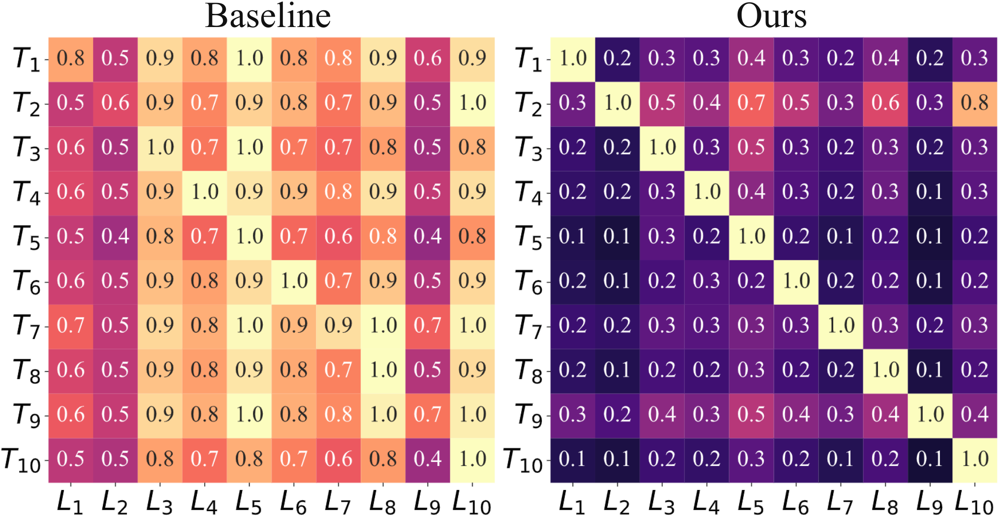
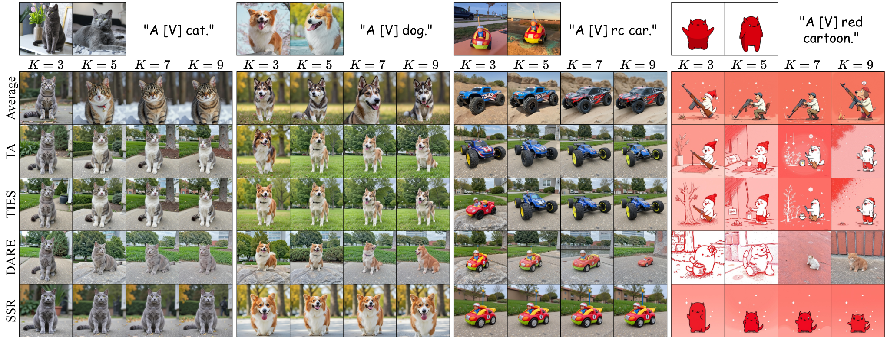
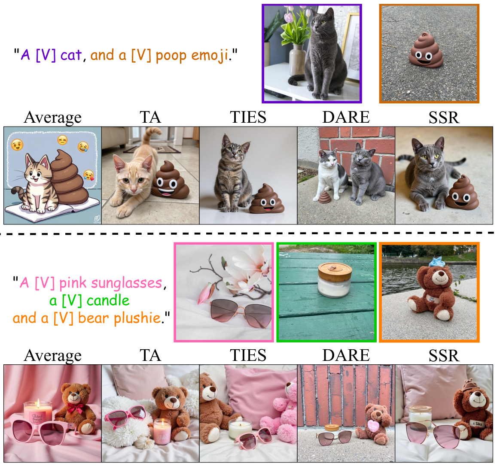
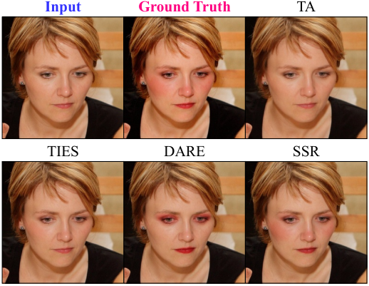
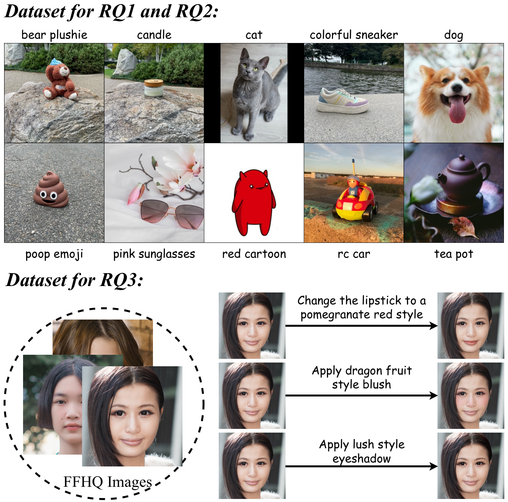
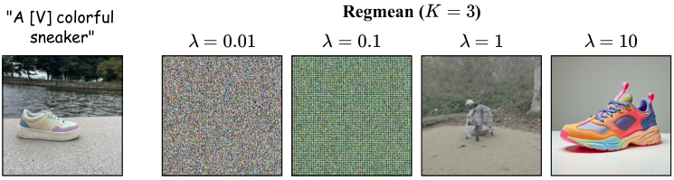
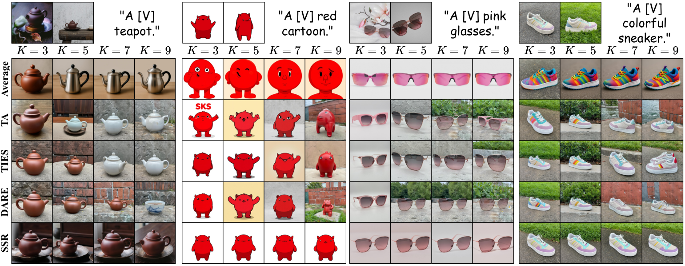
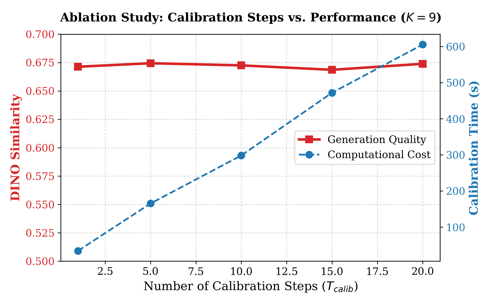

# SSR-Merge: 拡散モデルにおける学習不要な LoRA マージのための部分空間信号ルーティング

> 原題: SSR-Merge: Subspace Signal Routing for Training-Free LoRA Merging in Diffusion Models
> 著者: Zhengxuan Wei, Yi Dong, Zonghui Li, Xianhui Lin, Xing Liu, Hong Gu, Shaofeng Zhang, Wenbin Li, Qi Fan（南京大学 知能科学技術学院 / vivo BlueImage Lab / ShanghaiTech 大学 / 東南大学 / 中国科学技術大学）
> 出典: arXiv:2606.10617 ・ コード: [github.com/nagara214/SSR-Merge](https://github.com/nagara214/SSR-Merge)

## Abstract（要旨）

Low-Rank Adaptation（LoRA）のマージは、拡散モデルのために複数の学習済み LoRA から多様な生成能力を効率的に結合できる。しかしながら既存の LoRA マージ技法は**深刻なパラメータ干渉**にしばしば苦しみ、共有されたパラメータ空間で破壊的な衝突を引き起こす。これに対処するため、我々は **Subspace Signal Routing（SSR, 部分空間信号ルーティング）** を提案する。これはパラメータ空間でのマージを行う代わりに、**内部の信号をルーティングする**ことで干渉を解消する。具体的には、SSR はまず候補となる LoRA を rank 次元に沿って連結することで統一された部分空間を構成する。次に SSR は**逆相関行列**を用いてこの空間内で混合された信号の相関を除去する。最後に**方向ガイド行列**がこれらの浄化された信号をそれぞれのタスク固有の部分空間へ操舵する。我々は、SSR が**通常最小二乗（OLS）解と一致する**ことを証明する厳密な理論的分析を提供し、それにより数学的な最適性を保証する。我々は十分統計量の加法性を活用してストリーミング・アルゴリズムを設計する。これによりオンザフライの更新が可能になり、メモリのオーバーヘッドと計算時間を有意に削減する。広範な実験は、SSR が同等の効率を維持しながら最先端の手法を有意に上回ることを検証する。

###### キーワード:

機械学習、ICML

## 1 Introduction（はじめに）

<figure>

<figcaption>図1: タスク-LoRA 活性化整合の可視化。タスク指示（T）と LoRA モジュール（L）の間の最大値正規化された活性化強度を表示する。左: 静的なベースラインは深刻なクロストークを示し、そこでは指示が無関係なモジュールを誤って活性化しており、高い干渉を示している。右: 我々の SSR-Merge は精密な信号ルーティングを達成し、各タスクが自分の目標 LoRA のみを排他的に活性化する明瞭な対角構造を示す。詳細な設定は付録 A を参照。</figcaption>
</figure>

拡散モデルは高忠実度で多様な視覚コンテンツの合成において目覚ましい能力を実証している。しかしながら、下流の適応のための全パラメータの微調整は計算的に高価である。これに対処するため、**Parameter-Efficient Fine-Tuning（PEFT, 効率的パラメータ微調整）** の技法が標準的なパラダイムとして浮上し、モデルパラメータのごく一部のみを更新しながら効果的な適応を可能にしている。

様々な PEFT のアプローチのうち、**LoRA** は最も著名であり、凍結された層に学習可能な低ランク行列を注入することで効率と品質を均衡させる。この効率性は、多様なスタイル・キャラクター・指示にまたがる特化した LoRA の膨大な生態系をモデルハブ上に育んできた。これは自然に**合成**の必要へつながる。ユーザーは複数の LoRA をマージすることで、単一のモデル内で異なる能力を結合しようとする。

しかしながら、複数のタスク固有の LoRA を統合することは依然として有意な課題である。線形平均や **Task Arithmetic** のような基本的な静的戦略は、パラメータを直接重ね合わせるため本質的にパラメータ干渉を引き起こす。これに対処するため、**TIES** や **DARE** のようなヒューリスティックな変種は、衝突する重みを刈り込もうと試みる。しかしながら、タスク数がスケールするにつれてこれらは破壊的な衝突を防ぐことに失敗する。図 1（左）に可視化されるように、DARE のベースラインは深刻な「**クロストーク**」を示し、そこでは指示が無関係なモジュールを高い強度で誤って活性化している。

代替として、動的なアプローチは結合されたモジュールに適応的な重みを割り当てることに焦点を当てる。しかしながら、スカラー係数を学習する手法は共有されたパラメータ空間内での衝突の解消に苦戦する。逆に、非線形のゲーティングを利用するアプローチは**再パラメータ化の性質を壊し**、重みのマージを妨げて推論のレイテンシを生じさせる。

これに対処するため、我々は **Subspace Signal Routing（SSR）** を提案する。パラメータ空間で直接的な算術操作を行う代わりに、SSR は **LoRA の部分空間内で内部の信号を明示的にルーティングする**ことで衝突を回避する。

図 2 に図解するように、SSR はまず候補となる LoRA を rank 次元に沿って連結することで統一された部分空間を構成する。この部分空間内に、我々は二次統計量から導かれる**学習不要のルータ（$R$）** を挿入する。具体的には、ルータは**逆相関行列（$\mathbf{G}^{-1}$）** を混合された中間信号の相関を除去する白色化フィルタとして用い、続いて**方向ガイド（$\mathbf{Q}$）** がこれらの浄化された信号をそれぞれのタスク固有の部分空間へ精密に操舵する。この機構はタスク間の干渉を効果的に除去する。それは図 1（右）における明瞭な対角の活性化パターンによって裏づけられ、SSR が衝突する信号の解きほぐしに成功して正確なタスクの活性化を保証していることを実証する。

決定的なことに、このルーティング機構は**最適性の厳密な証明**に支えられている。我々は、ルータが**通常最小二乗（OLS）推定量の射影に数学的に等価である**ことを実証する。この定式化は、ヒューリスティックなパラメータ調整に依拠するのではなく、SSR が特徴の再構成誤差を厳密に最小化する一意の解析解を提供することを保証する。

計算的な実行可能性を保証するため、我々は十分統計量の加法性に基づくストリーミング・アルゴリズムを設計する。共分散と相互相関の更新をオンザフライで蓄積することにより、生の特徴をキャッシュする必要を排し、メモリの計算量を効果的に削減する。展開のためには、**構造的な再パラメータ化**を用いてルータを上方射影の重みへ吸収する。これは標準的な LoRA と構造的に同一のマージ済みモジュールをもたらし、**追加の推論オーバーヘッドがない**ことと既存の生態系とのシームレスな互換性を保証する。

我々の貢献を以下にまとめる。

- 我々は SSR を導入し、モデルのマージを**パラメータの算術ではなく信号のルーティング**として再定式化する。統一された部分空間を用いて信号を統計的に相関除去し操舵することにより、干渉を除去する。
- 我々は、我々のルータが**通常最小二乗（OLS）推定量の射影に解析的に等価である**ことを理論的に証明し、それにより特徴の再構成誤差を厳密に最小化する。
- 我々は効率的な展開を保証するストリーミング・アルゴリズムと構造的な再パラメータ化を開発する。実験は SSR が多様なタスクにわたって優れた能力の保存を達成することを実証する。

## 2 Related Work（関連研究）

**モデルのマージ。** モデルのマージは単純な重み平均から Task Arithmetic のタスクベクトルの合成へと発展してきた。しかしながら、直接的な算術はしばしばパラメータ干渉に苦しむ。これを緩和するため、**TIES-Merging** は刈り込みと符号の選挙を介して衝突を解消し、**DARE** はランダムな疎化と再スケーリングを用いて元の期待値を近似することで標準的なベースラインを確立する。これらの主流のパラダイムを超えて、最近の研究はマスキングと外れ値を意識した戦略、幾何学的分解や特徴のマッチングを利用するスペクトル・表現整合の枠組み、反復探索や解析的計算を通じて混合係数を推定する適応的重み付けの枠組みなど、他の方向も探求してきた。

汎用の戦略がしばしば基底にあるパラメータの構造を無視するのに対し、我々の SSR は**低ランク部分空間の内在的な幾何を明示的に活用する**。我々は理論的分析に支えられた枠組みを提供し、素朴な重みの算術より効果的に干渉を解消してアダプタの完全性を保存する。

**LoRA マージの応用。** LoRA の合成は機械学習の諸領域で広く採用されている。LLM と分散システムにおいては、マルチタスクの汎化と連合学習を促進する。拡散モデルにおいては、研究は主に**被写体-スタイルの融合**や**多概念の合成**といった特定のシナリオに焦点を当ててきた。

多様なアダプタの急速な増殖を踏まえると、統一的なマージの枠組みへの需要が高まっている。これに対処するため、我々の SSR は**タスクの事前知識や複雑なアーキテクチャ設計に依拠せずに**干渉を解消する、汎用的で学習不要の解を提供する。

## 3 Methodology（方法論）

> **訳注**: 図 2（SSR の概観図）は ar5iv・arXiv のいずれの HTML 変換でも画像が生成されていないため、本翻訳では画像を掲載できない。キャプションのみ以下に訳出する。
>
> **図2**: Subspace Signal Routing（SSR）の概観。この枠組みは $\mathbf{A}_{\text{comb}}$ を介して個々の LoRA のボトルネックを統一された部分空間へ拡張する。この空間内で、ルータ $R$ が 2 段階の機構を通じてパラメータ干渉を解消する：(1) **相関除去（$\mathbf{G}^{-1}$）**。混合された中間特徴を解きほぐす相関除去演算子として作用する。(2) **操舵（$\mathbf{Q}$）**。浄化された信号を目標のタスク固有の上方射影の基底（$B_{1},B_{2}$）へ精密に導く。理想的には、この線形構造は複数のタスクが衝突なく共存することを可能にする。

我々はマルチタスクの干渉を解消するため Subspace Signal Routing（SSR）を導入する。本節は問題の定式化（3.1 節）・ルータの構成（3.2 節）・最適性の理論的分析（3.3 節）・効率的な実装（3.4 節）に構成される。

### 3.1 Preliminary（準備）

LoRA は事前学習済み行列 $W_{0}\in\mathbb{R}^{d\times d}$ の重み更新 $\Delta W$ を低ランク分解によって近似する。$A\in\mathbb{R}^{r\times d}$ と $B\in\mathbb{R}^{d\times r}$ をそれぞれ下方射影行列と上方射影行列とし、$r\ll d$ とする。入力の活性化 $x\in\mathbb{R}^{d}$ に対する適応された順伝播は次のように定式化される。

$$
h=W_{0}x+\Delta Wx=W_{0}x+BAx.
$$

我々は異なるタスクで学習された $K$ 個の LoRA モジュール $\{A_{k},B_{k}\}_{k=1}^{K}$ をマージする問題を考える。我々の目的は、相互の干渉を最小化しながらすべての $K$ タスクの能力を保存する単一の統一された更新 $\Delta W_{\text{merged}}$ を合成することである。

### 3.2 Subspace Signal Routing（部分空間信号ルーティング）

$K$ タスク間のパラメータ干渉を解消するため、我々は SSR を提案する。この手法は、衝突する特徴がルーティング行列 $R$ を介して分離される統一された空間を構築する。

**統一された射影空間。** 我々はまず個々の部分空間を統一された座標系へ結合する。タスク固有の下方射影 $A_{k}$ を縦に積み重ねて統一された下方射影 $\mathbf{A}_{\text{comb}}\in\mathbb{R}^{Kr\times d}$ を構成し、上方射影 $B_{k}$ を横に連結して統一された上方射影 $\mathbf{B}_{\text{comb}}\in\mathbb{R}^{d\times Kr}$ を構成する。

$$
\mathbf{A}_{\text{comb}}=\begin{bmatrix}A_{1}\\ \vdots\\ A_{K}\end{bmatrix},\quad\mathbf{B}_{\text{comb}}=\begin{bmatrix}B_{1}&\dots&B_{K}\end{bmatrix}.
$$

この定式化は rank を $r$ から $Kr$ へ拡張する。我々の目標は、信号の流れを制御するために $\mathbf{A}_{\text{comb}}$ と $\mathbf{B}_{\text{comb}}$ の間に挿入するルータ行列 $R\in\mathbb{R}^{Kr\times Kr}$ を設計することである。

**統計量によるルーティング。** 我々は較正データから導かれる二次統計量を用いてルータを設計する。$X_{k}\in\mathbb{R}^{d\times N}$ を $k$ 番目のタスクの入力特徴、$Z_{k}=\mathbf{A}_{\text{comb}}X_{k}\in\mathbb{R}^{Kr\times N}$ を統一空間内でのその射影とする。

第一に、**相関行列** $\mathbf{G}\in\mathbb{R}^{Kr\times Kr}$ は結合空間内の全体的な相関構造を測るもので、射影された特徴の外積の和として定義される。

$$
\mathbf{G}:=\sum_{k=1}^{K}Z_{k}Z_{k}^{\top}.
$$

第二に、**方向ガイド** $\mathbf{Q}\in\mathbb{R}^{Kr\times Kr}$ は統一された射影とタスク固有の目標との間の相互共分散を捉える。$k$ 番目のタスクについて、理想的な局所活性化 $H_{k}=A_{k}X_{k}$ を用いてタスク固有のルーティング・ブロック $\mathbf{Q}_{k}=H_{k}Z_{k}^{\top}$ を定義する。大域的なガイド $\mathbf{Q}$ はこれらのブロックを積み重ねて構成される。

$$
\mathbf{Q}:=\begin{bmatrix}\mathbf{Q}_{1}\\ \vdots\\ \mathbf{Q}_{K}\end{bmatrix}=\begin{bmatrix}(A_{1}X_{1})Z_{1}^{\top}\\ \vdots\\ (A_{K}X_{K})Z_{K}^{\top}\end{bmatrix}.
$$

**ルータの定式化。** これらの統計量に基づき、方向ガイドと逆エネルギーマップを組み合わせて**部分空間ルータ** $R$ を構成する。

$$
R:=\mathbf{Q}\mathbf{G}^{-1}.
$$

この設計において、$\mathbf{G}^{-1}$ は共有された信号空間内の相関を除去する**相関除去演算子**として作用し、$\mathbf{Q}$ はこれらの浄化された信号をそれぞれのタスクの上方射影の基底 $B_{k}$ へ導く。

### 3.3 Theoretical Analysis of Optimality（最適性の理論的分析）

本節で我々は、提案するルータ $R$ が単なるヒューリスティックな設計ではなく、**すべてのタスクにわたる再構成誤差を最小化する厳密な解析解**であることを明らかにする。

**幾何学的分解。** ルータの数学的な振る舞いを理解するため、方向ガイド $\mathbf{Q}$ の構造を分析する。Moore-Penrose 擬似逆行列の性質により、次が成り立つ。

$$
\mathbf{B}_{\text{comb}}^{\dagger}B_{k}=\mathbf{E}_{k},
$$

ここで $\mathbf{E}_{k}$ は正準なブロック選択行列である。この幾何学的性質を $\mathbf{Q}$ の定義に適用すると、選択行列を射影演算子で置き換えられる。

$$
\mathbf{Q}=\sum_{k=1}^{K}\mathbf{E}_{k}(A_{k}X_{k})Z_{k}^{\top}=\sum_{k=1}^{K}(\mathbf{B}_{\text{comb}}^{\dagger}B_{k})(A_{k}X_{k})Z_{k}^{\top}.
$$

逆射影子 $\mathbf{B}_{\text{comb}}^{\dagger}$ はタスクのインデックス $k$ に不変であるから、和の外へ括り出せる。$B_{k}A_{k}X_{k}$ が目標信号 $Y_{k}$ に対応することを認識すると、統一された形が得られる。

$$
\mathbf{Q}=\mathbf{B}_{\text{comb}}^{\dagger}\sum_{k=1}^{K}\underbrace{(B_{k}A_{k}X_{k})}_{Y_{k}}Z_{k}^{\top}=\mathbf{B}_{\text{comb}}^{\dagger}\left(\sum_{k=1}^{K}Y_{k}Z_{k}^{\top}\right).
$$

**最小二乗との等価性。** この因数分解された形をルータの定義 $R=\mathbf{Q}\mathbf{G}^{-1}$ へ代入し戻すと、式は有意に簡約される。

$$
R=\mathbf{B}_{\text{comb}}^{\dagger}\underbrace{\left(\sum_{k=1}^{K}Y_{k}Z_{k}^{\top}\right)\left(\sum_{k=1}^{K}Z_{k}Z_{k}^{\top}\right)^{-1}}_{\hat{\beta}_{\text{OLS}}}.
$$

ここで我々は $\hat{\beta}_{\text{OLS}}$ の項を標準的な通常最小二乗推定量として特定する。統計的信号処理において、$\hat{\beta}_{\text{OLS}}$ は回帰残差 $\|\beta Z-Y\|_{F}^{2}$ を最小化する一意の行列として厳密に定義される。

**最適性の結論。** 上記の導出は我々の主要な理論的保証へ直接つながる。

###### 定理 3.1（再構成の最適性）.

部分空間ルータ $R$ は再構成の目的 $\mathcal{L}(R)=\sum_{k=1}^{K}\|\mathbf{B}_{\text{comb}}RZ_{k}-Y_{k}\|_{F}^{2}$ を最小化する。

###### 証明.

導出したとおり、我々のルータは最適な推定量の射影を実装している。

$$
R=\mathbf{B}_{\text{comb}}^{\dagger}\hat{\beta}_{\text{OLS}}.
$$

したがってマージ済みモデルの出力は $\hat{Y}=\mathbf{B}_{\text{comb}}RZ$ で与えられる。ルータの形を代入すると

$$
\hat{Y}=(\mathbf{B}_{\text{comb}}\mathbf{B}_{\text{comb}}^{\dagger})\hat{\beta}_{\text{OLS}}Z.
$$

目標 $Y_{k}$（したがって $\hat{\beta}_{\text{OLS}}$）は上方射影 $\mathbf{B}_{\text{comb}}$ の値域内に存在するので、射影演算子 $\mathbf{B}_{\text{comb}}\mathbf{B}_{\text{comb}}^{\dagger}$ は恒等写像として作用し、$\hat{Y}=\hat{\beta}_{\text{OLS}}Z$ をもたらす。$\hat{\beta}_{\text{OLS}}$ は Frobenius ノルムの乖離の最小化子として定義されるので、$R$ は本質的に達成可能な最小の再構成誤差を実現する。∎

### 3.4 Efficient Implementation（効率的な実装）

**ストリーミング計算。** 素朴なオフラインの構成では、モデル全体にわたるすべての $K$ タスクの活性化マップをキャッシュする必要があり、$\mathcal{O}(K\cdot N_{\text{layer}}\cdot T\cdot D_{\text{feat}})$ という法外なメモリ計算量をもたらす。ここで $N_{\text{layer}}$ は LoRA 層の総数、$T$ は較正されたタイムステップ、$D_{\text{feat}}$ は層あたりの特徴量である。これに対処するため、我々は十分統計量の加法的性質に基づく厳密なストリーミング戦略を採用する。タスク $k$ に属する入力特徴のバッチ $x_{t}$ について、統計量をオンザフライで更新する。

$$
\mathbf{G}\leftarrow\mathbf{G}+(\mathbf{A}_{\text{comb}}x_{t})(\mathbf{A}_{\text{comb}}x_{t})^{\top},\qquad
\mathbf{Q}\leftarrow\mathbf{Q}+\mathbf{E}_{k}(A_{k}x_{t})(\mathbf{A}_{\text{comb}}x_{t})^{\top},
$$

ここで $\mathbf{E}_{k}$ はベクトルを積み重ねられた空間の $k$ 番目のブロックへ配置する。生の特徴バッチ $x_{t}$ は更新後に破棄される。これは解への数値的な等価性を保証しつつ、空間計算量を定数 $\mathcal{O}((Kr)^{2})$ へ削減する。

**構造的な再パラメータ化。** 展開のために、線形性を活用してルータ $R$ を上方射影へ吸収する。

$$
\tilde{\mathbf{B}}_{\text{comb}}=\mathbf{B}_{\text{comb}}R.
$$

結果として得られる $(\mathbf{A}_{\text{comb}},\tilde{\mathbf{B}}_{\text{comb}})$ は標準的な LoRA と構造的に同一のままであり、既存の枠組みとのシームレスな互換性を保証する。さらにこの形は更新をバックボーンの重みへ完全にマージすることを可能にし、**厳密にゼロの推論レイテンシ**を達成する。

**全体のパイプライン。** これらの戦略を統合した完全なパイプラインをアルゴリズム 1 にまとめる。

**アルゴリズム 1: ストリーミング部分空間信号ルーティング（SSR）**

入力: タスク LoRA $\{(A_{k},B_{k})\}_{k=1}^{K}$、較正データ $\mathcal{D}$
出力: マージ済みモデル $(\mathbf{A}_{\text{comb}},\tilde{\mathbf{B}}_{\text{comb}})$

1. **初期化**
   - 大域的な射影を構成: $\mathbf{A}_{\text{comb}}\leftarrow[A_{1};\dots;A_{K}]$、$\mathbf{B}_{\text{comb}}\leftarrow[B_{1},\dots,B_{K}]$
   - 統計量を初期化: $\mathbf{G}\leftarrow\mathbf{0}$、$\mathbf{Q}\leftarrow\mathbf{0}$
2. **ストリーミング蓄積**
   - タスク $k=1$ から $K$ まで:
     - LoRA モジュール $(A_{k},B_{k})$ をベースモデルへ読み込む
     - $\mathcal{D}$ の入力バッチ $x_{t}$ について: $z_{t}\leftarrow\mathbf{A}_{\text{comb}}x_{t}$、$\mathbf{G}\leftarrow\mathbf{G}+z_{t}z_{t}^{\top}$、$\mathbf{Q}\leftarrow\mathbf{Q}+\mathbf{E}_{k}(A_{k}x_{t})z_{t}^{\top}$
     - LoRA モジュール $(A_{k},B_{k})$ を取り外す
3. **ルータの構成と再パラメータ化**
   - $R\leftarrow\mathbf{Q}\mathbf{G}^{-1}$、$\tilde{\mathbf{B}}_{\text{comb}}\leftarrow\mathbf{B}_{\text{comb}}R$
4. $(\mathbf{A}_{\text{comb}},\tilde{\mathbf{B}}_{\text{comb}})$ を返す

### 3.5 Data Construction and Analysis（データの構成と分析）

**ワンショット較正。** 我々は外部のデータセットに依拠せずに較正データを得る。代わりに、各タスクに単一の代表的な入力を割り当てる。例えば、特定の犬の概念で学習された LoRA が与えられたとき、我々は単に「A [V] dog」のようなテキストプロンプトを用いる。**決定的なことに、正解画像を一切必要としない**。LoRA モジュールへの入力特徴が直接 $X_{k}$ として抽出される。特筆すべきことに、生成モデルは典型的に多段階の推論を伴うが、**我々は $R$ を構成するために単一のタイムステップについてのみ順伝播を行う**（単一のタイムステップで十分である理由の経験的検証と理論的正当化は付録 G を参照）。

**統計的十分性。** ワンショットの設定にもかかわらず、集約された特徴系列は $10^{3}$ のオーダーの実効的な標本サイズ $N$（総トークン数）を提供する。これは部分空間の次元を有意に上回り（$N\gg Kr$）、相関行列 $\mathbf{G}$ が良条件で可逆であることを保証する。さらに付録 H で証明するとおり、推定誤差は $\mathcal{O}(\sqrt{Kr/N})$ で抑えられ、最適なルータへの緊密な近似を保証する。

## 4 Experiment（実験）

本節では、SSR の有効性を検証する包括的な評価を行う。我々の実験は次の 3 つの中核的な研究課題に答えるよう設計されている。

1. **RQ1**: マージ済み LoRA は個々の単一 LoRA の性能を効果的に保存できるか？
2. **RQ2**: マージ済みモデルは複数の LoRA の能力を同時に要求する指示を実行できるか？
3. **RQ3**: 提案手法は画像編集のような異なる種類の拡散タスクにわたって有効か？

### 4.1 RQ1: Single-Task Capability Preservation（単一タスク能力の保存）

**表1**: マルチタスク干渉のもとでの FLUX.1-dev における単一タスク能力の保存の定量的評価。マージされるタスク数（$K$）を変えたときの平均 DINOv2 スコアと CLIP スコアを報告する。上限（Upper Bound）はマージなしの単独 LoRA の性能を表す。

| 手法 | K=3 DINO | K=3 CLIP | K=5 DINO | K=5 CLIP | K=7 DINO | K=7 CLIP | K=9 DINO | K=9 CLIP |
| --- | --- | --- | --- | --- | --- | --- | --- | --- |
| Average | 0.4374 | 0.7400 | 0.3808 | 0.6944 | 0.3973 | 0.7095 | 0.3739 | 0.7103 |
| Task Arithmetic | 0.5814 | 0.7395 | 0.4935 | 0.7188 | 0.5165 | 0.6546 | 0.5356 | 0.6831 |
| TIES | 0.6264 | 0.7117 | 0.5058 | 0.6953 | 0.5095 | 0.6986 | 0.4723 | 0.6839 |
| DARE | 0.7171 | 0.7574 | 0.6584 | 0.7002 | 0.6087 | 0.7464 | 0.5837 | 0.7376 |
| RobustMerge | 0.7220 | 0.7710 | 0.6670 | 0.7550 | 0.5910 | 0.7480 | 0.5480 | 0.7330 |
| IterIS | 0.7030 | 0.7800 | 0.6720 | 0.7660 | 0.6420 | 0.7580 | 0.6240 | 0.7520 |
| **SSR (Ours)** | **0.7342** | **0.8144** | **0.7059** | **0.7951** | **0.6868** | **0.7798** | **0.6713** | **0.7850** |
| 回復率 | 98.6% | 96.4% | 94.8% | 94.1% | 92.3% | 92.3% | 90.2% | 92.9% |
| Upper Bound | 0.7443 | 0.8452 | 0.7443 | 0.8452 | 0.7443 | 0.8452 | 0.7443 | 0.8452 |

**目的とプロトコル。** 単一タスクの保存を評価するため、我々は可変規模のマージのプロトコルを採用する。10 個の LoRA のプールから抽出し、タスク数 $K\in\{1,3,5,7,9\}$ を変えたマージ済みモデルを構成する。具体的には、特定の目標タスクについて、その LoRA を $K-1$ 個のランダムに選ばれた「**妨害（distractor）**」LoRA とマージし、マージ済みモデルが目標の被写体を生成する能力を評価する。$K=1$ の場合は単一 LoRA のベースライン（すなわちマージなし）を表し、性能の上限（オラクル）として機能する。$K$ が 3 から 9 へ増えるにつれ、マージ済みモデルは強まるパラメータ干渉に直面し、マージ手法の頑健性を厳密に検証する。

**実装。** 我々は基盤モデルとして FLUX.1-dev を用いて実験を行う。すべての実験は単一の NVIDIA A100 GPU で行われる。構造とテクスチャの多様性を最大化するよう選ばれた、DreamBooth データセットの 10 個の異なる物体からなるベンチマークを整備する。各被写体について、rank $r=32$・学習率 $1e-4$・500 学習ステップで専用の LoRA を学習する。アーキテクチャの一般性をさらに検証するため、付録 F で Qwen-Image 上でも SSR を評価する。

**ベースライン。** 我々は Linear Average と Task Arithmetic を含む標準的な学習不要のマージのパラダイムに対して SSR をベンチマークする。特筆すべきことに、我々は付録 B.2 で **Task Arithmetic が、ルーティング行列が単位行列（$R=I$）である我々の枠組みの特別な場合と数学的に等価である**ことを実証し、それにより信号の制御を伴わない素朴なアンサンブルのベースラインとして機能させる。また最先端の干渉解消手法である TIES-Merging・DARE・PEFT 特化の RobustMerge・IterIS とも比較する。加えて RegMean も評価したが、この設定では深刻な数値的不安定性に苦しむことを見出した。詳細な分析は付録 E で提供する。

**rank 予算の公平性。** SSR は算術と疎化のベースラインより大きな部分空間の容量を用いてはいない。$K$ 個の LoRA の更新を直接足し合わせることは、rank 方向に連結された LoRA として厳密に書ける。

$$
\sum_{k=1}^{K}B_{k}A_{k}=\begin{bmatrix}B_{1}&\dots&B_{K}\end{bmatrix}\begin{bmatrix}A_{1}\\ \vdots\\ A_{K}\end{bmatrix}.
$$

これは単位ルータ $R=\mathbf{I}_{Kr}$ を持つ我々の枠組みに対応する。したがって Task Arithmetic・TIES・DARE・SSR は**同じ $K$ 個の低ランク更新の集合に作用しており、SSR は単位ルーティングを統計量から導かれるルータで置き換えているだけである**。

**指標。** 知識の保存を定量的に評価するため、生成画像の忠実度を特定の被写体の元の正解学習画像に対して測る。各被写体は複数の参照画像に対応するので、すべての参照に対する類似度を計算して平均を報告する。我々は 2 つの指標を採用する：(1) 高水準の意味的整合を評価する **CLIP-Score**、(2) 細粒度の視覚的同一性と構造的詳細を評価する **DINOv2 類似度**。公平な比較のためすべての手法は同じ初期ノイズのシードを用いる。

**定量的結果。** 表 1 は干渉の水準を変えた FLUX.1-dev 上の評価結果を提示する。第一に、高干渉の設定（$K=9$）における絶対性能について、SSR は最強のベースラインを一貫して上回り、この設定で最強のベースラインである IterIS を DINO で 0.0473、CLIP で 0.0330 上回る。第二に、スケーリングへの頑健性について、ベースラインはタスク数が増えるにつれて有意に劣化する一方、**SSR はすべてのマージ規模にわたって安定を保つ**。最後に忠実度の保持について、SSR は FLUX.1 上で単一タスクのオラクル性能の **90.2% 以上を一貫して回復する**。

<figure>

<figcaption>図3: K が 3 から 9 まで変化するマージ規模の増大のもとでの単一タスク生成結果の視覚的比較。最上行は正解の参照画像とテキストプロンプトを表示し、[V] は各特定の被写体について学習された一意の識別子トークンを表す。以降の行は Linear Average・Task Arithmetic・TIES-Merging・DARE・SSR の生成出力を提示する。各列について、K 個のタスク固有の LoRA を含む統一モデルに、最上行に示された目標の被写体を生成するようプロンプトが与えられる。</figcaption>
</figure>

**定性的結果。** 図 3 は FLUX.1-dev 上の異なるマージ手法の視覚的忠実度を図解する。Linear Average と Task Arithmetic は $K$ が増えるにつれて**意味的なドリフト**を示す。Dog の列では、コーギーの特定の特性が一般的なハスキーのような外観へ変形する。TIES と DARE は**属性の不一致と概念の漏出**を示す。RC Car のタスクでは、これらの手法は元の赤と黄色の色を保存できず、しばしば物体を青で描画する。Red Cartoon のシナリオでは、これらのベースラインはサンタクロースや写実的なスケッチといった無関係な要素を平坦なキャラクターの領域へ導入する。対照的に SSR は、検証したすべてのマージ規模にわたって被写体の同一性・正しい属性の結合・様式的な完全性を維持する。

**表2**: FLUX.1-dev のすべての transformer ブロックにわたって $K$ 個の LoRA をマージするのに要する総実時間（秒）の比較。濃い色ほど処理速度が遅いことを示す。SSR は軽量な算術手法に匹敵する高い効率を達成する。

| 手法 | $K=3$ | $K=5$ | $K=7$ | $K=9$ |
| --- | --- | --- | --- | --- |
| TIES | 42.78 | 50.98 | 69.87 | 88.93 |
| DARE | 6.96 | 11.75 | 16.11 | 20.95 |
| SSR | 9.50 | 16.31 | 25.46 | 34.26 |

**効率の分析。** 表 2 はマージ段階に要する実時間を報告する。ワンショット較正の戦略の恩恵により、SSR は十分統計量を蓄積するのに単一の推論ステップしか必要としない。その結果、最も要求の厳しい設定（$K=9$）で SSR は 34.26 秒でプロセスを完了する。この性能は最適化ベースの手法である TIES（88.93 秒）よりおよそ **2.6 倍高速**である。算術のベースラインである DARE（20.95 秒）と比べると、SSR は 13.31 秒のオーバーヘッドを生じるが、優れた干渉の解消を提供しながら同等の効率の桁を維持している。

### 4.2 RQ2: Simultaneous Multi-Task Execution（同時マルチタスク実行）

**目的とプロトコル。** 我々は、マージ済みモデルが複数の LoRA の能力を同時に要求する指示を実行できるかを評価するため、**多概念合成のプロトコル**を設計する。このプロトコルは、$K$ 個のランダムにサンプリングされた LoRA をマージして単一の画像内に複数の異なる被写体を生成することに焦点を当てる。$K$ は $\{2,3,4\}$ に一様に分布する。次にモデルはすべての $K$ 被写体のトリガー語を含む複合的な指示でプロンプトされる。この構成は、マージ済みモデルが要求されたすべての被写体をその特定の視覚的同一性を保存しながら正確に表現する能力を評価する。

**実装。** 我々は FLUX.1-dev と 4.1 節で述べた 10 被写体の LoRA プールを利用する。合成能力を評価するため、タスク数 $K$ が $\{2,3,4\}$ に一様に分布する 100 の異なるプロンプトをプログラム的に生成し、マルチタスク性能の系統的な評価を保証する。RQ1 で用いたのと同じベースラインに対して SSR を評価する。

**指標。** 我々は多被写体生成を評価するため **Grounding DINO** を用いた検出ベースのパイプラインを採用する。具体的には、$K$ 個の目標被写体について Grounding DINO に問い合わせ、各被写体について最も信頼度スコアの高いバウンディングボックスを選ぶ。続いて切り出された領域と正解の参照との間の CLIP と DINOv2 の類似度を計算する。**指示の無視を厳しく罰するため、検出されなかった物体には類似度スコア 0 を割り当てる。** 最後に、$K$ 個すべての目標物体が正常に検出されたサンプルの割合として定義される**成功率**を報告する。

**表3**: 同時マルチタスク生成性能の定量的比較。物体の忠実度を評価する DINOv2 と CLIP のスコア、および指示の遵守（すなわち要求された $K$ 被写体すべての検出の成功）を評価する成功率を報告する。

| 手法 | DINO $\uparrow$ | CLIP $\uparrow$ | 成功率 $\uparrow$ |
| --- | --- | --- | --- |
| Average | 0.3971 | 0.6387 | 0.74 |
| Task Arithmetic | 0.4052 | 0.6455 | 0.76 |
| TIES | 0.4475 | 0.6498 | 0.69 |
| DARE | 0.5050 | 0.6485 | 0.62 |
| **SSR (Ours)** | **0.5704** | **0.7357** | **0.91** |

**定量的結果。** 表 3 に詳述するとおり、SSR はマルチタスク実行における新しい最先端を確立する。生成の忠実度について、SSR は DINOv2 スコア 0.5704 と CLIP スコア 0.7357 を達成する。最強の疎ベースラインである DARE と比べると、SSR は DINOv2 で 6.54%、CLIP で 8.72% の絶対的な改善をもたらす。より重要なことに、SSR は **91% の成功率**で指示の遵守における例外的な頑健性を実証する。TIES と DARE のようなベースラインは衝突を緩和するためにパラメータの疎化に依拠する。これは妥当な忠実度を維持する一方で**有意なタスクの喪失**につながり、成功率をそれぞれ 69% と 62% へ落とす。その結果、SSR はこの抑制を回避し、この指標で DARE を 29% 上回る。

<figure>

<figcaption>図4: 同時マルチタスク実行の視覚的比較。この図は異なるタスク数の 2 つの実験設定を提示する: K = 2（上パネル）と K = 3（下パネル）。各設定について、複合的なプロンプトと対応する正解の参照画像が上に表示され、続いて異なるマージ手法の生成結果が示される。</figcaption>
</figure>

**定性的結果。** 図 4 に示すように、ベースラインはマルチタスクの干渉のもとで特徴的な失敗モードを示す。二重タスクの場合（上行）、Linear Average は**様式の崩壊**に苦しみ、漫画の領域へ戻ってしまう。Task Arithmetic と TIES は被写体の同一性を失い、特定の灰色の目標の代わりに一般的なオレンジや虎猫を生成する。DARE は深刻な構造的不安定性を示し、誤って 2 匹目の猫を幻覚する。3 物体のシナリオ（下行）では、ベースラインは物体のクラスの生成には成功するものの、細粒度の視覚的特性の保存に失敗する。例えば目標のクマの特定の特徴が一般的なぬいぐるみへ均質化される。対照的に SSR は、要求されたすべての被写体をその一意の高忠実度の詳細と正しい空間配置とともに正確に再構成する。

### 4.3 RQ3: Generalization to Image Editing Tasks（画像編集タスクへの汎化）

**目的とプロトコル。** 本節は第 3 の研究課題——提案手法は画像編集のような異なる種類の拡散タスクにわたって有効か——を調べる。これに答えるため、我々は精密な顔のレタッチに焦点を当てた**高密度な多属性編集のベンチマーク**を設計する。細粒度のパラメータ衝突を解消するモデルの能力を評価するため、3 つの異なる編集タスク——口紅・チーク・アイシャドウの適用——を選ぶ。実験は FFHQ データセットで行われ、400 枚を学習用、100 枚の多様な画像を検証用に分割する。

**実装。** 我々は学習データの構成に商用グレードの画像処理ソフトウェアを採用する。学習分割の各画像について、単一の編集指示にそれぞれ対応する 3 つの異なる目標画像を合成する。次にこれらのソース-目標の対で 3 つの独立したタスク固有の LoRA を学習する。推論の段階では、これら 3 つの LoRA がマージされ、検証集合上ですべてのメイクアップ効果を同時に適用する。評価のための厳密な正解を確立するため、同じ商用ソフトウェアを用いて検証画像に 3 つの編集指示を**逐次的に**適用する。この直列実行は高品質な合成結果を生み、並列的なマージの性能を評価するための参照上限として機能する。前節と一貫して、RQ1 で用いたのと同じベースラインの集合に対して SSR をベンチマークする。

**指標。** 定量的な性能は 2 つの主要な指標で評価される。**ArcFace 類似度**は被写体の顔の特徴が変化しないことを保証する同一性の保存を検証するために計算され、**CLIP スコア**はマージされた出力と逐次的に編集された正解との間の意味的整合を測るために計算される。

**表4**: 顔編集ベンチマークにおける定量的比較。SSR とベースライン手法について、検証集合にわたる平均 ArcFace 類似度と CLIP スコアを報告する。

| 手法 | ArcFace スコア $\uparrow$ | CLIP スコア $\uparrow$ |
| --- | --- | --- |
| Task Arithmetic | 0.9089 | 0.9348 |
| TIES-Merging | 0.9430 | 0.9529 |
| DARE | 0.9471 | 0.9464 |
| **SSR (Ours)** | **0.9610** | **0.9625** |

**定量的結果。** 表 4 に提示するとおり、SSR は同一性の保存と編集の忠実度の双方ですべてのベースラインを一貫して上回る。具体的には、我々の手法は最強のベースラインである DARE と比べて ArcFace スコアを 1.39% 改善する。さらに CLIP スコアで TIES-Merging を 0.96% 上回り、SSR が被写体の同一性を損なうことなく高密度の編集タスクにおけるパラメータの衝突を効果的に解消することを裏づける。

<figure>

<figcaption>図5: 顔編集ベンチマークにおける視覚的比較。3 つのメイクアップ属性（口紅・チーク・アイシャドウ）を同時に適用する。この図はソース画像・逐次的に編集された正解・異なるマージ手法の生成結果を表示する。</figcaption>
</figure>

**定性的結果。** 図 5 の視覚的比較はこれらの知見をさらに検証する。Task Arithmetic は編集の概念の注入に失敗し、ソースとほぼ同一の出力を生む。TIES-Merging は非常に弱い編集効果を示し、色が褪せた結果になる。DARE は疎化と再スケーリングの機構により深刻な**属性の不均衡**に苦しむ。特定の特徴（例えば口紅）を過度に増幅する一方で、他を誤って覆い隠す傾向がある。対照的に SSR は、3 つの目標属性——口紅・チーク・アイシャドウ——のすべてを均衡のとれた強度と精密な局在で忠実に再構成し、直列実行の正解に近く一致する。

## 5 Conclusion（結論）

我々は SSR を導入した。これは LoRA のマージを、パラメータ空間の算術ではなく**統一された低ランク部分空間内での信号のルーティング**として再定式化し、最小二乗の意味で証明可能に最適な閉形式のルータを持つ。実験は SSR が最先端のベースラインを一貫して上回ることを裏づける。

## Limitations（限界）

SSR は**局所的な線形の再構成目的**を最適化しており、これは完全な非線形の拡散過程における大域的な最適性を理論的に保証しない。我々の実験はこの局所最適が上限に近く近似することを示すものの、より極端な条件下ではその隔たりが広がる可能性がある。加えて、**深刻な領域の衝突や高い意味的重複を持つタスクをマージするとき**、より強いパラメータ干渉がルーティングを困難にし、性能が劣化しうる。最後に、複数の概念を高忠実度で合成する能力は欺瞞的なコンテンツの生成に悪用される可能性があり、我々はそのような技術の責任ある利用を推奨する。

## Appendix A Detailed Calculation Protocol for Activation Alignment（活性化整合の詳細な計算プロトコル）

パラメータ干渉（図 1）を厳密に定量化するため、我々はタスク固有のプロンプトと対応する LoRA モジュールの間の活性化の整合を可視化する。

### A.1 Experimental Setup and Task Definitions（実験設定とタスクの定義）

我々は多様なタスク（$T_{1}\dots T_{10}$）を表現するため、DreamBooth データセットから 10 個の異なる概念を選んだ。各タスクについて、FLUX.1-dev 上で専用の LoRA モジュール（$L_{1}\dots L_{10}$）が学習された。対象概念は次を含む：Bear Plushie（クマのぬいぐるみ）・Candle（ろうそく）・Cat（猫）・Colorful Sneaker（カラフルなスニーカー）・Dog（犬）・Pink Sunglasses（ピンクのサングラス）・Poop Emoji（うんち絵文字）・RC Car（ラジコンカー）・Red Cartoon（赤い漫画キャラ）・Teapot（ティーポット）。各タスクは特定のプロンプト（例えば「a sks [class]」）でトリガーされる。

### A.2 Measurement Methodology（測定の方法論）

公平で数学的に厳密な比較を保証するため、我々は寄与の統一的な定義を採用する。ベースラインと我々の手法の双方について、モデルの総更新 $\Delta h$ はタスク固有の成分へ線形に分解できる：$\Delta h=\sum_{k}h_{k}$。我々はプロンプト $T_{i}$ のもとでのモジュール $L_{k}$ の**活性化エネルギー**を、和を取る前のその固有の更新ベクトル $h_{k}$ の大きさを測ることで定量化する。

$$
\text{Energy}(T_{i},L_{k})=\frac{1}{M}\sum_{m=1}^{M}\|h_{k}^{(m)}\|_{2}.
$$

$h_{k}$ を生成する機構は異なるものの、それらは最終的な出力の式における等価な加法項を表す。

- **静的なベースライン（DARE）**：疎性率 $p=0.9$ の DARE を採用する。重みが足し合わされる物理的なマージ（$\Delta W=\sum\lambda_{k}\tilde{W}_{k}$）を厳密に再現するため、$k$ 番目の枝の寄与を $h_{k}=\lambda_{k}B_{k}(M_{k}\odot A_{k})x$ として計算する。ここで $\lambda_{k}=10$ は再スケーリング係数である。これら個々の $h_{k}$ ベクトルの和は、実際のマージ済み重みの出力に数学的に等しい。
- **SSR（本手法）**：寄与はルーティングされた部分空間の信号から導かれる。入力はまず統一空間へ射影され $z=\mathbf{A}_{\text{comb}}x$ となり、ルータによって $s=Rz$ へ変換される。次に相関除去された信号 $s$ をスライスしてタスク $k$ に対応する成分を抽出する。固有の寄与は $h_{k}=B_{k}s_{[k]}$ である。ここで $s_{[k]}$ は上方射影 $B_{k}$ へ精密に導かれた信号のスライスを表す。$\Delta h=\mathbf{B}_{\text{comb}}s=\sum B_{k}s_{[k]}$ であるから、この定義はベースラインの加法的な形と構造的に等価である。

### A.3 Visualization Protocol（可視化のプロトコル）

異なる特徴の大きさを正規化するため、行ごとの最大値正規化 $\hat{E}_{i,k}=E_{i,k}/\max_{j}(E_{i,j})$ を適用する。ヒートマップにおいて、対角要素（$\hat{E}_{i,i}$）は理想的には $1.0$ に等しい。ベースラインにおける高い非対角の値は深刻なクロストークを示し、そこでは無関係なモジュールがタスク固有の指示によって誤って活性化されている。

## Appendix B Dataset and Baseline Details（データセットとベースラインの詳細）

<figure>

<figcaption>図6: 実験に用いたデータセットの概観。上パネルは単一タスク（RQ1）とマルチタスク（RQ2）のベンチマーク用に整備された 10 の独自被写体を表示する。下パネルは FFHQ データセット上の RQ3 ベンチマーク用に設計された 3 つの特定の顔編集指示を図解する。</figcaption>
</figure>

### B.1 Dataset Construction（データセットの構成）

**単一タスク＆マルチタスクのベンチマーク（RQ1 & RQ2）。** 概念の保存と合成を評価するため、10 個の異なる被写体からなるデータセットを整備する。図 6 の上パネルに図解するように、被写体は次を含む：クマのぬいぐるみ・ろうそく・猫・カラフルなスニーカー・犬・うんち絵文字・ピンクのサングラス・赤い漫画キャラ・ラジコンカー・ティーポット。これらの被写体は多様なカテゴリ（動物・玩具・物体）とテクスチャの複雑さをカバーするよう選ばれた。

**顔編集のベンチマーク（RQ3）。** 細粒度の編集タスクには FFHQ データセットを利用する。図 6 の下パネルに示す 3 つの特定の編集指示を定義する。

- **口紅**：「Change the lipstick to a pomegranate red style」
- **チーク**：「Apply dragon fruit style blush」
- **アイシャドウ**：「Apply lush style eyeshadow」

### B.2 Baselines（ベースライン）

我々は確立されたパラメータマージのパラダイムに対して手法をベンチマークする。実験における決定的な実装上の詳細は、**個々の低ランク因子 $A$ と $B$ ではなく、再構成された重み更新 $\Delta W=BA\in\mathbb{R}^{d\times d}$ に対してすべてのマージ操作を行う**ことである。我々は、因子分解された行列を直接マージすると**独立に学習された LoRA の潜在基底が空間的に整合していない**ために性能が劣化することを経験的に観察した。

したがって $K$ タスクの集合について、$k$ 番目のタスクのタスクベクトル $\tau_{k}$ をその LoRA の更新として定義する。

$$
\tau_{k}=\Delta W_{k}=B_{k}A_{k}.
$$

**Linear Average（線形平均）。** マルチタスクのマージへの素朴なアプローチは、すべてのモデルのパラメータを平均することである。これは最適解がタスク固有の解の重心にあると仮定する。

$$
\Delta W_{\text{Avg}}=\frac{1}{K}\sum_{k=1}^{K}\tau_{k}.
$$

単純である一方、平均化はしばしば「**概念の希釈**」を招く。そこではタスク固有の特徴の大きさが $K$ の因子で減少し、特定の概念をトリガーするモデルの能力を減衰させる。

**Task Arithmetic。** Task Arithmetic はモデルの編集を重み空間におけるベクトル演算として扱う。しばしば大域的なスケーリング係数 $\lambda$ で制御しながら、タスクベクトルを足し合わせて統一された更新を計算する。

$$
\Delta W_{\text{TA}}=\lambda\sum_{k=1}^{K}\tau_{k}.
$$

**SSR との関係。** 理想的には、我々の枠組みでルーティング行列を単位行列、すなわち $R=\mathbf{I}_{Kr}\in\mathbb{R}^{Kr\times Kr}$ に設定すると、我々のモデルの出力は次になる。

$$
\Delta W_{\text{SSR}}=\mathbf{B}_{\text{comb}}\mathbf{I}\mathbf{A}_{\text{comb}}=\begin{bmatrix}B_{1}&\dots&B_{K}\end{bmatrix}\begin{bmatrix}A_{1}\\ \vdots\\ A_{K}\end{bmatrix}=\sum_{k=1}^{K}B_{k}A_{k}.
$$

**この導出は、Task Arithmetic（$\lambda=1$）が $R=\mathbf{I}$ である SSR の特別な場合と数学的に等価であることを明らかにする。** これは交差タスクの信号制御を一切伴わない rank 次元での素朴な連結の戦略に対応する。これは Task Arithmetic が破壊的な干渉に陥りやすい理由を説明する：**信号の方向を直交化することなく盲目的に重ね合わせている**のである。

**TIES-Merging。** TIES-Merging は符号の衝突を解消し冗長なパラメータを刈り込むことで干渉に対処する。平坦化されたタスクベクトルに対して 3 段階のパイプライン——Trim（刈り込み）・Elect Sign（符号の選挙）・Merge（マージ）——を通じて作用する。

$$
\Delta W_{\text{TIES}}=\text{Mean}\left(\text{SignSelect}\left(\text{Top-}k\left(\{\tau_{1},\dots,\tau_{K}\}\right)\right)\right).
$$

最も重要なパラメータのみを保持し方向の合意を強制することにより、TIES は衝突する更新が導入する「ノイズ」の削減を目指す。

**DARE（Drop And REscale）。** DARE は疎化への確率的なアプローチを採用する。各タスクベクトル $\tau_{k}$ からパラメータを確率 $1-p$ でランダムに落とし、大きさの期待値を維持するため残りのパラメータを再スケールする。

$$
\Delta W_{\text{DARE}}=\sum_{k=1}^{K}\left(\frac{M_{k}\odot\tau_{k}}{p}\right),\quad M_{k}\sim\text{Bernoulli}(p).
$$

この手法は、**デルタの重みが高度に冗長であり、ランダムな疎化がモデルの中核的な機能を保存しつつ他のタスクのための空間を空けられる**という仮説に依拠する。

**RobustMerge。** RobustMerge は効率的パラメータのモジュールに特化した学習不要のマージ手法である。その中心的な観察は、低ランク分解のもとでは $\tau_{k}$ の支配的な特異方向が干渉に敏感であり、したがって**各タスクベクトルの「方向」を保存する方がその大きさを保存するより重要である**というものである。この目的のため RobustMerge は (i) 特異値に関するパラメータ間の関係を用いてパラメータを刈り込み係数を再スケールし、主方向をタスク干渉から遠ざけて安定化させ、(ii) 異なるタスクの寄与を均衡させる交差タスクの正規化の段階を適用する。TIES や DARE のような符号ベース・疎性ベースのヒューリスティックと比べ、RobustMerge は低ランク部分空間における**方向の頑健性**に明示的に焦点を当てる。

**IterIS。** IterIS は LoRA のマージを層ごとの最適化問題として定式化し、反復的な推論-求解のループを通じてその解を精緻化する。少数のラベルなし較正サンプルが与えられたとき、IterIS は (i) 現在のマージ済みモデルを走らせて更新された層ごとの活性化を得ることと、(ii) マージ済みの出力とタスクごとの出力の間の乖離を最小化する正則化最小二乗問題を解くことを交互に行う。タスク間の不均衡を緩和するため適応的なタスクの重み付けがさらに導入される。従来の最適化ベースのマージのベースラインと比べ、IterIS は必要な較正サンプル数を約 1〜5% へ削減しつつ数回の層ごとの反復で収束し、LoRA マージの強力な最適化ベースの競合となっている。

## Appendix C Scalability and Real-World Composition（スケーラビリティと実世界の合成）

**より大きなマージ数へのスケーリング。** スケーラビリティをさらに評価するため、FLUX.1-dev の単一タスク保存のベンチマークを最大 $K=21$ のマージ数へ拡張する。表 5 に示すように、SSR はマージされる LoRA の数が増えても強い回復率を維持するが、より大きい $K$ ではパラメータ干渉が自然により深刻になる。

**表5**: より大きなマージ数へスケールしたときの FLUX.1-dev 上の SSR の単一タスク保存。

| 手法 | K=9 DINO | K=9 CLIP | K=12 DINO | K=12 CLIP | K=15 DINO | K=15 CLIP | K=18 DINO | K=18 CLIP | K=21 DINO | K=21 CLIP |
| --- | --- | --- | --- | --- | --- | --- | --- | --- | --- | --- |
| Upper Bound | 0.744 | 0.845 | 0.744 | 0.845 | 0.744 | 0.845 | 0.744 | 0.845 | 0.744 | 0.845 |
| SSR | 0.671 | 0.785 | 0.652 | 0.774 | 0.630 | 0.751 | 0.604 | 0.737 | 0.573 | 0.714 |
| 回復率 | 90.2% | 92.9% | 87.6% | 91.6% | 84.7% | 88.9% | 81.2% | 87.2% | 77.0% | 84.5% |

**実世界のコミュニティ LoRA の合成。** 我々はまた、Liblib プラットフォームからダウンロードした 3 つのコミュニティ LoRA（照明・ポートレート美化・ポートレート様式化をカバー）を用いた実践的な合成の設定も評価する。3 つの LoRA の直列実行を参照とし、表 6 で CLIP 類似度を報告する。SSR は評価したすべてのマージ手法の中で最高のスコアを達成する。

**表6**: 実世界のコミュニティ LoRA の合成結果。

| 手法 | CLIP スコア |
| --- | --- |
| Average | 0.652 |
| Task Arithmetic | 0.684 |
| TIES | 0.735 |
| DARE | 0.712 |
| RobustMerge | 0.768 |
| **SSR (Ours)** | **0.821** |

## Appendix D Generalization Beyond Diffusion（拡散を超えた汎化）

我々の主要な焦点は拡散モデルであるが、GLUE ベンチマークを用いて**非生成的な下流タスク**でも SSR をさらに検証する。DOGE TA の設定に従い、Concrete TA を含む代表的なモデルマージのベースラインと 8 つの GLUE タスクにわたって比較する。表 7 に示すように、SSR は最高の平均スコアを達成し、**ルーティングベースのマージ機構が拡散ベースの合成を超えても転移しうる**ことを示している。

**表7**: GLUE 上の非生成的な下流タスクへの汎化。

| 手法 | CoLA | MNLI | MRPC | QNLI | QQP | RTE | SST2 | STSB | Avg. |
| --- | --- | --- | --- | --- | --- | --- | --- | --- | --- |
| Weight Averaging | 69.7 | 59.7 | 78.9 | 90.1 | 83.8 | 80.5 | 91.2 | 72.0 | 78.2 |
| Task Arithmetic | 68.8 | 55.2 | 78.7 | 89.8 | 83.7 | 79.1 | 91.5 | 72.4 | 77.4 |
| Ties Merging | 68.3 | 56.3 | 79.4 | 89.8 | 83.7 | 79.4 | 91.6 | 71.2 | 77.5 |
| Concrete TA | 69.1 | 58.1 | 78.4 | 89.9 | 83.5 | 79.4 | 91.6 | 73.4 | 78.0 |
| DOGE TA | 69.1 | 71.9 | 80.9 | 90.3 | 83.5 | 79.8 | 92.5 | 71.1 | 79.9 |
| **SSR** | **69.3** | **73.3** | **82.1** | 90.1 | 83.6 | **81.4** | **92.7** | **74.9** | **80.9** |

## Appendix E Analysis of RegMean in High-Dimensional Diffusion Settings（高次元の拡散設定における RegMean の分析）

本節では RegMean のベースラインの詳細な分析を提供する。RegMean は重みのマージに理論的な閉形式の解を提供するものの、FLUX.1 のような高次元の Diffusion Transformer への適用は数値的安定性と計算の実行可能性に関して根本的な困難を呈する。

**数学的定式化。** RegMean はマージ済みモデルの活性化と個々のモデルの活性化の間の $L_{2}$ 距離を最小化する。最適なマージ済み重み $W_{M}$ は次のように計算される。

$$
W_{M}=\left(\sum_{i\in\mathcal{K}}X_{i}^{T}X_{i}\right)^{-1}\sum_{i\in\mathcal{K}}\left(X_{i}^{T}X_{i}W_{i}\right),
$$

ここで $X_{i}\in\mathbb{R}^{N\times d}$ は $i$ 番目のタスクの入力特徴行列を表し、$W_{i}$ は対応するタスク固有の重みである。$\sum X_{i}^{T}X_{i}$ の項は入力活性化の大域的な共分散（グラム）行列を表す。

**本質的な特異性と SSR との対比。** この設定における RegMean の根本的な限界は、逆行列を求める問題の次元にある。

- **RegMean（大域空間）**：サイズ $d\times d$ の大域的な共分散行列の逆行列を必要とする。FLUX.1 において $d$ は相当に大きい（例えば $d\approx 12{,}288$）。ワンショット較正の設定（$N\approx 4{,}096$）では、我々は $N\ll d$ の領域に直面する。これは行列を本質的に階数不足かつ数学的に**特異**にし、直接の逆行列計算を不可能にする。
- **SSR（部分空間）**：対照的に我々の手法は、統計量を計算する前に信号を rank $Kr$（例えば $Kr\approx 96$）のコンパクトな部分空間へ射影する。$N\gg Kr$ であるから、結果として得られる部分空間の相関行列は良条件であり、積極的な正則化を必要とせず自然に可逆である。

<figure>

<figcaption>図7: RegMean の安定性の視覚的分析。RegMean の共分散行列は特異（d ≫ N）であるため、逆行列計算を可能にするため正則化 λI を導入する。しかしながら結果は、行列の悪条件な性質に起因する深刻なトレードオフを明らかにする: 小さい λ は数値的爆発（ノイズ）を抑制できず、大きい λ は信号を支配してタスク固有の特徴を消し去る（同一性の喪失）。</figcaption>
</figure>

**正則化のジレンマ。** 共分散行列が特異であるため、RegMean について計算可能な解を得るには Tikhonov 正則化項 $\lambda\mathbf{I}$ の導入が数学的な必要条件である。

$$
W_{M}\approx\left(\sum_{i\in\mathcal{K}}X_{i}^{T}X_{i}+\lambda\mathbf{I}\right)^{-1}\sum_{i\in\mathcal{K}}\left(X_{i}^{T}X_{i}W_{i}\right).
$$

しかしながら我々は、高次元の共分散行列の深刻な悪条件性のため、この回避策が有効な作用点を生まないことを見出した（図 7 に示す）。

- **数値的不安定性（$\lambda\leq 0.1$）**：$\lambda$ が小さいとき、条件数を補正するには不十分である。逆行列計算はゼロに近い固有値からの数値誤差に支配され、混沌とした高周波のアーティファクトを招く（第 1〜2 列）。
- **同一性の希釈（$\lambda\geq 1$）**：$\lambda$ を増やすと行列は数値的に可逆になるが、正則化項が共分散の和を支配し始める。これは事実上タスク固有の相関（$X_{i}^{T}X_{i}$）を「洗い流し」、被写体の同一性の喪失を招く（第 3〜4 列）。

## Appendix F Additional Results on Qwen-Image（Qwen-Image 上の追加結果）

我々の手法のアーキテクチャ的普遍性をさらに検証するため、Qwen-Image バックボーンを用いた追加の定量的・定性的比較を提供する。Qwen-Image は FLUX.1 とは異なる特徴空間の特性を示すが、それでも標準的なマージ手法の干渉のパターンは一貫している。

**表8**: マルチタスク干渉のもとでの Qwen-Image における単一タスク能力の保存の定量的評価。

| 手法 | K=3 DINO | K=3 CLIP | K=5 DINO | K=5 CLIP | K=7 DINO | K=7 CLIP | K=9 DINO | K=9 CLIP |
| --- | --- | --- | --- | --- | --- | --- | --- | --- |
| Average | 0.5443 | 0.7624 | 0.4899 | 0.7221 | 0.4531 | 0.7103 | 0.4467 | 0.6913 |
| Task Arithmetic | 0.6894 | 0.8036 | 0.5861 | 0.7872 | 0.5822 | 0.7816 | 0.4772 | 0.7453 |
| TIES | 0.7455 | 0.8427 | 0.6292 | 0.8205 | 0.5971 | 0.8147 | 0.5716 | 0.7902 |
| DARE | 0.7308 | 0.8372 | 0.5996 | 0.8109 | 0.5975 | 0.7975 | 0.5557 | 0.7768 |
| **SSR (Ours)** | **0.7626** | **0.8761** | **0.7571** | **0.8746** | **0.7540** | **0.8673** | **0.7461** | **0.8654** |
| 回復率 | 99.2% | 99.7% | 98.4% | 99.5% | 98.0% | 98.7% | 97.0% | 98.5% |
| Upper Bound | 0.7691 | 0.8786 | 0.7691 | 0.8786 | 0.7691 | 0.8786 | 0.7691 | 0.8786 |

**定量的結果。** 表 8 は本文と同じ可変規模のマージのプロトコルのもとでの Qwen-Image 上の評価結果を報告する。高干渉の設定（$K=9$）において、SSR は DINOv2 類似度で最強のベースラインである TIES を 17.45% 上回る。さらにベースラインはタスク数が増えるにつれて急速に劣化する：TIES のスコアは $K=3$ から $K=9$ にかけて 17.39% 低下するのに対し、**SSR は同一の条件下でわずか 1.65% の低下しか示さない**。忠実度の保持について、SSR は Qwen-Image 上で単一タスクのオラクル性能の 97.0% 以上を一貫して回復する。

<figure>

<figcaption>図8: Qwen-Image 上の単一タスク保存の視覚的比較。妨害 LoRA の数を増やしながら（K ∈ {3, 5, 7, 9}）目標被写体の生成品質を図解する。ベースライン手法（例えば Task Arithmetic・DARE）は深刻な意味的崩壊と同一性の喪失を示し、高干渉（K = 9）のもとではしばしば認識不能なノイズや一般的な概念を生成するのに対し、SSR は被写体の構造的・テクスチャ的な詳細を一貫して保存する。これは部分空間ルーティングの機構が異なる transformer ベースの拡散アーキテクチャにわたって頑健であることを裏づける。</figcaption>
</figure>

**定性的結果。** 図 8 は視覚的結果を提示する。FLUX.1 上の知見と一貫して、密なマージ手法（Linear Average・Task Arithmetic）は急速な概念の希釈に苦しむ。タスク数が $K=7$ と $K=9$ へ増えるにつれ、これらの手法は目標被写体の決定的な特性の保持に失敗し、一般的あるいは破損した出力になる。TIES や DARE のような疎な手法は、時折輪郭を保存するものの、Qwen-Image の特徴空間の不一致によりテクスチャの一貫性に苦戦し、しばしば高周波のアーティファクトや誤った属性の結合を導入する。

際立った対照として、SSR は例外的な安定性を実証する。最も困難な領域（$K=9$）においてさえ、SSR は目標の信号を干渉から解きほぐすことに成功し、単一タスクのオラクルと意味的に整合する画像を生成する。この視覚的な証拠は表 8 で報告された定量的結果を裏づけ、そこでは SSR が Qwen-Image 上で DINOv2 類似度において最強のベースラインを 34% 以上上回っている。

## Appendix G Calibration Robustness（較正の頑健性）

### G.1 Ablation Study on Calibration Steps（較正ステップのアブレーション研究）

<figure>

<figcaption>図9: 較正ステップが性能とコストに与える影響（K = 9）。赤の実線は生成の忠実度（DINO 類似度）を示し、青の破線は較正の時間コストを表す。モデルの性能は T = 1 で直ちに飽和する一方、計算のオーバーヘッドは線形に増大することが観察される。これはワンショット較正を効率と性能の最適なトレードオフとする我々の選択を正当化する。</figcaption>
</figure>

ワンショット較正の戦略の効率を検証するため、部分空間ルーティング行列の推定に必要な較正ステップ数（$T_{calib}$）についてアブレーション研究を行う。最も計算的に要求の厳しい $K=9$ タスクの設定のもと、FLUX.1 バックボーン上で $T_{calib}\in\{1,5,10,15,20\}$ を変えて性能を評価する。

**経験的な観察。** 図 9 に図解するように、較正ステップ数を増やしても生成品質の向上はごくわずかである。DINO 類似度スコアは狭い範囲内で統計的に安定を保ち（例えば $T=1$ で 0.6713、$T=20$ で 0.6739）、**部分空間の統計量が急速に収束する**ことを示している。対照的に時間コストは $T_{calib}$ に対して線形にスケールする。SSR は較正の段階で $K$ タスクのそれぞれについて推論を行う必要があるため、9 タスクについて 20 ステップの較正は相当なオーバーヘッド（600 秒超）を生じるのに対し、我々の提案するワンショット較正（$T=1$）はわずか 34.26 秒で完了する。したがって $T=1$ が忠実度を損なうことなく最も効率的な解を提供する。

**機構の分析：ルーティングを生成から切り離す。** ワンショット較正の十分性は、根本的な設計原理から生じる：**SSR は時間的な生成能力と信号の衝突解消を切り離している。**

複雑で時間依存の生成的な力学は、元の LoRA 行列（概念的には $A$ と $B$）の内部に完全に保存されている。これらの行列はすべての拡散のタイムステップにわたる入力を扱うよう既に学習されているので、マージ済みモデルはこの時間的な汎化を本質的に継承する。その結果、**我々のルータ $\mathbf{R}$ は各タイムステップに固有の操作を「学習」したり近似したりする必要がない**。代わりにその唯一の機能は、直交性を保証するためにタスク部分空間内で信号の流れを再配分することである。タスク固有の部分空間の幾何学的な向きは構造的に安定を保つので、**単一の代表的なタイムステップから導かれたルーティング行列 $\mathbf{R}$ が、拡散の軌道全体を追跡することなくパラメータの衝突を大域的に解消するのに十分である**。

### G.2 Prompt Template Stability（プロンプトのテンプレートの安定性）

我々はさらに、ワンショット較正がプロンプトの文言に敏感かどうかを評価する。$K=3$ において 5 つの較正プロンプトのテンプレートを検証する。T1: A high quality photo of a [V] [obj]; T2: A professional studio shot of a [V] [obj] against a neutral solid background; T3: A detailed artistic illustration depicting a [V] [obj]; T4: A [V] [obj] placed on a clean wooden surface in a well lit room; T5: A [V] [obj] captured with dramatic cinematic lighting and high contrast。表 9 に示すように、テンプレート間の分散は非常に小さいままであり、最終的なマージ済みモデルが較正プロンプトの文言に対して安定であることを示している。

**表9**: $K=3$ におけるワンショット較正のプロンプトテンプレートの安定性。

| 指標 | T1 | T2 | T3 | T4 | T5 | 平均 | 分散 |
| --- | --- | --- | --- | --- | --- | --- | --- |
| Avg CLIP | 0.7915 | 0.8196 | 0.8160 | 0.8267 | 0.7983 | 0.8104 | 0.00067 |
| Avg DINO | 0.7405 | 0.7283 | 0.7324 | 0.7287 | 0.7260 | 0.7312 | 0.00035 |

### G.3 Stability Across Randomness（ランダム性にわたる安定性）

我々はさらに、異なるランダムな妨害集合とランダムシードのもとでの SSR の安定性を評価する。$K=3$ において、5 回の独立した試行にわたる平均と標準偏差を表 10 に報告する。結果は双方のランダム性の源のもとで安定を保つ。最悪の場合の低下は DINO で 0.017、CLIP で 0.012 に限られ、**得られた改善が有利な妨害の選択やシードの選択によるものではない**ことを示している。

**表10**: $K=3$ における異なるランダムな妨害集合とランダムシードのもとでの安定性。

| 条件 | DINO 平均 | DINO 標準偏差 | CLIP 平均 | CLIP 標準偏差 |
| --- | --- | --- | --- | --- |
| ランダムな妨害集合 | 0.729 | 0.011 | 0.810 | 0.008 |
| ランダムシード | 0.733 | 0.007 | 0.813 | 0.005 |

## Appendix H Theoretical Analysis of Finite-Sample Error（有限サンプル誤差の理論的分析）

3.2 節で我々は、サイズ $N$ の較正集合から導かれる経験的な二次統計量（$\hat{\mathbf{G}}$ と $\hat{\mathbf{Q}}$）を用いて部分空間信号ルータ $R$ を構成した。すべての実験は正則化されていない OLS の形 $R=\hat{\mathbf{Q}}\hat{\mathbf{G}}^{-1}$ を用いる。本節では同じ定式化のもとで推定誤差の厳密な上界を提供する。我々は **LoRA 部分空間の低次元な性質のため、構成されたルータが $N$ の増加とともに母集団の最適ルータ $R^{*}$ へ急速に収束する**ことを証明する。

### H.1 Setup and Notations（設定と記法）

統一された部分空間の次元を $D_{\text{sub}}=K\cdot r$ とする。ルータはこのコンパクトな空間 $\mathbb{R}^{D_{\text{sub}}\times D_{\text{sub}}}$ で作用すると定義する。$\mathcal{D}$ を射影された活性化 $z\in\mathbb{R}^{Kr}$ とタスク固有の目標信号 $y\in\mathbb{R}^{Kr}$ の基底にある分布とする。

母集団の最適ルータ（真の分布に対する期待統計量で定義される）は次である。

$$
R^{*}=\mathbf{Q}^{*}(\mathbf{G}^{*})^{-1},
$$

ここで $\mathbf{G}^{*}=\mathbb{E}[zz^{\top}]$、$\mathbf{Q}^{*}=\mathbb{E}[yz^{\top}]$ である。経験的なルータ（$N$ サンプルを用いて我々の手法で構成される）は

$$
\hat{R}=\hat{\mathbf{Q}}\hat{\mathbf{G}}^{-1},
$$

であり、$\hat{\mathbf{G}}=\frac{1}{N}\sum_{i=1}^{N}z_{i}z_{i}^{\top}$、$\hat{\mathbf{Q}}=\frac{1}{N}\sum_{i=1}^{N}y_{i}z_{i}^{\top}$ である。我々の目的は推定誤差 $\|\hat{R}-R^{*}\|_{2}$ の上界を導くことである。

### H.2 Main Theorem（主定理）

###### 定理 H.1（低ランク部分空間におけるサンプル複雑度）.

特徴ベクトル $z$ がパラメータ $\sigma^{2}$ の劣ガウス的で有界なノルムを持つと仮定する。母集団の相関行列が良条件、すなわち $\lambda_{\min}(\mathbf{G}^{*})\geq\mu>0$ とする。任意の $\delta\in(0,1)$ について、較正のサンプルサイズ $N$ が十分に大きければ、我々が構成したルータ $\hat{R}$ と母集団の最適解 $R^{*}$ の差は、確率 $1-\delta$ 以上で次のように抑えられる。

$$
\|\hat{R}-R^{*}\|_{2}\leq\frac{C}{\mu}\left(1+\frac{1}{\mu}\right)\sqrt{\frac{Kr+\log(1/\delta)}{N}},
$$

ここで $C$ はデータの劣ガウスノルムに依存する定数である。

### H.3 Proof of Theorem（定理の証明）

**1. 誤差の分解。** 恒等式 $A^{-1}-B^{-1}=A^{-1}(B-A)B^{-1}$ を用いて誤差項 $\Delta R=\hat{R}-R^{*}$ を分解する。

$$
\hat{R}-R^{*}=\underbrace{(\hat{\mathbf{Q}}-\mathbf{Q}^{*})(\mathbf{G}^{*})^{-1}}_{\text{項 A}}+\underbrace{\hat{\mathbf{Q}}\hat{\mathbf{G}}^{-1}(\mathbf{G}^{*}-\hat{\mathbf{G}})(\mathbf{G}^{*})^{-1}}_{\text{項 B}}.
$$

**2. 逆行列の評価。** 仮定より $\lambda_{\min}(\mathbf{G}^{*})\geq\mu$ であるから $\|(\mathbf{G}^{*})^{-1}\|_{2}\leq 1/\mu$ である。経験的共分散の集中が $\|\hat{\mathbf{G}}-\mathbf{G}^{*}\|_{2}\leq\mu/2$ を満たすとき、Weyl の不等式により $\lambda_{\min}(\hat{\mathbf{G}})\geq\mu/2$ が得られる。したがって逆行列のスペクトルノルムは次で抑えられる。

$$
\|(\mathbf{G}^{*})^{-1}\|_{2}\leq\frac{1}{\mu},\quad\|\hat{\mathbf{G}}^{-1}\|_{2}\leq\frac{2}{\mu}.
$$

**3. 部分空間における統計量の集中。** ここが**部分空間の次元が役割を果たす決定的な段階**である。$Kr$ 次元空間における経験的共分散行列の偏差を抑えるため行列 Bernstein 不等式を適用する。劣ガウス的なベクトル $z\in\mathbb{R}^{Kr}$ について、標本共分散 $\hat{\mathbf{G}}$ の $\mathbf{G}^{*}$ への収束速度は次元 $Kr$ によって支配される。高確率 $1-\delta$ で

$$
\|\hat{\mathbf{G}}-\mathbf{G}^{*}\|_{2}\lesssim\sqrt{\frac{Kr+\log(1/\delta)}{N}}.
$$

相互共分散 $\mathbf{Q}$ についても同様である。

$$
\|\hat{\mathbf{Q}}-\mathbf{Q}^{*}\|_{2}\lesssim\sqrt{\frac{Kr+\log(1/\delta)}{N}}.
$$

**4. 最終的な組み立て。** 段階 2 と段階 3 の上界を段階 1 の分解へ代入すると

$$
\|\hat{R}-R^{*}\|_{2}\leq\|\hat{\mathbf{Q}}-\mathbf{Q}^{*}\|_{2}\frac{1}{\mu}+\|\hat{\mathbf{Q}}\|_{2}\frac{2}{\mu}\|\mathbf{G}^{*}-\hat{\mathbf{G}}\|_{2}\frac{1}{\mu}=\mathcal{O}\left(\frac{1}{\mu}\left(1+\frac{1}{\mu}\right)\sqrt{\frac{Kr}{N}}\right).
$$

これで証明が完了する。

### H.4 Remark on Subspace Efficiency（部分空間の効率についての注意）

上で導いた上界は、**LoRA 部分空間内でルーティングを行うことの根本的な利点**を浮き彫りにする。収束速度は $\sqrt{Kr}$ の項に依存する。我々の手法は $Kr\ll d$ となるボトルネック次元で作用する（例えばモデル幅 $d\approx 4096$ に対し $Kr\approx 64$）ので、誤差上界の分子は極めて小さい。これは、**完全なパラメータ空間で作用する手法と比べ、我々のルータ $\hat{R}$ が最適なルーティングの論理を信頼できる形で近似するのに著しく少ない較正サンプルしか必要としない**ことを意味する。
